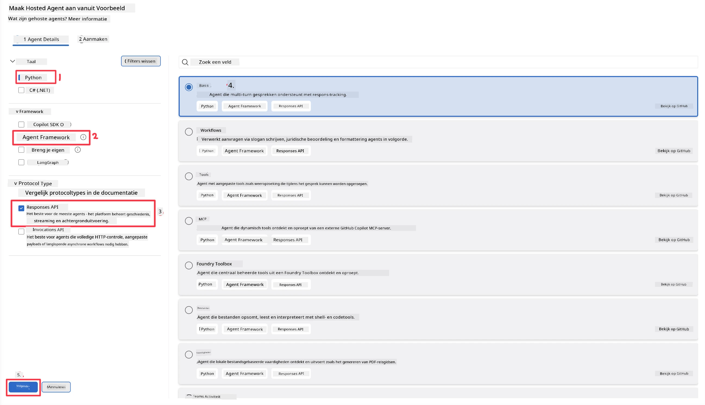
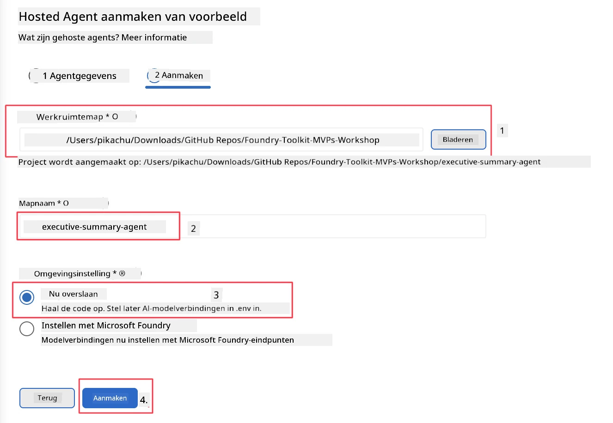

# Module 2 - Maak een Nieuwe Gehoste Agent

⏱️ ~5 min

In deze module gebruik je Foundry Toolkit om **een gehost agent-project op te zetten**. De scaffold genereert de volledige projectstructuur - `agent.yaml`, `main.py`, `Dockerfile`, `requirements.txt` en VS Code debugconfiguratie - zodat je je kunt richten op het aanpassen van het gedrag van de agent.

> **Belangrijk concept:** De map `agent/` in deze lab is een voorbeeld van wat Foundry Toolkit genereert. Je schrijft deze bestanden niet vanaf nul.

### Scaffold wizard flow

```mermaid
flowchart LR
    A["Command Palette:
    Create new Hosted Agent"] --> B["Language:
    Python"]
    B --> C["API type:
    Response API"]
    C --> D["Template:
    Basic - Agent Framework"]
    D --> E["Selecteer model"]
    E --> F["Workspace folder
    & agent name"]
    F --> G["Gegenereerd project"]

    style A fill:#4A90D9,color:#fff
    style B fill:#7B68EE,color:#fff
    style C fill:#7B68EE,color:#fff
    style D fill:#7B68EE,color:#fff
    style E fill:#7B68EE,color:#fff
    style F fill:#7B68EE,color:#fff
    style G fill:#27AE60,color:#fff
```



---

## Stap 1: Open de Create Hosted Agent wizard

1. Druk op `Ctrl+Shift+P` om de **Command Palette** te openen.
2. Typ: **Foundry Toolkit: Create new Hosted Agent** en selecteer deze.

> **Alternatief: Maak aan via Foundry Portal**
> Als je de browser verkiest, kun je je project aanmaken op [https://ai.azure.com](https://ai.azure.com). Zodra het project is aangemaakt, ga je terug naar VS Code en gebruik je de **Foundry Toolkit** zijbalk om verbinding te maken.

> **Alternatief:** Klik op het **+**-icoon naast **Hosted Agents (Preview)** in de Foundry Toolkit zijbalk.

## Stap 2: Kies instellingen



1. Selecteer in het menu/de navigatie aan de linkerkant het volgende:

| Menu | Selectie | Notities |
|--------|-----------|-------|
| **Language** | Python | C# wordt ook ondersteund |
| **Framework** | Agent Framework | Eenvoudig startpunt met gebruik van Agent Framework SDK |
| **API type** | Response API | `POST /responses` - conversatiegericht, met platformbeheer van geschiedenis |
| **Template** | Basic | Eenvoudig startpunt met gebruik van Agent Framework SDK |

2. Klik zodra geselecteerd op **Next**



3. Selecteer in het volgende venster het volgende:

| Menu | Selectie | Notities |
|--------|-----------|-------|
| **Workspace folder** | Kies een doelmap | bv. `/workspace/Foundry_Toolkit_for_VSCode_Lab/` of een submap in deze repo |
| **Agent name** | Voer een naam in | bv. `executive-summary-agent` |
| **Environment Setup** | zet setup nu over |  |

Klik op **create** om onze agent te maken. Er wordt een nieuwe map aangemaakt met de naam van de gehoste agent.

## Stap 3: Inspecteer het gegenereerde project

Controleer na het voltooien van de scaffolding of je deze bestanden ziet in de Explorer (`Ctrl+Shift+E`):

```
📂 my-agent/
├── .env                ← Environment variables (placeholders)
├── .vscode/
│   ├── launch.json     ← Debug config (F5 → run + Agent Inspector)
│   └── tasks.json      ← VS Code task definitions
├── agent.yaml          ← Agent definition (kind: hosted)
├── Dockerfile          ← Container config for deployment
├── main.py             ← Agent entry point (your main code)
└── requirements.txt    ← Python dependencies
```

### Belangrijke bestanden uitgelegd

| Bestand | Doel |
|------|---------|
| `agent.yaml` | Declareert de agent als `kind: hosted`, koppelt omgevingsvariabelen, definieert het `/responses` protocol |
| `main.py` | Maakt een `FoundryChatClient` → verpakt dit in een `Agent` met instructies → serveert via `ResponsesHostServer` op poort 8088 |
| `Dockerfile` | Gebruikt `python:3.12-slim`, installeert afhankelijkheden, maakt poort 8088 open, voert `main.py` uit |
| `requirements.txt` | `agent-framework-foundry`, `agent-framework-foundry-hosting`, `mcp`, `debugpy` |

> **Belangrijk:** Open de gescaffolde agentmap direct in VS Code (de map `agent/` zelf) zodat `.vscode/launch.json` en `tasks.json` correct werken voor F5 debugging.

---

### ✅ Checkpoint

- [ ] Gescaffold project gemaakt met alle verwachte bestanden
- [ ] `agent.yaml` toont `kind: hosted` en `protocol: responses`
- [ ] `main.py` importeert `Agent`, `FoundryChatClient`, `ResponsesHostServer`
- [ ] De agentmap is open in VS Code als workspace root

---

**Vorige:** [01 - Setup](01-setup.md) · **Volgende:** [03 - Configure & Code →](03-configure-and-code.md)

---

<!-- CO-OP TRANSLATOR DISCLAIMER START -->
**Disclaimer**:
Dit document is vertaald met behulp van de AI vertaaldienst [Co-op Translator](https://github.com/Azure/co-op-translator). Hoewel we streven naar nauwkeurigheid, dient u er rekening mee te houden dat geautomatiseerde vertalingen fouten of onnauwkeurigheden kunnen bevatten. Het originele document in de oorspronkelijke taal moet worden beschouwd als de gezaghebbende bron. Voor kritieke informatie wordt professionele menselijke vertaling aanbevolen. Wij zijn niet aansprakelijk voor eventuele misverstanden of verkeerde interpretaties die voortvloeien uit het gebruik van deze vertaling.
<!-- CO-OP TRANSLATOR DISCLAIMER END -->