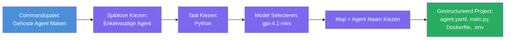

# Module 3 - Maak een Nieuwe Gehoste Agent (Automatisch Gescaffoldeerd door Foundry-extensie)

In deze module gebruik je de Microsoft Foundry-extensie om **een nieuw [gehost agent](https://learn.microsoft.com/azure/foundry/agents/concepts/hosted-agents) project te scafolden**. De extensie genereert de volledige projectstructuur voor je - inclusief `agent.yaml`, `main.py`, `Dockerfile`, `requirements.txt`, een `.env`-bestand en een VS Code debugconfiguratie. Na het scafolden pas je deze bestanden aan met de instructies, tools en configuratie van je agent.

> **Belangrijk concept:** De `agent/` map in deze lab is een voorbeeld van wat de Foundry-extensie genereert wanneer je dit scaffold-commando uitvoert. Je schrijft deze bestanden niet zelf vanaf nul - de extensie maakt ze aan, en daarna pas je ze aan.

### Scaffold wizard flow


---

## Stap 1: Open de Create Hosted Agent wizard

1. Druk op `Ctrl+Shift+P` om de **Command Palette** te openen.
2. Typ: **Microsoft Foundry: Create a New Hosted Agent** en selecteer deze.
3. De wizard voor het aanmaken van een gehoste agent opent.

> **Alternatief pad:** Je kunt deze wizard ook bereiken via de Microsoft Foundry zijbalk → klik op het **+** icoon naast **Agents** of klik met de rechtermuisknop en selecteer **Create New Hosted Agent**.

---

## Stap 2: Kies je template

De wizard vraagt je om een template te selecteren. Je ziet opties zoals:

| Template | Beschrijving | Wanneer te gebruiken |
|----------|--------------|---------------------|
| **Single Agent** | Eén agent met eigen model, instructies en optionele tools | Deze workshop (Lab 01) |
| **Multi-Agent Workflow** | Meerdere agents die samenwerken in een reeks | Lab 02 |

1. Selecteer **Single Agent**.
2. Klik op **Next** (of de selectie gaat automatisch door).

---

## Stap 3: Kies programmeertaal

1. Selecteer **Python** (aanbevolen voor deze workshop).
2. Klik op **Next**.

> **C# wordt ook ondersteund** als je .NET prefereert. De scaffold-structuur is vergelijkbaar (gebruikt `Program.cs` in plaats van `main.py`).

---

## Stap 4: Selecteer je model

1. De wizard toont de modellen die in jouw Foundry-project zijn ingezet (van Module 2).
2. Selecteer het model dat je hebt ingezet - bijvoorbeeld **gpt-4.1-mini**.
3. Klik op **Next**.

> Als je geen modellen ziet, ga dan terug naar [Module 2](02-create-foundry-project.md) en zet er eerst een in.

---

## Stap 5: Kies maplocatie en agentnaam

1. Er opent een bestandsdialoog - kies een **doelmap** waar het project wordt aangemaakt. Voor deze workshop:
   - Als je nieuw begint: kies willekeurige map (bijv. `C:\Projects\my-agent`)
   - Als je werkt binnen de workshop repo: maak een nieuwe submap aan onder `workshop/lab01-single-agent/agent/`
2. Voer een **naam** in voor de gehoste agent (bijv. `executive-summary-agent` of `my-first-agent`).
3. Klik op **Create** (of druk op Enter).

---

## Stap 6: Wacht tot het scafolden klaar is

1. VS Code opent een **nieuw venster** met het gescaffold project.
2. Wacht een paar seconden totdat het project volledig is geladen.
3. Je zou de volgende bestanden moeten zien in het Verkenner-paneel (`Ctrl+Shift+E`):

```
📂 my-first-agent/
├── .env                ← Environment variables (auto-generated with placeholders)
├── .vscode/
│   └── launch.json     ← Debug configuration (F5 to run + Agent Inspector)
├── agent.yaml          ← Agent definition (kind: hosted)
├── Dockerfile          ← Container configuration for deployment
├── main.py             ← Agent entry point (your main code file)
└── requirements.txt    ← Python dependencies
```

> **Dit is dezelfde structuur als de `agent/` map** in deze lab. De Foundry-extensie genereert deze bestanden automatisch - je hoeft ze dus niet handmatig te maken.

> **Workshopnotitie:** In deze workshop repository staat de `.vscode/` map op de **workspace root** (niet in elk project). Deze bevat een gedeelde `launch.json` en `tasks.json` met twee debugconfiguraties - **"Lab01 - Single Agent"** en **"Lab02 - Multi-Agent"** - elk wijzend naar de juiste lab `cwd`. Wanneer je op F5 drukt, selecteer je de configuratie die bij het lab hoort waar je aan werkt uit de dropdown.

---

## Stap 7: Begrijp elk gegenereerd bestand

Neem even de tijd om elk bestand dat de wizard heeft gemaakt te bekijken. Het begrijpen ervan is belangrijk voor Module 4 (aanpassing).

### 7.1 `agent.yaml` - Agentdefinitie

Open `agent.yaml`. Het ziet er zo uit:

```yaml
# yaml-language-server: $schema=https://raw.githubusercontent.com/microsoft/AgentSchema/refs/heads/main/schemas/v1.0/ContainerAgent.yaml

kind: hosted
name: my-first-agent
description: >
  A hosted agent deployed to Microsoft Foundry Agent Service.
metadata:
  authors:
    - Microsoft
  tags:
    - Azure AI AgentServer
    - Microsoft Agent Framework
    - Hosted Agent
protocols:
  - protocol: responses
    version: v1
environment_variables:
  - name: AZURE_AI_PROJECT_ENDPOINT
    value: ${PROJECT_ENDPOINT}
  - name: AZURE_AI_MODEL_DEPLOYMENT_NAME
    value: ${MODEL_DEPLOYMENT_NAME}
dockerfile_path: Dockerfile
resources:
  cpu: '0.25'
  memory: 0.5Gi
```

**Belangrijke velden:**

| Veld | Doel |
|-------|------|
| `kind: hosted` | Geeft aan dat dit een gehoste agent is (container-gebaseerd, gedeployed naar [Foundry Agent Service](https://learn.microsoft.com/azure/foundry/agents/overview)) |
| `protocols: responses v1` | De agent exposeert de OpenAI-compatibele `/responses` HTTP-endpoint |
| `environment_variables` | Maakt mapping van `.env` waardes naar container omgevingsvariabelen bij deployment |
| `dockerfile_path` | Verwijst naar de Dockerfile die gebruikt wordt om de container image te bouwen |
| `resources` | CPU en geheugenallocatie voor de container (0.25 CPU, 0.5Gi geheugen) |

### 7.2 `main.py` - Agent entry point

Open `main.py`. Dit is het hoofd-Pythonbestand waar je agentlogica in staat. De scaffold bevat:

```python
from agent_framework.azure import AzureAIAgentClient
from azure.ai.agentserver.agentframework import from_agent_framework
from azure.identity.aio import DefaultAzureCredential
```

**Belangrijke imports:**

| Import | Doel |
|--------|------|
| `AzureAIAgentClient` | Verbindt met je Foundry-project en maakt agents via `.as_agent()` |
| [`DefaultAzureCredential`](https://learn.microsoft.com/azure/developer/python/sdk/authentication/credential-chains#defaultazurecredential-overview) | Behandelt authenticatie (Azure CLI, VS Code aanmelding, managed identity, of service principal) |
| `from_agent_framework` | Wikkelt de agent in als HTTP-server die de `/responses` endpoint aanbiedt |

De hoofdflow is:
1. Maak een credential aan → maak een client → roep `.as_agent()` aan om een agent te krijgen (async context manager) → wikkel die in als server → run

### 7.3 `Dockerfile` - Container image

```dockerfile
FROM python:3.14-slim

WORKDIR /app

COPY ./ .

RUN pip install --upgrade pip && \
    if [ -f requirements.txt ]; then \
        pip install -r requirements.txt; \
    else \
        echo "No requirements.txt found" >&2; exit 1; \
    fi

EXPOSE 8088

CMD ["python", "main.py"]
```

**Belangrijke details:**
- Gebruikt `python:3.14-slim` als base image.
- Kopieert alle projectbestanden naar `/app`.
- Upgrade `pip`, installeert afhankelijkheden vanuit `requirements.txt`, en faalt snel als dat bestand ontbreekt.
- **Exporteert poort 8088** - dit is de verplichte poort voor gehoste agents. Verander deze niet.
- Start de agent met `python main.py`.

### 7.4 `requirements.txt` - Afhankelijkheden

```
agent-framework-azure-ai==1.0.0rc3
agent-framework-core==1.0.0rc3
azure-ai-agentserver-agentframework==1.0.0b16
azure-ai-agentserver-core==1.0.0b16
debugpy
agent-dev-cli
```

| Package | Doel |
|---------|------|
| `agent-framework-azure-ai` | Azure AI-integratie voor Microsoft Agent Framework |
| `agent-framework-core` | Kernruntime voor het bouwen van agents (inclusief `python-dotenv`) |
| `azure-ai-agentserver-agentframework` | Hosted agent server runtime voor Foundry Agent Service |
| `azure-ai-agentserver-core` | Kern agent server abstracties |
| `debugpy` | Python debugging ondersteuning (maakt F5 debug in VS Code mogelijk) |
| `agent-dev-cli` | Lokale ontwikkelings-CLI voor het testen van agents (gebruikt door debug/run configuratie) |

---

## Begrijp het agentprotocol

Gehoste agents communiceren via het **OpenAI Responses API** protocol. Tijdens het draaien (lokaal of in de cloud) exposeert de agent één enkele HTTP endpoint:

```
POST http://localhost:8088/responses
Content-Type: application/json

{
  "input": "Your prompt here",
  "stream": false
}
```

De Foundry Agent Service roept deze endpoint aan om gebruikersprompts te sturen en agentreacties te ontvangen. Dit is hetzelfde protocol dat de OpenAI API gebruikt, dus je agent is compatibel met elke client die het OpenAI Responses-formaat spreekt.

---

### Checkpoint

- [ ] De scaffold wizard is succesvol afgerond en er is een **nieuw VS Code venster** geopend
- [ ] Je ziet alle 5 bestanden: `agent.yaml`, `main.py`, `Dockerfile`, `requirements.txt`, `.env`
- [ ] Het `.vscode/launch.json` bestand bestaat (maakt F5 debugging mogelijk - in deze workshop staat het op de workspace root met lab-specifieke configuraties)
- [ ] Je hebt elk bestand doorgelezen en begrijpt het doel ervan
- [ ] Je begrijpt dat poort `8088` verplicht is en dat de `/responses` endpoint het protocol is

---

**Vorige:** [02 - Create Foundry Project](02-create-foundry-project.md) · **Volgende:** [04 - Configure & Code →](04-configure-and-code.md)

---

<!-- CO-OP TRANSLATOR DISCLAIMER START -->
**Disclaimer**:
Dit document is vertaald met behulp van de AI-vertalingsdienst [Co-op Translator](https://github.com/Azure/co-op-translator). Hoewel wij streven naar nauwkeurigheid, dient u er rekening mee te houden dat automatische vertalingen fouten of onjuistheden kunnen bevatten. Het originele document in de oorspronkelijke taal dient als de gezaghebbende bron te worden beschouwd. Voor cruciale informatie wordt professionele menselijke vertaling aanbevolen. Wij zijn niet aansprakelijk voor eventuele misverstanden of verkeerde interpretaties voortvloeiend uit het gebruik van deze vertaling.
<!-- CO-OP TRANSLATOR DISCLAIMER END -->