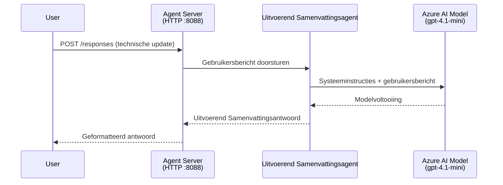
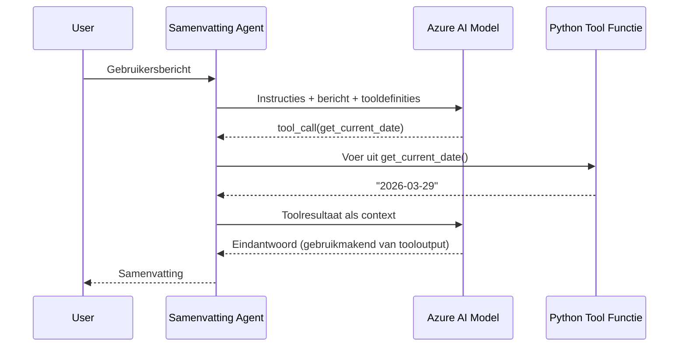

# Module 4 - Configureer instructies, omgeving & installeer afhankelijkheden

In deze module pas je de automatisch gegenereerde agent-bestanden uit Module 3 aan. Hier transformeer je de generieke scaffold in **jouw** agent - door instructies te schrijven, omgevingsvariabelen in te stellen, optioneel tools toe te voegen en afhankelijkheden te installeren.

> **Herinnering:** De Foundry-extensie heeft je projectbestanden automatisch gegenereerd. Nu pas je ze aan. Zie de map [`agent/`](../../../../../workshop/lab01-single-agent/agent) voor een volledig werkend voorbeeld van een aangepaste agent.

---

## Hoe de componenten samenwerken

### Verzoek levenscyclus (enkele agent)


> **Met tools:** Als de agent geregistreerde tools heeft, kan het model een tool-aanroep retourneren in plaats van een directe voltooiing. Het framework voert de tool lokaal uit, voedt het resultaat terug aan het model, en het model genereert dan de definitieve respons.


---

## Stap 1: Stel omgevingsvariabelen in

De scaffold heeft een `.env` bestand gemaakt met tijdelijke waarden. Je moet de echte waarden uit Module 2 invullen.

1. Open in je gescaffolde project het **`.env`** bestand (dit staat in de hoofdmap van het project).
2. Vervang de tijdelijke waarden door je echte Foundry projectgegevens:

   ```env
   PROJECT_ENDPOINT=https://<your-account>.services.ai.azure.com/api/projects/<your-project>
   MODEL_DEPLOYMENT_NAME=gpt-4.1-mini
   ```

3. Sla het bestand op.

### Waar vind je deze waarden

| Waarde | Waar te vinden |
|--------|----------------|
| **Project endpoint** | Open de **Microsoft Foundry** zijbalk in VS Code → klik op je project → de endpoint-URL wordt getoond in het detailoverzicht. Het ziet eruit als `https://<account-naam>.services.ai.azure.com/api/projects/<project-naam>` |
| **Model deployment naam** | Vouw in de Foundry zijbalk je project uit → kijk onder **Models + endpoints** → de naam staat naast het gedeployde model (bijv. `gpt-4.1-mini`) |

> **Beveiliging:** Voeg het `.env` bestand nooit toe aan versiebeheer. Het staat standaard al in `.gitignore`. Zo niet, voeg het dan toe:
> ```
> .env
> ```

### Hoe omgevingsvariabelen doorstromen

De keten is: `.env` → `main.py` (leest via `os.getenv`) → `agent.yaml` (wordt gemapt naar container omgevingsvariabelen bij deployment).

In `main.py` leest de scaffold deze waarden zo:

```python
PROJECT_ENDPOINT = os.getenv("AZURE_AI_PROJECT_ENDPOINT") or os.getenv("PROJECT_ENDPOINT")
MODEL_DEPLOYMENT_NAME = os.getenv("AZURE_AI_MODEL_DEPLOYMENT_NAME", os.getenv("MODEL_DEPLOYMENT_NAME", "gpt-4.1-mini"))
```

Zowel `AZURE_AI_PROJECT_ENDPOINT` als `PROJECT_ENDPOINT` worden geaccepteerd (in `agent.yaml` wordt de prefix `AZURE_AI_*` gebruikt).

---

## Stap 2: Schrijf agent instructies

Dit is de belangrijkste stap voor aanpassing. De instructies definiëren de persoonlijkheid, het gedrag, het output formaat en veiligheidsbeperkingen van je agent.

1. Open `main.py` in je project.
2. Zoek de instructiestring (de scaffold bevat een standaard/generic versie).
3. Vervang deze door gedetailleerde, gestructureerde instructies.

### Wat goede instructies bevatten

| Component | Doel | Voorbeeld |
|-----------|-------|-----------|
| **Rol** | Wat de agent is en doet | "Je bent een executive summary agent" |
| **Doelgroep** | Voor wie de reacties zijn | "Senior leiders met beperkte technische achtergrond" |
| **Input definitie** | Welke soort prompts worden behandeld | "Technische incidentrapporten, operationele updates" |
| **Output formaat** | Preciese structuur van de antwoorden | "Executive Summary: - Wat gebeurde er: ... - Zakelijke impact: ... - Volgende stap: ..." |
| **Regels** | Beperkingen en weigeringsvoorwaarden | "Voeg GEEN informatie toe die niet is verstrekt" |
| **Veiligheid** | Voorkom misbruik en hallucinaties | "Als input onduidelijk is, vraag om verduidelijking" |
| **Voorbeelden** | Input/output paren om gedrag te sturen | Voeg 2-3 voorbeelden toe met verschillende inputs |

### Voorbeeld: Executive Summary Agent instructies

Hier zijn de instructies die worden gebruikt in de workshop [`agent/main.py`](../../../../../workshop/lab01-single-agent/agent/main.py):

```python
AGENT_INSTRUCTIONS = """You are an "Explain Like I'm an Executive" agent.

Purpose:
Your job is to translate complex technical or operational information into
clear, concise, and outcome-focused summaries that can be easily understood
by non-technical executives.

Audience:
Senior leaders with limited technical background who care about impact,
risk, and what happens next.

What you must do:
- Rephrase the input so it is understandable to a non-technical audience
- Prioritize clarity, brevity, and outcomes over technical accuracy
- Remove technical jargon, logs, metrics, stack traces, and deep root-cause details
- Translate technical causes into simple cause-and-effect statements
- Explicitly call out business impact
- Always include a clear next step or action
- Maintain a neutral, factual, and calm executive tone
- Do NOT add new facts or speculate beyond the input

Standard Output Structure (always use this wording):

Executive Summary:
- What happened: <plain-language description>
- Business impact: <clear, non-technical impact>
- Next step: <clear action or mitigation>

Rules:
- Keep responses under 100 words
- Do NOT add facts beyond the input
- If input is unclear, ask for clarification
"""
```

4. Vervang de bestaande instructiestring in `main.py` door je eigen instructies.
5. Sla het bestand op.

---

## Stap 3: (Optioneel) Voeg aangepaste tools toe

Gehoste agents kunnen **lokale Python functies** uitvoeren als [tools](https://learn.microsoft.com/azure/foundry/agents/concepts/tool-catalog). Dit is een belangrijk voordeel van code-gebaseerde gehoste agents ten opzichte van alleen-prompt agents - je agent kan willekeurige server-side logica uitvoeren.

### 3.1 Definieer een toolfunctie

Voeg een toolfunctie toe aan `main.py`:

```python
from agent_framework import tool

@tool
def get_current_date() -> str:
    """Returns the current date in YYYY-MM-DD format."""
    from datetime import date
    return str(date.today())
```

De `@tool` decorator verandert een standaard Python functie in een agent tool. De docstring wordt de toolbeschrijving die het model ziet.

### 3.2 Registreer de tool bij de agent

Bij het creëren van de agent via de `.as_agent()` context manager, geef je de tool door in de `tools` parameter:

```python
async with AzureAIAgentClient(
    project_endpoint=PROJECT_ENDPOINT,
    model_deployment_name=MODEL_DEPLOYMENT_NAME,
    credential=credential,
).as_agent(
    name="my-agent",
    instructions=AGENT_INSTRUCTIONS,
    tools=[get_current_date],
) as agent:
    server = from_agent_framework(agent)
    await server.run_async()
```

### 3.3 Hoe tool-aanroepen werken

1. De gebruiker verstuurt een prompt.
2. Het model beslist of een tool nodig is (gebaseerd op prompt, instructies en toolbeschrijvingen).
3. Is een tool nodig, dan roept het framework je Python functie lokaal aan (binnen de container).
4. De retourwaarde van de tool wordt teruggestuurd naar het model als context.
5. Het model genereert de definitieve respons.

> **Tools worden server-side uitgevoerd** - ze draaien binnen je container, niet in de browser van de gebruiker of in het model. Dit betekent dat je toegang hebt tot databases, API's, bestandssystemen of elke Python bibliotheek.

---

## Stap 4: Maak en activeer een virtuele omgeving

Voordat je afhankelijkheden installeert, maak je een geïsoleerde Python omgeving aan.

### 4.1 Maak de virtuele omgeving

Open een terminal in VS Code (`` Ctrl+` ``) en voer uit:

```powershell
python -m venv .venv
```

Dit maakt een `.venv` map aan in je projectdirectory.

### 4.2 Activeer de virtuele omgeving

**PowerShell (Windows):**

```powershell
.\.venv\Scripts\Activate.ps1
```

**Command Prompt (Windows):**

```cmd
.venv\Scripts\activate.bat
```

**macOS/Linux (Bash):**

```bash
source .venv/bin/activate
```

Je zou `(.venv)` aan het begin van je terminalprompt moeten zien, wat aangeeft dat de virtuele omgeving actief is.

### 4.3 Installeer afhankelijkheden

Met de virtuele omgeving actief, installeer je de benodigde pakketten:

```powershell
pip install -r requirements.txt
```

Dit installeert:

| Pakket | Doel |
|---------|-------|
| `agent-framework-azure-ai==1.0.0rc3` | Azure AI integratie voor het [Microsoft Agent Framework](https://learn.microsoft.com/agent-framework/overview/) |
| `agent-framework-core==1.0.0rc3` | Core runtime voor het bouwen van agents (inclusief `python-dotenv`) |
| `azure-ai-agentserver-agentframework==1.0.0b16` | Gehoste agent server runtime voor [Foundry Agent Service](https://learn.microsoft.com/azure/foundry/agents/overview) |
| `azure-ai-agentserver-core==1.0.0b16` | Core agent server abstracties |
| `debugpy` | Python debugging (activeert F5 debugging in VS Code) |
| `agent-dev-cli` | Lokale ontwikkelings-CLI voor het testen van agents |

### 4.4 Controleer de installatie

```powershell
pip list | Select-String "agent-framework|agentserver"
```

Verwachte uitvoer:
```
agent-framework-azure-ai   1.0.0rc3
agent-framework-core       1.0.0rc3
azure-ai-agentserver-agentframework 1.0.0b16
azure-ai-agentserver-core  1.0.0b16
```

---

## Stap 5: Verifieer authenticatie

De agent gebruikt [`DefaultAzureCredential`](https://learn.microsoft.com/azure/developer/python/sdk/authentication/credential-chains#defaultazurecredential-overview) die meerdere authenticatiemethoden probeert in deze volgorde:

1. **Omgevingsvariabelen** - `AZURE_CLIENT_ID`, `AZURE_TENANT_ID`, `AZURE_CLIENT_SECRET` (service principal)
2. **Azure CLI** - gebruikt je `az login` sessie
3. **VS Code** - gebruikt het account waarmee je bent ingelogd in VS Code
4. **Managed Identity** - gebruikt bij draaien in Azure (bij deployment)

### 5.1 Verifieer voor lokale ontwikkeling

Minstens één van deze moet werken:

**Optie A: Azure CLI (aanbevolen)**

```powershell
az account show --query "{name:name, id:id}" --output table
```

Verwacht: toont je abonnementsnaam en ID.

**Optie B: VS Code aanmelding**

1. Kijk linksonder in VS Code voor het **Accounts** icoon.
2. Als je je accountnaam ziet, ben je geauthenticeerd.
3. Zo niet, klik op het icoon → **Aanmelden om Microsoft Foundry te gebruiken**.

**Optie C: Service principal (voor CI/CD)**

```powershell
$env:AZURE_TENANT_ID = "<your-tenant-id>"
$env:AZURE_CLIENT_ID = "<your-client-id>"
$env:AZURE_CLIENT_SECRET = "<your-client-secret>"
```

### 5.2 Veelvoorkomend authenticatieprobleem

Als je bent ingelogd met meerdere Azure-accounts, zorg dan dat het juiste abonnement is geselecteerd:

```powershell
az account set --subscription "<your-subscription-id>"
```

---

### Checkpoint

- [ ] `.env` bestand bevat geldige `PROJECT_ENDPOINT` en `MODEL_DEPLOYMENT_NAME` (geen tijdelijke waarden)
- [ ] Agent instructies zijn aangepast in `main.py` - ze definiëren rol, doelgroep, output formaat, regels en veiligheidsbeperkingen
- [ ] (Optioneel) Aangepaste tools zijn gedefinieerd en geregistreerd
- [ ] Virtuele omgeving is aangemaakt en geactiveerd (`(.venv)` zichtbaar in terminalprompt)
- [ ] `pip install -r requirements.txt` is succesvol voltooid zonder fouten
- [ ] `pip list | Select-String "azure-ai-agentserver"` laat zien dat het pakket is geïnstalleerd
- [ ] Authenticatie is geldig - `az account show` geeft je abonnement terug OF je bent ingelogd in VS Code

---

**Vorige:** [03 - Maak gehoste agent aan](03-create-hosted-agent.md) · **Volgende:** [05 - Test lokaal →](05-test-locally.md)

---

<!-- CO-OP TRANSLATOR DISCLAIMER START -->
**Disclaimer**:  
Dit document is vertaald met behulp van de AI-vertalingsdienst [Co-op Translator](https://github.com/Azure/co-op-translator). Hoewel we streven naar nauwkeurigheid, dient u zich ervan bewust te zijn dat geautomatiseerde vertalingen fouten of onnauwkeurigheden kunnen bevatten. Het originele document in de oorspronkelijke taal moet als de gezaghebbende bron worden beschouwd. Voor cruciale informatie wordt professionele menselijke vertaling aanbevolen. Wij zijn niet aansprakelijk voor enige misverstanden of verkeerde interpretaties voortvloeiend uit het gebruik van deze vertaling.
<!-- CO-OP TRANSLATOR DISCLAIMER END -->