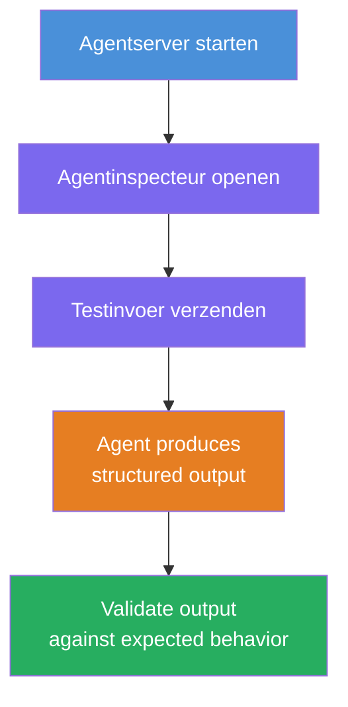
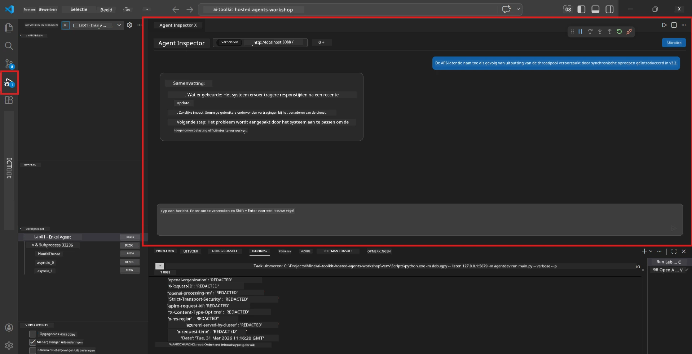
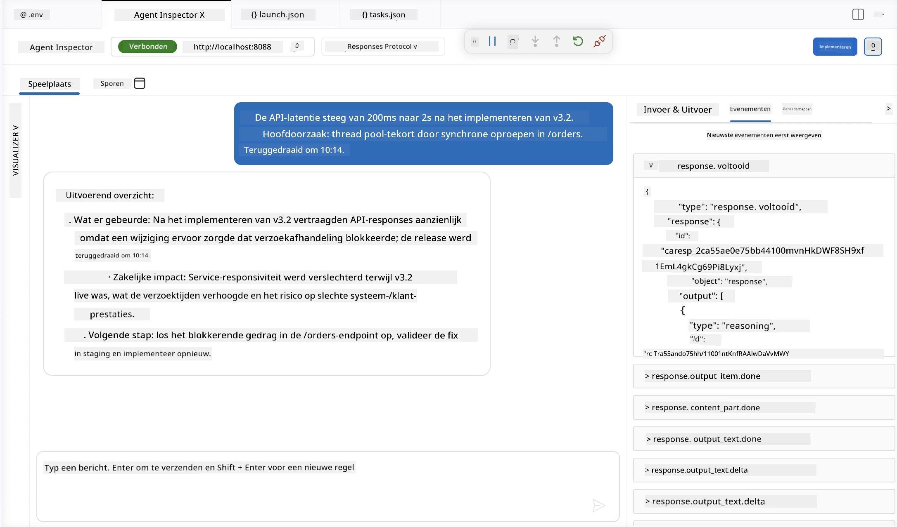

# Module 4 - Lokaal testen

⏱️ ~10 min

In deze module voer je je agent lokaal uit en controleer je of hij correct werkt met behulp van **happy-path functionele tests**. Je gebruikt de Agent Inspector (visuele interface) of directe HTTP-aanroepen om te bevestigen dat de agent gestructureerde, nauwkeurige antwoorden produceert.

### Lokale testworkflow



---

## Optie 1: Druk op F5 - Debug met Agent Inspector (aanbevolen)

### Start de debugger

1. Open de map **executive-summary-agent/** direct in VS Code (`File → Open Folder`).
2. Open het paneel **Run and Debug** (`Ctrl+Shift+D`).
3. Selecteer **Debug Local Agent Server** in de dropdown.
4. Druk op **F5** (of klik op ▶ Start Debugging).

> ⚠️ **Kritiek: Selecteer je Python Interpreter**
> Als je "ModuleNotFoundError" krijgt of de debugger niet start, moet je VS Code vertellen om je virtuele omgeving te gebruiken:
  > 1. Druk op `Ctrl+Shift+P` $\rightarrow$ typ **Python: Select Interpreter**.
  > 2. Selecteer de interpreter die zich bevindt in de `.venv` map van je project (bijv. `.\.venv\Scripts\python.exe` op Windows).
  > 3. Start de debug sessie opnieuw.
> Als je nog steeds fouten krijgt, werk dan handmatig je bestand `tasks.json` bij als volgt:
  > 1. Navigeer naar het `.vscode/tasks.json` bestand
  > 2. Zoek de opdracht met als label: `Run Agent/Workflow HTTP Server`
  > 3. Werk de waarde van de opdracht bij als volgt: `"value": "${workspaceFolder}/.venv/bin/python",`

### Wat gebeurt er

1. De HTTP-server start op `http://localhost:8088/responses`.
2. Het **Agent Inspector** paneel opent automatisch - een visuele chatinterface voor testen.
3. Breakpoints zijn ingeschakeld in `main.py`.

Kijk naar de Terminal voor:
```
Starting executive summary hosted agent
Executive agent server running on http://localhost:8088
```

> **Als de Agent Inspector niet opent:** Druk op `Ctrl+Shift+P` → **Foundry Toolkit: Open Agent Inspector**.



> *De screenshot kan oudere 'AI TOOLKIT' branding tonen van een eerdere extensieversie.*

---

## Optie 2: Test via Terminal (alternatief)

Start de agent in één terminal en stuur verzoeken vanuit een andere:

```bash
# Terminal 1: Start agent
cd executive-summary-agent/
source .venv/bin/activate
python main.py
```

```bash
# Terminal 2: Verstuur test (curl)
curl -sS -X POST http://localhost:8088/responses \
  -H "Content-Type: application/json" \
  -d '{"input": "The API latency increased due to thread pool exhaustion caused by sync calls in v3.2.", "stream": false}'
```

---

## Scenario tests: Happy-path functionele validatie

Voer **alle drie** scenario's hieronder uit. Deze valideren dat je agent correcte, gestructureerde output produceert voor realistische invoer.



### Scenario 1: IT-incident - API latency piek

**Invoer:**
```
The API latency increased from 200ms to 2s after deploying v3.2.
Root cause: thread pool starvation from synchronous calls in /orders.
Rolled back at 10:14.
```

**Verwacht gedrag:**
- ✅ Volgt de "Executive Summary" structuur (Wat is er gebeurd / Zakelijke impact / Volgende stap)
- ✅ Geen technische vaktermen (geen "thread pool", geen "/orders", geen "v3.2")
- ✅ Geeft duidelijk zakelijke impact aan (bijv. gebruikers ondervonden vertraging)
- ✅ Bevat een volgende stap (bijv. fix geïmplementeerd, monitoring ingesteld)

---

### Scenario 2: Data Pipeline - ETL-fout

**Invoer:**
```
The nightly ETL job failed because the upstream schema changed. APAC dashboards show missing data.
```

**Verwacht gedrag:**
- ✅ Vat het falen van de data refresh samen in begrijpelijke taal
- ✅ Vermeldt de impact op het APAC-dashboard
- ✅ Bevat een herstelstap
- ✅ Geeft GEEN termen als "ETL", "schema" of andere technische termen

---

### Scenario 3: Beveiliging - Blootgestelde credential

**Invoer:**
```
Static analysis flagged a hardcoded secret in the repository.
The secret may have been exposed in commit history.
```

**Verwacht gedrag:**
- ✅ Beschrijft een credential/beveiligingsprobleem in begrijpelijke taal voor executives
- ✅ Benoemt een potentiële risico (ongeautoriseerde toegang)
- ✅ Geeft een herstelactie aan (credential rotatie, audit)
- ✅ Bevat GEEN termen zoals "static analysis", "commit history" of "hardcoded"

---

## Validatiecriteria

Controleer voor elk scenario:

| # | Criteria | Slaagvoorwaarde |
|---|----------|---------------|
| 1 | **Structuur** | Antwoord gebruikt het "Executive Summary" formaat met alle drie de punten |
| 2 | **Eenvoudige taal** | Geen technische vaktermen die een executive niet zou begrijpen |
| 3 | **Nauwkeurigheid** | Samenvatting weerspiegelt de invoer - geen verzonnen details |
| 4 | **Beknoptheid** | Antwoord is minder dan 100 woorden |
| 5 | **Volgende stap** | Een duidelijke actie of mitigatie is vermeld |

---

## Debugging tips

| Probleem | Oplossing |
|-------|-----|
| Agent start niet | Controleer `.env` waarden, verifieer dat venv is geactiveerd, voer `pip install -r requirements.txt` uit |
| Leeg of generiek antwoord | Bekijk de instructies in `main.py` - zorg dat het uitvoerformaat is gespecificeerd |
| Antwoord bevat jargon | Versterk de "verwijder technische termen" regels in de instructies |
| Agent Inspector opent niet | `Ctrl+Shift+P` → **Foundry Toolkit: Open Agent Inspector** |
| Model fouten in Terminal | Controleer of `AZURE_AI_MODEL_DEPLOYMENT_NAME` exact overeenkomt (hoofdlettergevoelig) |

---

### ✅ Checkpoint

- [ ] Agent start lokaal zonder fouten
- [ ] Agent Inspector opent en toont een chatinterface (indien F5 gebruikt)
- [ ] **Scenario 1** (IT-incident) - gestructureerde Executive Summary, geen jargon
- [ ] **Scenario 2** (data pipeline) - relevante samenvatting met zakelijke impact
- [ ] **Scenario 3** (beveiligingswaarschuwing) - juiste risicocommunicatie
- [ ] Alle antwoorden volgen de gedefinieerde uitvoerstructuur

> **Bewaar je antwoorden** (kopieer of screenshot) - je vergelijkt ze met cloudervaringen in Module 06.

---

**Vorige:** [03 - Configureer en Codeer](03-configure-and-code.md) · **Volgende:** [05 - Deploy naar Foundry →](05-deploy-to-foundry.md)

---

<!-- CO-OP TRANSLATOR DISCLAIMER START -->
**Disclaimer**:
Dit document is vertaald met behulp van de AI vertaaldienst [Co-op Translator](https://github.com/Azure/co-op-translator). Hoewel we streven naar nauwkeurigheid, dient u er rekening mee te houden dat geautomatiseerde vertalingen fouten of onnauwkeurigheden kunnen bevatten. Het originele document in de oorspronkelijke taal moet worden beschouwd als de gezaghebbende bron. Voor kritieke informatie wordt professionele menselijke vertaling aanbevolen. Wij zijn niet aansprakelijk voor eventuele misverstanden of verkeerde interpretaties die voortvloeien uit het gebruik van deze vertaling.
<!-- CO-OP TRANSLATOR DISCLAIMER END -->