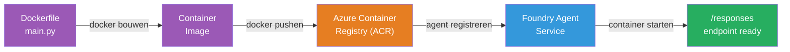
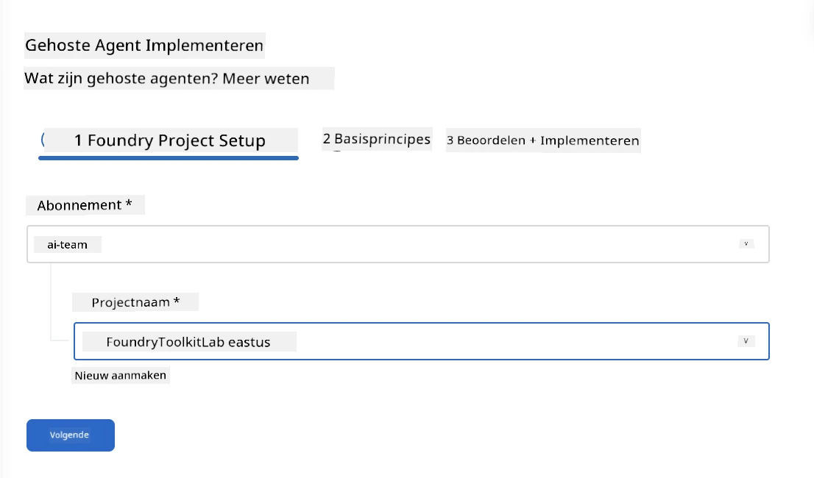
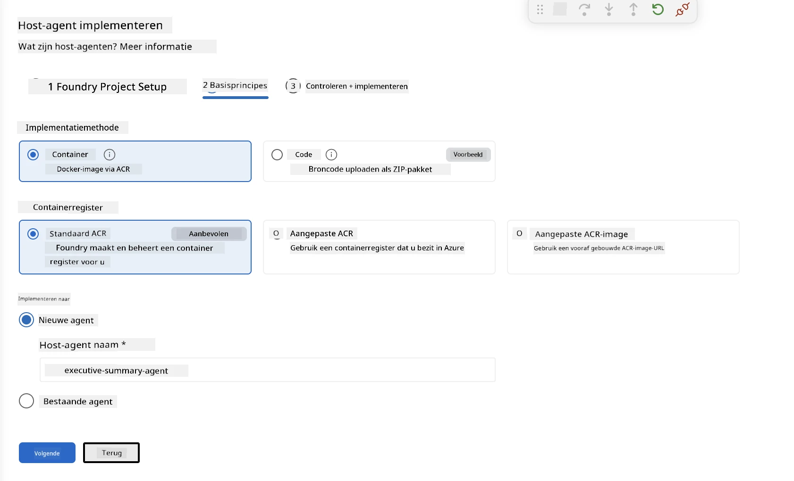
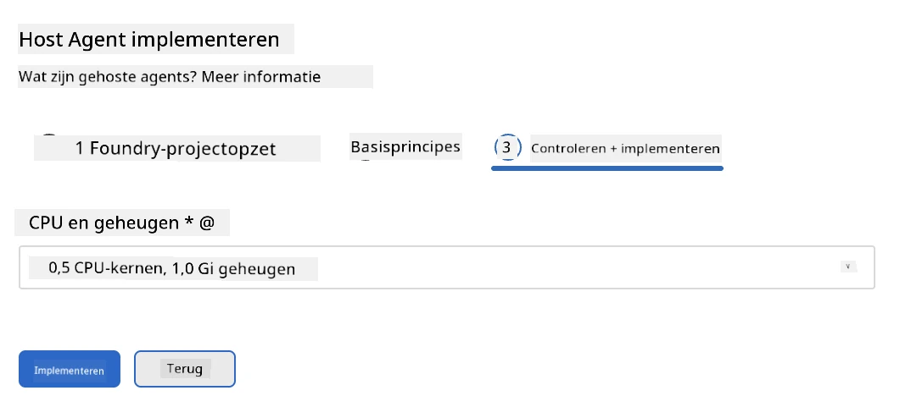
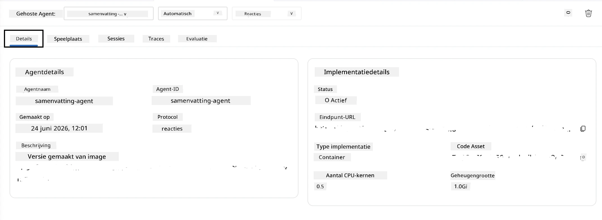

# Module 5 - Implementeren naar Foundry Agent Service

⏱️ ~10 min

> ⚠️ **Gebruikers van Pad B:** Deze module vereist een Foundry-abonnement. Als je Foundry Local gebruikt, ga dan door naar [Module 07 - Samenvatting](07-summary.md). Je hebt de lokale ontwikkelingsworkflow succesvol afgerond!

In deze module implementeer je je lokaal geteste agent naar Microsoft Foundry als een **Gehoste Agent**. De implementatie bouwt een containerimage, pusht deze naar Azure Container Registry en start de agent in de beheerde infrastructuur van Foundry.

### Implementatiepipeline

---

## Voorwaarden controleren

Controleer vóór het implementeren:

- [ ] Agent slaagt voor alle 3 lokale scenario’s uit [Module 04](04-test-locally.md)
- [ ] Je hebt de **Azure AI User** rol op projectniveau ([Module 01, RBAC toewijzen](01-setup.md#deploy-a-model--assign-rbac))
- [ ] Je bent aangemeld bij Azure in VS Code (Accounts-icoon toont je naam)

---

## Stap 1: Start de implementatie

### Optie A: Implementeer vanuit Agent Inspector (aanbevolen)

Als de Agent Inspector geopend is (vanuit testen):
1. Klik op de **Deploy** knop rechtsboven (wolk-icoon ↑).

### Optie B: Implementeer vanuit Command Palette

1. Druk op `Ctrl+Shift+P` → **Foundry Toolkit: Deploy Hosted Agent**.

---

## Stap 2: Configureer de implementatie

De wizard vraagt je om:

| Prompt | Selectie |
|--------|-----------|
| **Abonnement** | Je Azure-abonnement |
| **Doelproject** | Je Foundry-project (bijvoorbeeld `workshop-agents`) |

Klik op **volgende** om je agent te configureren.

| Prompt | Selectie |
|--------|-----------|
| **Implementatiemethode** | Container |
| **Containerregister** | **Standaard ACR** (Microsoft Foundry maakt er één voor je aan en beheert deze) |
| **Implementeer naar** | Nieuwe Agent (naam, `executive-summary-agent`) |

Klik op **volgende** om je agent te bekijken en implementeren.

| Prompt | Selectie |
|--------|-----------|
| **CPU en geheugen** | **0.25 CPU-cores, 0.5 Gi geheugen** (voldoende voor workshop) |

---

## Stap 3: Implementeer en monitor

1. Klik op **Deploy**.
2. Bekijk het **Output** paneel (selecteer **Microsoft Foundry** in het dropdownmenu).
3. De implementatie doorloopt deze fasen:
   - **Docker build** - bouwt container van je Dockerfile
   - **Docker push** - pusht image naar ACR (1–3 min bij eerste implementatie)
   - **Agentregistratie** - maakt gehoste agent aan in Foundry
   - **Container starten** - start met systeem-beheerde identiteit

4. Wanneer klaar, verschijnt een melding:
   > **my-agent is succesvol geïmplementeerd.** `Bekijk logs` `Run agent`

5. Klik op **Run agent** om de Agent Playground te openen.

### Statuswaarden implementatie

| Status | Betekenis |
|--------|---------|
| **Running** | Container gereed, agent reageert |
| **Pending** | Container start - wacht 30–60 seconden |
| **Failed** | Controleer logs (zie probleemoplossing hieronder) |

---

## Veelvoorkomende implementatiefouten

| Fout | Oorzaak | Oplossing |
|-------|-----------|-----|
| `agents/write` toestemming geweigerd | Ontbrekende **Azure AI User** rol op projectniveau | [Module 01, RBAC toewijzen](01-setup.md#deploy-a-model--assign-rbac) |
| Docker draait niet | Docker Desktop niet gestart | Start Docker Desktop → verifieer `docker info` |
| ACR autorisatie | Beheerde identiteit kan image niet ophalen | Zie [Module 08 - Probleemoplossing](08-troubleshooting.md) |

---

### ✅ Controlepunt

- [ ] Implementatie voltooid zonder fouten
- [ ] Agent verschijnt onder **Hosted Agents (Preview)** in de Foundry-zijbalk
- [ ] Containerstatus toont **Running**
- [ ] Agent Playground tabblad geopend met agentdetails en endpoint-URL

---

**Vorige:** [04 - Lokaal testen](04-test-locally.md) · **Volgende:** [06 - Verifiëren in Playground →](06-verify-in-playground.md)

---

<!-- CO-OP TRANSLATOR DISCLAIMER START -->
**Disclaimer**:
Dit document is vertaald met behulp van de AI vertaaldienst [Co-op Translator](https://github.com/Azure/co-op-translator). Hoewel we streven naar nauwkeurigheid, dient u er rekening mee te houden dat geautomatiseerde vertalingen fouten of onnauwkeurigheden kunnen bevatten. Het originele document in de oorspronkelijke taal moet worden beschouwd als de gezaghebbende bron. Voor kritieke informatie wordt professionele menselijke vertaling aanbevolen. Wij zijn niet aansprakelijk voor eventuele misverstanden of verkeerde interpretaties die voortvloeien uit het gebruik van deze vertaling.
<!-- CO-OP TRANSLATOR DISCLAIMER END -->