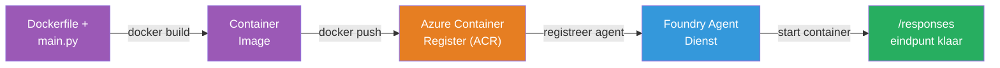
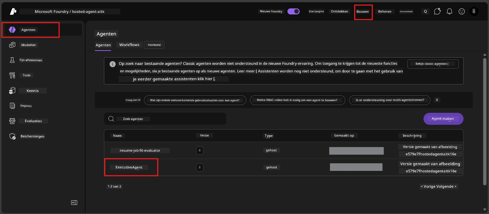

# Module 6 - Implementeren naar Foundry Agent Service

In deze module implementeer je je lokaal geteste agent naar Microsoft Foundry als een [**Hosted Agent**](https://learn.microsoft.com/azure/foundry/agents/concepts/hosted-agents). Het implementatieproces bouwt een Docker-containerimage uit je project, pusht deze naar [Azure Container Registry (ACR)](https://learn.microsoft.com/azure/container-registry/container-registry-intro) en maakt een hosted agent-versie aan in [Foundry Agent Service](https://learn.microsoft.com/azure/foundry/agents/overview).

### Implementatiepipeline


---

## Voorwaarden controleren

Controleer voor het implementeren elk onderstaande punt. Het overslaan hiervan is de meest voorkomende oorzaak van implementatiefouten.

1. **Agent slaagt voor lokale rooktesten:**
   - Je hebt alle 4 tests in [Module 5](05-test-locally.md) voltooid en de agent reageerde correct.

2. **Je hebt de [Azure AI User](https://learn.microsoft.com/azure/foundry/concepts/rbac-foundry#built-in-roles) rol:**
   - Deze is toegewezen in [Module 2, Stap 3](02-create-foundry-project.md). Als je niet zeker bent, controleer het nu:
   - Azure Portal → je Foundry **project** resource → **Toegangsbeheer (IAM)** → tabblad **Roltoewijzingen** → zoek je naam → bevestig dat **Azure AI User** vermeld staat.

3. **Je bent aangemeld bij Azure in VS Code:**
   - Controleer het Accounts-icoon linksonder in VS Code. Je accountnaam moet zichtbaar zijn.

4. **(Optioneel) Docker Desktop draait:**
   - Docker is alleen nodig als de Foundry-extensie je vraagt om een lokale build. In de meeste gevallen behandelt de extensie container builds automatisch tijdens implementatie.
   - Als je Docker hebt geïnstalleerd, controleer dan of het draait: `docker info`

---

## Stap 1: Start de implementatie

Je hebt twee manieren om te implementeren – beide leiden tot hetzelfde resultaat.

### Optie A: Implementeren vanuit de Agent Inspector (aanbevolen)

Als je de agent draait met de debugger (F5) en de Agent Inspector is geopend:

1. Kijk naar de **rechterbovenhoek** van het Agent Inspector-paneel.
2. Klik op de **Deploy** knop (fouthoud-icoon met een omhoog wijzende pijl ↑).
3. De implementatiewizard opent.

### Optie B: Implementeren vanuit de Command Palette

1. Druk op `Ctrl+Shift+P` om de **Command Palette** te openen.
2. Typ: **Microsoft Foundry: Deploy Hosted Agent** en selecteer deze.
3. De implementatiewizard opent.

---

## Stap 2: Configureer de implementatie

De implementatiewizard leidt je door de configuratie. Vul elke prompt in:

### 2.1 Selecteer het doelproject

1. Een dropdown toont je Foundry-projecten.
2. Selecteer het project dat je in Module 2 hebt gemaakt (bijv. `workshop-agents`).

### 2.2 Selecteer het container agent-bestand

1. Je wordt gevraagd het entry point van de agent te selecteren.
2. Kies **`main.py`** (Python) - dit is het bestand dat de wizard gebruikt om je agentproject te herkennen.

### 2.3 Configureer middelen

| Instelling | Aanbevolen waarde | Opmerkingen |
|---------|------------------|-------|
| **CPU** | `0.25` | Standaard, voldoende voor workshop. Verhoog voor productieworkloads |
| **Geheugen** | `0.5Gi` | Standaard, voldoende voor workshop |

Deze komen overeen met de waarden in `agent.yaml`. Je kunt de standaardwaarden accepteren.

---

## Stap 3: Bevestigen en implementeren

1. De wizard toont een implementatiesamenvatting met:
   - Naam van het doelproject
   - Agentnaam (uit `agent.yaml`)
   - Containerbestand en middelen
2. Bekijk de samenvatting en klik op **Bevestigen en implementeren** (of **Implementeren**).
3. Volg de voortgang in VS Code.

### Wat gebeurt er tijdens implementatie (stap voor stap)

De implementatie is een proces in meerdere stappen. Volg het in het VS Code **Output**-paneel (selecteer "Microsoft Foundry" uit de dropdown):

1. **Docker build** – VS Code bouwt een Docker-containerimage uit je `Dockerfile`. Je ziet Docker-laagmeldingen:
   ```
   Step 1/6 : FROM python:<version>-slim
   Step 2/6 : WORKDIR /app
   ...
   Successfully built abc123def456
   ```

2. **Docker push** – De image wordt gepusht naar de **Azure Container Registry (ACR)** verbonden aan je Foundry-project. Dit kan de eerste keer 1-3 minuten duren (de basisimage is >100MB).

3. **Agent registratie** – Foundry Agent Service maakt een nieuwe hosted agent aan (of een nieuwe versie als de agent al bestaat). De agentmetadata uit `agent.yaml` wordt gebruikt.

4. **Container starten** – De container start op in Foundry's beheerde infrastructuur. Het platform wijst een [system-managed identity](https://learn.microsoft.com/azure/foundry/agents/concepts/agent-identity) toe en opent het `/responses`-endpoint.

> **De eerste implementatie duurt langer** (Docker moet alle lagen pushen). Volgende implementaties zijn sneller omdat Docker niet gewijzigde lagen cached.

---

## Stap 4: Controleer de implementatiestatus

Na het voltooien van de implementatieopdracht:

1. Open de **Microsoft Foundry** zijbalk door op het Foundry-icoon in de activiteitbalk te klikken.
2. Vouw de sectie **Hosted Agents (Preview)** uit onder je project.
3. Je zou je agentnaam moeten zien (bijv. `ExecutiveAgent` of de naam uit `agent.yaml`).
4. **Klik op de agentnaam** om deze uit te vouwen.
5. Je ziet een of meer **versies** (bijv. `v1`).
6. Klik op de versie om **Containergegevens** te bekijken.
7. Controleer het **Status** veld:

   | Status | Betekenis |
   |--------|---------|
   | **Started** of **Running** | De container draait en de agent is klaar |
   | **Pending** | Container wordt gestart (wacht 30-60 seconden) |
   | **Failed** | Container is niet opgestart (controleer logs – zie probleemoplossing hieronder) |



> **Als je "Pending" langer dan 2 minuten ziet:** De container is mogelijk de basisimage aan het ophalen. Wacht wat langer. Als het blijft hangen, controleer dan de containerlogs.

---

## Veelvoorkomende implementatiefouten en oplossingen

### Fout 1: Permission denied - `agents/write`

```
Error: lacks the required data action 
Microsoft.CognitiveServices/accounts/AIServices/agents/write 
to perform POST /api/projects/{projectName}/assistants operation.
```

**Oorzaak:** Je hebt niet de `Azure AI User`-rol op **project**-niveau.

**Stap-voor-stap oplossing:**

1. Open [https://portal.azure.com](https://portal.azure.com).
2. Typ in de zoekbalk de naam van je Foundry **project** en klik erop.
   - **Belangrijk:** Zorg dat je navigeert naar de **project** resource (type: "Microsoft Foundry project"), NIET naar het bovenliggende account/hub resource.
3. Klik in de linker navigatie op **Toegangsbeheer (IAM)**.
4. Klik op **+ Toevoegen** → **Roltoewijzing toevoegen**.
5. Zoek in het tabblad Rol naar [**Azure AI User**](https://learn.microsoft.com/azure/foundry/concepts/rbac-foundry#built-in-roles) en selecteer deze. Klik op **Volgende**.
6. Ga naar het tabblad Leden en selecteer **Gebruiker, groep of service-principal**.
7. Klik op **+ Leden selecteren**, zoek naar je naam/e-mail, selecteer jezelf, klik op **Selecteren**.
8. Klik op **Controleren + toewijzen** → nogmaals **Controleren + toewijzen**.
9. Wacht 1-2 minuten tot de roltoewijzing is doorgevoerd.
10. **Herstart de implementatie** vanaf Stap 1.

> De rol moet op **project**-niveau zijn toegekend, niet alleen op accountniveau. Dit is de meest voorkomende oorzaak van implementatiefouten.

### Fout 2: Docker draait niet

```
Error: Docker build failed / Cannot connect to Docker daemon
```

**Oplossing:**
1. Start Docker Desktop (zoek in je Startmenu of systeemvak).
2. Wacht tot "Docker Desktop is running" verschijnt (30-60 seconden).
3. Controleer: `docker info` in een terminal.
4. **Specifiek voor Windows:** Zorg dat de WSL 2-backend is ingeschakeld in Docker Desktop instellingen → **Algemeen** → **Gebruik de WSL 2 gebaseerde engine**.
5. Probeer opnieuw te implementeren.

### Fout 3: ACR autorisatie - `AcrPullUnauthorized`

```
Error: AcrPullUnauthorized
```

**Oorzaak:** De beheerde identiteit van het Foundry-project heeft geen pull-toegang tot het containerregister.

**Oplossing:**
1. Navigeer in Azure Portal naar je **[Container Registry](https://learn.microsoft.com/azure/container-registry/container-registry-intro)** (bevindt zich in dezelfde resourcegroep als je Foundry-project).
2. Ga naar **Toegangsbeheer (IAM)** → **Toevoegen** → **Roltoewijzing toevoegen**.
3. Selecteer de rol **[AcrPull](https://learn.microsoft.com/azure/container-registry/container-registry-roles)**.
4. Kies onder Leden **Beheerde identiteit** → zoek de beheerde identiteit van het Foundry-project.
5. Klik op **Controleren + toewijzen**.

> Dit wordt meestal automatisch ingesteld door de Foundry-extensie. Als je deze fout ziet, kan het zijn dat de automatische setup is mislukt.

### Fout 4: Container platform mismatch (Apple Silicon)

Als je implementeert vanaf een Apple Silicon Mac (M1/M2/M3), moet de container gebouwd zijn voor `linux/amd64`:

```bash
docker build --platform linux/amd64 -t myagent:v1 .
```

> De Foundry-extensie regelt dit automatisch voor de meeste gebruikers.

---

### Controlelijst

- [ ] Implementatieopdracht voltooid zonder fouten in VS Code
- [ ] Agent verschijnt onder **Hosted Agents (Preview)** in de Foundry-zijbalk
- [ ] Je hebt op de agent geklikt → een versie geselecteerd → **Containergegevens** bekeken
- [ ] Container status toont **Started** of **Running**
- [ ] (Bij fouten) Je hebt de fout geïdentificeerd, de oplossing toegepast en succesvol opnieuw geïmplementeerd

---

**Vorige:** [05 - Test Locally](05-test-locally.md) · **Volgende:** [07 - Verify in Playground →](07-verify-in-playground.md)

---

<!-- CO-OP TRANSLATOR DISCLAIMER START -->
**Disclaimer**:  
Dit document is vertaald met behulp van de AI-vertalingsservice [Co-op Translator](https://github.com/Azure/co-op-translator). Hoewel we streven naar nauwkeurigheid, houd er rekening mee dat automatische vertalingen fouten of onnauwkeurigheden kunnen bevatten. Het originele document in de oorspronkelijke taal moet als de gezaghebbende bron worden beschouwd. Voor cruciale informatie wordt professionele menselijke vertaling aanbevolen. Wij zijn niet aansprakelijk voor misverstanden of verkeerde interpretaties die voortvloeien uit het gebruik van deze vertaling.
<!-- CO-OP TRANSLATOR DISCLAIMER END -->