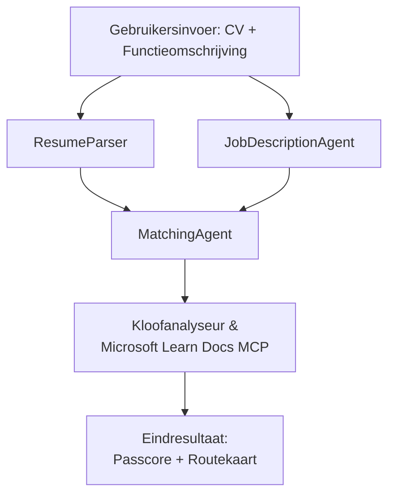

# PersonalCareerCopilot - CV → Job Fit Evaluator

Een multi-agent workflow die beoordeelt hoe goed een cv aansluit bij een functieomschrijving en vervolgens een persoonlijk leerplan genereert om de hiaten te dichten.

---

## Agents

| Agent | Rol | Hulpmiddelen |
|-------|------|--------------|
| **ResumeParser** | Extraheert gestructureerde vaardigheden, ervaring, certificeringen uit cv-tekst | - |
| **JobDescriptionAgent** | Extraheert vereiste/voorkeursvaardigheden, ervaring, certificeringen uit een functieomschrijving | - |
| **MatchingAgent** | Vergelijkt profiel met vereisten → fit score (0-100) + overeenkomende/ontbrekende vaardigheden | - |
| **GapAnalyzer** | Bouwt een gepersonaliseerd leerplan met Microsoft Learn-bronnen | `search_microsoft_learn_for_plan` (MCP) |

## Workflow


---

## Snel aan de slag

### 1. Omgevingssetup

```powershell
cd workshop\lab02-multi-agent\PersonalCareerCopilot
python -m venv .venv
.\.venv\Scripts\Activate.ps1          # Windows PowerShell
# source .venv/bin/activate            # macOS / Linux
pip install -r requirements.txt
```

### 2. Configureer inloggegevens

Kopieer het voorbeeld env-bestand en vul de details van je Foundry-project in:

```powershell
cp .env.example .env
```

Bewerk `.env`:

```env
PROJECT_ENDPOINT=https://<your-account>.services.ai.azure.com/api/projects/<your-project>
MODEL_DEPLOYMENT_NAME=gpt-4.1-mini
```

| Waarde | Waar te vinden |
|--------|----------------|
| `PROJECT_ENDPOINT` | Microsoft Foundry zijbalk in VS Code → rechtsklik op je project → **Kopieer Project Endpoint** |
| `MODEL_DEPLOYMENT_NAME` | Foundry zijbalk → project uitklappen → **Modellen + endpoints** → deploymentnaam |

### 3. Local draaien

```powershell
python -m debugpy --listen 127.0.0.1:5679 -m agentdev run main.py --verbose --port 8088
```

Of gebruik de VS Code taak: `Ctrl+Shift+P` → **Taken: Taak uitvoeren** → **Lab02 HTTP Server uitvoeren**.

### 4. Test met Agent Inspector

Open Agent Inspector: `Ctrl+Shift+P` → **Foundry Toolkit: Open Agent Inspector**.

Plak deze testprompt:

```
Resume:
Jane Doe
Senior Software Engineer with 5 years of experience in Python, Django, and AWS.
Built microservices handling 10K+ requests/second. Led a team of 4 developers.
Certifications: AWS Solutions Architect Associate.
Education: B.S. Computer Science, State University.

Job Description:
Senior Cloud Engineer at Contoso Ltd.
Required: Python, Azure, Kubernetes, Terraform, CI/CD pipelines.
Preferred: Go, monitoring (Prometheus/Grafana), cost optimization.
Experience: 5+ years in cloud infrastructure.
Certifications: Azure Solutions Architect Expert preferred.
```

**Verwacht:** Een fit score (0-100), overeenkomende/ontbrekende vaardigheden, en een persoonlijk leerplan met Microsoft Learn-URL's.

### 5. Deploy naar Foundry

`Ctrl+Shift+P` → **Microsoft Foundry: Hosted Agent uitrollen** → selecteer je project → bevestigen.

---

## Projectstructuur

```
PersonalCareerCopilot/
├── .env.example        ← Template for environment variables
├── .env                ← Your credentials (git-ignored)
├── agent.yaml          ← Hosted agent definition (name, resources, env vars)
├── Dockerfile          ← Container image for Foundry deployment
├── main.py             ← 4-agent workflow (instructions, MCP tool, WorkflowBuilder)
└── requirements.txt    ← Python dependencies
```

## Belangrijke bestanden

### `agent.yaml`

Definieert de hosted agent voor Foundry Agent Service:
- `kind: hosted` - draait als een beheerde container
- `protocols: [responses v1]` - maakt de `/responses` HTTP endpoint beschikbaar
- `environment_variables` - `PROJECT_ENDPOINT` en `MODEL_DEPLOYMENT_NAME` worden bij deployen geïnjecteerd

### `main.py`

Bevat:
- **Agent instructies** - vier `*_INSTRUCTIONS` constanten, één per agent
- **MCP tool** - `search_microsoft_learn_for_plan()` roept `https://learn.microsoft.com/api/mcp` aan via Streamable HTTP
- **Agent creatie** - `create_agents()` contextmanager gebruikmakend van `AzureAIAgentClient.as_agent()`
- **Workflow grafiek** - `create_workflow()` gebruikt `WorkflowBuilder` om agents met fan-out/fan-in/sequentiële patronen te verbinden
- **Serverstart** - `from_agent_framework(agent).run_async()` op poort 8088

### `requirements.txt`

| Pakket | Versie | Doel |
|--------|--------|-------|
| `agent-framework-azure-ai` | `1.0.0rc3` | Azure AI integratie voor Microsoft Agent Framework |
| `agent-framework-core` | `1.0.0rc3` | Kern runtime (inclusief WorkflowBuilder) |
| `azure-ai-agentserver-agentframework` | `1.0.0b16` | Hosted agent server runtime |
| `azure-ai-agentserver-core` | `1.0.0b16` | Kern agent server abstracties |
| `debugpy` | nieuwste | Python debugging (F5 in VS Code) |
| `agent-dev-cli` | `--pre` | Lokale dev CLI + Agent Inspector backend |

---

## Probleemoplossing

| Probleem | Oplossing |
|----------|-----------|
| `RuntimeError: Missing required environment variable(s)` | Maak `.env` aan met `PROJECT_ENDPOINT` en `MODEL_DEPLOYMENT_NAME` |
| `ModuleNotFoundError: No module named 'agent_framework'` | Activeer venv en voer uit `pip install -r requirements.txt` |
| Geen Microsoft Learn URL's in output | Controleer internetverbinding naar `https://learn.microsoft.com/api/mcp` |
| Slechts 1 gap-kaart (afgekapt) | Controleer of `GAP_ANALYZER_INSTRUCTIONS` het `CRITICAL:` blok bevat |
| Poort 8088 in gebruik | Stop andere servers: `netstat -ano \| findstr :8088` |

Voor uitgebreide probleemoplossing zie [Module 8 - Troubleshooting](../docs/08-troubleshooting.md).

---

**Volledige walkthrough:** [Lab 02 Docs](../docs/README.md) · **Terug naar:** [Lab 02 README](../README.md) · [Workshop Home](../../../README.md)

---

<!-- CO-OP TRANSLATOR DISCLAIMER START -->
**Disclaimer**:  
Dit document is vertaald met behulp van de AI-vertalingsdienst [Co-op Translator](https://github.com/Azure/co-op-translator). Hoewel we streven naar nauwkeurigheid, dient u er rekening mee te houden dat geautomatiseerde vertalingen fouten of onnauwkeurigheden kunnen bevatten. Het originele document in de oorspronkelijke taal dient als de gezaghebbende bron te worden beschouwd. Voor kritieke informatie wordt een professionele menselijke vertaling aanbevolen. Wij zijn niet aansprakelijk voor eventuele misverstanden of foutieve interpretaties voortvloeiend uit het gebruik van deze vertaling.
<!-- CO-OP TRANSLATOR DISCLAIMER END -->