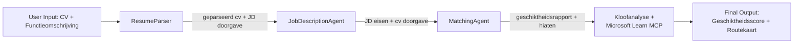

# PersonalCareerCopilot - CV → Baan Match Evaluator

Een workflow-eerst multi-agent app die evalueert hoe goed een cv overeenkomt met een functiebeschrijving, en vervolgens een gepersonaliseerde leerroute genereert om de hiaten te dichten.

---

## Agenten

| Agent | Rol | Tools |
|-------|------|-------|
| **ResumeParser** | Extraheert gestructureerde vaardigheden, ervaring, certificeringen uit cv-tekst | - |
| **JobDescriptionAgent** | Extraheert vereiste/gewenste vaardigheden, ervaring, certificeringen uit een functiebeschrijving | - |
| **MatchingAgent** | Vergelijkt profiel versus vereisten → matchscore (0-100) + overeenkomende/ontbrekende vaardigheden | - |
| **GapAnalyzer** | Bouwt een gepersonaliseerde leerroute met Microsoft Learn bronnen | `search_microsoft_learn_for_plan` (MCP) |

## Workflow


```mermaid
flowchart LR
    UserInput["User Input: CV + Functieomschrijving"] --> ResumeParser
    ResumeParser -- "geparseerd cv + JD doorgave" --> JobDescriptionAgent
    JobDescriptionAgent -- "JD eisen + cv doorgave" --> MatchingAgent
    MatchingAgent -- "geschiktheidsrapport + hiaten" --> GapAnalyzerMCP["Kloofanalyse +\nMicrosoft Learn MCP"]
    GapAnalyzerMCP --> FinalOutput["Final Output:\nGeschiktheidsscore + Routekaart"]
```

---

## Snelstart

### 1. Omgevingsinstelling

Deze map is de referentie-implementatie voor de workflow-gebaseerde Lab 02 scaffold. De `main.py` gebruikt de bestaande promptblokken plus `WorkflowBuilder` om de vier agenten samen te koppelen.

```powershell
cd workshop\lab02-multi-agent\PersonalCareerCopilot
python -m venv .venv
.\.venv\Scripts\Activate.ps1          # Windows PowerShell
# source .venv/bin/activate            # macOS / Linux
pip install -r requirements.txt
```

### 2. Configureer referenties

Maak een `.env` bestand in deze map aan:

```powershell
copy .env .env.bak 2>$null; echo $null > .env
```

Bewerk `.env`:

```env
FOUNDRY_PROJECT_ENDPOINT=https://<your-account>.services.ai.azure.com/api/projects/<your-project>
AZURE_AI_MODEL_DEPLOYMENT_NAME=gpt-4.1-mini
```

| Waarde | Waar te vinden |
|-------|------------------|
| `FOUNDRY_PROJECT_ENDPOINT` | Foundry Toolkit zijbalk → klik met rechts op je project → **Copy Project Endpoint** |
| `AZURE_AI_MODEL_DEPLOYMENT_NAME` | Foundry zijbalk → project uitklappen → **Models + endpoints** → deploymentnaam |

### 3. Lokal draaien

```powershell
python -m debugpy --listen 127.0.0.1:5679 main.py --port 8088
```

Of gebruik de VS Code taak: `Ctrl+Shift+P` → **Taken: Taak uitvoeren** → **Run Agent HTTP Server**.

Voor F5 debugging, gebruik **Debug Local Agent HTTP Server**.

### 4. Test met Agent Inspector

Open Agent Inspector: `Ctrl+Shift+P` → **Foundry Toolkit: Open Agent Inspector**.

Plak deze testprompt:

```
Resume:
Jane Doe
Senior Software Engineer with 5 years of experience in Python, Django, and AWS.
Built microservices handling 10K+ requests/second. Led a team of 4 developers.
Certifications: AWS Solutions Architect Associate.
Education: B.S. Computer Science, State University.

Job Description:
Senior Cloud Engineer at Contoso Ltd.
Required: Python, Azure, Kubernetes, Terraform, CI/CD pipelines.
Preferred: Go, monitoring (Prometheus/Grafana), cost optimization.
Experience: 5+ years in cloud infrastructure.
Certifications: Azure Solutions Architect Expert preferred.
```

**Verwacht:** Een matchscore (0-100), overeenkomende/ontbrekende vaardigheden, en een gepersonaliseerde leerroute met Microsoft Learn URL's.

### 5. Deploy naar Foundry

`Ctrl+Shift+P` → **Foundry Toolkit: Deploy Hosted Agent** → selecteer je project → bevestig.

---

## Projectstructuur

```
PersonalCareerCopilot/
├── .env                ← Your credentials (git-ignored)
├── agent.yaml          ← Hosted agent definition (name, resources, env vars)
├── Dockerfile          ← Container image for Foundry deployment
├── main.py             ← 4-agent workflow (instructions, MCP tool, WorkflowBuilder)
└── requirements.txt    ← Python dependencies
```

## Belangrijke bestanden

### `agent.yaml`

Definieert de gehoste agent voor Foundry Agent Service:
- `kind: hosted` - draait als een beheerde container
- `protocols` - `responses` protocol met `version: 1.0.0`, die de `/responses` HTTP endpoint blootstelt
- `environment_variables` - `AZURE_AI_MODEL_DEPLOYMENT_NAME` wordt hier gedeclareerd; `FOUNDRY_PROJECT_ENDPOINT` wordt automatisch geïnjecteerd bij deploy

### `main.py`

Bevat:
- **Agent instructies** - vier `*_INSTRUCTIONS` constanten, één per agent
- **MCP tool** - `search_microsoft_learn_for_plan()` roept `https://learn.microsoft.com/api/mcp` aan via Streamable HTTP
- **Agent creatie** - vier `Agent()` + `AgentExecutor()` instanties die één `FoundryChatClient` delen
- **Workflowgraph** - `WorkflowBuilder` koppelt agenten als een sequentiële pijplijn: ResumeParser → JD Agent → MatchingAgent → GapAnalyzer
- **Server start** - `ResponsesHostServer` draait op poort 8088

### `requirements.txt`

| Pakket | Doel |
|---------|----------|
| `agent-framework-foundry` | Kern runtime: `Agent`, `AgentExecutor`, `WorkflowBuilder`, `@tool`, `FoundryChatClient` |
| `agent-framework-foundry-hosting` | `ResponsesHostServer` + Foundry hosting integratie |
| `mcp<2,>=1.24.0` | MCP client voor GapAnalyzer (`streamable_http_client`) |
| `debugpy` | Python debugging (F5 in VS Code) |

---

## Probleemoplossing

| Probleem | Oplossing |
|-------|-----|
| `KeyError: 'FOUNDRY_PROJECT_ENDPOINT'` of `KeyError: 'AZURE_AI_MODEL_DEPLOYMENT_NAME'` | Maak `.env` aan met zowel `FOUNDRY_PROJECT_ENDPOINT` als `AZURE_AI_MODEL_DEPLOYMENT_NAME` ingesteld |
| `ModuleNotFoundError: No module named 'agent_framework'` | Activeer venv en voer `pip install -r requirements.txt` uit |
| Geen Microsoft Learn URLs in output | Controleer internetverbinding naar `https://learn.microsoft.com/api/mcp` |
| Slechts 1 gap kaart (afgekapt) | Verifieer dat `GAP_ANALYZER_INSTRUCTIONS` de `CRITICAL:` blokkade bevat |
| Poort 8088 in gebruik | Stop andere servers: `netstat -ano \| findstr :8088` |

Voor gedetailleerde probleemoplossing, zie [Module 8 - Troubleshooting](../docs/08-troubleshooting.md).

---

**Volledige walkthrough:** [Lab 02 Docs](../docs/README.md) · **Terug naar:** [Lab 02 README](../README.md) · [Workshop Home](../../../README.md)

---

<!-- CO-OP TRANSLATOR DISCLAIMER START -->
**Disclaimer**:
Dit document is vertaald met behulp van de AI vertaaldienst [Co-op Translator](https://github.com/Azure/co-op-translator). Hoewel we streven naar nauwkeurigheid, dient u er rekening mee te houden dat geautomatiseerde vertalingen fouten of onnauwkeurigheden kunnen bevatten. Het originele document in de oorspronkelijke taal moet worden beschouwd als de gezaghebbende bron. Voor kritieke informatie wordt professionele menselijke vertaling aanbevolen. Wij zijn niet aansprakelijk voor eventuele misverstanden of verkeerde interpretaties die voortvloeien uit het gebruik van deze vertaling.
<!-- CO-OP TRANSLATOR DISCLAIMER END -->