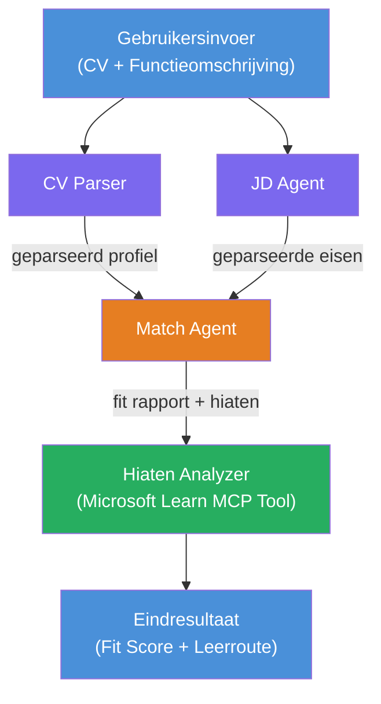

# Lab 02 - Multi-Agent Workflow: CV → Functiegeschiktheid Evaluator

---

## Wat je gaat bouwen

Een **CV → Functiegeschiktheid Evaluator** - een multi-agent workflow waarbij vier gespecialiseerde agenten samenwerken om te evalueren hoe goed het cv van een kandidaat aansluit bij een functieomschrijving, en vervolgens een gepersonaliseerd leertraject opstellen om de hiaten te dichten.

### De agenten

| Agent | Rol |
|-------|------|
| **CV Parser** | Extraheert gestructureerde vaardigheden, ervaring, certificeringen uit cv-tekst |
| **Functieomschrijving Agent** | Extraheert vereiste/preferente vaardigheden, ervaring, certificeringen uit een functieomschrijving |
| **Matching Agent** | Vergelijkt profiel vs vereisten → geschiktheidsscore (0-100) + overeenkomende/ontbrekende vaardigheden |
| **Hiaat Analyzer** | Maakt een gepersonaliseerd leertraject met bronnen, tijdlijnen en snelle projectwinsten |

### Demo flow

Upload een **cv + functieomschrijving** → krijg een **geschiktheidsscore + ontbrekende vaardigheden** → ontvang een **gepersonaliseerd leertraject**.

### Workflow architectuur

> Paars = parallelle agenten | Oranje = aggregatiepunt | Groen = laatste agent met tools. Zie [Module 1 - Begrijp de Architectuur](docs/01-understand-multi-agent.md) en [Module 4 - Orkestratiepatronen](docs/04-orchestration-patterns.md) voor gedetailleerde diagrammen en datastromen.

### Behandelde onderwerpen

- Een multi-agent workflow creëren met **WorkflowBuilder**
- Agentrollen en orkestratieflow definiëren (parallel + sequentieel)
- Communicatiepatronen tussen agenten
- Lokaal testen met de Agent Inspector
- Multi-agent workflows uitrollen naar Foundry Agent Service

---

## Vereisten

Voltooi eerst Lab 01:

- [Lab 01 - Enkele Agent](../lab01-single-agent/README.md)

---

## Aan de slag

Zie de volledige setup-instructies, code-uitleg en testcommando's in:

- [Lab 2 Docs - Vereisten](docs/00-prerequisites.md)
- [Lab 2 Docs - Volledig Leertraject](docs/README.md)
- [PersonalCareerCopilot startgids](PersonalCareerCopilot/README.md)

## Orkestratiepatronen (agentale alternatieven)

Lab 2 bevat de standaard **parallel → aggregator → planner** flow, en de documentatie beschrijft ook alternatieve patronen om sterker agentgedrag te demonstreren:

- **Fan-out/Fan-in met gewogen consensus**
- **Review-/kritiekronde vóór het definitieve leertraject**
- **Voorwaardelijke router** (padselectie op basis van geschiktheidsscore en ontbrekende vaardigheden)

Zie [docs/04-orchestration-patterns.md](docs/04-orchestration-patterns.md).

---

**Vorige:** [Lab 01 - Enkele Agent](../lab01-single-agent/README.md) · **Terug naar:** [Workshop Startpagina](../../README.md)

---

<!-- CO-OP TRANSLATOR DISCLAIMER START -->
**Disclaimer**:
Dit document is vertaald met behulp van de AI-vertalingsdienst [Co-op Translator](https://github.com/Azure/co-op-translator). Hoewel we streven naar nauwkeurigheid, dient u er rekening mee te houden dat automatische vertalingen fouten of onnauwkeurigheden kunnen bevatten. Het originele document in de oorspronkelijke taal moet als de gezaghebbende bron worden beschouwd. Voor kritieke informatie wordt professionele menselijke vertaling aanbevolen. Wij zijn niet aansprakelijk voor eventuele misverstanden of verkeerde interpretaties die voortvloeien uit het gebruik van deze vertaling.
<!-- CO-OP TRANSLATOR DISCLAIMER END -->