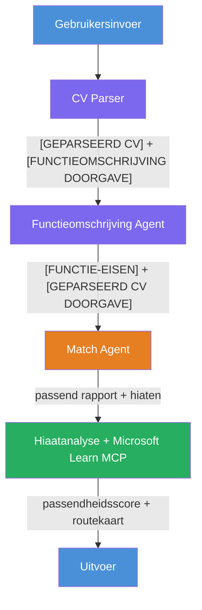

# Lab 02 - Multi-Agent Workflow: CV → Job Fit Evaluator

## Overzicht

In deze praktijkgerichte lab bouw je een **workflow-first multi-agent app** met Foundry Toolkit in VS Code en zet je deze uit naar de Microsoft Foundry Agent Service.

**Wat je bouwt:** een CV → Job Fit Evaluator die een cv en functieomschrijving verwerkt, de match scoort en een gepersonaliseerde leerroute maakt met Microsoft Learn-bronnen.

---

## Architectuur

```mermaid
flowchart TD
    A["Gebruikersinvoer"] --> B["CV Parser"]
    B -->|"[GEPARSEERD CV] + [FUNCTIEOMSCHRIJVING DOORGAVE]"| C["Functieomschrijving Agent"]
    C -->|"[FUNCTIE-EISEN] + [GEPARSEERD CV DOORGAVE]"| D["Match Agent"]
    D -->|passend rapport + hiaten| E["Hiaatanalyse + Microsoft Learn MCP"]
    E -->|passendheidsscore + routekaart| F["Uitvoer"]

    style A fill:#4A90D9,color:#fff
    style B fill:#7B68EE,color:#fff
    style C fill:#7B68EE,color:#fff
    style D fill:#E67E22,color:#fff
    style E fill:#27AE60,color:#fff
    style F fill:#4A90D9,color:#fff
```

**Hoe werkt het:**
1. De gebruiker plakt een cv en een functieomschrijving.
2. **ResumeParser** verwerkt het cv en kopieert de JD letterlijk naar een `[JOB DESCRIPTION PASS-THROUGH]` sectie.
3. **JD Agent** extraheert gestructureerde vereisten uit de pass-through en geeft vervolgens de `[PARSED RESUME]` door als `[PARSED RESUME PASS-THROUGH]`.
4. **MatchingAgent** vergelijkt `[PARSED RESUME PASS-THROUGH]` met `[JD REQUIREMENTS]` en maakt een fit-score.
5. **GapAnalyzer** zet de hiaten om in een praktische roadmap en haalt echte Microsoft Learn-links op via MCP.

---

## Vereisten

Voltooi eerst Lab 01:

- [Lab 01 - Single Agent](../lab01-single-agent/README.md)

---

## Deel 1: Lees de modules op volgorde

Bekijk het volledige leerpad in:

- [Lab 2 Docs - Vereisten](docs/00-prerequisites.md)
- [Lab 2 Docs - Volledig Leerpad](docs/README.md)
- [PersonalCareerCopilot handleiding](PersonalCareerCopilot/README.md)

---

## Deel 2: Bouw en test de workflow

1. Gebruik de Foundry Toolkit wizard om het workflow-gebaseerde project op te zetten.
2. Kopieer de prompt-blokken en workflow-grafiek van `PersonalCareerCopilot/main.py` naar je werkruimte.
3. Voer lokaal uit met de Agent Inspector en verifieer alle vier agents plus de MCP-tool.
4. Zet de gehoste agent in Foundry uit zodra de lokale test slaagt.

---

## Orkestratiepatronen

Lab 02 bevat de standaard **fan-out → fan-in → sequentiële** flow, en de docs beschrijven ook alternatieve orkestratiepatronen voor experimentatie.

- **Fan-out/Fan-in met gewogen consensus**
- **Reviewer/criticus doorgenomen voordat de uiteindelijke roadmap wordt gemaakt**
- **Voorwaardelijke router** gebaseerd op fit-score en ontbrekende vaardigheden

Zie [docs/04-orchestration-patterns.md](docs/04-orchestration-patterns.md).

---

**Vorig:** [Lab 01 - Single Agent](../lab01-single-agent/README.md) · **Terug naar:** [Workshop Home](../../README.md)

---

<!-- CO-OP TRANSLATOR DISCLAIMER START -->
**Disclaimer**:
Dit document is vertaald met behulp van de AI vertaaldienst [Co-op Translator](https://github.com/Azure/co-op-translator). Hoewel we streven naar nauwkeurigheid, dient u er rekening mee te houden dat geautomatiseerde vertalingen fouten of onnauwkeurigheden kunnen bevatten. Het originele document in de oorspronkelijke taal moet worden beschouwd als de gezaghebbende bron. Voor kritieke informatie wordt professionele menselijke vertaling aanbevolen. Wij zijn niet aansprakelijk voor eventuele misverstanden of verkeerde interpretaties die voortvloeien uit het gebruik van deze vertaling.
<!-- CO-OP TRANSLATOR DISCLAIMER END -->