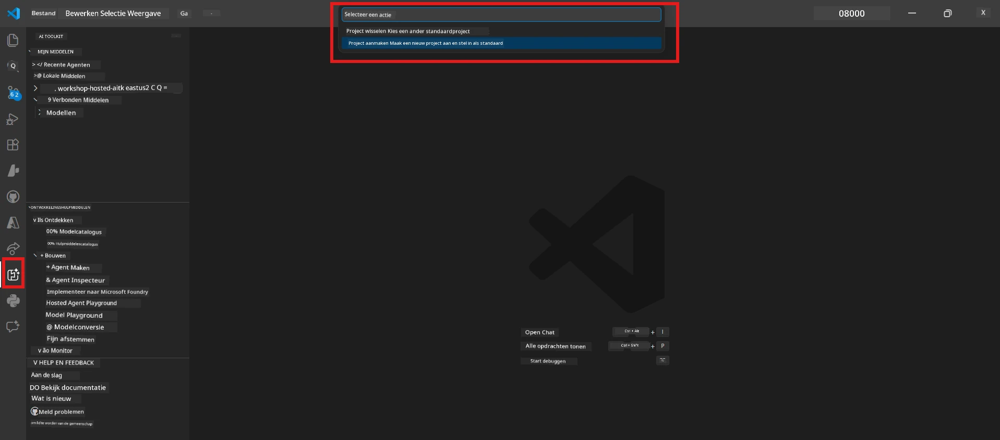

# Module 0 - Vereisten

Voordat je begint met Lab 02, controleer of je het volgende hebt voltooid. Dit lab bouwt direct voort op Lab 01 - sla dit niet over.

---

## 1. Voltooi Lab 01

Lab 02 gaat ervan uit dat je al:

- [x] Alle 8 modules van [Lab 01 - Single Agent](../../lab01-single-agent/README.md) hebt voltooid
- [x] Succesvol een enkele agent hebt ingezet in Foundry Agent Service
- [x] Hebt geverifieerd dat de agent werkt in zowel de lokale Agent Inspector als Foundry Playground

Als je Lab 01 nog niet hebt afgerond, ga dan terug en maak het nu af: [Lab 01 Docs](../../lab01-single-agent/docs/00-prerequisites.md)

---

## 2. Verifieer bestaande setup

Alle tools van Lab 01 moeten nog steeds geïnstalleerd zijn en werken. Voer deze snelle controles uit:

### 2.1 Azure CLI

```powershell
az account show --query "{name:name, id:id}" --output table
```
  
Verwacht: Toont je abonnementsnaam en ID. Als dit niet lukt, voer dan [`az login`](https://learn.microsoft.com/cli/azure/authenticate-azure-cli-interactively) uit.

### 2.2 VS Code extensies

1. Druk op `Ctrl+Shift+P` → typ **"Microsoft Foundry"** → bevestig dat je opdrachten ziet (bijv. `Microsoft Foundry: Create a New Hosted Agent`).
2. Druk op `Ctrl+Shift+P` → typ **"Foundry Toolkit"** → bevestig dat je opdrachten ziet (bijv. `Foundry Toolkit: Open Agent Inspector`).

### 2.3 Foundry project & model

1. Klik op het **Microsoft Foundry**-pictogram in de VS Code-activiteitenbalk.
2. Bevestig dat je project vermeld staat (bijv. `workshop-agents`).
3. Vouw het project uit → verifieer dat er een ingezet model bestaat (bijv. `gpt-4.1-mini`) met status **Succeeded**.

> **Als je modelimplementatie is verlopen:** Sommige gratis tier-implementaties verlopen automatisch. Zet opnieuw in via de [Model Catalog](https://learn.microsoft.com/azure/foundry/foundry-models/concepts/models-sold-directly-by-azure) (`Ctrl+Shift+P` → **Microsoft Foundry: Open Model Catalog**).



### 2.4 RBAC-rollen

Verifieer dat je **Azure AI User** hebt op je Foundry-project:

1. [Azure Portal](https://portal.azure.com) → je Foundry **project** resource → **Toegangsbeheer (IAM)** → **[Roltoewijzingen](https://learn.microsoft.com/azure/foundry/concepts/rbac-foundry)** tabblad.
2. Zoek je naam → bevestig dat **[Azure AI User](https://aka.ms/foundry-ext-project-role)** vermeld staat.

---

## 3. Begrijp multi-agent concepten (nieuw in Lab 02)

Lab 02 introduceert concepten die niet in Lab 01 zijn behandeld. Lees deze door voordat je verder gaat:

### 3.1 Wat is een multi-agent workflow?

In plaats van één agent die alles afhandelt, verdeelt een **multi-agent workflow** het werk over meerdere gespecialiseerde agenten. Elke agent heeft:

- Zijn eigen **instructies** (systeem prompt)
- Zijn eigen **rol** (waarvoor het verantwoordelijk is)
- Optionele **tools** (functies die hij kan aanroepen)

De agenten communiceren via een **orkestratiegrafiek** die definieert hoe gegevens tussen hen stromen.

### 3.2 WorkflowBuilder

De [`WorkflowBuilder`](https://learn.microsoft.com/agent-framework/workflows/agents-in-workflows) klasse uit `agent_framework` is het SDK-component dat agenten aan elkaar koppelt:

```python
from agent_framework import WorkflowBuilder

workflow = (
    WorkflowBuilder(
        name="MyWorkflow",
        start_executor=agent_a,
        output_executors=[agent_d],
    )
    .add_edge(agent_a, agent_b)
    .add_edge(agent_a, agent_c)
    .add_edge(agent_b, agent_d)
    .add_edge(agent_c, agent_d)
    .build()
)
```
  
- **`start_executor`** - De eerste agent die gebruikersinvoer ontvangt  
- **`output_executors`** - De agent(en) waarvan de output het uiteindelijke antwoord wordt  
- **`add_edge(source, target)`** - Bepaalt dat `target` de output van `source` ontvangt

### 3.3 MCP (Model Context Protocol) tools

Lab 02 gebruikt een **MCP-tool** die de Microsoft Learn API aanroept om leermaterialen op te halen. [MCP (Model Context Protocol)](https://modelcontextprotocol.io/introduction) is een gestandaardiseerd protocol om AI-modellen te verbinden met externe databronnen en tools.

| Term | Definitie |
|------|-----------|
| **MCP server** | Een service die tools/bronnen beschikbaar stelt via het [MCP protocol](https://learn.microsoft.com/azure/foundry/agents/how-to/tools/model-context-protocol) |
| **MCP client** | Je agentcode die verbinding maakt met een MCP-server en zijn tools aanroept |
| **[Streamable HTTP](https://learn.microsoft.com/agent-framework/agents/tools/hosted-mcp-tools)** | De transportmethode die wordt gebruikt om te communiceren met de MCP-server |

### 3.4 Hoe Lab 02 verschilt van Lab 01

| Aspect | Lab 01 (Single Agent) | Lab 02 (Multi-Agent) |
|--------|----------------------|---------------------|
| Agenten | 1 | 4 (gespecialiseerde rollen) |
| Orkestratie | Geen | WorkflowBuilder (parallel + sequentieel) |
| Tools | Optionele `@tool` functie | MCP tool (externe API-aanroep) |
| Complexiteit | Eenvoudige prompt → antwoord | CV + vacature → fit score → roadmap |
| Contextstroom | Direct | Agent-naar-agent overdracht |

---

## 4. Structuur van de workshoprepository voor Lab 02

Zorg dat je weet waar de bestanden van Lab 02 zijn:

```
workshop/
└── lab02-multi-agent/
    ├── README.md                       ← Lab overview
    ├── docs/                           ← You are here
    │   ├── README.md                   ← Learning path index
    │   ├── 00-prerequisites.md         ← This file
    │   ├── 01-understand-multi-agent.md
    │   ├── ...
    │   └── 08-troubleshooting.md
    └── PersonalCareerCopilot/          ← The agent project
        ├── agent.yaml                  ← Agent definition
        ├── main.py                     ← 4-agent workflow code
        ├── Dockerfile                  ← Container configuration
        └── requirements.txt            ← Python dependencies
```
  
---

### Controlepunt

- [ ] Lab 01 is volledig afgerond (alle 8 modules, agent ingezet en geverifieerd)  
- [ ] `az account show` toont je abonnement  
- [ ] Microsoft Foundry- en Foundry Toolkit-extensies zijn geïnstalleerd en reageren  
- [ ] Foundry-project heeft een ingezet model (bijv. `gpt-4.1-mini`)  
- [ ] Je hebt de rol **Azure AI User** op het project  
- [ ] Je hebt het gedeelte over multi-agent concepten hierboven gelezen en begrijpt WorkflowBuilder, MCP en agentorkestratie  

---

**Volgende:** [01 - Begrijp Multi-Agent Architectuur →](01-understand-multi-agent.md)

---

<!-- CO-OP TRANSLATOR DISCLAIMER START -->
**Disclaimer**:  
Dit document is vertaald met behulp van de AI-vertalingsdienst [Co-op Translator](https://github.com/Azure/co-op-translator). Hoewel we streven naar nauwkeurigheid, dient u er rekening mee te houden dat automatische vertalingen fouten of onnauwkeurigheden kunnen bevatten. Het oorspronkelijke document in de oorspronkelijke taal moet als de gezaghebbende bron worden beschouwd. Voor belangrijke informatie wordt professionele menselijke vertaling aanbevolen. Wij zijn niet aansprakelijk voor eventuele misverstanden of verkeerde interpretaties als gevolg van het gebruik van deze vertaling.
<!-- CO-OP TRANSLATOR DISCLAIMER END -->