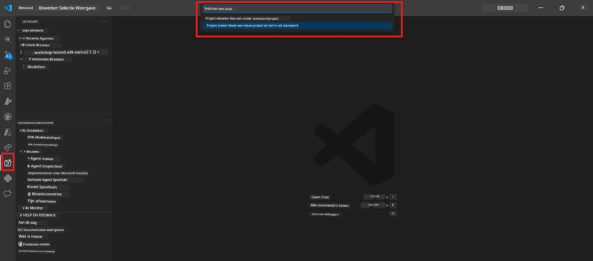

# Module 0 - Inleiding

⏱️ ~10 min

> [!WARNING]
> **Preview & Beperkingen:** [Hosted Agents](https://learn.microsoft.com/azure/foundry/agents/concepts/hosted-agents) zijn momenteel in **publieke preview** - niet aanbevolen voor productieomgevingen. Sommige functies getoond in deze workshop kunnen veranderen wanneer de dienst GA nadert.

## Wat je gaat bouwen

In deze lab breid je de single-agent vaardigheden van Lab 01 uit om een **multi-agent workflow** te bouwen - de Resume → Job Fit Evaluator.

Je plakt een **cv** en een **functieomschrijving** in. Vier gespecialiseerde agents verwerken de input achtereenvolgens en geven dan terug:
- Een score voor de fit (0–100 met een score-uitsplitsing)
- Een lijst met vaardigheids- en certificeringshiaten
- Een gepersonaliseerde leerroute met echte Microsoft Learn-links voor elk hiaten

**De workflow gebruikt:**
- **Microsoft Agent Framework** - `WorkflowBuilder` voor het sequentieel orkestreren van de pijplijn
- **Foundry Toolkit voor VS Code** - scaffolding, lokaal testen, implementeren
- **Een AI-model** (bijvoorbeeld `gpt-4.1-mini`) - gebruikt door alle vier de agents
- **Microsoft Learn MCP-server** - levert echte leerbronlinks voor elk vaardigheidshiaat

---

## Kies je pad

> ⚠️ **Ga door met hetzelfde pad dat je in Lab 01 gebruikte.**

<details open>
<summary><strong>🅰️ Pad A - Azure cloud (vereist Azure-abonnement)</strong></summary>

| | Details |
|---|---|
| **Voor wie is dit?** | Je hebt Lab 01 voltooid met een Azure-abonnement |
| **Model** | Azure OpenAI via Foundry (bijvoorbeeld `gpt-4.1-mini`) |
| **Behandelde modules** | Alle modules (00–09) |
| **Implementeren naar cloud?** | ✅ Ja - volledige end-to-end implementatie |

</details>

<details open>
<summary><strong>🅱️ Pad B - Foundry Local (geen Azure-abonnement nodig)</strong></summary>

| | Details |
|---|---|
| **Voor wie is dit?** | Je hebt Lab 01 voltooid met Foundry Local |
| **Model** | Foundry Local (gratis, draait op je machine) |
| **Behandelde modules** | Modules 00–05 (sla 06–07 over - implementeren & cloudverificatie) |
| **Implementeren naar cloud?** | ❌ Nee - alleen lokaal testen via Agent Inspector |

</details>

---

## Controle van Lab 01

Lab 02 bouwt direct voort op Lab 01. Voltooi Lab 01 eerst voordat je hier begint.

Lab 01 nog niet gedaan? Begin hier: [Lab 01 - Inleiding](../../lab01-single-agent/docs/00-prerequisites.md)

<details open>
<summary><strong>🅰️ Pad A - Azure cloud</strong></summary>

```powershell
az account show --query "{name:name, id:id}" --output table
```

Als dit faalt, voer `az login` uit. Verifieer dan in VS Code:

1. `Ctrl+Shift+P` → typ **Foundry Toolkit** → controleer of de commando’s verschijnen.
2. Klik op het **Foundry Toolkit**-pictogram → je project en geïmplementeerde model tonen **Geslaagd**.



> **RBAC:** Je hebt in Lab 01 de rol **Foundry User** toegewezen. Als je dit opnieuw wilt toewijzen, zie [Lab 01, Module 1](../../lab01-single-agent/docs/01-setup.md#deploy-a-model--assign-rbac). De rol heette eerder **Azure AI User** - dezelfde permissies.

</details>

<details open>
<summary><strong>🅱️ Pad B - Foundry Local</strong></summary>

```powershell
Invoke-WebRequest -Uri "http://localhost:5273/v1/health" -UseBasicParsing | Select-Object StatusCode
```

Verwacht: `StatusCode: 200`. Zo niet, herstart Foundry Local vanuit de Foundry Toolkit zijbalk.

> Alle inferentie draait op je machine. De enige uitgaande oproep is het MCP-hulpmiddel naar `https://learn.microsoft.com/api/mcp`.

</details>

---

## Wat is nieuw in Lab 02

| | Lab 01 | Lab 02 |
|--|--------|--------|
| Agents | 1 | 4 (gekoppeld met WorkflowBuilder) |
| Scaffold template | Basis - Agent Framework | Workflows - Agent Framework |
| Nieuw pakket | - | `mcp` |
| Orkestratie | Enkel conversatie-agent | Sequentiële pijplijn (WorkflowBuilder) |
| Nieuwe tool | - | `search_microsoft_learn_for_plan` (MCP) |

---

**Volgende:** [01 - Begrijp de Architectuur →](01-understand-multi-agent.md)

---

<!-- CO-OP TRANSLATOR DISCLAIMER START -->
**Disclaimer**:
Dit document is vertaald met behulp van de AI vertaaldienst [Co-op Translator](https://github.com/Azure/co-op-translator). Hoewel we streven naar nauwkeurigheid, dient u er rekening mee te houden dat geautomatiseerde vertalingen fouten of onnauwkeurigheden kunnen bevatten. Het originele document in de oorspronkelijke taal moet worden beschouwd als de gezaghebbende bron. Voor kritieke informatie wordt professionele menselijke vertaling aanbevolen. Wij zijn niet aansprakelijk voor eventuele misverstanden of verkeerde interpretaties die voortvloeien uit het gebruik van deze vertaling.
<!-- CO-OP TRANSLATOR DISCLAIMER END -->