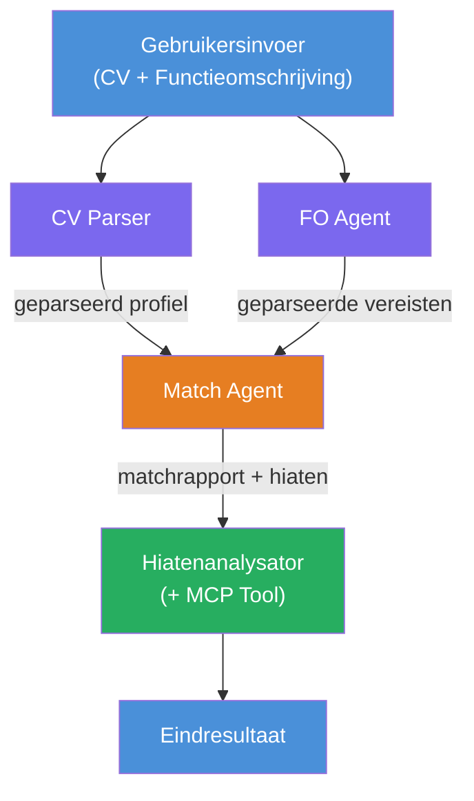
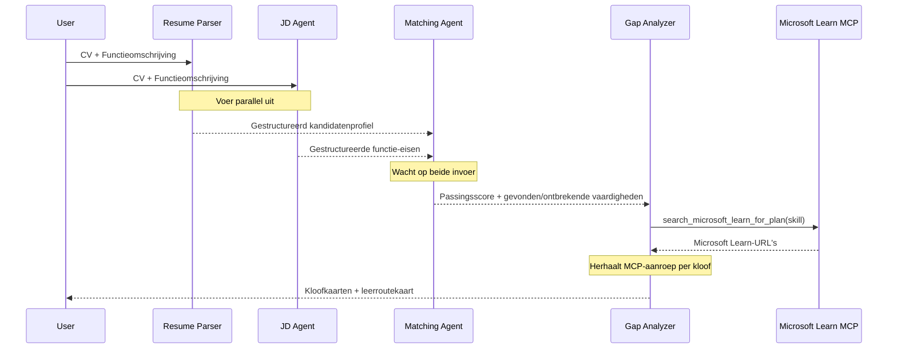
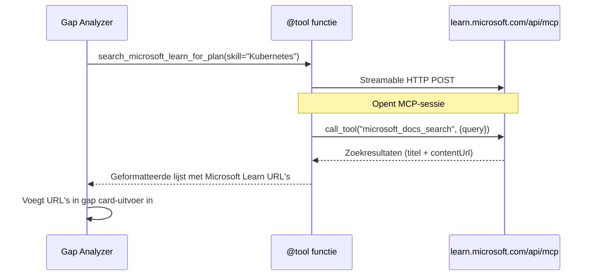

# Module 1 - Begrijp de Multi-Agent Architectuur

In deze module leer je de architectuur van de Resume → Job Fit Evaluator voordat je code schrijft. Het begrijpen van de orkestratiegrafiek, agentrollen en datastroom is cruciaal voor het debuggen en uitbreiden van [multi-agent workflows](https://learn.microsoft.com/azure/architecture/ai-ml/idea/multiple-agent-workflow-automation).

---

## Het probleem dat dit oplost

Het matchen van een cv met een functiebeschrijving vereist meerdere verschillende vaardigheden:

1. **Parseren** - Gestructureerde data extraheren uit ongestructureerde tekst (cv)
2. **Analyse** - Eisen extraheren uit een functiebeschrijving
3. **Vergelijking** - De overeenstemming tussen de twee beoordelen
4. **Planning** - Een leertraject opstellen om hiaten te dichten

Een enkele agent die alle vier taken in één prompt uitvoert, levert vaak:
- Onvolledige extractie (het haast zich door het parseren om bij de score te komen)
- Oppervlakkige scoring (geen onderbouwde uitsplitsing)
- Generieke leerroutes (niet afgestemd op de specifieke hiaten)

Door het op te splitsen in **vier gespecialiseerde agenten**, richt elke agent zich op zijn taak met gerichte instructies, wat resulteert in output van hogere kwaliteit in elke fase.

---

## De vier agenten

Elke agent is een volledige [Microsoft Foundry](https://learn.microsoft.com/azure/foundry/agents/concepts/hosted-agents) agent gemaakt via `AzureAIAgentClient.as_agent()`. Ze gebruiken dezelfde model-deployment maar hebben verschillende instructies en (optioneel) verschillende tools.

| # | Agent Naam | Rol | Input | Output |
|---|------------|-----|-------|--------|
| 1 | **ResumeParser** | Extraheert gestructureerd profiel uit cv-tekst | Ongestructureerde cv-tekst (van gebruiker) | Kandidaatprofiel, Technische Vaardigheden, Soft Skills, Certificeringen, Domeinervaring, Prestaties |
| 2 | **JobDescriptionAgent** | Extraheert gestructureerde eisen uit een functiebeschrijving | Ongestructureerde functiebeschrijving (van gebruiker, doorgegeven via ResumeParser) | Functieoverzicht, Vereiste Vaardigheden, Voorkeursvaardigheden, Ervaring, Certificeringen, Opleiding, Verantwoordelijkheden |
| 3 | **MatchingAgent** | Berekent op bewijs gebaseerde fit-score | Outputs van ResumeParser + JobDescriptionAgent | Fit Score (0-100 met uitsplitsing), Overeenkomende Vaardigheden, Ontbrekende Vaardigheden, Hiaten |
| 4 | **GapAnalyzer** | Stelt gepersonaliseerd leertraject op | Output van MatchingAgent | Gapkaarten (per vaardigheid), Leerorde, Tijdlijn, Microsoft Learn Bronnen |

---

## De orkestratiegrafiek

De workflow gebruikt **parallelle fan-out** gevolgd door **sequentiële aggregatie**:


> **Legenda:** Paars = parallelle agenten, Oranje = aggregatiepunt, Groen = laatste agent met tools

### Hoe data stroomt


1. **Gebruiker stuurt** een bericht met een cv en een functiebeschrijving.
2. **ResumeParser** ontvangt de volledige gebruikersinput en extraheert een gestructureerd kandidaatprofiel.
3. **JobDescriptionAgent** ontvangt parallel de gebruikersinput en extraheert gestructureerde eisen.
4. **MatchingAgent** ontvangt output van **zowel** ResumeParser als JobDescriptionAgent (het framework wacht tot beiden klaar zijn voordat MatchingAgent draait).
5. **GapAnalyzer** ontvangt de output van MatchingAgent en roept de **Microsoft Learn MCP tool** op om echte leerbronnen voor elk gat te zoeken.
6. De **definitieve output** is de reactie van GapAnalyzer, inclusief fit score, gapkaarten en een compleet leertraject.

### Waarom parallelle fan-out belangrijk is

ResumeParser en JobDescriptionAgent draaien **parallel** omdat geen van beide van de ander afhankelijk is. Dit:
- Vermindert de totale latentie (beide draaien tegelijk in plaats van na elkaar)
- Is een natuurlijke splitsing (cv parseren vs. functiebeschrijving parseren zijn onafhankelijke taken)
- Toont een veelgebruikt multi-agent patroon: **fan-out → aggregeren → handelen**

---

## WorkflowBuilder in code

Hier zie je hoe de bovenstaande grafiek wordt vertaald naar [`WorkflowBuilder`](https://learn.microsoft.com/agent-framework/workflows/agents-in-workflows) API-aanroepen in `main.py`:

```python
from agent_framework import WorkflowBuilder

workflow = (
    WorkflowBuilder(
        name="ResumeJobFitEvaluator",
        start_executor=resume_parser,       # Eerste agent die gebruikersinvoer ontvangt
        output_executors=[gap_analyzer],     # Laatste agent waarvan de uitvoer wordt teruggegeven
    )
    .add_edge(resume_parser, jd_agent)      # ResumeParser → JobDescriptionAgent
    .add_edge(resume_parser, matching_agent) # ResumeParser → MatchingAgent
    .add_edge(jd_agent, matching_agent)      # JobDescriptionAgent → MatchingAgent
    .add_edge(matching_agent, gap_analyzer)  # MatchingAgent → GapAnalyzer
    .build()
)
```

**Begrijp de verbindingen:**

| Verbinding | Betekenis |
|------------|-----------|
| `resume_parser → jd_agent` | JD Agent ontvangt output van ResumeParser |
| `resume_parser → matching_agent` | MatchingAgent ontvangt output van ResumeParser |
| `jd_agent → matching_agent` | MatchingAgent ontvangt ook output van JD Agent (wacht op beiden) |
| `matching_agent → gap_analyzer` | GapAnalyzer ontvangt output van MatchingAgent |

Omdat `matching_agent` **twee inkomende verbindingen** heeft (`resume_parser` en `jd_agent`), wacht het framework automatisch tot beide klaar zijn voordat Matching Agent draait.

---

## De MCP-tool

De GapAnalyzer-agent heeft één tool: `search_microsoft_learn_for_plan`. Dit is een **[MCP tool](https://learn.microsoft.com/agent-framework/agents/tools/hosted-mcp-tools)** die de Microsoft Learn API aanroept om geselecteerde leerbronnen op te halen.

### Hoe het werkt

```python
@tool
async def search_microsoft_learn_for_plan(
    skill: str, role: str = "", max_results: int = 5
) -> str:
    """Search Microsoft Learn MCP and return curated official links."""
    # Verbindt met https://learn.microsoft.com/api/mcp via Streamable HTTP
    # Roept de 'microsoft_docs_search' tool aan op de MCP-server
    # Geeft een geformatteerde lijst van Microsoft Learn-URL's terug
```

### MCP aanroepproces


1. GapAnalyzer besluit dat het leerbronnen nodig heeft voor een vaardigheid (bijv. "Kubernetes")
2. Het framework roept `search_microsoft_learn_for_plan(skill="Kubernetes")` aan
3. De functie opent een [Streamable HTTP](https://learn.microsoft.com/agent-framework/agents/tools/hosted-mcp-tools) verbinding met `https://learn.microsoft.com/api/mcp`
4. Het roept de `microsoft_docs_search` tool aan op de [MCP server](https://learn.microsoft.com/azure/foundry/agents/how-to/tools/model-context-protocol)
5. De MCP server retourneert zoekresultaten (titel + URL)
6. De functie formatteert de resultaten en retourneert ze als string
7. GapAnalyzer gebruikt de geretourneerde URL's in de gapkaartoutput

### Verwachte MCP logs

Wanneer de tool draait, zie je logboekvermeldingen zoals:

```
GET https://learn.microsoft.com/api/mcp → 405 (Method Not Allowed)
POST https://learn.microsoft.com/api/mcp → 200
DELETE https://learn.microsoft.com/api/mcp → 405 (Method Not Allowed)
```

**Dit is normaal.** De MCP-client controleert met GET en DELETE tijdens initialisatie - het ontvangen van 405 als antwoord is verwacht gedrag. De eigenlijke toolaanroep gebruikt POST en retourneert 200. Alleen opletten als POST-aanroepen falen.

---

## Agent creatiepatroon

Elke agent wordt gemaakt met de **[`AzureAIAgentClient.as_agent()`](https://learn.microsoft.com/python/api/overview/azure/ai-agents-readme) async context manager**. Dit is het Foundry SDK-patroon voor het creëren van agenten die automatisch worden opgeruimd:

```python
async with (
    get_credential() as credential,
    AzureAIAgentClient(
        project_endpoint=PROJECT_ENDPOINT,
        model_deployment_name=MODEL_DEPLOYMENT_NAME,
        credential=credential,
    ).as_agent(
        name="ResumeParser",
        instructions=RESUME_PARSER_INSTRUCTIONS,
    ) as resume_parser,
    # ... herhaal voor elke agent ...
):
    # Hier bestaan alle 4 agents
    workflow = create_workflow(resume_parser, jd_agent, matching_agent, gap_analyzer)
```

**Belangrijke punten:**
- Elke agent krijgt een eigen `AzureAIAgentClient` instantie (de SDK vereist dat agentnaam client-gebonden is)
- Alle agenten delen dezelfde `credential`, `PROJECT_ENDPOINT` en `MODEL_DEPLOYMENT_NAME`
- Het `async with` blok zorgt dat alle agenten worden opgeruimd wanneer de server wordt afgesloten
- De GapAnalyzer ontvangt daarnaast `tools=[search_microsoft_learn_for_plan]`

---

## Server opstarten

Na het creëren van agenten en het bouwen van de workflow, start de server:

```python
from azure.ai.agentserver.agentframework import from_agent_framework

agent = create_workflow(resume_parser, jd_agent, matching_agent, gap_analyzer)
await from_agent_framework(agent).run_async()
```

`from_agent_framework()` wikkelt de workflow in als een HTTP-server die het `/responses`-endpoint op poort 8088 aanbiedt. Dit is hetzelfde patroon als Lab 01, maar de "agent" is nu de volledige [workflowgrafiek](https://learn.microsoft.com/agent-framework/workflows/as-agents).

---

### Checkpoint

- [ ] Je begrijpt de 4-agent architectuur en de rol van elke agent
- [ ] Je kunt de datastroom volgen: Gebruiker → ResumeParser → (parallel) JD Agent + MatchingAgent → GapAnalyzer → Output
- [ ] Je begrijpt waarom MatchingAgent wacht op zowel ResumeParser als JD Agent (twee inkomende verbindingen)
- [ ] Je begrijpt de MCP-tool: wat het doet, hoe het wordt aangeroepen, en dat GET 405 logs normaal zijn
- [ ] Je begrijpt het `AzureAIAgentClient.as_agent()` patroon en waarom elke agent zijn eigen client heeft
- [ ] Je kunt de `WorkflowBuilder` code lezen en koppelen aan de visuele grafiek

---

**Vorige:** [00 - Vereisten](00-prerequisites.md) · **Volgende:** [02 - Scaffold het Multi-Agent Project →](02-scaffold-multi-agent.md)

---

<!-- CO-OP TRANSLATOR DISCLAIMER START -->
**Disclaimer**:  
Dit document is vertaald met behulp van de AI-vertalingsdienst [Co-op Translator](https://github.com/Azure/co-op-translator). Hoewel we streven naar nauwkeurigheid, dient u er rekening mee te houden dat geautomatiseerde vertalingen fouten of onjuistheden kunnen bevatten. Het originele document in de oorspronkelijke taal dient als de gezaghebbende bron te worden beschouwd. Voor kritieke informatie wordt een professionele menselijke vertaling aanbevolen. Wij zijn niet aansprakelijk voor misverstanden of verkeerde interpretaties die voortvloeien uit het gebruik van deze vertaling.
<!-- CO-OP TRANSLATOR DISCLAIMER END -->