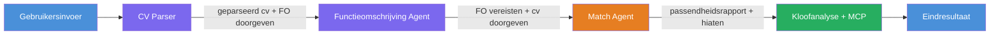

# Module 1 - Begrijp de Architectuur

⏱️ ~5 min

Voordat je code schrijft, hier een snel overzicht van wat je bouwt en hoe het werkt.

---

## Wat je bouwt

Je plakt een **cv** en een **functieomschrijving**. De workflow geeft terug:

- Een fit-score (0–100 met een uitsplitsing)
- Een lijst met vaardigheids- en certificeringslacunes
- Een gepersonaliseerd leertraject met Microsoft Learn-links voor elke lacune

---

## De vier agenten

Eén enkele agent die alles tegelijk probeert te ontleden, scoren en plannen heeft de neiging dingen te haasten en oppervlakkige output te produceren. Het werk opsplitsen in vier gespecialiseerde agenten levert betere resultaten:

| Agent | Wat het doet |
|-------|-------------|
| **ResumeParser** | Ontleedt het cv; kopieert de functieomschrijving woordelijk naar `[JOB DESCRIPTION PASS-THROUGH]` voor downstream agenten |
| **JobDescriptionAgent** | Extraheert functie-eisen uit de doorgegeven tekst; geeft `[PARSED RESUME]` door als `[PARSED RESUME PASS-THROUGH]` |
| **MatchingAgent** | Vergelijkt beide gelabelde secties; produceert een fit-score 0–100 en lijst met lacunes |
| **GapAnalyzer** | Bouwt een leertraject; zoekt voor elke lacune op Microsoft Learn |

---

## De orkestratiegrafiek

De workflow is een **sequentiële pijplijn** — elke agent geeft zijn output door aan de volgende:


```mermaid
flowchart LR
    A["Gebruikersinvoer"] --> B["CV Parser"]
    B -- "geparseerd cv + FO doorgeven" --> C["Functieomschrijving Agent"]
    C -- "FO vereisten + cv doorgeven" --> D["Match Agent"]
    D -- "passendheidsrapport + hiaten" --> E["Kloofanalyse + MCP"]
    E --> F["Eindresultaat"]

    style A fill:#4A90D9,color:#fff
    style B fill:#7B68EE,color:#fff
    style C fill:#7B68EE,color:#fff
    style D fill:#E67E22,color:#fff
    style E fill:#27AE60,color:#fff
    style F fill:#4A90D9,color:#fff
```

1. **ResumeParser** ontvangt de gebruikersinput, ontleedt het cv, en kopieert de functieomschrijving naar `[JOB DESCRIPTION PASS-THROUGH]`.
2. **JD Agent** extraheert gestructureerde eisen en geeft `[PARSED RESUME PASS-THROUGH]` door.
3. **MatchingAgent** vergelijkt beide secties en produceert een fit-score en lijst met lacunes.
4. **GapAnalyzer** bouwt het leertraject en roept voor elke lacune de Microsoft Learn MCP-tool aan.

---

## Hoe dit zich vertaalt naar code

In `main.py` beschrijf je deze grafiek met `WorkflowBuilder`:

```python
workflow_agent = (
    WorkflowBuilder(
        start_executor=resume_executor,       # eerste agent die gebruikersinvoer ontvangt
        output_executors=[gap_executor],      # laatste agent - zijn output is de reactie
    )
    .add_edge(resume_executor, jd_executor)       # ResumeParser → JD Agent
    .add_edge(jd_executor, matching_executor)     # JD Agent → MatchingAgent
    .add_edge(matching_executor, gap_executor)    # MatchingAgent → GapAnalyzer
    .build()
    .as_agent()
)
```

Elke `Agent` zit verpakt in een `AgentExecutor`. De `add_edge()` aanroepen definiëren een strikt sequentiële pijplijn — iedere agent ontvangt alleen de output van zijn directe voorganger.

> `context_mode="last_agent"` betekent dat elke executor alleen de output van zijn directe voorganger ziet. ResumeParser en JD Agent geven data door in gelabelde secties zodat elke volgende agent precies krijgt wat hij nodig heeft.

---

## De MCP-tool

GapAnalyzer heeft één tool: `search_microsoft_learn_for_plan`. Deze maakt verbinding met `https://learn.microsoft.com/api/mcp` en geeft echte Microsoft Learn-links voor elke vaardigheidslacune terug.

Als de tool draait zie je deze logs — allemaal verwacht:

```
GET  https://learn.microsoft.com/api/mcp → 405   ← connection probe, normal
POST https://learn.microsoft.com/api/mcp → 200   ← actual tool call
DELETE https://learn.microsoft.com/api/mcp → 405 ← cleanup probe, normal
```

Maak je pas zorgen als de `POST` een fout teruggeeft.

---

**Vorige:** [00 - Vereisten](00-prerequisites.md) · **Volgende:** [02 - Scaffold het Project →](02-scaffold-multi-agent.md)

---

<!-- CO-OP TRANSLATOR DISCLAIMER START -->
**Disclaimer**:
Dit document is vertaald met behulp van de AI vertaaldienst [Co-op Translator](https://github.com/Azure/co-op-translator). Hoewel we streven naar nauwkeurigheid, dient u er rekening mee te houden dat geautomatiseerde vertalingen fouten of onnauwkeurigheden kunnen bevatten. Het originele document in de oorspronkelijke taal moet worden beschouwd als de gezaghebbende bron. Voor kritieke informatie wordt professionele menselijke vertaling aanbevolen. Wij zijn niet aansprakelijk voor eventuele misverstanden of verkeerde interpretaties die voortvloeien uit het gebruik van deze vertaling.
<!-- CO-OP TRANSLATOR DISCLAIMER END -->