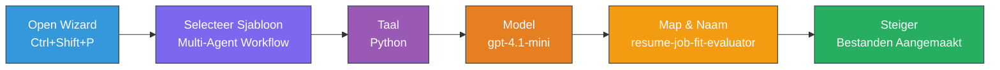
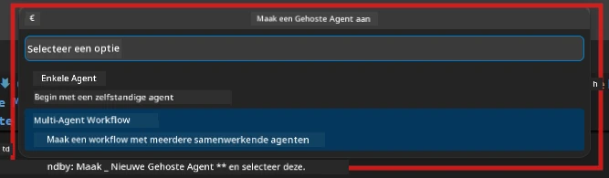

# Module 2 - Scaffold het Multi-Agent Project

In deze module gebruik je de [Microsoft Foundry-extensie](https://marketplace.visualstudio.com/items?itemName=TeamsDevApp.vscode-ai-foundry) om **een multi-agent workflowproject te scaffolden**. De extensie genereert de volledige projectstructuur - `agent.yaml`, `main.py`, `Dockerfile`, `requirements.txt`, `.env`, en debugconfiguratie. Je past deze bestanden vervolgens aan in Modules 3 en 4.

> **Opmerking:** De map `PersonalCareerCopilot/` in deze lab is een compleet werkend voorbeeld van een aangepast multi-agent project. Je kunt een nieuw project scaffolden (aanbevolen om te leren) of direct de bestaande code bestuderen.

---

## Stap 1: Open de wizard Create Hosted Agent


1. Druk op `Ctrl+Shift+P` om de **Command Palette** te openen.
2. Typ: **Microsoft Foundry: Create a New Hosted Agent** en selecteer het.
3. De wizard voor het maken van een hosted agent opent.

> **Alternatief:** Klik op het **Microsoft Foundry**-pictogram in de Activiteitenbalk → klik op het **+**-pictogram naast **Agents** → **Create New Hosted Agent**.

---

## Stap 2: Kies de Multi-Agent Workflow-sjabloon

De wizard vraagt je een sjabloon te selecteren:

| Sjabloon | Beschrijving | Wanneer te gebruiken |
|----------|--------------|---------------------|
| Single Agent | Eén agent met instructies en optionele tools | Lab 01 |
| **Multi-Agent Workflow** | Meerdere agents die samenwerken via WorkflowBuilder | **Deze lab (Lab 02)** |

1. Selecteer **Multi-Agent Workflow**.
2. Klik op **Next**.



---

## Stap 3: Kies programmeertaal

1. Selecteer **Python**.
2. Klik op **Next**.

---

## Stap 4: Selecteer je model

1. De wizard toont de modellen die in je Foundry-project zijn uitgerold.
2. Selecteer hetzelfde model dat je in Lab 01 gebruikte (bijv. **gpt-4.1-mini**).
3. Klik op **Next**.

> **Tip:** [`gpt-4.1-mini`](https://learn.microsoft.com/azure/foundry/foundry-models/concepts/models-sold-directly-by-azure#gpt-41-series) wordt aanbevolen voor ontwikkeling - het is snel, goedkoop en gaat goed om met multi-agent workflows. Schakel over naar `gpt-4.1` voor de definitieve productie-implementatie als je output van hogere kwaliteit wilt.

---

## Stap 5: Kies maplocatie en agentnaam

1. Er opent een dialoogvenster voor het kiezen van een map. Kies een doelmap:
   - Als je de workshoprepo volgt: navigeer naar `workshop/lab02-multi-agent/` en maak een nieuwe submap aan
   - Als je opnieuw begint: kies elke gewenste map
2. Voer een **naam** in voor de hosted agent (bijv. `resume-job-fit-evaluator`).
3. Klik op **Create**.

---

## Stap 6: Wacht tot het scaffolden voltooid is

1. VS Code opent een nieuw venster (of werkt het huidige venster bij) met het gescaffolde project.
2. Je zou deze mappenstructuur moeten zien:

```
resume-job-fit-evaluator/
├── .env                ← Environment variables (placeholders)
├── .vscode/
│   └── launch.json     ← Debug configuration
├── agent.yaml          ← Agent definition (kind: hosted)
├── Dockerfile          ← Container configuration
├── main.py             ← Multi-agent workflow code (scaffold)
└── requirements.txt    ← Python dependencies
```

> **Workshopopmerking:** In de workshoprepository staat de `.vscode/`-map in de **workspace root** met gedeelde `launch.json` en `tasks.json`. De debugconfiguraties voor Lab 01 en Lab 02 zijn beide opgenomen. Wanneer je op F5 drukt, selecteer je **"Lab02 - Multi-Agent"** in de dropdown.

---

## Stap 7: Begrijp de gescaffolde bestanden (multi-agent specifics)

Het multi-agent scaffold verschilt op enkele belangrijke punten van het single-agent scaffold:

### 7.1 `agent.yaml` - Agentdefinitie

```yaml
kind: hosted
name: resume-job-fit-evaluator
description: >
  A multi-agent workflow that evaluates resume-to-job fit.
metadata:
  authors:
    - Microsoft
  tags:
    - Multi-Agent Workflow
    - Resume Evaluator
protocols:
  - protocol: responses
    version: v1
environment_variables:
  - name: PROJECT_ENDPOINT
    value: ${PROJECT_ENDPOINT}
  - name: MODEL_DEPLOYMENT_NAME
    value: ${MODEL_DEPLOYMENT_NAME}
```

**Belangrijk verschil met Lab 01:** De sectie `environment_variables` kan extra variabelen bevatten voor MCP-eindpunten of andere toolconfiguratie. De `name` en `description` reflecteren de multi-agent use-case.

### 7.2 `main.py` - Multi-agent workflow code

Het scaffold bevat:
- **Meerdere agent instructiestrings** (één const per agent)
- **Meerdere [`AzureAIAgentClient.as_agent()`](https://learn.microsoft.com/python/api/overview/azure/ai-agents-readme) contextmanagers** (één per agent)
- **[`WorkflowBuilder`](https://learn.microsoft.com/agent-framework/workflows/agents-in-workflows)** om agents met elkaar te verbinden
- **`from_agent_framework()`** om de workflow als een HTTP-eindpunt te serveren

```python
from agent_framework import WorkflowBuilder, tool
from agent_framework.azure import AzureAIAgentClient
from azure.ai.agentserver.agentframework import from_agent_framework
```

De extra import [`WorkflowBuilder`](https://learn.microsoft.com/agent-framework/workflows/agents-in-workflows) is nieuw ten opzichte van Lab 01.

### 7.3 `requirements.txt` - Aanvullende afhankelijkheden

Het multi-agent project gebruikt dezelfde basispakketten als Lab 01, plus eventuele MCP-gerelateerde pakketten:

```
agent-framework-azure-ai==1.0.0rc3
agent-framework-core==1.0.0rc3
azure-ai-agentserver-agentframework==1.0.0b16
azure-ai-agentserver-core==1.0.0b16
debugpy
agent-dev-cli --pre
```

> **Belangrijke versienotitie:** Het `agent-dev-cli` pakket vereist de `--pre` vlag in `requirements.txt` om de nieuwste previewversie te installeren. Dit is nodig voor Agent Inspector compatibiliteit met `agent-framework-core==1.0.0rc3`. Zie [Module 8 - Troubleshooting](08-troubleshooting.md) voor versiegegevens.

| Pakket | Versie | Doel |
|--------|--------|-------|
| [`agent-framework-azure-ai`](https://learn.microsoft.com/agent-framework/overview/) | `1.0.0rc3` | Azure AI-integratie voor [Microsoft Agent Framework](https://github.com/microsoft/agent-framework) |
| [`agent-framework-core`](https://learn.microsoft.com/agent-framework/overview/) | `1.0.0rc3` | Kern-runtime (bevat WorkflowBuilder) |
| `azure-ai-agentserver-agentframework` | `1.0.0b16` | Hosted agent server runtime |
| `azure-ai-agentserver-core` | `1.0.0b16` | Kern agent server abstracties |
| `debugpy` | nieuwste | Python debugging (F5 in VS Code) |
| `agent-dev-cli` | `--pre` | Lokale dev CLI + Agent Inspector backend |

### 7.4 `Dockerfile` - Zelfde als Lab 01

De Dockerfile is identiek aan die van Lab 01 - hij kopieert bestanden, installeert afhankelijkheden uit `requirements.txt`, maakt poort 8088 beschikbaar en voert `python main.py` uit.

```dockerfile
FROM python:3.14-slim
WORKDIR /app
COPY ./ .
RUN pip install --upgrade pip && \
    if [ -f requirements.txt ]; then \
        pip install -r requirements.txt; \
    else \
      echo "No requirements.txt found" >&2; exit 1; \
    fi
EXPOSE 8088
CMD ["python", "main.py"]
```

---

### Tussenstation

- [ ] Scaffold wizard voltooid → nieuwe projectstructuur is zichtbaar
- [ ] Je ziet alle bestanden: `agent.yaml`, `main.py`, `Dockerfile`, `requirements.txt`, `.env`
- [ ] `main.py` bevat de import `WorkflowBuilder` (bevestigt dat multi-agent template is geselecteerd)
- [ ] `requirements.txt` bevat zowel `agent-framework-core` als `agent-framework-azure-ai`
- [ ] Je begrijpt hoe het multi-agent scaffold verschilt van het single-agent scaffold (meerdere agents, WorkflowBuilder, MCP-tools)

---

**Vorige:** [01 - Begrijp de Multi-Agent Architectuur](01-understand-multi-agent.md) · **Volgende:** [03 - Configureer Agents & Omgeving →](03-configure-agents.md)

---

<!-- CO-OP TRANSLATOR DISCLAIMER START -->
**Disclaimer**:  
Dit document is vertaald met behulp van de AI vertaaldienst [Co-op Translator](https://github.com/Azure/co-op-translator). Hoewel we streven naar nauwkeurigheid, dient u er rekening mee te houden dat geautomatiseerde vertalingen fouten of onnauwkeurigheden kunnen bevatten. Het originele document in de oorspronkelijke taal dient als gezaghebbende bron te worden beschouwd. Voor kritieke informatie wordt professionele menselijke vertaling aanbevolen. Wij zijn niet aansprakelijk voor misverstanden of verkeerde interpretaties die voortvloeien uit het gebruik van deze vertaling.
<!-- CO-OP TRANSLATOR DISCLAIMER END -->