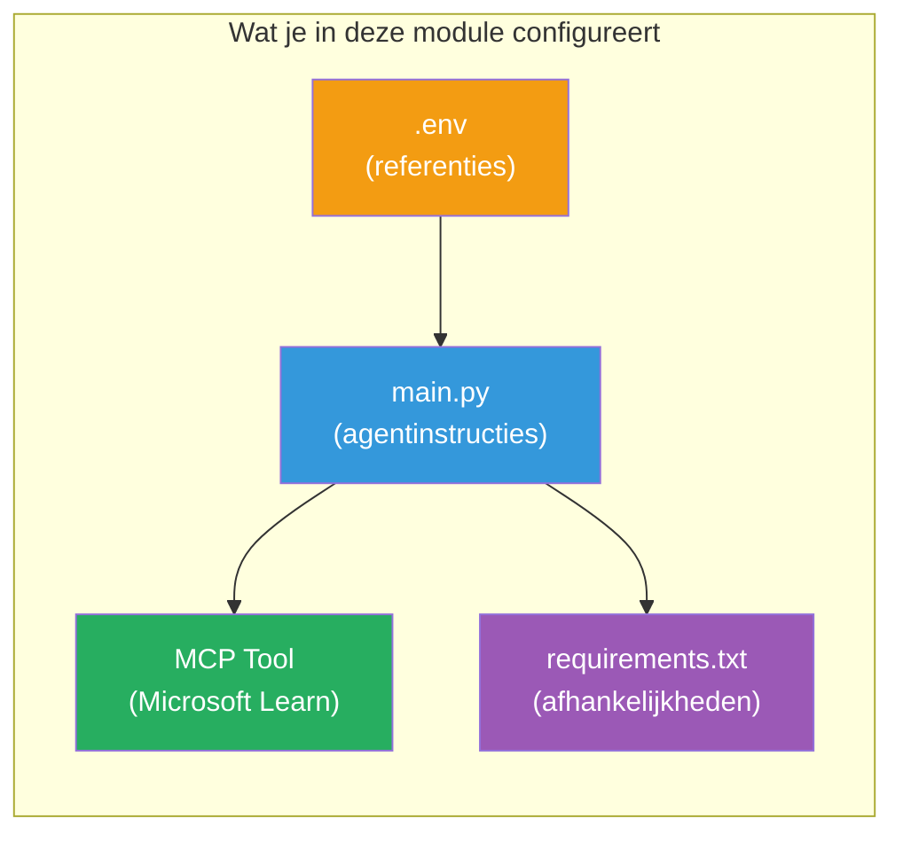

# Module 3 - Configureer Agents, MCP Tool & Omgeving

In deze module pas je het gescaffolde multi-agent project aan. Je schrijft instructies voor alle vier de agents, stelt de MCP-tool in voor Microsoft Learn, configureert omgevingsvariabelen en installeert dependencies.


> **Referentie:** De volledige werkende code staat in [`PersonalCareerCopilot/main.py`](../../../../../workshop/lab02-multi-agent/PersonalCareerCopilot/main.py). Gebruik dit als referentie tijdens het bouwen van je eigen project.

---

## Stap 1: Configureer omgevingsvariabelen

1. Open het **`.env`** bestand in de hoofdmap van je project.
2. Vul je Foundry-projectgegevens in:

   ```env
   PROJECT_ENDPOINT=https://<your-account>.services.ai.azure.com/api/projects/<your-project>
   MODEL_DEPLOYMENT_NAME=gpt-4.1-mini
   ```

3. Sla het bestand op.

### Waar je deze waarden vindt

| Waarde | Hoe te vinden |
|-------|---------------|
| **Project endpoint** | Microsoft Foundry zijbalk → klik op je project → endpoint-URL in het detailoverzicht |
| **Modeldeployment naam** | Foundry zijbalk → project uitvouwen → **Models + endpoints** → naam naast gedeployed model |

> **Beveiliging:** Voeg `.env` nooit toe aan versiebeheer. Voeg het toe aan `.gitignore` als dat nog niet is gedaan.

### Mapping van omgevingsvariabelen

De multi-agent `main.py` leest zowel standaard- als workshop-specifieke env var namen:

```python
PROJECT_ENDPOINT = os.getenv("AZURE_AI_PROJECT_ENDPOINT") or os.getenv("PROJECT_ENDPOINT")
MODEL_DEPLOYMENT_NAME = os.getenv(
    "AZURE_AI_MODEL_DEPLOYMENT_NAME",
    os.getenv("MODEL_DEPLOYMENT_NAME", "gpt-4.1-mini"),
)
MICROSOFT_LEARN_MCP_ENDPOINT = os.getenv(
    "MICROSOFT_LEARN_MCP_ENDPOINT", "https://learn.microsoft.com/api/mcp"
)
```

Het MCP endpoint heeft een verstandige standaard - je hoeft dit niet in `.env` te zetten tenzij je het wilt overschrijven.

---

## Stap 2: Schrijf agentinstructies

Dit is de belangrijkste stap. Elke agent heeft zorgvuldig opgestelde instructies nodig die zijn rol, uitvoerformaat en regels definiëren. Open `main.py` en maak de instructieconstanten aan (of bewerk ze).

### 2.1 Resume Parser Agent

```python
RESUME_PARSER_INSTRUCTIONS = """\
You are the Resume Parser.
Extract resume text into a compact, structured profile for downstream matching.

Output exactly these sections:
1) Candidate Profile
2) Technical Skills (grouped categories)
3) Soft Skills
4) Certifications & Awards
5) Domain Experience
6) Notable Achievements

Rules:
- Use only explicit or strongly implied evidence.
- Do not invent skills, titles, or experience.
- Keep concise bullets; no long paragraphs.
- If input is not a resume, return a short warning and request resume text.
"""
```

**Waarom deze secties?** De MatchingAgent heeft gestructureerde data nodig om op te scoren. Consistente secties zorgen voor betrouwbare overdracht tussen agents.

### 2.2 Job Description Agent

```python
JOB_DESCRIPTION_INSTRUCTIONS = """\
You are the Job Description Analyst.
Extract a structured requirement profile from a JD.

Output exactly these sections:
1) Role Overview
2) Required Skills
3) Preferred Skills
4) Experience Required
5) Certifications Required
6) Education
7) Domain / Industry
8) Key Responsibilities

Rules:
- Keep required vs preferred clearly separated.
- Only use what the JD states; do not invent hidden requirements.
- Flag vague requirements briefly.
- If input is not a JD, return a short warning and request JD text.
"""
```

**Waarom onderscheid tussen required en preferred?** De MatchingAgent hanteert verschillende gewichten voor elk (Vereiste vaardigheden = 40 punten, Gewenste vaardigheden = 10 punten).

### 2.3 Matching Agent

```python
MATCHING_AGENT_INSTRUCTIONS = """\
You are the Matching Agent.
Compare parsed resume output vs JD output and produce an evidence-based fit report.

Scoring (100 total):
- Required Skills 40
- Experience 25
- Certifications 15
- Preferred Skills 10
- Domain Alignment 10

Output exactly these sections:
1) Fit Score (with breakdown math)
2) Matched Skills
3) Missing Skills
4) Partially Matched
5) Experience Alignment
6) Certification Gaps
7) Overall Assessment

Rules:
- Be objective and evidence-only.
- Keep partial vs missing separate.
- Keep Missing Skills precise; it feeds roadmap planning.
"""
```

**Waarom expliciete scoring?** Reproduceerbare scoring maakt het mogelijk om runs te vergelijken en problemen te debuggen. De 100-puntenschaal is eenvoudig te interpreteren voor eindgebruikers.

### 2.4 Gap Analyzer Agent

```python
GAP_ANALYZER_INSTRUCTIONS = """\
You are the Gap Analyzer and Roadmap Planner.
Create a practical upskilling plan from the matching report.

Microsoft Learn MCP usage (required):
- For EVERY High and Medium priority gap, call tool `search_microsoft_learn_for_plan`.
- Use returned Learn links in Suggested Resources.
- Prefer Microsoft Learn for free resources.

CRITICAL: You MUST produce a SEPARATE detailed gap card for EVERY skill listed in
the Missing Skills and Certification Gaps sections of the matching report. Do NOT
skip or combine gaps. Do NOT summarize multiple gaps into one card.

Output format:
1) Personalized Learning Roadmap for [Role Title]
2) One DETAILED card per gap (produce ALL cards, not just the first):
   - Skill
   - Priority (High/Medium/Low)
   - Current Level
   - Target Level
   - Suggested Resources (include Learn URL from tool results)
   - Estimated Time
   - Quick Win Project
3) Recommended Learning Order (numbered list)
4) Timeline Summary (week-by-week)
5) Motivational Note

Rules:
- Produce every gap card before writing the summary sections.
- Keep it specific, realistic, and actionable.
- Tailor to candidate's existing stack.
- If fit >= 80, focus on polish/interview readiness.
- If fit < 40, be honest and provide a staged path.
"""
```

**Waarom benadrukken met "CRITICAL"?** Zonder expliciete instructies om ALLE gap-kaarten te produceren, genereert het model vaak slechts 1-2 kaarten en vat de rest samen. De "CRITICAL" sectie voorkomt deze inkorting.

---

## Stap 3: Definieer de MCP tool

De GapAnalyzer gebruikt een tool die de [Microsoft Learn MCP server](https://learn.microsoft.com/azure/foundry/agents/how-to/tools/model-context-protocol) aanroept. Voeg dit toe aan `main.py`:

```python
import json
from agent_framework import tool
from mcp.client.session import ClientSession
from mcp.client.streamable_http import streamable_http_client

@tool
async def search_microsoft_learn_for_plan(
    skill: str, role: str = "", max_results: int = 5
) -> str:
    """Search Microsoft Learn MCP and return curated official links for roadmap planning."""
    query = " ".join(part for part in [skill, role, "learning path module"] if part).strip()
    query = query or "job skills learning path"

    try:
        async with streamable_http_client(MICROSOFT_LEARN_MCP_ENDPOINT) as (
            read_stream, write_stream, _,
        ):
            async with ClientSession(read_stream, write_stream) as session:
                await session.initialize()
                result = await session.call_tool(
                    "microsoft_docs_search", {"query": query}
                )

        if not result.content:
            return (
                "No results returned from Microsoft Learn MCP. "
                "Fallback: https://learn.microsoft.com/training/support/catalog-api"
            )

        payload_text = getattr(result.content[0], "text", "")
        data = json.loads(payload_text) if payload_text else {}
        items = data.get("results", [])[:max(1, min(max_results, 10))]

        if not items:
            return f"No direct Microsoft Learn results found for '{skill}'."

        lines = [f"Microsoft Learn resources for '{skill}':"]
        for i, item in enumerate(items, start=1):
            title = item.get("title") or item.get("url") or "Microsoft Learn Resource"
            url = item.get("url") or item.get("link") or ""
            lines.append(f"{i}. {title} - {url}".rstrip(" -"))
        return "\n".join(lines)
    except Exception as ex:
        return (
            f"Microsoft Learn MCP lookup unavailable. Reason: {ex}. "
            "Fallbacks: https://learn.microsoft.com/api/mcp"
        )
```

### Hoe de tool werkt

| Stap | Wat er gebeurt |
|------|----------------|
| 1 | GapAnalyzer besluit dat er resources nodig zijn voor een vaardigheid (bijv. "Kubernetes") |
| 2 | Framework roept `search_microsoft_learn_for_plan(skill="Kubernetes")` aan |
| 3 | Functie opent [Streamable HTTP](https://learn.microsoft.com/agent-framework/agents/tools/hosted-mcp-tools) verbinding naar `https://learn.microsoft.com/api/mcp` |
| 4 | Roept `microsoft_docs_search` aan op de [MCP server](https://learn.microsoft.com/azure/foundry/agents/how-to/tools/model-context-protocol) |
| 5 | MCP server retourneert zoekresultaten (titel + URL) |
| 6 | Functie formatteert resultaten als genummerde lijst |
| 7 | GapAnalyzer verwerkt de URLs in de gapkaart |

### MCP dependencies

De MCP clientbibliotheken worden transitief meegeleverd via [`agent-framework-core`](https://learn.microsoft.com/agent-framework/overview/). Je hoeft ze **niet** apart toe te voegen aan `requirements.txt`. Als je importfouten krijgt, controleer dan:

```powershell
pip list | Select-String "mcp"
```

Verwacht: `mcp` package is geïnstalleerd (versie 1.x of hoger).

---

## Stap 4: Koppel de agents en workflow

### 4.1 Maak agents aan met contextmanagers

```python
from contextlib import asynccontextmanager

@asynccontextmanager
async def create_agents():
    async with (
        get_credential() as credential,
        AzureAIAgentClient(
            project_endpoint=PROJECT_ENDPOINT,
            model_deployment_name=MODEL_DEPLOYMENT_NAME,
            credential=credential,
        ).as_agent(
            name="ResumeParser",
            instructions=RESUME_PARSER_INSTRUCTIONS,
        ) as resume_parser,
        AzureAIAgentClient(
            project_endpoint=PROJECT_ENDPOINT,
            model_deployment_name=MODEL_DEPLOYMENT_NAME,
            credential=credential,
        ).as_agent(
            name="JobDescriptionAgent",
            instructions=JOB_DESCRIPTION_INSTRUCTIONS,
        ) as jd_agent,
        AzureAIAgentClient(
            project_endpoint=PROJECT_ENDPOINT,
            model_deployment_name=MODEL_DEPLOYMENT_NAME,
            credential=credential,
        ).as_agent(
            name="MatchingAgent",
            instructions=MATCHING_AGENT_INSTRUCTIONS,
        ) as matching_agent,
        AzureAIAgentClient(
            project_endpoint=PROJECT_ENDPOINT,
            model_deployment_name=MODEL_DEPLOYMENT_NAME,
            credential=credential,
        ).as_agent(
            name="GapAnalyzer",
            instructions=GAP_ANALYZER_INSTRUCTIONS,
            tools=[search_microsoft_learn_for_plan],
        ) as gap_analyzer,
    ):
        yield resume_parser, jd_agent, matching_agent, gap_analyzer
```

**Belangrijke punten:**
- Elke agent heeft zijn **eigen** `AzureAIAgentClient` instantie
- Alleen GapAnalyzer krijgt `tools=[search_microsoft_learn_for_plan]`
- `get_credential()` retourneert [`ManagedIdentityCredential`](https://learn.microsoft.com/python/api/overview/azure/identity-readme#managed-identity-support) in Azure, [`DefaultAzureCredential`](https://learn.microsoft.com/azure/developer/python/sdk/authentication/credential-chains#defaultazurecredential-overview) lokaal

### 4.2 Bouw de workflow graph

```python
def create_workflow(resume_parser, jd_agent, matching_agent, gap_analyzer):
    workflow = (
        WorkflowBuilder(
            name="ResumeJobFitEvaluator",
            start_executor=resume_parser,
            output_executors=[gap_analyzer],
        )
        .add_edge(resume_parser, jd_agent)
        .add_edge(resume_parser, matching_agent)
        .add_edge(jd_agent, matching_agent)
        .add_edge(matching_agent, gap_analyzer)
        .build()
    )
    return workflow.as_agent()
```

> Zie [Workflows als Agents](https://learn.microsoft.com/agent-framework/workflows/as-agents) om het `.as_agent()` patroon te begrijpen.

### 4.3 Start de server

```python
async def main() -> None:
    validate_configuration()
    async with create_agents() as (resume_parser, jd_agent, matching_agent, gap_analyzer):
        agent = create_workflow(resume_parser, jd_agent, matching_agent, gap_analyzer)
        from azure.ai.agentserver.agentframework import from_agent_framework
        await from_agent_framework(agent).run_async()

if __name__ == "__main__":
    asyncio.run(main())
```

---

## Stap 5: Maak en activeer de virtuele omgeving

### 5.1 Maak de omgeving aan

```powershell
cd workshop\lab02-multi-agent\PersonalCareerCopilot
python -m venv .venv
```

### 5.2 Activeer de omgeving

**PowerShell (Windows):**
```powershell
.\.venv\Scripts\Activate.ps1
```

**macOS/Linux:**
```bash
source .venv/bin/activate
```

### 5.3 Installeer dependencies

```powershell
pip install -r requirements.txt
```

> **Let op:** De regel `agent-dev-cli --pre` in `requirements.txt` zorgt ervoor dat de nieuwste preview-versie wordt geïnstalleerd. Dit is nodig voor compatibiliteit met `agent-framework-core==1.0.0rc3`.

### 5.4 Verifieer installatie

```powershell
pip list | Select-String "agent-framework|agentserver|agent-dev"
```

Verwachte output:
```
agent-dev-cli                  0.0.1b260316
agent-framework-azure-ai       1.0.0rc3
agent-framework-core            1.0.0rc3
azure-ai-agentserver-agentframework 1.0.0b16
azure-ai-agentserver-core      1.0.0b16
```

> **Als `agent-dev-cli` een oudere versie toont** (bijv. `0.0.1b260119`), zal de Agent Inspector falen met 403/404 fouten. Upgrade dan: `pip install agent-dev-cli --pre --upgrade`

---

## Stap 6: Verifieer authenticatie

Voer dezelfde authenticatiecontrole uit als in Lab 01:

```powershell
az account show --query "{name:name, id:id}" --output table
```

Als dit faalt, voer dan [`az login`](https://learn.microsoft.com/cli/azure/authenticate-azure-cli-interactively) uit.

Voor multi-agent workflows delen alle vier de agents dezelfde credential. Als authenticatie werkt voor één agent, werkt het voor alle.

---

### Checkpoint

- [ ] `.env` bevat geldige `PROJECT_ENDPOINT` en `MODEL_DEPLOYMENT_NAME` waarden
- [ ] Alle 4 agent instructieconstanten staan gedefinieerd in `main.py` (ResumeParser, JD Agent, MatchingAgent, GapAnalyzer)
- [ ] De `search_microsoft_learn_for_plan` MCP tool is gedefinieerd en geregistreerd bij GapAnalyzer
- [ ] `create_agents()` maakt alle 4 agents aan met individuele `AzureAIAgentClient` instanties
- [ ] `create_workflow()` bouwt de juiste graph met `WorkflowBuilder`
- [ ] Virtuele omgeving is aangemaakt en geactiveerd (`(.venv)` zichtbaar)
- [ ] `pip install -r requirements.txt` voltooit zonder fouten
- [ ] `pip list` toont alle verwachte pakketten op de correcte versies (rc3 / b16)
- [ ] `az account show` retourneert je abonnement

---

**Vorige:** [02 - Scaffold Multi-Agent Project](02-scaffold-multi-agent.md) · **Volgende:** [04 - Orchestration Patterns →](04-orchestration-patterns.md)

---

<!-- CO-OP TRANSLATOR DISCLAIMER START -->
**Disclaimer**:  
Dit document is vertaald met behulp van de AI-vertalingsservice [Co-op Translator](https://github.com/Azure/co-op-translator). Hoewel we streven naar nauwkeurigheid, dient u er rekening mee te houden dat geautomatiseerde vertalingen fouten of onnauwkeurigheden kunnen bevatten. Het originele document in de oorspronkelijke taal moet als de gezaghebbende bron worden beschouwd. Voor kritieke informatie wordt professionele menselijke vertaling aanbevolen. Wij zijn niet aansprakelijk voor misverstanden of verkeerde interpretaties die voortvloeien uit het gebruik van deze vertaling.
<!-- CO-OP TRANSLATOR DISCLAIMER END -->