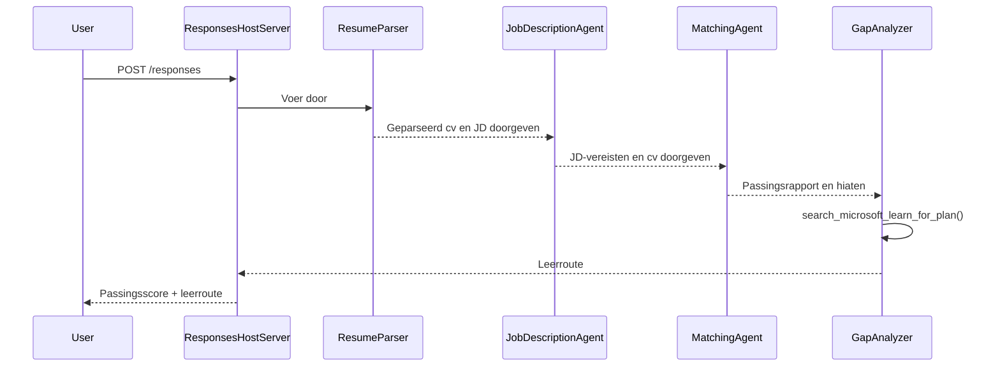

# Module 3 - Configureer Instructies, Omgeving & Installeer Afhankelijkheden

⏱️ ~15 min

In deze module transformeer je de gescaffolde stub naar **jouw** multi-agent workflow - door omgevingsvariabelen in te stellen, agentinstructies te schrijven, de MCP-tool toe te voegen, de workflowgrafiek te koppelen en afhankelijkheden te installeren.

> **Referentie:** De complete werkende code staat in [`PersonalCareerCopilot/main.py`](../../../../../workshop/lab02-multi-agent/PersonalCareerCopilot/main.py). Gebruik deze als referentie terwijl je je eigen workflowgrafiek en prompt-blokken bouwt.

---

## Hoe de vier agents samenwerken


```mermaid
sequenceDiagram
    participant User
    participant Server as ResponsesHostServer
    participant RP as ResumeParser
    participant JD as JobDescriptionAgent
    participant MA as MatchingAgent
    participant GA as GapAnalyzer

    User->>Server: POST /responses
    Server->>RP: Voer door
    RP-->>JD: Geparseerd cv en JD doorgeven
    JD-->>MA: JD-vereisten en cv doorgeven
    MA-->>GA: Passingsrapport en hiaten
    GA->>GA: search_microsoft_learn_for_plan()
    GA-->>Server: Leerroute
    Server-->>User: Passingsscore + leerroute
```

---

## Stap 1: Stel omgevingsvariabelen in

1. Open het **`.env`** bestand in de root van je project (aangemaakt door de scaffold wizard).
2. Vervang de placeholders met je daadwerkelijke waarden uit Lab 01.

<details open>
<summary><strong>🅰️ Pad A - Foundry abonnement</strong></summary>

```env
FOUNDRY_PROJECT_ENDPOINT=https://<your-account>.services.ai.azure.com/api/projects/<your-project>
AZURE_AI_MODEL_DEPLOYMENT_NAME=gpt-4.1-mini
```

> **Waar de waarden te vinden zijn:** Zie [Lab 01, Module 1](../../lab01-single-agent/docs/01-setup.md#deploy-a-model--assign-rbac).

</details>

<details open>
<summary><strong>🅱️ Pad B - Foundry Local</strong></summary>

```env
FOUNDRY_PROJECT_ENDPOINT=http://localhost:5273/v1
AZURE_AI_MODEL_DEPLOYMENT_NAME=phi-4-mini
```

> Alle inferentie draait op jouw machine - er verlaat geen data je apparaat. Voer `foundry model list` uit om het exacte modelalias te bevestigen. De enige uitgaande aanvraag is de MCP tool call naar `https://learn.microsoft.com/api/mcp`.

> **Waar de waarden te vinden zijn:** Zie [Lab 01, Module 1 - lokaal pad](../../lab01-single-agent/docs/01-setup.md#step-2-set-up-based-on-your-access).

</details>

> **Beveiliging:** Commit nooit `.env` naar versiebeheer. Het zou al in `.gitignore` moeten staan.

---

## Stap 2: Schrijf agentinstructies

Instructies bepalen elke agent’s rol, outputformaat en regels. Open `main.py` en definieer (of vervang) de vier instructieconstanten - de complete strings staan in [`PersonalCareerCopilot/main.py`](../../../../../workshop/lab02-multi-agent/PersonalCareerCopilot/main.py).

### 2.1 `RESUME_PARSER_INSTRUCTIONS`
Parseert het CV naar een gestructureerd kandidaatprofiel **en** kopieert de functiebeschrijving woordelijk naar `[JOB DESCRIPTION PASS-THROUGH]`. Beide gelabelde secties moeten in de output verschijnen.

> **Waarom de pass-through?** Met `context_mode="last_agent"` is ResumeParser de **enige** agent die het originele gebruikersbericht ziet. Als het niet de JD doorgeeft, zien de downstream agents het nooit.

### 2.2 `JOB_DESCRIPTION_INSTRUCTIONS`
Leest `[PARSED RESUME]` en `[JOB DESCRIPTION PASS-THROUGH]` uit de ResumeParser output. Levert `[JD REQUIREMENTS]` (gestructureerde vereisten) en `[PARSED RESUME PASS-THROUGH]` (woordelijke CV-kopie voor MatchingAgent).

### 2.3 `MATCHING_AGENT_INSTRUCTIONS`
Leest `[JD REQUIREMENTS]` en `[PARSED RESUME PASS-THROUGH]`. Produceert een gescoord fit-rapport (0–100) met onderliggende berekeningen, gematchte vaardigheden, ontbrekende vaardigheden en ervaringsovereenstemming.

### 2.4 `GAP_ANALYZER_INSTRUCTIONS`
Leest het fit-rapport. Voor **elke** ontbrekende vaardigheid roept het `search_microsoft_learn_for_plan` aan om Microsoft Learn bronnen op te halen. Produceert één gedetailleerde gap-kaart per vaardigheid plus een week-voor-week leerroute.

---

## Stap 3: Voeg de MCP tool toe

De GapAnalyzer roept de [Microsoft Learn MCP server](https://learn.microsoft.com/azure/foundry/agents/how-to/tools/model-context-protocol) aan om echte leerbronnen voor elke vaardigheidsgap op te halen. De volledige functie `search_microsoft_learn_for_plan` staat in [`PersonalCareerCopilot/main.py`](../../../../../workshop/lab02-multi-agent/PersonalCareerCopilot/main.py).

Registreer de tool op de GapAnalyzer wanneer je de agent aanmaakt:

```python
gap_analyzer = Agent(
    client=client,
    instructions=GAP_ANALYZER_INSTRUCTIONS,
    name="GapAnalyzer",
    tools=[search_microsoft_learn_for_plan],
)
```

> Zie [`PersonalCareerCopilot/main.py`](../../../../../workshop/lab02-multi-agent/PersonalCareerCopilot/main.py) voor de complete `WorkflowBuilder` grafiek met `FoundryChatClient`, `AgentExecutor` en alle `add_edge()` aanroepen.

---

## Stap 4: Maak een virtuele omgeving aan & installeer afhankelijkheden

> ⚠️ **Sla deze stap niet over.** Zonder geïnstalleerde afhankelijkheden werkt F5 debuggen niet.

### 4.1 Maak de virtuele omgeving aan

```powershell
python -m venv .venv
```

### 4.2 Activeer deze

| OS | Command |
|----|---------|
| **Windows (PowerShell)** | `.\.venv\Scripts\Activate.ps1` |
| **Windows (CMD)** | `.venv\Scripts\activate.bat` |
| **macOS / Linux** | `source .venv/bin/activate` |

Je zou `(.venv)` in je terminal prompt moeten zien.

### 4.3 Installeer afhankelijkheden

```powershell
pip install -r requirements.txt
```

### 4.4 Verifieer

```powershell
pip list | Select-String "agent-framework|mcp|debugpy"
```

Verwacht: `agent-framework-foundry`, `agent-framework-foundry-hosting`, `mcp` en `debugpy` staan vermeld.

---

## Stap 5: Verifieer authenticatie

<details open>
<summary><strong>🅰️ Pad A - Azure credential</strong></summary>

```powershell
az account show --query "{name:name, id:id}" --output table
```

Als dit mislukt, voer dan [`az login`](https://learn.microsoft.com/cli/azure/authenticate-azure-cli-interactively) uit.

Alle vier agents delen één `FoundryChatClient` en één `DefaultAzureCredential`. Als authenticatie werkt voor één, werkt het voor alle.

</details>

<details open>
<summary><strong>🅱️ Pad B - Foundry Local</strong></summary>

Geen authenticatie vereist voor lokaal testen.

</details>

---

### ✅ Checkpoint

> Ga **niet** door naar Module 04 totdat: **(1)** `(.venv)` zichtbaar is in je prompt EN **(2)** `pip install -r requirements.txt` succesvol is afgerond.

- [ ] `.env` heeft geldige endpoint- en model deployed naam (geen placeholders)
- [ ] Alle 4 agent instructieconstanten gedefinieerd in `main.py` (ResumeParser, JD Agent, MatchingAgent, GapAnalyzer)
- [ ] `search_microsoft_learn_for_plan` MCP tool gedefinieerd en geregistreerd op GapAnalyzer
- [ ] `FoundryChatClient` + 4 `Agent` + 4 `AgentExecutor` objecten aangemaakt in `main()`
- [ ] `WorkflowBuilder` bouwt de juiste sequentiële grafiek met alle 3 `add_edge()` aanroepen
- [ ] Virtuele omgeving aangemaakt en geactiveerd (`(.venv)` zichtbaar in prompt)
- [ ] `pip install -r requirements.txt` afgerond zonder fouten
- [ ] **Pad A:** `az account show` slaagt OF VS Code Accounts-icoon toont ingelogde account

---

**Vorige:** [02 - Scaffold Multi-Agent Project](02-scaffold-multi-agent.md) · **Volgende:** [04 - Orkestratiepatronen →](04-orchestration-patterns.md)

---

<!-- CO-OP TRANSLATOR DISCLAIMER START -->
**Disclaimer**:
Dit document is vertaald met behulp van de AI vertaaldienst [Co-op Translator](https://github.com/Azure/co-op-translator). Hoewel we streven naar nauwkeurigheid, dient u er rekening mee te houden dat geautomatiseerde vertalingen fouten of onnauwkeurigheden kunnen bevatten. Het originele document in de oorspronkelijke taal moet worden beschouwd als de gezaghebbende bron. Voor kritieke informatie wordt professionele menselijke vertaling aanbevolen. Wij zijn niet aansprakelijk voor eventuele misverstanden of verkeerde interpretaties die voortvloeien uit het gebruik van deze vertaling.
<!-- CO-OP TRANSLATOR DISCLAIMER END -->