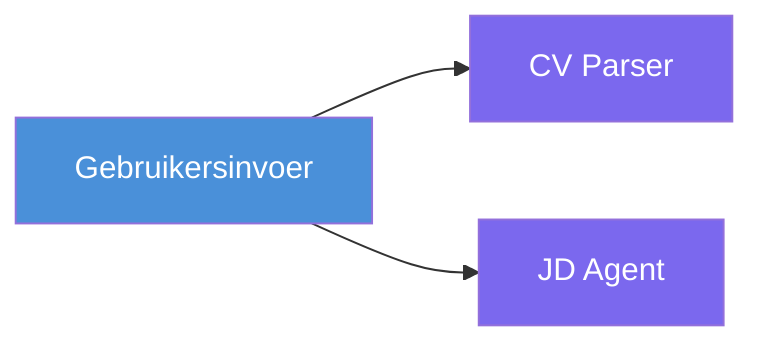
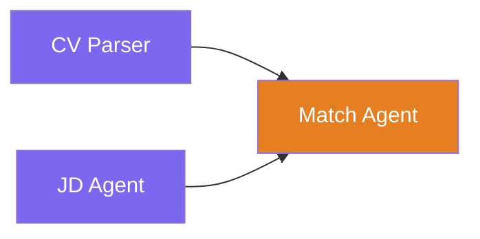
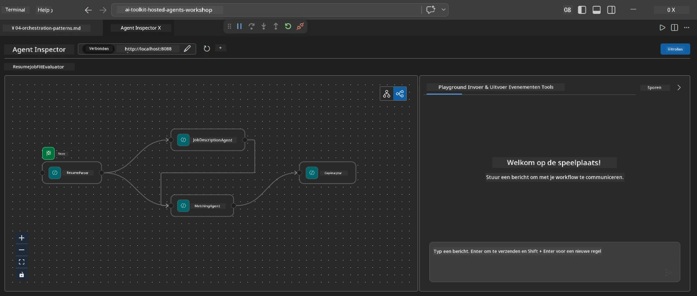
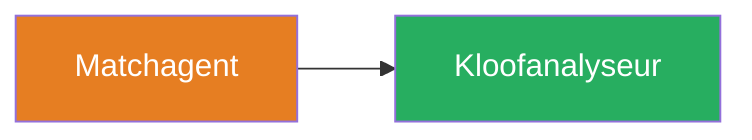
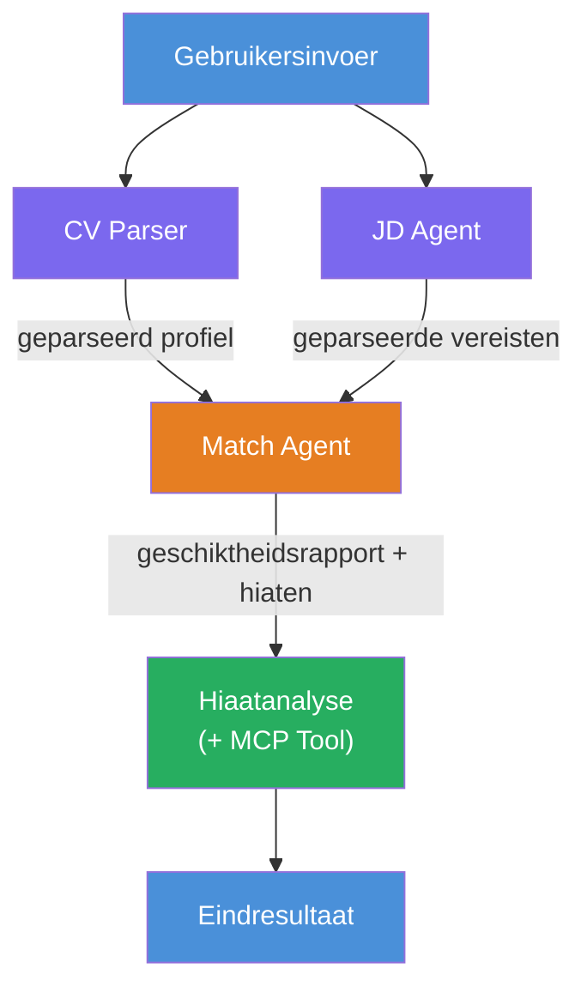
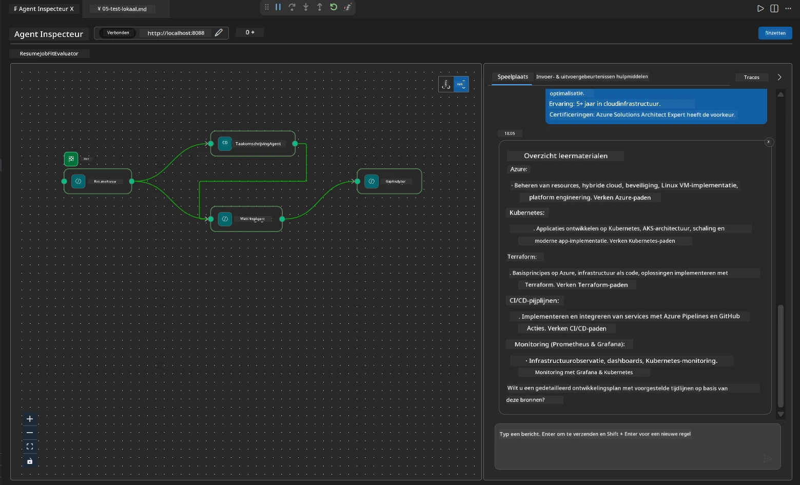

# Module 4 - Orkestratiepatronen

In deze module verken je de orkestratiepatronen die worden gebruikt in de Resume Job Fit Evaluator en leer je hoe je de workflowgrafiek leest, aanpast en uitbreidt. Het begrijpen van deze patronen is essentieel voor het oplossen van problemen met datastromen en het bouwen van je eigen [multi-agent workflows](https://learn.microsoft.com/agent-framework/workflows/).

---

## Patroon 1: Fan-out (parallelle splitsing)

Het eerste patroon in de workflow is **fan-out** - één enkele invoer wordt gelijktijdig naar meerdere agents gestuurd.


In de code gebeurt dit omdat `resume_parser` de `start_executor` is - deze ontvangt eerst het bericht van de gebruiker. Vervolgens, omdat zowel `jd_agent` als `matching_agent` zijwaartse verbindingen van `resume_parser` hebben, leidt het framework de output van `resume_parser` naar beide agents:

```python
.add_edge(resume_parser, jd_agent)         # ResumeParser uitvoer → JD Agent
.add_edge(resume_parser, matching_agent)   # ResumeParser uitvoer → MatchingAgent
```

**Waarom dit werkt:** ResumeParser en JD Agent verwerken verschillende aspecten van dezelfde invoer. Het parallel uitvoeren van deze agents vermindert de totale latentie vergeleken met sequentieel uitvoeren.

### Wanneer fan-out gebruiken

| Gebruikscasus | Voorbeeld |
|---------------|-----------|
| Onafhankelijke subtaken | CV parseren versus JD parseren |
| Redundantie / stemmen | Twee agents analyseren dezelfde data, een derde kiest het beste antwoord |
| Meerdere outputformaten | De ene agent genereert tekst, de andere gestructureerde JSON |

---

## Patroon 2: Fan-in (aggregatie)

Het tweede patroon is **fan-in** - meerdere agentoutputs worden verzameld en naar één downstream agent gestuurd.


In de code:

```python
.add_edge(resume_parser, matching_agent)   # ResumeParser-uitvoer → MatchingAgent
.add_edge(jd_agent, matching_agent)        # JD Agent-uitvoer → MatchingAgent
```

**Belangrijk gedrag:** Wanneer een agent **twee of meer inkomende verbindingen** heeft, wacht het framework automatisch tot **alle** upstream agents klaar zijn voordat het de downstream agent uitvoert. MatchingAgent start niet voordat zowel ResumeParser als JD Agent zijn afgerond.

### Wat MatchingAgent ontvangt

Het framework voegt de outputs van alle upstream agents samen. De invoer van MatchingAgent ziet er als volgt uit:

```
[ResumeParser output]
---
Candidate Profile:
  Name: Jane Doe
  Technical Skills: Python, Azure, Kubernetes, ...
  ...

[JobDescriptionAgent output]
---
Role Overview: Senior Cloud Engineer
Required Skills: Python, Azure, Terraform, ...
...
```

> **Opmerking:** Het exacte samenvoegingsformaat hangt af van de versie van het framework. De instructies voor de agent moeten zo geschreven zijn dat zowel gestructureerde als ongestructureerde upstream-output wordt verwerkt.



---

## Patroon 3: Sequentiële keten

Het derde patroon is **sequentiële ketting** - de output van de ene agent wordt direct doorgegeven aan de volgende.


In de code:

```python
.add_edge(matching_agent, gap_analyzer)    # MatchingAgent uitvoer → GapAnalyzer
```

Dit is het eenvoudigste patroon. GapAnalyzer ontvangt de fit score, gematchte/ontbrekende vaardigheden en hiaten van MatchingAgent. Vervolgens roept het de [MCP-tool](https://learn.microsoft.com/azure/foundry/agents/how-to/tools/model-context-protocol) aan voor elk gat om Microsoft Learn bronnen op te halen.

---

## De volledige grafiek

Door alle drie de patronen te combineren ontstaat de volledige workflow:


### Uitvoeringstijdlijn

```mermaid
gantt
    title Agent Uitvoeringsschema
    dateFormat X
    axisFormat %s

    section Parallel
    CV Parser           :rp, 0, 3
    JD Agent            :jd, 0, 2

    section Sequentieel
    Matching Agent      :ma, 3, 5
    Gap Analyzer        :ga, 5, 9
```


> De totale doorlooptijd is ongeveer `max(ResumeParser, JD Agent) + MatchingAgent + GapAnalyzer`. GapAnalyzer is meestal het traagst omdat het meerdere MCP-tool oproepen doet (één per gat).

---

## De WorkflowBuilder-code lezen

Hier is de complete `create_workflow()` functie uit `main.py`, met annotaties:

```python
def create_workflow(resume_parser, jd_agent, matching_agent, gap_analyzer):
    workflow = (
        WorkflowBuilder(
            name="ResumeJobFitEvaluator",

            # De eerste agent die gebruikersinvoer ontvangt
            start_executor=resume_parser,

            # De agent(en) waarvan de output het uiteindelijke antwoord wordt
            output_executors=[gap_analyzer],
        )
        # Fan-out: Output van ResumeParser gaat naar zowel JD Agent als MatchingAgent
        .add_edge(resume_parser, jd_agent)
        .add_edge(resume_parser, matching_agent)

        # Fan-in: MatchingAgent wacht op zowel ResumeParser als JD Agent
        .add_edge(jd_agent, matching_agent)

        # Sequentieel: Output van MatchingAgent voedt GapAnalyzer
        .add_edge(matching_agent, gap_analyzer)

        .build()
    )
    return workflow.as_agent()
```

### Overzichtstabel van verbindingen

| # | Verbinding | Patroon | Effect |
|---|------------|---------|--------|
| 1 | `resume_parser → jd_agent` | Fan-out | JD Agent ontvangt output van ResumeParser (plus de originele gebruikersinvoer) |
| 2 | `resume_parser → matching_agent` | Fan-out | MatchingAgent ontvangt output van ResumeParser |
| 3 | `jd_agent → matching_agent` | Fan-in | MatchingAgent ontvangt ook output van JD Agent (wacht op beiden) |
| 4 | `matching_agent → gap_analyzer` | Sequentieel | GapAnalyzer ontvangt fit rapport + lijst van hiaten |

---

## De grafiek aanpassen

### Een nieuwe agent toevoegen

Om een vijfde agent toe te voegen (bijvoorbeeld een **InterviewPrepAgent** die interviewvragen genereert op basis van de gap-analyse):

```python
# 1. Definieer instructies
INTERVIEW_PREP_INSTRUCTIONS = """\
You are the Interview Prep Agent.
Given a gap analysis and fit report, generate 10 targeted interview questions
the candidate should prepare for.
"""

# 2. Maak de agent aan (binnen het async with-blok)
AzureAIAgentClient(
    project_endpoint=PROJECT_ENDPOINT,
    model_deployment_name=MODEL_DEPLOYMENT_NAME,
    credential=credential,
).as_agent(
    name="InterviewPrepAgent",
    instructions=INTERVIEW_PREP_INSTRUCTIONS,
) as interview_prep,

# 3. Voeg verbindingen toe in create_workflow()
.add_edge(matching_agent, interview_prep)   # ontvangt fit rapport
.add_edge(gap_analyzer, interview_prep)     # ontvangt ook gap-kaarten

# 4. Werk output_executors bij
output_executors=[interview_prep],  # nu de uiteindelijke agent
```

### Wijzigen van de uitvoeringsvolgorde

Om JD Agent **na** ResumeParser te laten draaien (sequentieel in plaats van parallel):

```python
# Verwijder: .add_edge(resume_parser, jd_agent)  ← bestaat al, behoud dit
# Verwijder de impliciete parallel door jd_agent NIET direct gebruikersinvoer te laten ontvangen
# De start_executor stuurt eerst naar resume_parser, en jd_agent ontvangt alleen
# de output van resume_parser via de verbinding. Dit maakt ze sequentieel.
```

> **Belangrijk:** de `start_executor` is de enige agent die de ruwe gebruikersinvoer ontvangt. Alle andere agents ontvangen output via hun upstream verbindingen. Als je wilt dat een agent ook de ruwe gebruikersinvoer ontvangt, moet er een verbinding van de `start_executor` naar die agent zijn.

---

## Veelvoorkomende fouten in de grafiek

| Fout | Symbool | Oplossing |
|-------|----------|----------|
| Ontbrekende verbinding naar `output_executors` | Agent runt maar output is leeg | Zorg dat er een pad is van `start_executor` naar elke agent in `output_executors` |
| Cirkelvormige afhankelijkheid | Oneindige lus of timeout | Controleer dat geen agent terugvoert naar een upstream agent |
| Agent in `output_executors` zonder inkomende verbinding | Lege output | Voeg ten minste één `add_edge(source, die_agent)` toe |
| Meerdere `output_executors` zonder fan-in | Output bevat slechts één agentantwoord | Gebruik een enkele output agent die aggregeert, of accepteer meerdere outputs |
| Ontbrekende `start_executor` | `ValueError` bij het bouwen | Specificeer altijd `start_executor` in `WorkflowBuilder()` |

---

## De grafiek debuggen

### Agent Inspector gebruiken

1. Start de agent lokaal (F5 of terminal - zie [Module 5](05-test-locally.md)).
2. Open Agent Inspector (`Ctrl+Shift+P` → **Foundry Toolkit: Open Agent Inspector**).
3. Verstuur een testbericht.
4. Kijk in het antwoordpaneel van de Inspector naar de **streamende output** - dit toont de bijdrage van elke agent in volgorde.



### Logging gebruiken

Voeg logging toe aan `main.py` om de datastroom te traceren:

```python
import logging
logger = logging.getLogger("resume-job-fit")

# In create_workflow(), na het bouwen:
logger.info("Workflow graph built with edges: RP→JD, RP→MA, JD→MA, MA→GA")
```

De serverlogs tonen de uitvoeringsvolgorde van agents en MCP-tool oproepen:

```
INFO:resume-job-fit:Starting Resume -> Job Fit Evaluator HTTP server...
INFO:resume-job-fit:Server running on http://localhost:8088
INFO:agent_framework:Executing agent: ResumeParser
INFO:agent_framework:Executing agent: JobDescriptionAgent
INFO:agent_framework:Waiting for upstream agents: ResumeParser, JobDescriptionAgent
INFO:agent_framework:Executing agent: MatchingAgent
INFO:agent_framework:Executing agent: GapAnalyzer
INFO:agent_framework:Tool call: search_microsoft_learn_for_plan(skill="Kubernetes")
POST https://learn.microsoft.com/api/mcp → 200
INFO:agent_framework:Tool call: search_microsoft_learn_for_plan(skill="Terraform")
POST https://learn.microsoft.com/api/mcp → 200
```

---

### Checkpoint

- [ ] Je kunt de drie orkestratiepatronen in de workflow identificeren: fan-out, fan-in en sequentiële keten
- [ ] Je begrijpt dat agents met meerdere inkomende verbindingen wachten tot alle upstream agents klaar zijn
- [ ] Je kunt de `WorkflowBuilder` code lezen en elke `add_edge()` oproep koppelen aan de visuele grafiek
- [ ] Je begrijpt de uitvoeringstijdlijn: parallelle agents draaien eerst, dan aggregatie, dan sequentieel
- [ ] Je weet hoe je een nieuwe agent aan de grafiek toevoegt (instructies definiëren, agent maken, verbindingen toevoegen, output bijwerken)
- [ ] Je kunt veelvoorkomende grafiekfouten en hun symptomen herkennen

---

**Vorige:** [03 - Agents & omgeving configureren](03-configure-agents.md) · **Volgende:** [05 - Lokaal testen →](05-test-locally.md)

---

<!-- CO-OP TRANSLATOR DISCLAIMER START -->
**Disclaimer**:  
Dit document is vertaald met behulp van de AI-vertalingsservice [Co-op Translator](https://github.com/Azure/co-op-translator). Hoewel we streven naar nauwkeurigheid, dient u er rekening mee te houden dat automatische vertalingen fouten of onnauwkeurigheden kunnen bevatten. Het oorspronkelijke document in de oorspronkelijke taal moet worden beschouwd als de gezaghebbende bron. Voor cruciale informatie wordt professionele menselijke vertaling aanbevolen. Wij zijn niet aansprakelijk voor misverstanden of verkeerde interpretaties die voortvloeien uit het gebruik van deze vertaling.
<!-- CO-OP TRANSLATOR DISCLAIMER END -->