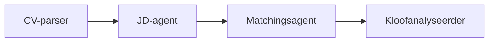
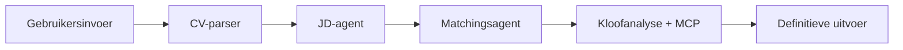

# Module 4 - Orkestratiepatronen

⏱️ ~10 min

In deze module verken je de orkestratiepatronen die gebruikt worden in de Resume Job Fit Evaluator en leer je hoe je de workflow-grafiek kunt lezen, wijzigen en uitbreiden. Het begrijpen van deze patronen is essentieel voor het debuggen van datastroomproblemen en het bouwen van je eigen [multi-agent workflows](https://learn.microsoft.com/agent-framework/workflows/).

---

## Patroon 1: Sequentiële keten

Het fundamentele patroon in de workflow is een **sequentiële keten** - de output van elke agent voedt direct de volgende.


```mermaid
flowchart LR
    RP[CV-parser] --> JD[JD-agent]
    JD --> MA[Matchingsagent]
    MA --> GA[Kloofanalyseerder]
```

In code creëert elke `add_edge()` aanroep een stap in de keten:

```python
.add_edge(resume_executor, jd_executor)       # ResumeParser output → JD Agent
.add_edge(jd_executor, matching_executor)     # JD Agent output → MatchingAgent
.add_edge(matching_executor, gap_executor)    # MatchingAgent output → GapAnalyzer
```

> **Waarom sequentieel, niet fan-out/fan-in?** `WorkflowBuilder` gebruikt **OF-semantiek** voor inkomende edges: een downstream uitvoerder start zodra **één** voorganger voltooid is. Als `matching_executor` twee inkomende edges zou hebben (van zowel `resume_executor` als `jd_executor`), zou hij twee keer triggeren - één keer wanneer ResumeParser klaar is en nog een keer wanneer JD Agent klaar is - wat ervoor zorgt dat GapAnalyzer ook twee keer draait en de output twee keer verschijnt. De sequentiële pijplijn voorkomt dit volledig.

## Patroon 2: Content Relay

Omdat `context_mode="last_agent"` betekent dat elke uitvoerder alleen de output van zijn **directe voorganger** ziet, moeten agents in een sequentiële keten expliciet alle data doorgeven die downstream agents nodig hebben.

In deze workflow:
- **ResumeParser** kopieert de JD woordelijk in `[JOB DESCRIPTION PASS-THROUGH]` (zodat JD Agent het kan vinden).
- **JD Agent** kopieert de `[PARSED RESUME]` woordelijk in `[PARSED RESUME PASS-THROUGH]` (zodat MatchingAgent beide profielen kan vergelijken).

```
ResumeParser output
└─ [PARSED RESUME]               ← extracted by JD Agent
└─ [JOB DESCRIPTION PASS-THROUGH] ← extracted by JD Agent

JD Agent output
└─ [JD REQUIREMENTS]             ← extracted by MatchingAgent
└─ [PARSED RESUME PASS-THROUGH]  ← extracted by MatchingAgent
```

Elk relay-gedeelte moet **woordelijk** worden gekopieerd - samenvatten of parafraseren breekt de downstream agent die ervan afhankelijk is.

---

## De volledige grafiek

Het combineren van de sequentiële keten en content relay patronen levert de volledige workflow op:


```mermaid
flowchart LR
    U[Gebruikersinvoer] --> RP[CV-parser]
    RP --> JD[JD-agent]
    JD --> MA[Matchingsagent]
    MA --> GA[Kloofanalyse + MCP]
    GA --> O[Definitieve uitvoer]
```

De Agent Inspector toont dezezelfde grafiekstructuur wanneer de agent lokaal draait. Zie [Module 5 - Test Locally](05-test-locally.md) voor schermafbeeldingen.

---

## De WorkflowBuilder code lezen

De volledige `create_workflow()` functie staat in [`PersonalCareerCopilot/main.py`](../../../../../workshop/lab02-multi-agent/PersonalCareerCopilot/main.py). De drie `add_edge()` aanroepen bouwen de sequentiële pijplijn:

| # | Edge | Effect |
|---|------|--------|
| 1 | `resume_executor → jd_executor` | JD Agent ontvangt `[PARSED RESUME]` + `[JOB DESCRIPTION PASS-THROUGH]` |
| 2 | `jd_executor → matching_executor` | MatchingAgent ontvangt `[JD REQUIREMENTS]` + `[PARSED RESUME PASS-THROUGH]` |
| 3 | `matching_executor → gap_executor` | GapAnalyzer ontvangt fit rapport + lijst met hiaten |

---

## De grafiek wijzigen

### Een nieuwe agent toevoegen

Om een vijfde agent toe te voegen (bijv. een **InterviewPrepAgent** na GapAnalyzer):

1. Definieer een constante `INTERVIEW_PREP_INSTRUCTIONS`.
2. Maak `Agent` + `AgentExecutor` objecten aan (zelfde patroon als de bestaande vier).
3. Voeg `.add_edge(gap_executor, interview_exec)` toe in `WorkflowBuilder`.
4. Werk `output_executors=[interview_exec]` bij.

> **Belangrijk:** `start_executor` is de enige agent die ruwe gebruikersinput ontvangt. Alle andere agents ontvangen output van hun upstream edge.

---

## Veelvoorkomende fouten in de grafiek

| Fout | Symptoom | Oplossing |
|---------|---------|-----|
| Ontbrekende edge naar `output_executors` | Agent draait maar output is leeg | Zorg dat er een pad is van `start_executor` naar elke agent in `output_executors` |
| Circulaire afhankelijkheid | Oneindige loop of time-out | Controleer dat geen agent terugvoedt naar een upstream agent |
| Agent in `output_executors` zonder inkomende edge | Lege output | Voeg minstens één `add_edge(source, that_agent)` toe |
| Meerdere `output_executors` zonder fan-in | Output bevat alleen response van één agent | Gebruik één output agent die aggregeert, of accepteer meerdere outputs |
| Ontbrekende `start_executor` | `ValueError` bij bouwtijd | Geef altijd `start_executor` op in `WorkflowBuilder()` |

---

## De grafiek debuggen

### Gebruik van Agent Inspector

1. Start de agent lokaal met F5.
2. Open Agent Inspector (`Ctrl+Shift+P` → **Foundry Toolkit: Open Agent Inspector**).
3. Stuur een testbericht.
4. Kijk in het responsepaneel van de Inspector naar de **streaming output** - die toont de bijdrage van elke agent in volgorde.


### Gebruik van logging

Voeg logging toe aan `main.py` om datastromen te traceren:

```python
import logging
logger = logging.getLogger("resume-job-fit")

# In main(), na het opbouwen van de workflow:
logger.info("Workflow graph built with edges: RP→JD, JD→MA, MA→GA")
```

De serverlogs tonen de uitvoeringsvolgorde van agents en MCP tool-aanroepen:

```
INFO:agent_framework:Executing agent: ResumeParser
INFO:agent_framework:Executing agent: JobDescriptionAgent
INFO:agent_framework:Executing agent: MatchingAgent
INFO:agent_framework:Executing agent: GapAnalyzer
INFO:agent_framework:Tool call: search_microsoft_learn_for_plan(skill="Kubernetes")
POST https://learn.microsoft.com/api/mcp → 200
INFO:agent_framework:Tool call: search_microsoft_learn_for_plan(skill="Terraform")
POST https://learn.microsoft.com/api/mcp → 200
```

---

### Controlepunt

- [ ] Je kunt de twee orkestratiepatronen in de workflow identificeren: sequentiële keten en content relay
- [ ] Je begrijpt waarom `context_mode="last_agent"` expliciete datarelay tussen agents vereist
- [ ] Je kunt de `WorkflowBuilder` code lezen en elke `add_edge()` aanroep aan de visuele grafiek koppelen
- [ ] Je weet hoe je een nieuwe agent aan het einde van de pijplijn toevoegt
- [ ] Je kunt veelvoorkomende grafiekfouten en hun symptomen herkennen

---

**Vorige:** [03 - Configure Agents & Environment](03-configure-agents.md) · **Volgende:** [05 - Test Locally →](05-test-locally.md)

---

<!-- CO-OP TRANSLATOR DISCLAIMER START -->
**Disclaimer**:
Dit document is vertaald met behulp van de AI vertaaldienst [Co-op Translator](https://github.com/Azure/co-op-translator). Hoewel we streven naar nauwkeurigheid, dient u er rekening mee te houden dat geautomatiseerde vertalingen fouten of onnauwkeurigheden kunnen bevatten. Het originele document in de oorspronkelijke taal moet worden beschouwd als de gezaghebbende bron. Voor kritieke informatie wordt professionele menselijke vertaling aanbevolen. Wij zijn niet aansprakelijk voor eventuele misverstanden of verkeerde interpretaties die voortvloeien uit het gebruik van deze vertaling.
<!-- CO-OP TRANSLATOR DISCLAIMER END -->