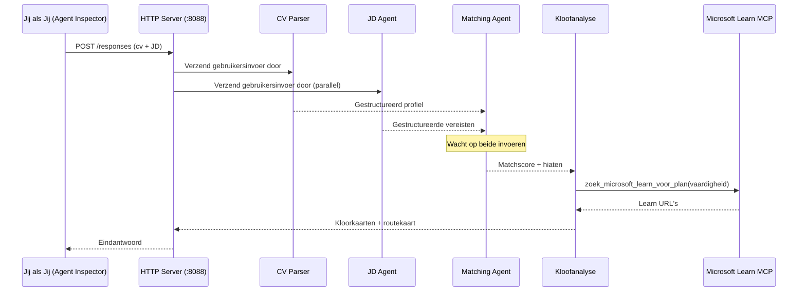
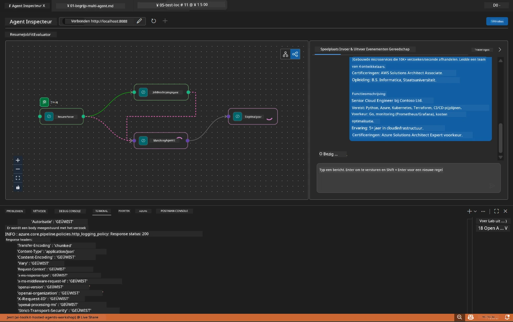

# Module 5 - Lokale test (Multi-Agent)

In deze module voer je de multi-agent workflow lokaal uit, test je deze met Agent Inspector en verifieer je dat alle vier agenten en de MCP-tool correct werken voordat je ze naar Foundry uitrolt.

### Wat gebeurt er tijdens een lokale testrun


---

## Stap 1: Start de agent-server

### Optie A: Gebruik de VS Code taak (aanbevolen)

1. Druk op `Ctrl+Shift+P` → typ **Tasks: Run Task** → selecteer **Run Lab02 HTTP Server**.
2. De taak start de server met debugpy gekoppeld op poort `5679` en de agent op poort `8088`.
3. Wacht tot de uitvoer toont:

```
INFO:resume-job-fit:Starting Resume -> Job Fit Evaluator HTTP server...
INFO:resume-job-fit:Server running on http://localhost:8088
```

### Optie B: Handmatig via de terminal

```powershell
cd workshop\lab02-multi-agent\PersonalCareerCopilot
```

Activeer de virtuele omgeving:

**PowerShell (Windows):**
```powershell
.\.venv\Scripts\Activate.ps1
```

**macOS/Linux:**
```bash
source .venv/bin/activate
```

Start de server:

```powershell
python -m debugpy --listen 127.0.0.1:5679 -m agentdev run main.py --verbose --port 8088
```

### Optie C: Gebruik F5 (debugmodus)

1. Druk op `F5` of ga naar **Run and Debug** (`Ctrl+Shift+D`).
2. Selecteer de **Lab02 - Multi-Agent** launchconfiguratie uit het dropdownmenu.
3. De server start met volledige breakpoint-ondersteuning.

> **Tip:** De debugmodus laat je breakpoints zetten binnen `search_microsoft_learn_for_plan()` om MCP-responses te inspecteren, of binnen agent-instructiestrings om te zien wat elke agent ontvangt.

---

## Stap 2: Open Agent Inspector

1. Druk op `Ctrl+Shift+P` → typ **Foundry Toolkit: Open Agent Inspector**.
2. Agent Inspector opent in een browsertabblad op `http://localhost:5679`.
3. Je zou de agentinterface klaar moeten zien om berichten te accepteren.

> **Als Agent Inspector niet opent:** Zorg dat de server volledig gestart is (je ziet de "Server running" log). Als poort 5679 bezet is, zie [Module 8 - Probleemoplossing](08-troubleshooting.md).

---

## Stap 3: Voer smoketests uit

Voer deze drie tests achtereenvolgens uit. Elke test controleert een uitgebreider deel van de workflow.

### Test 1: Basis cv + functieomschrijving

Plak het volgende in Agent Inspector:

```
Resume:
Jane Doe
Senior Software Engineer with 5 years of experience in Python, Django, and AWS.
Built microservices handling 10K+ requests/second. Led a team of 4 developers.
Certifications: AWS Solutions Architect Associate.
Education: B.S. Computer Science, State University.

Job Description:
Senior Cloud Engineer at Contoso Ltd.
Required: Python, Azure, Kubernetes, Terraform, CI/CD pipelines.
Preferred: Go, monitoring (Prometheus/Grafana), cost optimization.
Experience: 5+ years in cloud infrastructure.
Certifications: Azure Solutions Architect Expert preferred.
```

**Verwachte outputstructuur:**

De response moet output bevatten van alle vier agenten in volgorde:

1. **Resume Parser output** - Gestructureerd kandidaatprofiel met vaardigheden gegroepeerd per categorie
2. **JD Agent output** - Gestructureerde vereisten met verplichte vs. gewenste vaardigheden gescheiden
3. **Matching Agent output** - Fit-score (0-100) met uitsplitsing, overeenkomende vaardigheden, ontbrekende vaardigheden, hiaten
4. **Gap Analyzer output** - Individuele gap-kaarten voor elke ontbrekende vaardigheid, elk met Microsoft Learn-URL’s



### Wat te verifiëren in Test 1

| Controle | Verwacht | Geslaagd? |
|----------|----------|-----------|
| Response bevat een fit-score | Getal tussen 0-100 met uitsplitsing | |
| Lijst van overeenkomende vaardigheden | Python, CI/CD (gedeeltelijk), enz. | |
| Lijst van ontbrekende vaardigheden | Azure, Kubernetes, Terraform, enz. | |
| Gap-kaarten voor elke ontbrekende vaardigheid | Één kaart per vaardigheid | |
| Microsoft Learn URL’s aanwezig | Echte `learn.microsoft.com` links | |
| Geen foutmeldingen in response | Schone gestructureerde output | |

### Test 2: Verifieer MCP tool-uitvoering

Terwijl Test 1 draait, controleer in de **serverterminal** voor MCP logitems:

```
GET https://learn.microsoft.com/api/mcp → 405 (Method Not Allowed)
POST https://learn.microsoft.com/api/mcp → 200
DELETE https://learn.microsoft.com/api/mcp → 405 (Method Not Allowed)
```

| Log item | Betekenis | Verwacht? |
|----------|-----------|-----------|
| `GET ... → 405` | MCP client test met GET tijdens initialisatie | Ja - normaal |
| `POST ... → 200` | Werkelijke tool-aanroep naar Microsoft Learn MCP server | Ja - dit is de echte aanroep |
| `DELETE ... → 405` | MCP client test met DELETE tijdens opschoning | Ja - normaal |
| `POST ... → 4xx/5xx` | Tool-aanroep mislukt | Nee - zie [Probleemoplossing](08-troubleshooting.md) |

> **Belangrijk:** De regels `GET 405` en `DELETE 405` zijn **verwacht gedrag**. Alleen zorgen maken als `POST` aanroepen niet-status 200 teruggeven.

### Test 3: Randgeval - kandidaat met hoge fit

Plak een cv die nauw aansluit bij de JD om te controleren of GapAnalyzer hoge-fit scenario’s goed verwerkt:

```
Resume:
Alex Chen
Senior Cloud Engineer with 7 years of experience.
Skills: Python, Azure (AKS, Functions, DevOps), Kubernetes, Terraform, CI/CD (GitHub Actions, Azure Pipelines), Go, Prometheus, Grafana, cost optimization.
Certifications: Azure Solutions Architect Expert, Azure DevOps Engineer Expert.
Led infrastructure migration to Azure for 3 enterprise clients.
Education: M.S. Computer Science, Tech University.

Job Description:
Senior Cloud Engineer at Contoso Ltd.
Required: Python, Azure, Kubernetes, Terraform, CI/CD pipelines.
Preferred: Go, monitoring (Prometheus/Grafana), cost optimization.
Experience: 5+ years in cloud infrastructure.
Certifications: Azure Solutions Architect Expert preferred.
```

**Verwacht gedrag:**
- Fit-score moet **80+** zijn (meeste vaardigheden komen overeen)
- Gap-kaarten richten zich op verfijning/voorbereiding interview in plaats van basisleren
- GapAnalyzer instructies zeggen: "If fit >= 80, focus on polish/interview readiness"

---

## Stap 4: Verifieer volledigheid output

Controleer na het uitvoeren van de tests of de output aan deze criteria voldoet:

### Checklist outputstructuur

| Sectie | Agent | Aanwezig? |
|--------|-------|-----------|
| Kandidatenprofiel | Resume Parser | |
| Technische vaardigheden (gegroepeerd) | Resume Parser | |
| Overzicht rol | JD Agent | |
| Verplichte vs. gewenste vaardigheden | JD Agent | |
| Fit-score met uitsplitsing | Matching Agent | |
| Overeenkomend / Ontbrekend / Gedeeltelijke vaardigheden | Matching Agent | |
| Gap-kaart per ontbrekende vaardigheid | Gap Analyzer | |
| Microsoft Learn URL’s in gap-kaarten | Gap Analyzer (MCP) | |
| Leer volgorde (genummerd) | Gap Analyzer | |
| Tijdlijn samenvatting | Gap Analyzer | |

### Veelvoorkomende problemen in dit stadium

| Probleem | Oorzaak | Oplossing |
|----------|---------|-----------|
| Slechts 1 gap-kaart (rest afgekapt) | GapAnalyzer instructies missen CRITICAL paragraaf | Voeg de `CRITICAL:` paragraaf toe aan `GAP_ANALYZER_INSTRUCTIONS` - zie [Module 3](03-configure-agents.md) |
| Geen Microsoft Learn URL’s | MCP endpoint niet bereikbaar | Controleer internetverbinding. Verifieer dat `MICROSOFT_LEARN_MCP_ENDPOINT` in `.env` `https://learn.microsoft.com/api/mcp` is |
| Lege response | `PROJECT_ENDPOINT` of `MODEL_DEPLOYMENT_NAME` niet ingesteld | Controleer waarden in `.env`. Voer `echo $env:PROJECT_ENDPOINT` uit in terminal |
| Fit-score is 0 of ontbreekt | MatchingAgent ontving geen upstream data | Controleer of `add_edge(resume_parser, matching_agent)` en `add_edge(jd_agent, matching_agent)` in `create_workflow()` aanwezig zijn |
| Agent start maar stopt direct | Importfout of ontbrekende dependency | Voer `pip install -r requirements.txt` opnieuw uit. Controleer terminal op stacktraces |
| `validate_configuration` fout | Ontbrekende env variabelen | Maak `.env` met `PROJECT_ENDPOINT=<jouw-endpoint>` en `MODEL_DEPLOYMENT_NAME=<jouw-model>` |

---

## Stap 5: Test met je eigen data (optioneel)

Probeer je eigen cv en een echte functieomschrijving te plakken. Dit helpt verifiëren dat:

- De agenten omgaan met verschillende cv-formaten (chronologisch, functioneel, hybride)
- De JD Agent verschillende JD-stijlen aan kan (opsommingstekens, paragrafen, gestructureerd)
- De MCP tool relevante bronnen teruggeeft voor echte vaardigheden
- De gap-kaarten gepersonaliseerd zijn voor jouw specifieke achtergrond

> **Privacy-opmerking:** Bij lokaal testen blijven je gegevens op je eigen apparaat en worden ze alleen naar je Azure OpenAI-implementatie gestuurd. Ze worden niet gelogd of opgeslagen door de workshopinfrastructuur. Gebruik desgewenst fictieve namen (bijv. "Jane Doe" in plaats van je echte naam).

---

### Checkpoint

- [ ] Server succesvol gestart op poort `8088` (log toont "Server running")
- [ ] Agent Inspector geopend en verbonden met de agent
- [ ] Test 1: Volledige response met fit-score, overeenkomende/ontbrekende vaardigheden, gap-kaarten en Microsoft Learn URL’s
- [ ] Test 2: MCP logs tonen `POST ... → 200` (tool-aanroepen geslaagd)
- [ ] Test 3: Kandidaat met hoge fit krijgt score 80+ met verfijning-georiënteerde aanbevelingen
- [ ] Alle gap-kaarten aanwezig (één per ontbrekende vaardigheid, geen afkapping)
- [ ] Geen fouten of stacktraces in serverterminal

---

**Vorige:** [04 - Orkestratiepatronen](04-orchestration-patterns.md) · **Volgende:** [06 - Uitrollen naar Foundry →](06-deploy-to-foundry.md)

---

<!-- CO-OP TRANSLATOR DISCLAIMER START -->
**Disclaimer**:  
Dit document is vertaald met behulp van de AI vertaaldienst [Co-op Translator](https://github.com/Azure/co-op-translator). Hoewel we streven naar nauwkeurigheid, dient u ervan bewust te zijn dat automatische vertalingen fouten of onnauwkeurigheden kunnen bevatten. Het oorspronkelijke document in de oorspronkelijke taal moet als de gezaghebbende bron worden beschouwd. Voor kritieke informatie wordt professionele menselijke vertaling aanbevolen. Wij zijn niet aansprakelijk voor eventuele misverstanden of verkeerde interpretaties die voortvloeien uit het gebruik van deze vertaling.
<!-- CO-OP TRANSLATOR DISCLAIMER END -->