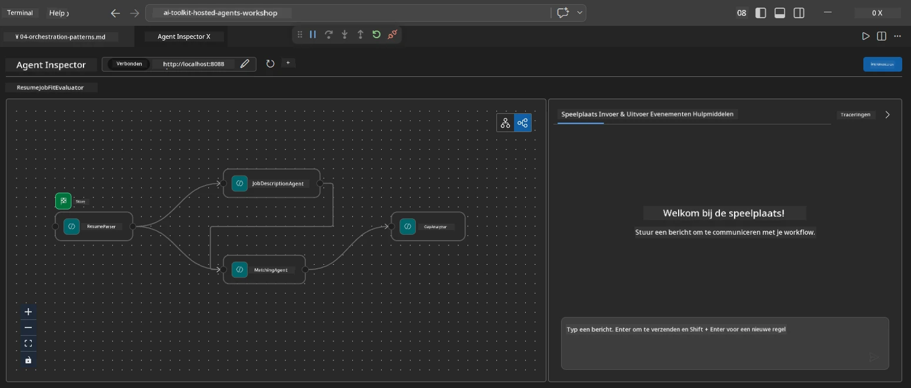
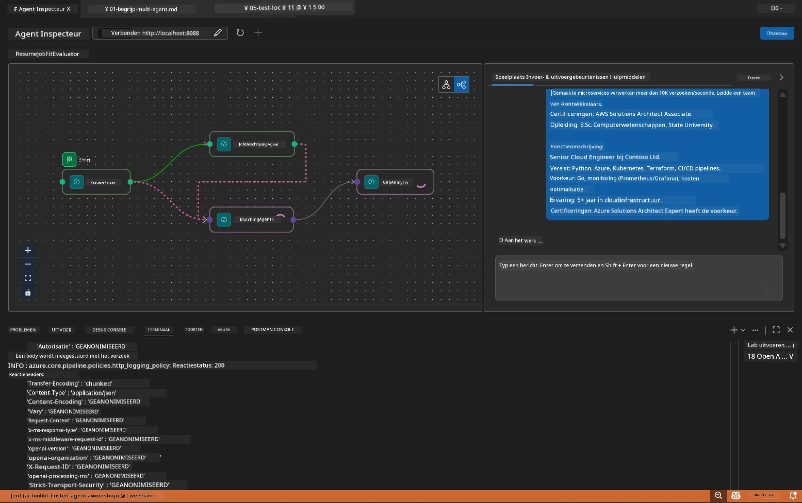
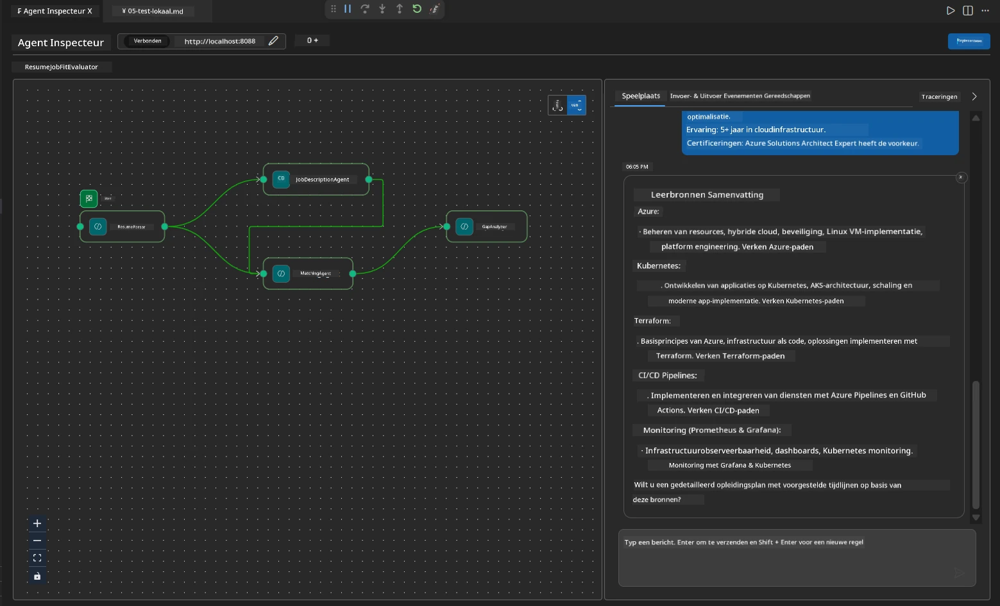

# Module 5 - Test lokaal

⏱️ ~15 min

In deze module voer je de multi-agent workflow lokaal uit, test je deze met Agent Inspector en controleer je dat alle vier agents en de MCP-tool correct werken voordat je deze implementeert.

---

## Stap 1: Start de agentserver

### Optie A: Gebruik de VS Code taak (aanbevolen)

1. Open `workshop/lab02-multi-agent/PersonalCareerCopilot/` als je VS Code map.
2. Druk op `Ctrl+Shift+P` → typ **Tasks: Run Task** → selecteer **Run Agent HTTP Server**.
3. De taak start de server met debugpy aangehangen op poort `5679` en de agent op poort `8088`.
4. Wacht tot de output het volgende toont:

```
INFO:resume-job-fit:Starting Resume -> Job Fit Evaluator HTTP server...
INFO:resume-job-fit:Server running on http://localhost:8088
```

### Optie B: Gebruik F5 (debugmodus)

1. Druk op `F5` → selecteer **Debug Local Agent HTTP Server**.
2. De server start met volledige breakpoint-ondersteuning - handig voor het inspecteren van MCP-antwoorden of agent-uitvoer.

---

## Stap 2: Open Agent Inspector

1. Druk op `Ctrl+Shift+P` → typ **Foundry Toolkit: Open Agent Inspector**.
2. Agent Inspector opent als een VS Code paneel verbonden met `http://localhost:8088`.
3. Je zou de agent interface moeten zien klaar om berichten te ontvangen.



> **Als Agent Inspector niet opent:** Zorg dat de server volledig gestart is (je ziet de log "Server running"). Als poort 5679 bezet is, zie [Module 8 - Problemen oplossen](08-troubleshooting.md).

---

## Stap 2b: (Optioneel) Open de Workflow Visualizer

De Foundry Toolkit bevat een realtime **Workflow Visualizer** die toont hoe agents met elkaar communiceren terwijl de grafiek wordt uitgevoerd. Dit is vooral handig voor het debuggen van multi-agent workflows.

1. Druk op `Ctrl+Shift+P` → typ **Foundry Toolkit: Open Visualizer for Hosted Agents**.
2. Er opent een nieuw VS Code tabblad met de live uitvoeringsgrafiek.
3. Terwijl je berichten verstuurt in Agent Inspector, werkt de visualizer automatisch bij - groene knooppunten geven voltooide agents aan, en geanimeerde randen tonen datastromen ertussen.

> **Poortconflict:** Als de visualizer poort al in gebruik is, wijzig deze dan in VS Code instellingen → **Extensions** → **Microsoft Foundry Configuration** → **Hosted Agents: Visualizer Port**.

---

## Stap 3: Voer smoke tests uit

Voer deze drie tests achtereenvolgens uit. Elke test test een steeds groter deel van de workflow.

### Test 1: Basistoeichting + functiebeschrijving

Plak het volgende in Agent Inspector:

```
Resume:
Jane Doe
Senior Software Engineer with 5 years of experience in Python, Django, and AWS.
Built microservices handling 10K+ requests/second. Led a team of 4 developers.
Certifications: AWS Solutions Architect Associate.
Education: B.S. Computer Science, State University.

Job Description:
Senior Cloud Engineer at Contoso Ltd.
Required: Python, Azure, Kubernetes, Terraform, CI/CD pipelines.
Preferred: Go, monitoring (Prometheus/Grafana), cost optimization.
Experience: 5+ years in cloud infrastructure.
Certifications: Azure Solutions Architect Expert preferred.
```

**Verwachte outputstructuur:**

Het antwoord moet output bevatten van alle vier agents na elkaar:

1. **Resume Parser output** - Twee gelabelde secties: `[PARSED RESUME]` (kandidatenprofiel met gegroepeerde vaardigheden) en `[JOB DESCRIPTION PASS-THROUGH]` (letterlijke JD-tekst die de JD-agent voedt)
2. **JD Agent output** - Gestructureerde vereisten met onderscheid tussen vereiste en voorkeurvaardigheden
3. **Matching Agent output** - Fit score (0-100) met uitsplitsing, overeenkomende vaardigheden, ontbrekende vaardigheden, hiaten
4. **Gap Analyzer output** - Individuele hiaatkaarten voor elke ontbrekende vaardigheid, elk met Microsoft Learn-URL’s





### Wat te verifiëren in Test 1

| Controleer | Verwacht | Geslaagd? |
|----------|----------|-----------|
| Antwoord bevat een fit score | Nummer tussen 0-100 met uitsplitsing | |
| Overeenkomende vaardigheden zijn vermeld | Python, CI/CD (gedeeltelijk), enz. | |
| Ontbrekende vaardigheden zijn vermeld | Azure, Kubernetes, Terraform, enz. | |
| Hiaatkaarten bestaan voor elke ontbrekende vaardigheid | Eén kaart per vaardigheid | |
| Microsoft Learn URL's zijn aanwezig | Echte `learn.microsoft.com` links | |
| Geen foutmeldingen in het antwoord | Schone gestructureerde output | |

### Test 2: Edge case - kandidaat met hoge match

Plak een CV dat sterk overeenkomt met de JD om te verifiëren dat de GapAnalyzer omgaat met scenario's met hoge match:

```
Resume:
Alex Chen
Senior Cloud Engineer with 7 years of experience.
Skills: Python, Azure (AKS, Functions, DevOps), Kubernetes, Terraform, CI/CD (GitHub Actions, Azure Pipelines), Go, Prometheus, Grafana, cost optimization.
Certifications: Azure Solutions Architect Expert, Azure DevOps Engineer Expert.
Led infrastructure migration to Azure for 3 enterprise clients.
Education: M.S. Computer Science, Tech University.

Job Description:
Senior Cloud Engineer at Contoso Ltd.
Required: Python, Azure, Kubernetes, Terraform, CI/CD pipelines.
Preferred: Go, monitoring (Prometheus/Grafana), cost optimization.
Experience: 5+ years in cloud infrastructure.
Certifications: Azure Solutions Architect Expert preferred.
```

**Verwacht gedrag:**
- Fit score moet **80+** zijn (meeste vaardigheden komen overeen)
- Hiaatkaarten moeten zich richten op verfijning/interview voorbereiding in plaats van fundamenteel leren
- De instructies van de GapAnalyzer zeggen: "Als fit >= 80, focus op verfijning/interview voorbereiding"

---

## Stap 4: Test met je eigen gegevens (optioneel)

Probeer je eigen CV en een echte functiebeschrijving te plakken. Dit helpt te verifiëren:

- De agents kunnen verschillende CV-formaten aan (chronologisch, functioneel, hybride)
- De JD Agent verwerkt verschillende JD-stijlen (opsommingstekens, alinea's, gestructureerd)
- De MCP-tool levert relevante bronnen voor echte vaardigheden
- De hiaatkaarten zijn gepersonaliseerd op jouw specifieke achtergrond

> **Privacy - Pad A (Foundry cloud):** CV- en JD-tekst wordt naar jouw Azure OpenAI-implementatie gestuurd voor inferentie. Het wordt niet gelogd of opgeslagen door de workshopinfrastructuur. Gebruik desgewenst fictieve namen (bijv. "Jane Doe").
>
> **Privacy - Pad B (Foundry Local):** Alle vier agentinferenties draaien volledig op jouw apparaat. Je CV- en functiebeschrijvingstekst **verlaat je machine nooit**. De enige uitgaande oproep is van de MCP-tool die bronnen ophaalt van `https://learn.microsoft.com/api/mcp`; die query bevat alleen de vaardigheidsnaam, niet je persoonlijke gegevens.

---

### Checkpoint

- [ ] Server succesvol gestart op poort `8088` (log toont "Server running")
- [ ] Agent Inspector geopend en verbonden met de agent
- [ ] Test 1: Compleet antwoord met fit score, overeenkomende/ontbrekende vaardigheden, hiaatkaarten en Microsoft Learn URL’s
- [ ] Test 2: Kandidaat met hoge match krijgt score 80+ met verfijning-gerichte aanbevelingen
- [ ] Alle hiaatkaarten aanwezig (één per ontbrekende vaardigheid, geen inkorting)
- [ ] Geen fouten of stacktraces in de serverterminal

---

**Vorige:** [04 - Orchestration Patterns](04-orchestration-patterns.md) · **Volgende:** [06 - Deploy to Foundry →](06-deploy-to-foundry.md)

---

<!-- CO-OP TRANSLATOR DISCLAIMER START -->
**Disclaimer**:
Dit document is vertaald met behulp van de AI vertaaldienst [Co-op Translator](https://github.com/Azure/co-op-translator). Hoewel we streven naar nauwkeurigheid, dient u er rekening mee te houden dat geautomatiseerde vertalingen fouten of onnauwkeurigheden kunnen bevatten. Het originele document in de oorspronkelijke taal moet worden beschouwd als de gezaghebbende bron. Voor kritieke informatie wordt professionele menselijke vertaling aanbevolen. Wij zijn niet aansprakelijk voor eventuele misverstanden of verkeerde interpretaties die voortvloeien uit het gebruik van deze vertaling.
<!-- CO-OP TRANSLATOR DISCLAIMER END -->