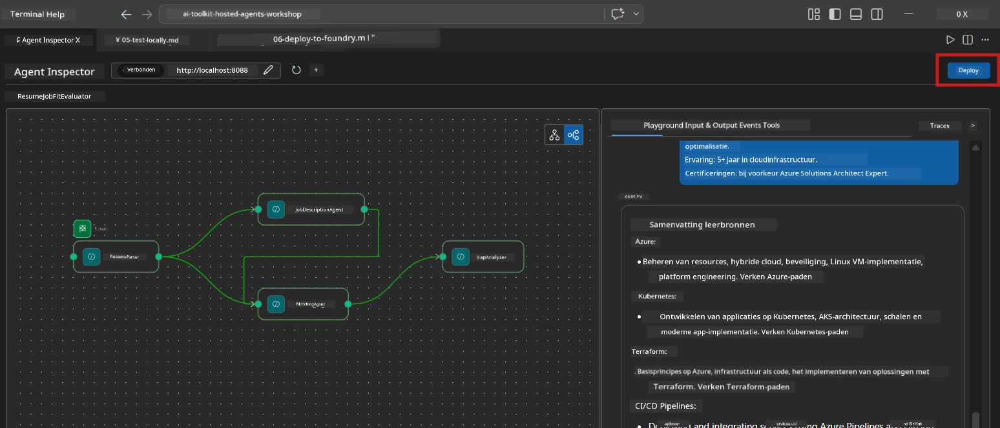
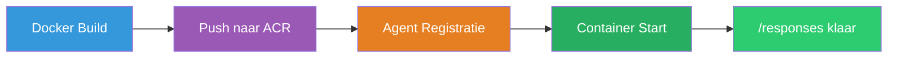
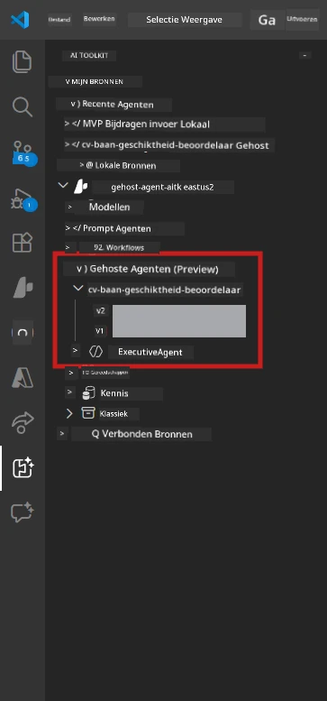

# Module 6 - Implementeren naar Foundry Agent Service

In deze module implementeer je je lokaal-geteste multi-agent workflow naar [Microsoft Foundry](https://learn.microsoft.com/azure/foundry/agents/concepts/hosted-agents) als een **Hosted Agent**. Het implementatieproces bouwt een Docker container image, duwt het naar [Azure Container Registry (ACR)](https://learn.microsoft.com/azure/container-registry/container-registry-intro), en maakt een gehoste agent versie aan in [Foundry Agent Service](https://learn.microsoft.com/azure/foundry/agents/how-to/publish-agent).

> **Belangrijk verschil met Lab 01:** Het implementatieproces is identiek. Foundry behandelt je multi-agent workflow als een enkele gehoste agent - de complexiteit zit binnenin de container, maar het implementatieoppervlak is dezelfde `/responses` endpoint.

---

## Controle van vereisten

Controleer voor het implementeren elk van onderstaande punten:

1. **Agent slaagt voor lokale rooktests:**
   - Je hebt alle 3 tests in [Module 5](05-test-locally.md) voltooid en de workflow produceerde volledige output met gap cards en Microsoft Learn URL's.

2. **Je hebt de rol [Azure AI User](https://learn.microsoft.com/azure/foundry/concepts/rbac-foundry):**
   - Toegekend in [Lab 01, Module 2](../../lab01-single-agent/docs/02-create-foundry-project.md). Verifieer:
   - [Azure Portal](https://portal.azure.com) → je Foundry **project** resource → **Toegangsbeheer (IAM)** → **Roltoewijzingen** → bevestig dat **[Azure AI User](https://aka.ms/foundry-ext-project-role)** is vermeld voor je account.

3. **Je bent aangemeld bij Azure in VS Code:**
   - Controleer het Accounts-icoon linksonder in VS Code. Je accountnaam moet zichtbaar zijn.

4. **`agent.yaml` heeft correcte waarden:**
   - Open `PersonalCareerCopilot/agent.yaml` en verifieer:
     ```yaml
     environment_variables:
       - name: PROJECT_ENDPOINT
         value: ${PROJECT_ENDPOINT}
       - name: MODEL_DEPLOYMENT_NAME
         value: ${MODEL_DEPLOYMENT_NAME}
     ```
   - Deze moeten overeenkomen met de environment variabelen die je `main.py` leest.

5. **`requirements.txt` heeft correcte versies:**
   ```
   agent-framework-azure-ai==1.0.0rc3
   agent-framework-core==1.0.0rc3
   azure-ai-agentserver-agentframework==1.0.0b16
   azure-ai-agentserver-core==1.0.0b16
   debugpy
   agent-dev-cli --pre
   ```

---

## Stap 1: Begin de implementatie

### Optie A: Implementeer via de Agent Inspector (aanbevolen)

Als de agent draait via F5 en de Agent Inspector open is:

1. Kijk rechtsboven in het Agent Inspector paneel.
2. Klik op de **Deploy** knop (cloud-icoon met een pijl omhoog ↑).
3. De implementatiewizard opent.



### Optie B: Implementeer via de Command Palette

1. Druk `Ctrl+Shift+P` om de **Command Palette** te openen.
2. Typ: **Microsoft Foundry: Deploy Hosted Agent** en selecteer deze.
3. De implementatiewizard opent.

---

## Stap 2: Configureer de implementatie

### 2.1 Selecteer het doelproject

1. Een dropdown toont je Foundry projecten.
2. Selecteer het project dat je gedurende de workshop gebruikt hebt (bijv. `workshop-agents`).

### 2.2 Selecteer het container agent bestand

1. Je wordt gevraagd de entry point van de agent te selecteren.
2. Navigeer naar `workshop/lab02-multi-agent/PersonalCareerCopilot/` en kies **`main.py`**.

### 2.3 Configureer resources

| Instelling | Aanbevolen waarde | Notities |
|------------|-------------------|----------|
| **CPU** | `0.25` | Standaard. Multi-agent workflows hebben geen hogere CPU nodig omdat model-aanroepen I/O-bound zijn |
| **Geheugen** | `0.5Gi` | Standaard. Verhoog naar `1Gi` als je grote data verwerkingshulpmiddelen toevoegt |

---

## Stap 3: Bevestig en implementeer

1. De wizard toont een overzicht van de implementatie.
2. Controleer en klik op **Bevestig en implementeer**.
3. Volg de voortgang in VS Code.

### Wat gebeurt er tijdens het implementeren

Bekijk het VS Code **Output** paneel (selecteer de dropdown "Microsoft Foundry"):


1. **Docker build** - Bouwt de container vanuit je `Dockerfile`:
   ```
   Step 1/6 : FROM python:3.14-slim
   Step 2/6 : WORKDIR /app
   ...
   Successfully built abc123def456
   ```

2. **Docker push** - Duwt de image naar ACR (1-3 minuten bij de eerste implementatie).

3. **Agent registratie** - Foundry maakt een gehoste agent aan met `agent.yaml` metadata. De agent naam is `resume-job-fit-evaluator`.

4. **Container start** - De container start in Foundry’s beheerde infrastructuur met een systeem-beheerde identiteit.

> **De eerste implementatie duurt langer** (Docker pusht alle lagen). Latere implementaties hergebruiken gecachte lagen en zijn sneller.

### Specifieke opmerkingen voor multi-agent

- **Alle vier agents zitten in één container.** Foundry ziet één gehoste agent. De WorkflowBuilder-grafiek draait intern.
- **MCP-aanroepen gaan naar buiten.** De container heeft internettoegang nodig om `https://learn.microsoft.com/api/mcp` te bereiken. Foundry’s beheerde infrastructuur voorziet hierin standaard.
- **[Managed Identity](https://learn.microsoft.com/python/api/overview/azure/identity-readme#managed-identity-support).** In de gehoste omgeving retourneert `get_credential()` in `main.py` `ManagedIdentityCredential()` (omdat `MSI_ENDPOINT` is ingesteld). Dit is automatisch.

---

## Stap 4: Controleer de implementatiestatus

1. Open de **Microsoft Foundry** zijbalk (klik op het Foundry icoon in de Activity Bar).
2. Vouw **Hosted Agents (Preview)** uit onder je project.
3. Zoek **resume-job-fit-evaluator** (of je eigen agentnaam).
4. Klik op de agentnaam → vouw versies uit (bijv. `v1`).
5. Klik op de versie → controleer **Container Details** → **Status**:



| Status | Betekenis |
|--------|-----------|
| **Gestart** / **Running** | Container draait, agent is klaar |
| **In afwachting** | Container is aan het starten (wacht 30-60 seconden) |
| **Geweigerd** | Container kon niet starten (controleer logs - zie hieronder) |

> **Multi-agent opstarten duurt langer** dan single-agent omdat de container 4 agent instanties aanmaakt bij het opstarten. “In afwachting” tot 2 minuten is normaal.

---

## Veelvoorkomende implementatiefouten en oplossingen

### Fout 1: Toegang geweigerd - `agents/write`

```
Error: lacks the required data action 
Microsoft.CognitiveServices/accounts/AIServices/agents/write
```

**Oplossing:** Ken de **[Azure AI User](https://learn.microsoft.com/azure/foundry/concepts/rbac-foundry)** rol toe op projectniveau. Zie [Module 8 - Probleemoplossing](08-troubleshooting.md) voor stapsgewijze instructies.

### Fout 2: Docker draait niet

```
Error: Docker build failed / Cannot connect to Docker daemon
```

**Oplossing:**
1. Start Docker Desktop.
2. Wacht tot "Docker Desktop is running".
3. Verifieer: `docker info`
4. **Windows:** Zorg dat de WSL 2 backend is ingeschakeld in de Docker Desktop instellingen.
5. Probeer opnieuw.

### Fout 3: pip install faalt tijdens Docker build

```
Error: Could not find a version that satisfies the requirement agent-dev-cli
```

**Oplossing:** De `--pre` vlag in `requirements.txt` wordt anders behandeld in Docker. Zorg dat je `requirements.txt` bevat:
```
agent-dev-cli --pre
```

Als Docker nog steeds faalt, maak een `pip.conf` aan of geef `--pre` mee via een build argument. Zie [Module 8](08-troubleshooting.md).

### Fout 4: MCP tool faalt in gehoste agent

Als de Gap Analyzer stopt met het produceren van Microsoft Learn URL’s na implementatie:

**Oorzaak:** Netwerkbeleid kan uitgaande HTTPS verbindingen vanuit de container blokkeren.

**Oplossing:**
1. Dit is normaal gesproken geen probleem met Foundry’s standaardconfiguratie.
2. Als het voorkomt, controleer dan of het virtuele netwerk van het Foundry project een NSG heeft die uitgaande HTTPS blokkeert.
3. De MCP tool heeft ingebouwde fallback URL’s, dus de agent produceert nog steeds output (zonder live URL’s).

---

### Controlepunt

- [ ] Implementatie opdracht voltooid zonder fouten in VS Code
- [ ] Agent verschijnt onder **Hosted Agents (Preview)** in de Foundry zijbalk
- [ ] Agent naam is `resume-job-fit-evaluator` (of je gekozen naam)
- [ ] Container status toont **Gestart** of **Running**
- [ ] (Indien fouten) Je hebt de fout geïdentificeerd, de oplossing toegepast, en opnieuw succesvol geïmplementeerd

---

**Vorige:** [05 - Test Locally](05-test-locally.md) · **Volgende:** [07 - Verify in Playground →](07-verify-in-playground.md)

---

<!-- CO-OP TRANSLATOR DISCLAIMER START -->
**Disclaimer**:  
Dit document is vertaald met behulp van de AI vertaaldienst [Co-op Translator](https://github.com/Azure/co-op-translator). Hoewel wij streven naar nauwkeurigheid, dient u er rekening mee te houden dat automatische vertalingen fouten of onnauwkeurigheden kunnen bevatten. Het oorspronkelijke document in de oorspronkelijke taal moet als de gezaghebbende bron worden beschouwd. Voor cruciale informatie wordt professionele menselijke vertaling aanbevolen. Wij zijn niet aansprakelijk voor enige misverstanden of verkeerde interpretaties voortvloeiend uit het gebruik van deze vertaling.
<!-- CO-OP TRANSLATOR DISCLAIMER END -->