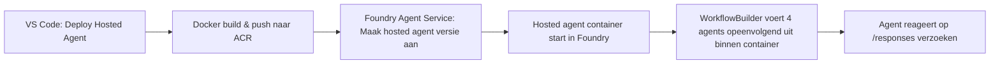
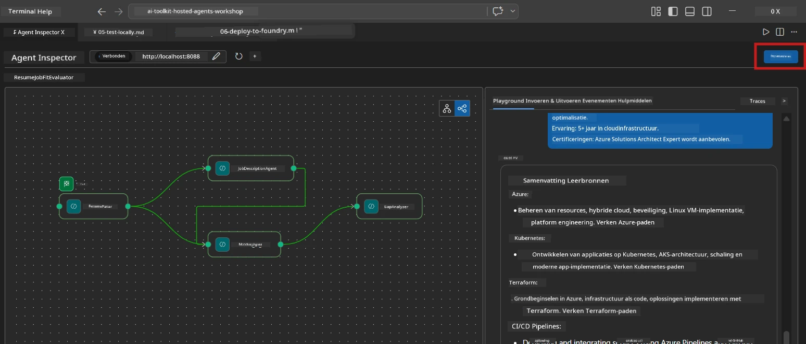

# Module 6 - Implementeren naar Foundry Agent Service

⏱️ ~10 min

In deze module implementeer je je lokaal geteste multi-agent workflow naar [Microsoft Foundry](https://learn.microsoft.com/azure/foundry/agents/concepts/hosted-agents) als een **Hosted Agent**. Het implementatieproces bouwt een Docker-containerafbeelding, pusht deze naar [Azure Container Registry (ACR)](https://learn.microsoft.com/azure/container-registry/container-registry-intro), en maakt een hosted agent-versie aan in [Foundry Agent Service](https://learn.microsoft.com/azure/foundry/agents/how-to/publish-agent).

> **Belangrijk verschil met Lab 01:** Het implementatieproces is identiek. Foundry behandelt je multi-agent workflow als een enkele hosted agent - de complexiteit bevindt zich in de container, maar het implementatieoppervlak is hetzelfde `/responses` eindpunt.

### Implementatiepijplijn


```mermaid
flowchart LR
    A[VS Code: Deploy Hosted Agent] --> B[Docker build & push naar ACR]
    B --> C[Foundry Agent Service: Maak hosted agent versie aan]
    C --> D[Hosted agent container start in Foundry]
    D --> E[WorkflowBuilder voert 4 agents opeenvolgend uit binnen container]
    E --> F[Agent reageert op /responses verzoeken]
```

---

## Controle van vereisten

Controleer vóór implementatie elk van de onderstaande punten:

1. **Agent slaagt voor lokale rooktesten:**
   - Je hebt alle 3 tests in [Module 5](05-test-locally.md) voltooid en de workflow leverde complete output met gap cards en Microsoft Learn URL’s.

2. **Je hebt de rol [Foundry User](https://learn.microsoft.com/azure/foundry/concepts/rbac-foundry)** (om te implementeren heb je minimaal **Foundry Project Manager** op projectniveau nodig):

   > **Opmerking:** De Foundry RBAC-rollen zijn recent hernoemd - **Foundry User**, **Foundry Owner**, en **Foundry Project Manager** heetten eerder Azure AI User, Azure AI Owner, en Azure AI Project Manager. Rol-ID’s en machtigingen zijn ongewijzigd.

   - Controleer in [Azure Portal](https://portal.azure.com) → je Foundry **project** resource → **Toegangsbeheer (IAM)** → **Roltoewijzingen** → bevestig dat **Foundry User** (of hoger) voor je account wordt vermeld.

3. **Je bent aangemeld bij Azure in VS Code:**
   - Controleer het Accounts-icoon linksonder in VS Code. Je accountnaam zou zichtbaar moeten zijn.

4. **`agent.yaml` bevat juiste waarden:**
   - Open `PersonalCareerCopilot/agent.yaml` en controleer:
     ```yaml
     environment_variables:
       - name: AZURE_AI_MODEL_DEPLOYMENT_NAME
         value: ${AZURE_AI_MODEL_DEPLOYMENT_NAME}
     ```
   - `FOUNDRY_PROJECT_ENDPOINT` wordt **niet** hier vermeld - Foundry voegt dit tijdens runtime toe. Alleen `AZURE_AI_MODEL_DEPLOYMENT_NAME` hoeft te worden gedeclareerd.

5. **`requirements.txt` heeft juiste versies:**
   ```
   agent-framework-foundry
   agent-framework-foundry-hosting
   mcp<2,>=1.24.0
   debugpy
   ```

---

## Stap 1: Start de implementatie

### Optie A: Implementeren vanuit de Agent Inspector (aanbevolen)

Als de agent via F5 draait met de Agent Inspector geopend:

1. Kijk in de **rechtsbovenhoek** van het Agent Inspector paneel.
2. Klik op de **Deploy** knop (wolk-icoon met een pijl omhoog ↑).
3. De implementatiewizard opent.



### Optie B: Implementeren vanuit de Command Palette

1. Druk op `Ctrl+Shift+P` om de **Command Palette** te openen.
2. Typ: **Foundry Toolkit: Deploy Hosted Agent** en selecteer het.
3. De implementatiewizard opent.

---

## Stap 2: Configureer de implementatie

### 2.1 Selecteer het doelproject

1. Een dropdown toont je Foundry-projecten.
2. Selecteer het project dat je tijdens de workshop hebt gebruikt (bijv. `workshop-agents`).

### 2.2 Selecteer het container agent-bestand

1. Je wordt gevraagd om het entry point van de agent te selecteren.
2. Navigeer naar `workshop/lab02-multi-agent/PersonalCareerCopilot/` en kies **`main.py`**.

### 2.3 Configureer resources

| Instelling | Aanbevolen waarde | Notities |
|---------|------------------|-------|
| **Implementatiemethode** | **Container** (aanbevolen) of **Code** | Container bouwt een Docker image; Code uploadt bron als ZIP (preview) |
| **Container Registry** | **Standaard ACR** | Foundry maakt er een aan en beheert deze voor je |
| **CPU** | `0.25` | Standaard. Multi-agent workflows hebben geen hogere CPU nodig omdat modelaanroepen I/O-bound zijn |
| **Geheugen** | `0.5Gi` | Standaard. Verhoog naar `1Gi` als je grote dataverwerkingstools toevoegt |

---

## Stap 3: Bevestigen en implementeren

1. De wizard toont een samenvatting van de implementatie.
2. Controleer en klik op **Bevestigen en implementeren**.
3. Volg de voortgang in VS Code.

### Wat gebeurt er tijdens de implementatie

Bekijk het VS Code **Output** paneel (selecteer de "Microsoft Foundry" dropdown):

1. **Docker build** - Bouwt de container vanuit je `Dockerfile`
   ```
   Step 1/6 : FROM python:3.12-slim
   Step 2/6 : WORKDIR /app
   ...
   Successfully built abc123def456
   ```

2. **Docker push** - Pusht de image naar ACR (1-3 minuten bij eerste implementatie).

3. **Agent-registratie** - Foundry maakt een hosted agent aan met behulp van `agent.yaml` metadata. De agentnaam is `resume-job-fit-evaluator`.

4. **Container start** - De container wordt gestart in Foundry's beheerde infrastructuur met een systeembeheerde identiteit.

> **De eerste implementatie duurt langer** (Docker pusht alle lagen). Volgende implementaties hergebruiken gecachte lagen en zijn sneller.

### Specifieke notities voor multi-agent

- **Alle vier agents zitten in één container.** Foundry ziet een enkele hosted agent. De WorkflowBuilder-grafiek loopt intern.
- **MCP-aanroepen gaan outbound.** De container heeft internettoegang nodig om `https://learn.microsoft.com/api/mcp` te bereiken. De door Foundry beheerde infrastructuur voorziet hierin standaard.
- **[Beheerde identiteit](https://learn.microsoft.com/azure/foundry/agents/concepts/agent-identity).** Foundry maakt automatisch een **toegewijde per-agent Entra identiteit** aan voor elke Hosted agent tijdens implementatie. In de hosted omgeving wijst `DefaultAzureCredential` automatisch naar deze agentidentiteit - geen handmatige configuratie is vereist.

---

## Stap 4: Verifieer de implementatiestatus

1. Open de **Microsoft Foundry** zijbalk (klik op het Foundry-icoon in de Activiteitenbalk).
2. Vouw **Hosted Agents (Preview)** onder je project uit.
3. Zoek **resume-job-fit-evaluator** (of je eigen agentnaam).
4. Klik op de agentnaam → vouw versies uit (bijv. `v1`).
5. Klik op de versie → controleer **Container Details** → **Status**:


| Status | Betekenis |
|--------|-----------|
| **active** | Agent draait en is klaar om verzoeken te accepteren |
| **creating** | Container start (wacht 30–60 seconden) |
| **failed** | Container kon niet starten (controleer logs - zie hieronder) |

> **Opmerking:** De VS Code zijbalk toont mogelijk labels zoals "Running" of "Started" terwijl de onderliggende API-status `active`/`creating` gebruikt. Beide weergaven geven dezelfde staat aan.

> **Multi-agent opstarten duurt langer** dan bij een enkele agent omdat de container 4 agentinstanties bij het opstarten creëert. `creating` tot 2 minuten is normaal.

---

## Veelvoorkomende implementatiefouten en oplossingen

### Fout 1: Machtiging geweigerd - `agents/write`

```
Error: lacks the required data action 
Microsoft.CognitiveServices/accounts/AIServices/agents/write
```

**Oplossing:** Wijs de **[Foundry User](https://learn.microsoft.com/azure/foundry/concepts/rbac-foundry)** rol (voorheen **Azure AI User**) toe op **projectniveau**. Zie [Module 8 - Problemen oplossen](08-troubleshooting.md) voor stapsgewijze instructies.

### Fout 2: Docker draait niet

```
Error: Docker build failed / Cannot connect to Docker daemon
```

**Oplossing:**
1. Start Docker Desktop.
2. Wacht tot "Docker Desktop is running".
3. Controleer met: `docker info`
4. **Windows:** Zorg dat de WSL 2 backend is ingeschakeld in de Docker Desktop instellingen.
5. Probeer opnieuw.

### Fout 3: pip install mislukt tijdens Docker build

```
Error: Could not find a version that satisfies the requirement agent-framework-foundry
```

**Oplossing:** Controleer of `requirements.txt` overeenkomt met:
```
agent-framework-foundry
agent-framework-foundry-hosting
mcp<2,>=1.24.0
debugpy
```

Als de build nog steeds faalt, kan je Docker-netwerk PyPI blokkeren. Controleer `docker info` op proxy-instellingen.

### Fout 4: MCP-tool faalt in hosted agent

Als de Gap Analyzer na implementatie geen Microsoft Learn URL’s meer produceert:

**Oorzaak:** Netwerkbeleid kan uitgaande HTTPS-verkeer vanuit de container blokkeren.

**Oplossing:**
1. Dit is meestal geen probleem met Foundry’s standaardconfiguratie.
2. Als het voorkomt, controleer of het virtuele netwerk van het Foundry-project een NSG heeft die uitgaande HTTPS blokkeert.
3. De MCP-tool heeft ingebouwde fallback URL’s, dus de agent zal nog steeds output produceren (zonder live URL’s).

---

### Controlepunt

- [ ] De implementatieopdracht is zonder fouten voltooid in VS Code
- [ ] De agent verschijnt onder **Hosted Agents (Preview)** in de Foundry zijbalk
- [ ] Agentnaam is `resume-job-fit-evaluator` (of je gekozen naam)
- [ ] Containerstatus toont **Started** of **Running**
- [ ] (Indien fouten) Je hebt de fout vastgesteld, de oplossing toegepast, en opnieuw succesvol geïmplementeerd

---

**Vorige:** [05 - Test lokaal](05-test-locally.md) · **Volgende:** [07 - Verifiëren in Playground →](07-verify-in-playground.md)

---

<!-- CO-OP TRANSLATOR DISCLAIMER START -->
**Disclaimer**:
Dit document is vertaald met behulp van de AI vertaaldienst [Co-op Translator](https://github.com/Azure/co-op-translator). Hoewel we streven naar nauwkeurigheid, dient u er rekening mee te houden dat geautomatiseerde vertalingen fouten of onnauwkeurigheden kunnen bevatten. Het originele document in de oorspronkelijke taal moet worden beschouwd als de gezaghebbende bron. Voor kritieke informatie wordt professionele menselijke vertaling aanbevolen. Wij zijn niet aansprakelijk voor eventuele misverstanden of verkeerde interpretaties die voortvloeien uit het gebruik van deze vertaling.
<!-- CO-OP TRANSLATOR DISCLAIMER END -->