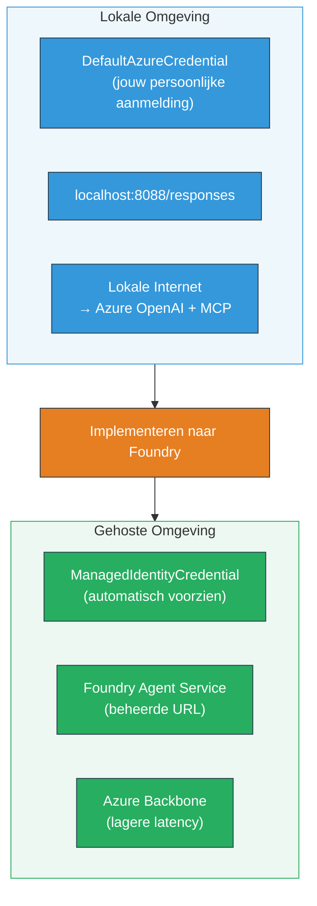

# Module 7 - Verifiëren in Playground

In deze module test je je uitgerolde multi-agent workflow zowel in **VS Code** als in het **[Foundry Portal](https://ai.azure.com)**, om te bevestigen dat de agent zich identiek gedraagt als bij lokale tests.

---

## Waarom verifiëren na uitrol?

Je multi-agent workflow functioneerde perfect lokaal, dus waarom opnieuw testen? De gehoste omgeving verschilt op verschillende manieren:


| Verschil | Lokaal | Gehost |
|-----------|---------|---------|
| **Identiteit** | [`DefaultAzureCredential`](https://learn.microsoft.com/azure/developer/python/sdk/authentication/credential-chains#defaultazurecredential-overview) (je persoonlijke aanmelding) | [`ManagedIdentityCredential`](https://learn.microsoft.com/python/api/overview/azure/identity-readme#managed-identity-support) (automatisch geprovisioneerd) |
| **Endpoint** | `http://localhost:8088/responses` | [Foundry Agent Service](https://learn.microsoft.com/azure/foundry/agents/concepts/hosted-agents) endpoint (beheerde URL) |
| **Netwerk** | Lokale machine → Azure OpenAI + MCP outbound | Azure backbone (lagere latency tussen services) |
| **MCP connectiviteit** | Lokale internet → `learn.microsoft.com/api/mcp` | Container outbound → `learn.microsoft.com/api/mcp` |

Als een omgevingsvariabele verkeerd geconfigureerd is, RBAC verschilt of MCP outbound geblokkeerd is, ontdek je het hier.

---

## Optie A: Test in VS Code Playground (aanbevolen eerst)

De [Foundry extensie](https://marketplace.visualstudio.com/items?itemName=TeamsDevApp.vscode-ai-foundry) bevat een geïntegreerde Playground waarmee je met je uitgerolde agent kunt chatten zonder VS Code te verlaten.

### Stap 1: Navigeer naar je gehoste agent

1. Klik op het **Microsoft Foundry**-icoon in de VS Code **Activiteitenbalk** (linker zijbalk) om het Foundry-paneel te openen.
2. Vouw je verbonden project uit (bijv. `workshop-agents`).
3. Vouw **Hosted Agents (Preview)** uit.
4. Je zou de naam van je agent moeten zien (bijv. `resume-job-fit-evaluator`).

### Stap 2: Selecteer een versie

1. Klik op de agentnaam om de versies uit te klappen.
2. Klik op de versie die je hebt uitgerold (bijv. `v1`).
3. Er opent een **detailpaneel** met Container details.
4. Controleer of de status **Started** of **Running** is.

### Stap 3: Open de Playground

1. Klik in het detailpaneel op de knop **Playground** (of rechtsklik de versie → **Open in Playground**).
2. Er opent een chatinterface in een VS Code tabblad.

### Stap 4: Voer je smoketests uit

Gebruik dezelfde 3 tests uit [Module 5](05-test-locally.md). Typ elk bericht in het invoerveld van de Playground en druk op **Send** (of **Enter**).

#### Test 1 - Volledige cv + JD (standaard flow)

Plak de volledige cv + JD prompt uit Module 5, Test 1 (Jane Doe + Senior Cloud Engineer bij Contoso Ltd).

**Verwacht:**
- Fit score met overzichtelijke rekenmethode (schaal van 100 punten)
- Matched Skills sectie
- Missing Skills sectie
- **Eén gap card per ontbrekende vaardigheid** met Microsoft Learn URL's
- Leertraject met tijdlijn

#### Test 2 - Snelle korte test (minimale input)

```
RESUME: 3 years Python developer, knows Django and PostgreSQL, no cloud experience.

JOB: Cloud DevOps Engineer requiring AWS, Kubernetes, Terraform, CI/CD. 5 years needed.
```

**Verwacht:**
- Lagere fit score (< 40)
- Eerlijke beoordeling met stapsgewijs leerpad
- Meerdere gap cards (AWS, Kubernetes, Terraform, CI/CD, ervaringsgap)

#### Test 3 - Kandidaten met hoge fit score

```
RESUME:
10 years Azure Cloud Architect. AZ-305 certified. Expert in AKS, Terraform, Azure DevOps, 
Azure Functions, Helm, Prometheus, Grafana, Python, Go. Led platform team of 8.

JOB:
Senior Cloud Engineer. Required: AKS, Terraform, Azure DevOps, Python. Preferred: Helm, Go.
5+ years experience. AZ-305 preferred.
```

**Verwacht:**
- Hoge fit score (≥ 80)
- Focus op interviewvoorbereiding en verfijning
- Weinig of geen gap cards
- Korte tijdlijn gericht op voorbereiding

### Stap 5: Vergelijk met lokale resultaten

Open je notities of browser tab uit Module 5 waar je lokale antwoorden hebt opgeslagen. Voor elke test:

- Heeft het antwoord dezelfde **structuur** (fit score, gap cards, roadmap)?
- Volgt het dezelfde **scoremethode** (100-puntsverdeling)?
- Zijn de **Microsoft Learn URL's** nog steeds aanwezig in de gap cards?
- Is er **één gap card per ontbrekende vaardigheid** (niet afgekapt)?

> **Kleine tekstuele verschillen zijn normaal** - het model is niet-deterministisch. Focus op structuur, consistente scoring en MCP tool gebruik.

---

## Optie B: Test in het Foundry Portal

Het [Foundry Portal](https://ai.azure.com) biedt een webgebaseerde playground, handig om te delen met collega's of belanghebbenden.

### Stap 1: Open het Foundry Portal

1. Open je browser en ga naar [https://ai.azure.com](https://ai.azure.com).
2. Meld je aan met hetzelfde Azure account dat je tijdens de workshop hebt gebruikt.

### Stap 2: Navigeer naar je project

1. Zoek op de startpagina naar **Recent projects** in de linkerzijbalk.
2. Klik op je projectnaam (bijv. `workshop-agents`).
3. Zie je het niet, klik dan op **All projects** en zoek het op.

### Stap 3: Vind je uitgerolde agent

1. Klik in de linker navigatie van het project op **Build** → **Agents** (of zoek de sectie **Agents**).
2. Je ziet een lijst met agents. Zoek je uitgerolde agent (bijv. `resume-job-fit-evaluator`).
3. Klik op de agentnaam om de detailpagina te openen.

### Stap 4: Open de Playground

1. Kijk op de agent detailpagina naar de bovenste werkbalk.
2. Klik op **Open in playground** (of **Try in playground**).
3. Er opent een chatinterface.

### Stap 5: Voer dezelfde smoketests uit

Herhaal alle 3 tests uit de VS Code Playground sectie hierboven. Vergelijk elk antwoord met zowel de lokale resultaten (Module 5) als de VS Code Playground resultaten (Optie A hierboven).

---

## Mult-agent specifieke verificatie

Naast basisjuistheid verifieer je de volgende multi-agent specifieke gedragingen:

### MCP tool uitvoering

| Controle | Hoe te verifiëren | Slaagt als |
|----------|--------------------|------------|
| MCP oproepen slagen | Gap cards bevatten `learn.microsoft.com` URL's | Echte URL's, geen fallback-berichten |
| Meerdere MCP oproepen | Elke High/Medium prioriteit gap heeft resources | Niet alleen de eerste gap card |
| MCP fallback werkt | Als URL's ontbreken, controleer fallback tekst | Agent maakt nog steeds gap cards (met of zonder URL's) |

### Agent coördinatie

| Controle | Hoe te verifiëren | Slaagt als |
|----------|--------------------|------------|
| Alle 4 agents draaiden | Output bevat fit score EN gap cards | Score komt van MatchingAgent, kaarten van GapAnalyzer |
| Parallel fan-out | Reactietijd is redelijk (< 2 min) | Bij > 3 min werkt parallelle uitvoering mogelijk niet |
| Integriteit datastroom | Gap cards verwijzen naar skills uit matching rapport | Geen verzonnen skills die niet in JD staan |

---

## Validatie rubric

Gebruik deze rubric om het gehoste gedrag van je multi-agent workflow te evalueren:

| # | Criteria | Slaagt als | Slaagt? |
|---|----------|------------|---------|
| 1 | **Functionele correctheid** | Agent reageert op cv + JD met fit score en gap analyse | |
| 2 | **Scoring consistentie** | Fit score gebruikt 100-punts schaal met overzichtelijke berekening | |
| 3 | **Volledigheid gap cards** | Eén kaart per ontbrekende vaardigheid (niet afgekapt of gecombineerd) | |
| 4 | **MCP tool integratie** | Gap cards bevatten echte Microsoft Learn URL's | |
| 5 | **Structurele consistentie** | Output structuur komt overeen tussen lokaal en gehost | |
| 6 | **Reactietijd** | Gehoste agent reageert binnen 2 minuten voor volledige beoordeling | |
| 7 | **Geen fouten** | Geen HTTP 500 fouten, time-outs of lege antwoorden | |

> Een "bestaan" betekent dat alle 7 criteria voldaan zijn voor alle 3 smoketests in ten minste één playground (VS Code of Portal).

---

## Problemen met Playground oplossen

| Symbool | Waarschijnlijke oorzaak | Oplossing |
|---------|-------------------------|-----------|
| Playground laadt niet | Container status niet "Started" | Ga terug naar [Module 6](06-deploy-to-foundry.md), controleer uitrolstatus. Wacht bij "Pending" |
| Agent geeft lege respons | Model deployment naam komt niet overeen | Controleer `agent.yaml` → `environment_variables` → `MODEL_DEPLOYMENT_NAME` komt overeen met je uitgerolde model |
| Agent geeft foutmelding | [RBAC](https://learn.microsoft.com/azure/foundry/concepts/rbac-foundry) permissie ontbreekt | Wijs **[Azure AI User](https://aka.ms/foundry-ext-project-role)** toe op projectniveau |
| Geen Microsoft Learn URL's in gap cards | MCP outbound geblokkeerd of MCP server niet bereikbaar | Controleer of container `learn.microsoft.com` kan bereiken. Zie [Module 8](08-troubleshooting.md) |
| Slechts 1 gap card (afgekapt) | GapAnalyzer instructies missen "CRITICAL" blok | Herzie [Module 3, Stap 2.4](03-configure-agents.md) |
| Fit score wijkt sterk af van lokaal | Ander model of instructies uitgerold | Vergelijk `agent.yaml` env vars met lokale `.env`. Rol opnieuw uit indien nodig |
| "Agent not found" in Portal | Uitrol nog bezig of mislukt | Wacht 2 minuten, vernieuw. Indien niet aanwezig, rol opnieuw uit uit [Module 6](06-deploy-to-foundry.md) |

---

### Checkpoint

- [ ] Agent getest in VS Code Playground - alle 3 smoketests geslaagd
- [ ] Agent getest in [Foundry Portal](https://ai.azure.com) Playground - alle 3 smoketests geslaagd
- [ ] Reacties zijn structureel consistent met lokale tests (fit score, gap cards, roadmap)
- [ ] Microsoft Learn URL's aanwezig in gap cards (MCP tool werkt in gehoste omgeving)
- [ ] Eén gap card per ontbrekende vaardigheid (geen afkapping)
- [ ] Geen fouten of time-outs tijdens testen
- [ ] Validatie rubric ingevuld (alle 7 criteria geslaagd)

---

**Vorige:** [06 - Deploy to Foundry](06-deploy-to-foundry.md) · **Volgende:** [08 - Troubleshooting →](08-troubleshooting.md)

---

<!-- CO-OP TRANSLATOR DISCLAIMER START -->
**Disclaimer**:  
Dit document is vertaald met behulp van de AI-vertalingsservice [Co-op Translator](https://github.com/Azure/co-op-translator). Hoewel we streven naar nauwkeurigheid, dient u er rekening mee te houden dat automatische vertalingen fouten of onjuistheden kunnen bevatten. Het originele document in de oorspronkelijke taal wordt beschouwd als de gezaghebbende bron. Voor belangrijke informatie wordt professionele menselijke vertaling aanbevolen. Wij zijn niet aansprakelijk voor eventuele misverstanden of verkeerde interpretaties die voortvloeien uit het gebruik van deze vertaling.
<!-- CO-OP TRANSLATOR DISCLAIMER END -->