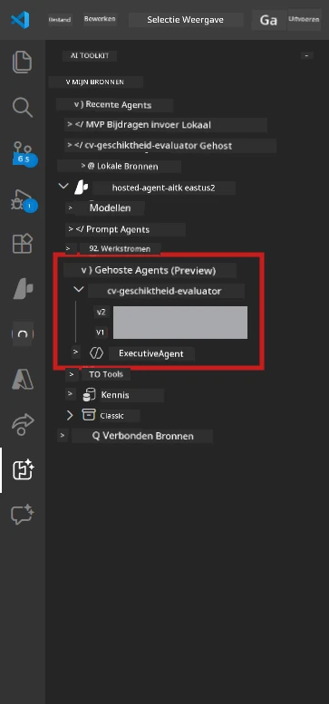

# Module 7 - Verifiëren in Playground

⏱️ ~10 min

In deze module test je je gedeployde multi-agent workflow in VS Code en het Foundry-portaal, om te bevestigen dat de agent zich hetzelfde gedraagt als bij lokaal testen.

---

## Waarom opnieuw testen na deployen?

De gehoste omgeving verschilt op een paar belangrijke manieren van lokaal:

| | Lokaal | Gehost |
|--|-------|--------|
| **Identiteit** | Je persoonlijke aanmelding (`DefaultAzureCredential`) | Toegewijde per-agent Entra-identiteit (automatisch voorzien bij deploy) |
| **Eindpunt** | `http://localhost:8088/responses` | Door Foundry Agent Service beheerde URL |
| **Netwerk** | Je machine → Azure OpenAI + MCP | Azure backbone (lagere latency) |

Een verkeerd geconfigureerde omgevingsvariabele, RBAC-probleem, of geblokkeerde MCP-uitgaande oproep zou hier als eerste zichtbaar zijn.

---

## Optie A: Test in VS Code Playground (aanbevolen eerste stap)

### Stap 1: Navigeer naar je gehoste agent

1. Klik op het **Foundry Toolkit**-icoon in de Activiteitenbalk.
2. Vouw je project uit → **Hosted Agents (Preview)** → zoek je agent.



### Stap 2: Selecteer een versie

1. Klik op de agent om zijn versies uit te vouwen.
2. Klik op `v1` → controleer of de status **actief** is (de zijbalk kan "Running" of "Started" tonen - beide geven dezelfde gereedheidsstatus aan).

### Stap 3: Open de Playground

1. Klik op **Playground** (of rechtsklik versie → **Open in Playground**).
2. Er opent zich een chatvenster in een VS Code tabblad.

### Stap 4: Voer je smoke tests uit

Gebruik dezelfde 3 tests als in [Module 5](05-test-locally.md). Typ elk bericht in het invoerveld van de Playground en druk op **Verzenden** (of **Enter**).

#### Test 1 - Volledig cv + JD (standaard flow)

Plak de volledige prompt voor cv + JD uit Module 5, Test 1 (Jane Doe + Senior Cloud Engineer bij Contoso Ltd).

**Verwacht:**
- Fit score met uitsplitsende berekening (100-punten schaal)
- Matched Skills sectie
- Missing Skills sectie
- **Één gap card per ontbrekende vaardigheid** met Microsoft Learn URL's
- Leerplan met tijdlijn

#### Test 2 - Snelle korte test (minimale invoer)

```
RESUME: 3 years Python developer, knows Django and PostgreSQL, no cloud experience.

JOB: Cloud DevOps Engineer requiring AWS, Kubernetes, Terraform, CI/CD. 5 years needed.
```

**Verwacht:**
- Lagere fit score (< 40)
- Eerlijke beoordeling met gefaseerd leerpad
- Meerdere gap cards (AWS, Kubernetes, Terraform, CI/CD, ervaringstekort)

#### Test 3 - Hoog passende kandidaat

```
RESUME:
10 years Azure Cloud Architect. AZ-305 certified. Expert in AKS, Terraform, Azure DevOps, 
Azure Functions, Helm, Prometheus, Grafana, Python, Go. Led platform team of 8.

JOB:
Senior Cloud Engineer. Required: AKS, Terraform, Azure DevOps, Python. Preferred: Helm, Go.
5+ years experience. AZ-305 preferred.
```

**Verwacht:**
- Hoge fit score (≥ 80)
- Focus op interviewvoorbereiding en verfijning
- Weinig of geen gap cards
- Korte tijdlijn gericht op voorbereiding

### Stap 5: Vergelijk met lokale resultaten

Open je notities of browsertabblad van Module 5 waar je lokale antwoorden hebt opgeslagen. Voor elke test:

- Heeft het antwoord dezelfde **structuur** (fit score, gap cards, roadmap)?
- Volgt het dezelfde **score rubric** (100-punten uitsplitsing)?
- Zijn **Microsoft Learn URL's** nog aanwezig in gap cards?
- Is er **één gap card per ontbrekende vaardigheid** (niet ingekort)?

> **Kleine woordkeuzeverschillen zijn normaal** - het model is niet-deterministisch. Focus op structuur, consistente scoring en MCP-tool gebruik.

---

## Optie B: Test in het Foundry-portaal

Het [Foundry-portaal](https://ai.azure.com) biedt een webgebaseerde playground die handig is om te delen met teamleden of belanghebbenden.

### Stap 1: Open het Foundry-portaal

1. Open je browser en ga naar [https://ai.azure.com](https://ai.azure.com).
2. Meld je aan met hetzelfde Azure-account dat je tijdens de workshop hebt gebruikt.

### Stap 2: Navigeer naar je project

1. Zoek op de startpagina in de linkerzijbalk naar **Recent projects**.
2. Klik op de naam van je project (bijv. `workshop-agents`).
3. Zie je het niet, klik dan op **All projects** en zoek het op.

### Stap 3: Zoek je gedeployde agent

1. Klik in de linker navigatie van het project op **Build** → **Agents** (of zoek de sectie **Agents**).
2. Je ziet een lijst met agents. Zoek je gedeployde agent (bijv. `resume-job-fit-evaluator`).
3. Klik op de agentnaam om de detailpagina te openen.

### Stap 4: Open de Playground

1. Kijk op de topwerkbalk van de agent detailpagina.
2. Klik op **Open in playground** (of **Try in playground**).
3. Er opent een chatinterface.

### Stap 5: Voer dezelfde smoke tests uit

Herhaal alle 3 tests uit het VS Code Playground-gedeelte hierboven. Vergelijk elk antwoord met zowel de lokale resultaten (Module 5) als de VS Code Playground-resultaten (Optie A hierboven).

---

## Multi-agent specifieke verificatie

Naast basiscorrectheid, verifieer deze multi-agent-specifieke gedragingen:

### MCP tool uitvoering

| Controle | Hoe te verifiëren | Voldoet aan voorwaarde |
|-------|---------------|----------------|
| MCP-oproepen slagen | Gap cards bevatten `learn.microsoft.com` URL's | Echt URL's, geen fallback-berichten |
| Meerdere MCP-oproepen | Elke High/Middle-prioriteit gap heeft resources | Niet alleen de eerste gap card |
| MCP fallback werkt | Bij ontbrekende URL's fallback-tekst controleren | Agent produceert nog steeds gap cards (met of zonder URL's) |

### Agent coördinatie

| Controle | Hoe te verifiëren | Voldoet aan voorwaarde |
|-------|---------------|----------------|
| Alle 4 agents draaiden | Output bevat fit score EN gap cards | Score komt van MatchingAgent, cards van GapAnalyzer |
| Sequentiële uitvoering | Reactietijd is redelijk (< 2 min) | Als > 3 min, controleer foutmeldingen in terminal log |
| Dataflow integriteit | Gap cards refereren aan skills uit matching rapport | Geen gehallucineerde skills die niet in de JD staan |

---

## Validatie rubric

Gebruik deze rubric om het gehoste gedrag van je multi-agent workflow te evalueren:

| # | Criteria | Voldoet aan voorwaarde | Voldoet? |
|---|----------|---------------|-------|
| 1 | **Functionele correctheid** | Agent reageert op cv + JD met fit score en gap analyse | |
| 2 | **Consistentie in scoring** | Fit score gebruikt 100-puntsschaal met uitsplitsende berekening | |
| 3 | **Volledigheid gap cards** | Één kaart per ontbrekende vaardigheid (niet afgekapt of gecombineerd) | |
| 4 | **Integratie MCP tool** | Gap cards bevatten echte Microsoft Learn URL's | |
| 5 | **Structurele consistentie** | Output structuur komt overeen tussen lokaal en gehost | |
| 6 | **Reactietijd** | Gehoste agent reageert binnen 2 minuten voor volledige beoordeling | |
| 7 | **Geen fouten** | Geen HTTP 500 fouten, time-outs of lege reacties | |

> Een "voldoet" betekent dat aan alle 7 criteria wordt voldaan voor alle 3 smoke tests in ten minste één playground (VS Code of Portaal).

---

## Problemen oplossen met playground

| Symptom | Waarschijnlijke oorzaak | Oplossing |
|---------|-------------|-----|
| Playground laadt niet | Container niet in `active` staat | Ga terug naar [Module 6](06-deploy-to-foundry.md), controleer deploystatus. Wacht als `creating` |
| Agent geeft lege respons | Model deployment naam komt niet overeen | Controleer `agent.yaml` → `environment_variables` → `AZURE_AI_MODEL_DEPLOYMENT_NAME` komt overeen met je gedeployde model |
| Agent geeft foutmelding | [RBAC](https://learn.microsoft.com/azure/foundry/concepts/rbac-foundry) permissie ontbreekt | Wijs **[Foundry User](https://aka.ms/foundry-ext-project-role)** toe (voorheen Azure AI User) op projectniveau |
| Geen Microsoft Learn URL's in gap cards | MCP uitgaand verkeer geblokkeerd of MCP server onbereikbaar | Controleer of container toegang heeft tot `learn.microsoft.com`. Zie [Module 8](08-troubleshooting.md) |
| Slechts 1 gap card (afgekapt) | GapAnalyzer instructies missen "CRITICAL" blok | Bekijk [Module 3, Stap 2.4](03-configure-agents.md) |
| Fit score sterk verschillend van lokaal | Ander model of instructies gedeployd | Vergelijk `agent.yaml` env vars met lokale `.env`. Herdeploy indien nodig |
| "Agent niet gevonden" in Portaal | Deployment is nog aan het propagateren of mislukt | Wacht 2 minuten, vernieuw de pagina. Bij uitblijven herdeploy uit [Module 6](06-deploy-to-foundry.md) |

---

### Controlepunt

- [ ] Agent getest in VS Code Playground - alle 3 smoke tests geslaagd
- [ ] Agent getest in [Foundry Portal](https://ai.azure.com) Playground - alle 3 smoke tests geslaagd
- [ ] Antwoorden zijn structureel consistent met lokaal testen (fit score, gap cards, roadmap)
- [ ] Microsoft Learn URL's zijn aanwezig in gap cards (MCP tool werkt in gehoste omgeving)
- [ ] Één gap card per ontbrekende vaardigheid (geen truncatie)
- [ ] Geen fouten of time-outs tijdens testen
- [ ] Validatie rubric ingevuld (alle 7 criteria voldaan)

---

**Vorige:** [06 - Deploy naar Foundry](06-deploy-to-foundry.md) · **Volgende:** [08 - Problemen oplossen →](08-troubleshooting.md)

---

<!-- CO-OP TRANSLATOR DISCLAIMER START -->
**Disclaimer**:
Dit document is vertaald met behulp van de AI vertaaldienst [Co-op Translator](https://github.com/Azure/co-op-translator). Hoewel we streven naar nauwkeurigheid, dient u er rekening mee te houden dat geautomatiseerde vertalingen fouten of onnauwkeurigheden kunnen bevatten. Het originele document in de oorspronkelijke taal moet worden beschouwd als de gezaghebbende bron. Voor kritieke informatie wordt professionele menselijke vertaling aanbevolen. Wij zijn niet aansprakelijk voor eventuele misverstanden of verkeerde interpretaties die voortvloeien uit het gebruik van deze vertaling.
<!-- CO-OP TRANSLATOR DISCLAIMER END -->