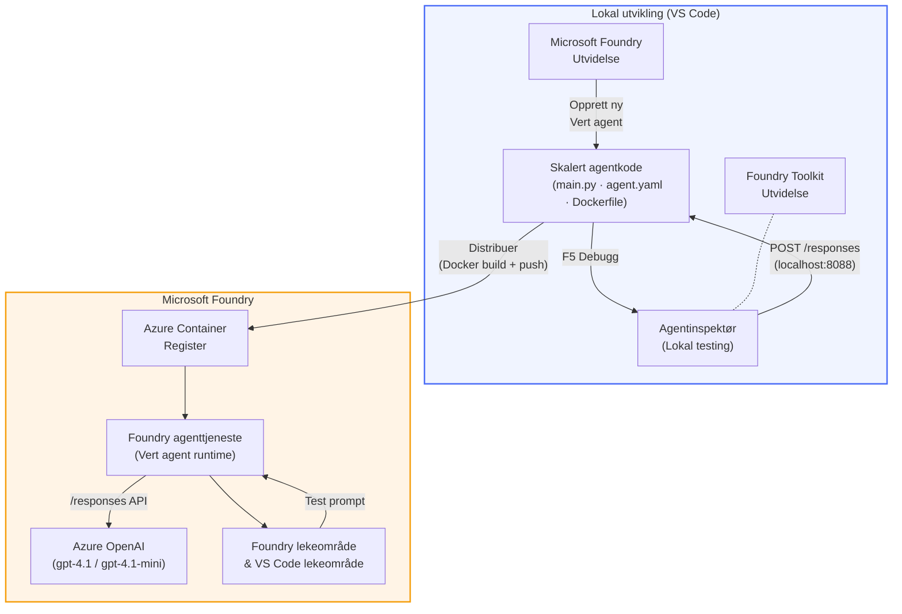

# Foundry Toolkit + Foundry Hosted Agents Workshop

[](https://www.python.org/)
[](https://github.com/microsoft/agents)
[](https://learn.microsoft.com/azure/ai-foundry/agents/concepts/hosted-agents/)
[](https://ai.azure.com/)
[](https://learn.microsoft.com/azure/ai-services/openai/)
[](https://learn.microsoft.com/cli/azure/install-azure-cli)
[](https://learn.microsoft.com/azure/developer/azure-developer-cli/install-azd)
[](https://www.docker.com/)
[](https://marketplace.visualstudio.com/items?itemName=ms-windows-ai-studio.windows-ai-studio)
[](LICENSE)

Bygg, test og distribuer AI-agenter til **Microsoft Foundry Agent Service** som **Hosted Agents** – helt fra VS Code ved hjelp av **Microsoft Foundry-utvidelsen** og **Foundry Toolkit**.

> **Hosted Agents er for øyeblikket i forhåndsvisning.** Støttede regioner er begrenset – se [regiontilgjengelighet](https://learn.microsoft.com/azure/foundry/agents/concepts/hosted-agents#region-availability).

> Mappen `agent/` inne i hver lab blir **automatisk generert** av Foundry-utvidelsen – deretter tilpasser du koden, tester lokalt og distribuerer.

### 🌐 Støtte for flere språk

#### Støttet via GitHub Action (Automatisk & Alltid Oppdatert)

<!-- CO-OP TRANSLATOR LANGUAGES TABLE START -->
[Arabic](../ar/README.md) | [Bengali](../bn/README.md) | [Bulgarian](../bg/README.md) | [Burmese (Myanmar)](../my/README.md) | [Chinese (Simplified)](../zh-CN/README.md) | [Chinese (Traditional, Hong Kong)](../zh-HK/README.md) | [Chinese (Traditional, Macau)](../zh-MO/README.md) | [Chinese (Traditional, Taiwan)](../zh-TW/README.md) | [Croatian](../hr/README.md) | [Czech](../cs/README.md) | [Danish](../da/README.md) | [Dutch](../nl/README.md) | [Estonian](../et/README.md) | [Finnish](../fi/README.md) | [French](../fr/README.md) | [German](../de/README.md) | [Greek](../el/README.md) | [Hebrew](../he/README.md) | [Hindi](../hi/README.md) | [Hungarian](../hu/README.md) | [Indonesian](../id/README.md) | [Italian](../it/README.md) | [Japanese](../ja/README.md) | [Kannada](../kn/README.md) | [Khmer](../km/README.md) | [Korean](../ko/README.md) | [Lithuanian](../lt/README.md) | [Malay](../ms/README.md) | [Malayalam](../ml/README.md) | [Marathi](../mr/README.md) | [Nepali](../ne/README.md) | [Nigerian Pidgin](../pcm/README.md) | [Norwegian](./README.md) | [Persian (Farsi)](../fa/README.md) | [Polish](../pl/README.md) | [Portuguese (Brazil)](../pt-BR/README.md) | [Portuguese (Portugal)](../pt-PT/README.md) | [Punjabi (Gurmukhi)](../pa/README.md) | [Romanian](../ro/README.md) | [Russian](../ru/README.md) | [Serbian (Cyrillic)](../sr/README.md) | [Slovak](../sk/README.md) | [Slovenian](../sl/README.md) | [Spanish](../es/README.md) | [Swahili](../sw/README.md) | [Swedish](../sv/README.md) | [Tagalog (Filipino)](../tl/README.md) | [Tamil](../ta/README.md) | [Telugu](../te/README.md) | [Thai](../th/README.md) | [Turkish](../tr/README.md) | [Ukrainian](../uk/README.md) | [Urdu](../ur/README.md) | [Vietnamese](../vi/README.md)

> **Foretrekker du å klone lokalt?**
>
> Dette depotet inkluderer 50+ språkoversettelser som øker nedlastingsstørrelsen betydelig. For å klone uten oversettelser, bruk sparse checkout:
>
> **Bash / macOS / Linux:**
> ```bash
> git clone --filter=blob:none --sparse https://github.com/microsoft-foundry/Foundry_Toolkit_for_VSCode_Lab.git
> cd Foundry_Toolkit_for_VSCode_Lab
> git sparse-checkout set --no-cone '/*' '!translations' '!translated_images'
> ```
>
> **CMD (Windows):**
> ```cmd
> git clone --filter=blob:none --sparse https://github.com/microsoft-foundry/Foundry_Toolkit_for_VSCode_Lab.git
> cd Foundry_Toolkit_for_VSCode_Lab
> git sparse-checkout set --no-cone "/*" "!translations" "!translated_images"
> ```
>
> Dette gir deg alt du trenger for å fullføre kurset med en mye raskere nedlasting.
<!-- CO-OP TRANSLATOR LANGUAGES TABLE END -->

---

## Arkitektur


**Flyt:** Foundry-utvidelsen genererer agenten → du tilpasser kode & instruksjoner → tester lokalt med Agent Inspector → distribuerer til Foundry (Docker-image push til ACR) → verifiserer i Playground.

---

## Hva du skal bygge

| Lab | Beskrivelse | Status |
|-----|-------------|--------|
| **Lab 01 - Enkelt Agent** | Bygg **"Forklar som om jeg er en leder"-agenten**, test den lokalt og distribuer til Foundry | ✅ Tilgjengelig |
| **Lab 02 - Multi-Agent Arbeidsflyt** | Bygg **"CV → Jobbtilpasningsvurderer"** – 4 agenter samarbeider om å score CV-tilpasning og generere en læringsplan | ✅ Tilgjengelig |

---

## Møt lederagenten

I denne workshopen skal du bygge **"Forklar som om jeg er en leder"-agenten** – en AI-agent som tar komplisert teknisk sjargong og oversetter det til rolige, styreklare sammendrag. For ærlig talt, ingen i ledelsen ønsker å høre om "thread pool exhaustion forårsaket av synkrone kall introdusert i v3.2."

Jeg bygde denne agenten etter altfor mange hendelser der min perfekt utformede etteranalyse fikk svaret: *"Så... er nettsiden nede eller ikke?"*

### Hvordan den fungerer

Du gir den en teknisk oppdatering. Den gir tilbake et leder-sammendrag – tre kulepunkter, ingen sjargong, ingen stack traces, ingen eksistensiell angst. Bare **hva som skjedde**, **forretningspåvirkning**, og **neste steg**.

### Se den i aksjon

**Du sier:**
> "API-forsinkelsen økte på grunn av thread pool exhaustion forårsaket av synkrone kall introdusert i v3.2."

**Agenten svarer:**

> **Leder sammendrag:**
> - **Hva som skjedde:** Etter siste utgivelse ble systemet tregere.
> - **Forretningspåvirkning:** Noen brukere opplevde forsinkelser under bruk av tjenesten.
> - **Neste steg:** Endringen er rullet tilbake, og en fiks forberedes før ny distribusjon.

### Hvorfor denne agenten?

Den er en veldig enkel, enkeltformålsagent – perfekt for å lære hosted agent-arbeidsflyten fra start til slutt uten å bli fanget i komplekse verktøykjeder. Og ærlig talt? Hvert ingeniørteam kunne hatt en slik.

---

## Workshopstruktur

```
📂 Foundry_Toolkit_for_VSCode_Lab/
├── 📄 README.md                      ← You are here
├── 📂 ExecutiveAgent/                ← Standalone hosted agent project
│   ├── agent.yaml
│   ├── Dockerfile
│   ├── main.py
│   └── requirements.txt
└── 📂 workshop/
    ├── 📂 lab01-single-agent/        ← Full lab: docs + agent code
    │   ├── README.md                 ← Hands-on lab instructions
    │   ├── 📂 docs/                  ← Step-by-step tutorial modules
    │   │   ├── 00-prerequisites.md
    │   │   ├── 01-install-foundry-toolkit.md
    │   │   ├── 02-create-foundry-project.md
    │   │   ├── 03-create-hosted-agent.md
    │   │   ├── 04-configure-and-code.md
    │   │   ├── 05-test-locally.md
    │   │   ├── 06-deploy-to-foundry.md
    │   │   ├── 07-verify-in-playground.md
    │   │   └── 08-troubleshooting.md
    │   └── 📂 agent/                 ← Reference solution (auto-scaffolded by Foundry extension)
    │       ├── agent.yaml
    │       ├── Dockerfile
    │       ├── main.py
    │       └── requirements.txt
    └── 📂 lab02-multi-agent/         ← Resume → Job Fit Evaluator
        ├── README.md                 ← Hands-on lab instructions (end-to-end)
        ├── 📂 docs/                  ← Step-by-step tutorial modules
        │   ├── 00-prerequisites.md
        │   ├── 01-understand-multi-agent.md
        │   ├── 02-scaffold-multi-agent.md
        │   ├── 03-configure-agents.md
        │   ├── 04-orchestration-patterns.md
        │   ├── 05-test-locally.md
        │   ├── 06-deploy-to-foundry.md
        │   ├── 07-verify-in-playground.md
        │   └── 08-troubleshooting.md
        └── 📂 PersonalCareerCopilot/ ← Reference solution (multi-agent workflow)
            ├── agent.yaml
            ├── Dockerfile
            ├── main.py
            └── requirements.txt
```

> **Merk:** Mappen `agent/` inne i hver lab er det **Microsoft Foundry-utvidelsen** genererer når du kjører `Microsoft Foundry: Create a New Hosted Agent` fra Command Palette. Filene tilpasses så med dine instruksjoner, verktøy og konfigurasjon. Lab 01 guider deg gjennom hvordan du lager dette fra bunnen av.

---

## Komme i gang

### 1. Klon depotet

```bash
git clone https://github.com/microsoft-foundry/Foundry_Toolkit_for_VSCode_Lab.git
cd Foundry_Toolkit_for_VSCode_Lab
```

### 2. Sett opp et Python virtuelt miljø

```bash
python -m venv venv
```

Aktiver det:

- **Windows (PowerShell):**
  ```powershell
  .\venv\Scripts\Activate.ps1
  ```
- **macOS / Linux:**
  ```bash
  source venv/bin/activate
  ```

### 3. Installer avhengigheter

```bash
pip install -r workshop/lab01-single-agent/agent/requirements.txt
```

### 4. Konfigurer miljøvariabler

Kopier eksempel-`.env`-filen inne i agent-mappen og fyll ut dine verdier:

```bash
cp workshop/lab01-single-agent/agent/.env.example workshop/lab01-single-agent/agent/.env
```

Rediger `workshop/lab01-single-agent/agent/.env`:

```env
AZURE_AI_PROJECT_ENDPOINT=https://<your-account>.services.ai.azure.com/api/projects/<your-project>
MODEL_DEPLOYMENT_NAME=<your-model-deployment-name>
```

### 5. Følg workshop-labbene

Hver lab er selvstendig med egne moduler. Start med **Lab 01** for å lære det grunnleggende, så går du videre til **Lab 02** for multi-agent arbeidsflyter.

#### Lab 01 - Enkelt Agent ([fullstendige instruksjoner](workshop/lab01-single-agent/README.md))

| # | Modul | Lenke |
|---|--------|------|
| 1 | Les forutsetningene | [00-prerequisites.md](workshop/lab01-single-agent/docs/00-prerequisites.md) |
| 2 | Installer Foundry Toolkit & Foundry-utvidelsen | [01-install-foundry-toolkit.md](workshop/lab01-single-agent/docs/01-install-foundry-toolkit.md) |
| 3 | Opprett et Foundry-prosjekt | [02-create-foundry-project.md](workshop/lab01-single-agent/docs/02-create-foundry-project.md) |
| 4 | Opprett en hosted agent | [03-create-hosted-agent.md](workshop/lab01-single-agent/docs/03-create-hosted-agent.md) |
| 5 | Konfigurer instruksjoner & miljø | [04-configure-and-code.md](workshop/lab01-single-agent/docs/04-configure-and-code.md) |
| 6 | Test lokalt | [05-test-locally.md](workshop/lab01-single-agent/docs/05-test-locally.md) |
| 7 | Distribuer til Foundry | [06-deploy-to-foundry.md](workshop/lab01-single-agent/docs/06-deploy-to-foundry.md) |
| 8 | Verifiser i playground | [07-verify-in-playground.md](workshop/lab01-single-agent/docs/07-verify-in-playground.md) |
| 9 | Feilsøking | [08-troubleshooting.md](workshop/lab01-single-agent/docs/08-troubleshooting.md) |

#### Lab 02 - Multi-Agent Arbeidsflyt ([fullstendige instruksjoner](workshop/lab02-multi-agent/README.md))

| # | Modul | Lenke |
|---|--------|------|
| 1 | Forutsetninger (Lab 02) | [00-prerequisites.md](workshop/lab02-multi-agent/docs/00-prerequisites.md) |
| 2 | Forstå multi-agent arkitektur | [01-understand-multi-agent.md](workshop/lab02-multi-agent/docs/01-understand-multi-agent.md) |
| 3 | Generer multi-agent prosjekt | [02-scaffold-multi-agent.md](workshop/lab02-multi-agent/docs/02-scaffold-multi-agent.md) |
| 4 | Konfigurer agenter & miljø | [03-configure-agents.md](workshop/lab02-multi-agent/docs/03-configure-agents.md) |
| 5 | Orkestreringsmønstre | [04-orchestration-patterns.md](workshop/lab02-multi-agent/docs/04-orchestration-patterns.md) |
| 6 | Test lokalt (multi-agent) | [05-test-locally.md](workshop/lab02-multi-agent/docs/05-test-locally.md) |
| 7 | Distribuer til Foundry | [06-deploy-to-foundry.md](workshop/lab02-multi-agent/docs/06-deploy-to-foundry.md) |
| 8 | Verifiser i playground | [07-verify-in-playground.md](workshop/lab02-multi-agent/docs/07-verify-in-playground.md) |
| 9 | Feilsøking (multi-agent) | [08-troubleshooting.md](workshop/lab02-multi-agent/docs/08-troubleshooting.md) |

---

## Vedlikeholder

<table>
<tr>
    <td align="center"><a href="https://github.com/ShivamGoyal03">
        <br />
        <sub><b>Shivam Goyal</b></sub>
    </a><br />
    </td>
</tr>
</table>

---

## Nødvendige tillatelser (hurtigreferanse)

| Scenario | Nødvendige roller |
|----------|-------------------|
| Opprett nytt Foundry-prosjekt | **Azure AI Owner** på Foundry-ressurs |
| Distribuer til eksisterende prosjekt (nye ressurser) | **Azure AI Owner** + **Contributor** på abonnement |
| Distribuer til fullt konfigurert prosjekt | **Reader** på konto + **Azure AI User** på prosjekt |

> **Viktig:** Azure-roller `Owner` og `Contributor` inkluderer kun *administrasjonstillatelser*, ikke *utvikling* (datahandlingstillatelser). Du trenger **Azure AI User** eller **Azure AI Owner** for å bygge og distribuere agenter.

---

## Referanser

- [Hurtigstart: Distribuer din første hostede agent (VS Code)](https://learn.microsoft.com/azure/foundry/agents/quickstarts/quickstart-hosted-agent)
- [Hva er hostede agenter?](https://learn.microsoft.com/azure/foundry/agents/concepts/hosted-agents)
- [Opprett hostede agent-arbeidsflyter i VS Code](https://learn.microsoft.com/azure/foundry/agents/how-to/vs-code-agents-workflow-pro-code)
- [Distribuer en hostet agent](https://learn.microsoft.com/azure/foundry/agents/how-to/deploy-hosted-agent)
- [RBAC for Microsoft Foundry](https://learn.microsoft.com/azure/foundry/concepts/rbac-foundry)
- [Arkitektur Gjennomgang Agent Eksempel](https://github.com/Azure-Samples/agent-architecture-review-sample) - Virkelighetsnær hostet agent med MCP-verktøy, Excalidraw-diagrammer og dobbel distribusjon

---


## Lisens

[MIT](../../LICENSE)

---

<!-- CO-OP TRANSLATOR DISCLAIMER START -->
**Ansvarsfraskrivelse**:  
Dette dokumentet er oversatt ved hjelp av AI-oversettelsestjenesten [Co-op Translator](https://github.com/Azure/co-op-translator). Selv om vi streber etter nøyaktighet, vennligst vær oppmerksom på at automatiske oversettelser kan inneholde feil eller unøyaktigheter. Det originale dokumentet på dets opprinnelige språk bør betraktes som den autoritative kilden. For kritisk informasjon anbefales profesjonell menneskelig oversettelse. Vi er ikke ansvarlige for eventuelle misforståelser eller feiltolkninger som oppstår på grunn av bruk av denne oversettelsen.
<!-- CO-OP TRANSLATOR DISCLAIMER END -->