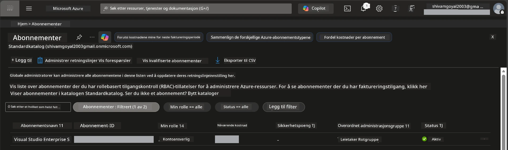

# Module 0 - Forutsetninger

Før du starter verkstedet, bekreft at du har følgende verktøy, tilgang og miljø klart. Følg hvert steg nedenfor - ikke hopp fremover.

---

## 1. Azure-konto og abonnement

### 1.1 Opprett eller bekreft Azure-abonnementet ditt

1. Åpne en nettleser og gå til [https://azure.microsoft.com/free/](https://azure.microsoft.com/free/).
2. Hvis du ikke har en Azure-konto, klikk **Start free** og følg registreringsprosessen. Du trenger en Microsoft-konto (eller opprette en) og et kredittkort for identitetsbekreftelse.
3. Hvis du allerede har en konto, logg inn på [https://portal.azure.com](https://portal.azure.com).
4. I portalen klikker du på **Subscriptions**-panelet i venstre navigasjon (eller søk "Subscriptions" i toppsøket).
5. Bekreft at du ser minst ett **Active** abonnement. Noter deg **Subscription ID** - du vil trenge det senere.



### 1.2 Forstå nødvendige RBAC-roller

[Hosted Agent](https://learn.microsoft.com/azure/foundry/agents/concepts/hosted-agents) distribusjon krever **data action** tillatelser som standard Azure `Owner` og `Contributor` roller **ikke** inkluderer. Du vil trenge en av disse [rollkombinasjonene](https://learn.microsoft.com/azure/foundry/concepts/rbac-foundry#built-in-roles):

| Scenario | Nødvendige roller | Hvor de tildeles |
|----------|-------------------|------------------|
| Opprett nytt Foundry-prosjekt | **Azure AI Owner** på Foundry-ressurs | Foundry-ressurs i Azure-portalen |
| Distribuer til eksisterende prosjekt (nye ressurser) | **Azure AI Owner** + **Contributor** på abonnement | Abonnement + Foundry-ressurs |
| Distribuer til fullstendig konfigurert prosjekt | **Reader** på konto + **Azure AI User** på prosjekt | Konto + Prosjekt i Azure-portalen |

> **Viktig:** Azure `Owner` og `Contributor` roller dekker kun *administrasjonstilganger* (ARM-operasjoner). Du trenger [**Azure AI User**](https://learn.microsoft.com/azure/foundry/concepts/rbac-foundry#built-in-roles) (eller høyere) for *data handlinger* som `agents/write` som kreves for å opprette og distribuere agenter. Du tildeler disse rollene i [Modul 2](02-create-foundry-project.md).

---

## 2. Installer lokale verktøy

Installer hvert verktøy nedenfor. Etter installasjon, bekreft at det fungerer ved å kjøre sjekk-kommandoen.

### 2.1 Visual Studio Code

1. Gå til [https://code.visualstudio.com/](https://code.visualstudio.com/).
2. Last ned installasjonsprogrammet for ditt OS (Windows/macOS/Linux).
3. Kjør installasjonsprogrammet med standardinnstillinger.
4. Åpne VS Code for å bekrefte at det starter.

### 2.2 Python 3.10+

1. Gå til [https://www.python.org/downloads/](https://www.python.org/downloads/).
2. Last ned Python 3.10 eller nyere (3.12+ anbefales).
3. **Windows:** Under installasjonen, huk av for **"Add Python to PATH"** på første skjerm.
4. Åpne et terminalvindu og bekreft:

   ```powershell
   python --version
   ```

   Forventet utdata: `Python 3.10.x` eller nyere.

### 2.3 Azure CLI

1. Gå til [https://learn.microsoft.com/cli/azure/install-azure-cli](https://learn.microsoft.com/cli/azure/install-azure-cli).
2. Følg installasjonsinstruksjonene for ditt OS.
3. Bekreft:

   ```powershell
   az --version
   ```

   Forventet: `azure-cli 2.80.0` eller nyere.

4. Logg inn:

   ```powershell
   az login
   ```

### 2.4 Azure Developer CLI (azd)

1. Gå til [https://learn.microsoft.com/azure/developer/azure-developer-cli/install-azd](https://learn.microsoft.com/azure/developer/azure-developer-cli/install-azd).
2. Følg installasjonsinstruksjonene for ditt OS. På Windows:

   ```powershell
   winget install microsoft.azd
   ```

3. Bekreft:

   ```powershell
   azd version
   ```

   Forventet: `azd version 1.x.x` eller nyere.

4. Logg inn:

   ```powershell
   azd auth login
   ```

### 2.5 Docker Desktop (valgfritt)

Docker trengs bare hvis du ønsker å bygge og teste containerbildet lokalt før distribusjon. Foundry-utvidelsen håndterer containerbygg under distribusjon automatisk.

1. Gå til [https://docs.docker.com/get-docker/](https://docs.docker.com/get-docker/).
2. Last ned og installer Docker Desktop for ditt OS.
3. **Windows:** Sørg for at WSL 2 backend er valgt under installasjon.
4. Start Docker Desktop og vent til ikonet i systemstatusfeltet viser **"Docker Desktop is running"**.
5. Åpne et terminalvindu og bekreft:

   ```powershell
   docker info
   ```

   Dette skal skrive ut Docker systeminformasjon uten feil. Hvis du ser `Cannot connect to the Docker daemon`, vent noen sekunder til Docker er fullstendig startet.

---

## 3. Installer VS Code-utvidelser

Du trenger tre utvidelser. Installer dem **før** verkstedet starter.

### 3.1 Microsoft Foundry for VS Code

1. Åpne VS Code.
2. Trykk `Ctrl+Shift+X` for å åpne Utvidelsespanelet.
3. I søkefeltet, skriv **"Microsoft Foundry"**.
4. Finn **Microsoft Foundry for Visual Studio Code** (utgiver: Microsoft, ID: `TeamsDevApp.vscode-ai-foundry`).
5. Klikk **Install**.
6. Etter installasjon skal du se **Microsoft Foundry**-ikonet vises i Aktivitetslinjen (venstre sidelinje).

### 3.2 Foundry Toolkit

1. I Utvidelsespanelet (`Ctrl+Shift+X`), søk etter **"Foundry Toolkit"**.
2. Finn **Foundry Toolkit** (utgiver: Microsoft, ID: `ms-windows-ai-studio.windows-ai-studio`).
3. Klikk **Install**.
4. **Foundry Toolkit**-ikonet skal vises i Aktivitetslinjen.

### 3.3 Python

1. I Utvidelsespanelet, søk etter **"Python"**.
2. Finn **Python** (utgiver: Microsoft, ID: `ms-python.python`).
3. Klikk **Install**.

---

## 4. Logg inn i Azure via VS Code

[Microsoft Agent Framework](https://learn.microsoft.com/agent-framework/overview/) bruker [`DefaultAzureCredential`](https://learn.microsoft.com/azure/developer/python/sdk/authentication/credential-chains#defaultazurecredential-overview) for autentisering. Du må være logget inn i Azure i VS Code.

### 4.1 Logg inn via VS Code

1. Se nederst til venstre i VS Code og klikk på **Accounts**-ikonet (personsilhuett).
2. Klikk **Sign in to use Microsoft Foundry** (eller **Sign in with Azure**).
3. Et nettleservindu åpnes - logg inn med Azure-kontoen med tilgang til abonnementet ditt.
4. Gå tilbake til VS Code. Du skal se kontonavnet ditt nederst til venstre.

### 4.2 (Valgfritt) Logg inn via Azure CLI

Hvis du har installert Azure CLI og foretrekker CLI-basert autentisering:

```powershell
az login
```

Dette åpner en nettleser for innlogging. Etter innlogging setter du korrekt abonnement:

```powershell
az account set --subscription "<your-subscription-id>"
```

Bekreft:

```powershell
az account show --query "{name:name, id:id, state:state}" --output table
```

Du skal se abonnementnavn, ID og tilstand = `Enabled`.

### 4.3 (Alternativt) Service principal-autentisering

For CI/CD eller delte miljøer, sett disse miljøvariablene i stedet:

```powershell
$env:AZURE_TENANT_ID = "<your-tenant-id>"
$env:AZURE_CLIENT_ID = "<your-client-id>"
$env:AZURE_CLIENT_SECRET = "<your-client-secret>"
```

---

## 5. Forhåndsvisningsbegrensninger

Før du fortsetter, vær klar over gjeldende begrensninger:

- [**Hosted Agents**](https://learn.microsoft.com/azure/foundry/agents/concepts/hosted-agents) er for øyeblikket i **offentlig forhåndsvisning** – ikke anbefalt for produksjonsarbeidsbelastninger.
- **Støttede regioner er begrenset** – sjekk [regiontilgjengelighet](https://learn.microsoft.com/azure/foundry/agents/concepts/hosted-agents#region-availability) før du oppretter ressurser. Velger du en ikke-støttet region, vil distribusjonen feile.
- `azure-ai-agentserver-agentframework`-pakken er pre-release (`1.0.0b16`) – API-er kan endres.
- Skaleringsbegrensninger: hosted agenter støtter 0-5 replikaer (inkludert skaler-til-null).

---

## 6. Sjekkliste før start

Gå gjennom hvert punkt nedenfor. Dersom noen steg feiler, gå tilbake og rette det før du fortsetter.

- [ ] VS Code åpnes uten feil
- [ ] Python 3.10+ er på PATH (`python --version` viser `3.10.x` eller høyere)
- [ ] Azure CLI er installert (`az --version` viser `2.80.0` eller høyere)
- [ ] Azure Developer CLI er installert (`azd version` viser versjonsinfo)
- [ ] Microsoft Foundry-utvidelsen er installert (ikon synlig i Aktivitetslinjen)
- [ ] Foundry Toolkit-utvidelsen er installert (ikon synlig i Aktivitetslinjen)
- [ ] Python-utvidelsen er installert
- [ ] Du er logget inn i Azure i VS Code (sjekk Accounts-ikon nederst til venstre)
- [ ] `az account show` viser abonnementet ditt
- [ ] (Valgfritt) Docker Desktop kjører (`docker info` gir systeminfo uten feil)

### Kontrollpunkt

Åpne Aktivitetslinjen i VS Code og bekreft at både **Foundry Toolkit** og **Microsoft Foundry** vises i sidelinjene. Klikk på hver for å verifisere at de lastes uten feil.

---

**Neste:** [01 - Installer Foundry Toolkit & Foundry Extension →](01-install-foundry-toolkit.md)

---

<!-- CO-OP TRANSLATOR DISCLAIMER START -->
**Ansvarsfraskrivelse**:
Dette dokumentet er oversatt ved hjelp av AI-oversettelsestjenesten [Co-op Translator](https://github.com/Azure/co-op-translator). Selv om vi streber etter nøyaktighet, vennligst merk at automatiserte oversettelser kan inneholde feil eller unøyaktigheter. Det opprinnelige dokumentet på originalspråket bør anses som den autoritative kilden. For kritisk informasjon anbefales profesjonell menneskelig oversettelse. Vi er ikke ansvarlige for noen misforståelser eller feiltolkninger som oppstår fra bruk av denne oversettelsen.
<!-- CO-OP TRANSLATOR DISCLAIMER END -->