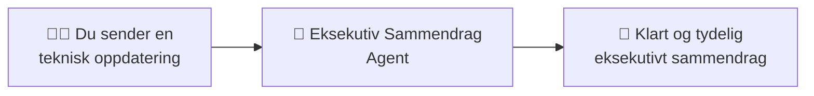

# Modul 0 - Introduksjon

⏱️ ~10 min

> [!WARNING]
> **Forhåndsvisning og begrensninger:** [Hosted Agents](https://learn.microsoft.com/azure/foundry/agents/concepts/hosted-agents) er for øyeblikket i **offentlig forhåndsvisning** - ikke anbefalt for produksjonsarbeidsbelastninger. Vær oppmerksom på følgende:
> - **Støttede regioner er begrenset** - sjekk [regiontilgjengelighet](https://learn.microsoft.com/azure/foundry/agents/concepts/hosted-agents#region-availability) før du oppretter ressurser. Velger du en ikke-støttet region, vil distribusjonen mislykkes.
> - `azure-ai-agentserver-agentframework`-pakken er pre-release - API-er kan endres mellom versjoner.
> - Skaleringsgrenser: hosted agents støtter 0–5 replikaer (inkludert skaler-til-null).
> - Noen funksjoner som vises i denne workshopen kan endres etter hvert som tjenesten nærmer seg GA.

## Hva du skal bygge

I denne workshopen skal du bygge en **"Forklar som om jeg er en leder"** agent – en hosted AI-agent som tar komplekse tekniske oppdateringer og omskriver dem til forståelige sammendrag på vanlig norsk.

```mermaid
flowchart LR
    A["🧑‍💻 Du sender en\nteknisk oppdatering"] --> B["🤖 Eksekutiv Sammendrag\nAgent"]
    B --> C["📝 Klart og tydelig\neksekutivt sammendrag"]
```

**Agenten bruker:**
- **Microsoft Agent Framework** - for agentlogikk og struktur
- **Foundry Toolkit for VS Code** - for å skissere, teste lokalt og distribuere
- **En AI-modell** (f.eks., `gpt-4.1-mini/gpt-5-mini`) - for å generere sammendragene

Mot slutten av denne labben vil du ha en fungerende agent som du kan teste lokalt via Agent Inspector, og eventuelt distribuere til skyen.

---

## Hva er hosted agents?

En **hosted agent** er en AI-agent som kjører som en administrert tjeneste i Microsoft Foundry. I stedet for å administrere egen infrastruktur pakker du agentkoden i en container, og Foundry håndterer skalering, hosting og eksponering via et standard HTTP-endepunkt.

| Konsept | Hva det betyr |
|---------|--------------|
| **Agent** | Din Python-kode som mottar brukerbeskjeder, kaller en AI-modell og returnerer et strukturert svar |
| **Hosted** | Foundry kjører din container for deg – ingen virtuelle maskiner, ingen Kubernetes, ingen infrastruktur å administrere |
| **Svarprotokoll** | Et standard HTTP API (`POST /responses`) som alle klienter kan bruke for å kommunisere med agenten din |
| **Agent Inspector** | En lokal test-UI (bygget inn i Foundry Toolkit) som lar deg chatte med agenten før distribusjon |

I denne workshopen går du fra null til en fullstendig hosted agent – eller stopper på lokal testing, om du foretrekker det.

---

## Velg din vei

> ⚠️ **Velg en vei før du fortsetter.** Ditt valg bestemmer hvilke verktøy du skal installere og hvilke moduler som gjelder. Du kan bytte fra Vei B → Vei A senere dersom du skaffer et abonnement.

<strong>🅰️ Vei A - Azure-sky (krever Azure-abonnement)</strong>

| | Detaljer |
|---|---|
| **Hvem er dette for?** | Du har et aktivt Azure-abonnement og kan opprette Foundry-ressurser |
| **Modell** | Azure OpenAI via Foundry (f.eks., `gpt-4.1-mini/gpt-5-mini`) |
| **Dekker moduler** | Alle moduler (00–07) |
| **Distribuere til skyen?** | ✅ Ja – full ende-til-ende distribusjon |

<strong>🅱️ Vei B - Lokal / gratisnivå (krever ikke Azure-abonnement)</strong>

| | Detaljer |
|---|---|
| **Hvem er dette for?** | MVP-er, studenter eller hvem som helst uten Azure-tilgang |
| **Modell** | **Foundry Local** (gratis, kjører på din maskin) |
| **Dekker moduler** | Moduler 00–04 (hopp over distribusjon & sky-verifisering) |
| **Distribuere til skyen?** | ❌ Nei – kun lokal testing via Agent Inspector |

---

## Alle veier: Nødvendige verktøy

Installer hvert verktøy under. Etter installasjon, sjekk at det virker ved å kjøre sjekk-kommandoen.

| # | Verktøy | Versjon | Installasjon | Sjekk (Forventet utdata) |
|---|---------|---------|--------------|---------------------------|
| 1 | **Visual Studio Code** | Nyeste | [code.visualstudio.com](https://code.visualstudio.com/) | Åpnes uten feil |
| 2 | **Python** | 3.12 eller høyere | [python.org/downloads](https://www.python.org/downloads/) | `python --version` $\rightarrow$ `Python 3.12.x` |
| 3 | **Foundry Toolkit for VS Code** | Nyeste | Extension ID: `ms-windows-ai-studio.windows-ai-studio` | Foundry-ikon i aktivitetslinjen |
| 4 | **Python-utvidelse for VS Code** | Nyeste | Extension ID: `ms-python.python` | Installert i Extensions-panelet |

> [!TIP]
> **Tips for installasjon:**
> - **Python PATH (Windows):** Husk å alltid krysse av for **"Add Python to PATH"** på første skjerm i Python-installasjonen. Uten dette vil ikke `python` bli gjenkjent i terminalen.
> - **Flere Python-versjoner:** Dersom du har både Python 3.10 og 3.12 installert, bruk `python3.12 -m venv .venv` for å sikre riktig versjon i ditt virtuelle miljø.
> - **Docker WSL 2 (Windows):** Under Docker Desktop-installasjonen, sørg for at **WSL 2 backend** er valgt. Docker med Hyper-V er tregere og kan gi problemer med Foundry-containerbygger.
> - **Docker starter ikke?** Vent 30–60 sekunder etter at du har startet Docker Desktop. Kjør `docker info` – hvis du ser "Cannot connect to the Docker daemon," er Docker fortsatt under oppstart.
> - **VS Code-utvidelser lastes ikke?** Etter installasjon av utvidelser, last inn vinduet på nytt: `Ctrl+Shift+P` → `Developer: Reload Window`.

> **Windows-brukere:** Husk å krysse av for **"Add Python to PATH"** under Python-installasjonen.

**Neste:** [01 - Setup →](01-setup.md)

---

<!-- CO-OP TRANSLATOR DISCLAIMER START -->
**Ansvarsfraskrivelse**:
Dette dokumentet er oversatt ved hjelp av AI-oversettelsestjenesten [Co-op Translator](https://github.com/Azure/co-op-translator). Selv om vi streber etter nøyaktighet, vær oppmerksom på at automatiske oversettelser kan inneholde feil eller unøyaktigheter. Det opprinnelige dokumentet på originalspråket skal betraktes som den autoritative kilden. For kritisk informasjon anbefales profesjonell menneskelig oversettelse. Vi er ikke ansvarlige for eventuelle misforståelser eller feiltolkninger som oppstår ved bruk av denne oversettelsen.
<!-- CO-OP TRANSLATOR DISCLAIMER END -->