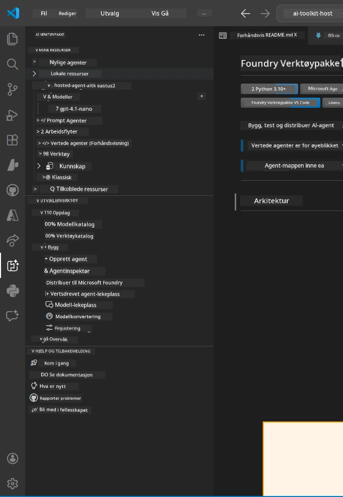
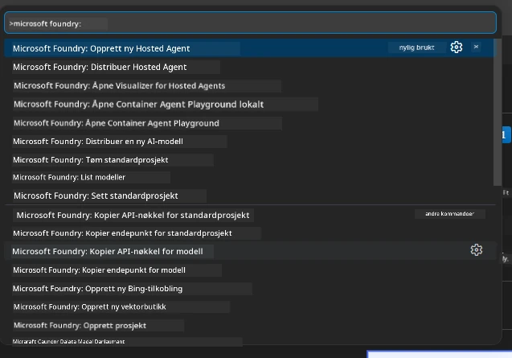

# Modul 1 - Installer Foundry Toolkit & Foundry Extension

Denne modulen guider deg gjennom installasjon og verifisering av de to viktigste VS Code-utvidelsene for denne workshopen. Hvis du allerede installerte dem under [Modul 0](00-prerequisites.md), bruk denne modulen for å bekrefte at de fungerer riktig.

---

## Steg 1: Installer Microsoft Foundry Extension

**Microsoft Foundry for VS Code**-utvidelsen er ditt hovedverktøy for å lage Foundry-prosjekter, distribuere modeller, bygge opp hosted agenter, og distribuere direkte fra VS Code.

1. Åpne VS Code.
2. Trykk `Ctrl+Shift+X` for å åpne **Extensions**-panelet.
3. Skriv inn i søkefeltet øverst: **Microsoft Foundry**
4. Finn resultatet med tittelen **Microsoft Foundry for Visual Studio Code**.
   - Utgiver: **Microsoft**
   - Extension ID: `TeamsDevApp.vscode-ai-foundry`
5. Klikk på **Install**-knappen.
6. Vent til installasjonen er ferdig (du ser en liten fremdriftsindikator).
7. Etter installasjon, se på **Activity Bar** (den vertikale ikonbaren på venstre side av VS Code). Du skal se et nytt **Microsoft Foundry**-ikon (ser ut som en diamant/AI-ikon).
8. Klikk på **Microsoft Foundry**-ikonet for å åpne sidelinjen. Du skal se seksjoner for:
   - **Resources** (eller Projects)
   - **Agents**
   - **Models**

> **Hvis ikonet ikke vises:** Prøv å laste VS Code på nytt (`Ctrl+Shift+P` → `Developer: Reload Window`).

---

## Steg 2: Installer Foundry Toolkit Extension

**Foundry Toolkit**-utvidelsen tilbyr [**Agent Inspector**](https://learn.microsoft.com/azure/foundry/agents/how-to/vs-code-agents-workflow-pro-code) - en visuell grensesnitt for testing og feilsøking av agenter lokalt - pluss lekemiljø, modellhåndtering, og evalueringsverktøy.

1. I Extensions-panelet (`Ctrl+Shift+X`), tøm søkefeltet og skriv: **Foundry Toolkit**
2. Finn **Foundry Toolkit** i resultatene.
   - Utgiver: **Microsoft**
   - Extension ID: `ms-windows-ai-studio.windows-ai-studio`
3. Klikk på **Install**.
4. Etter at installasjonen fullføres, vises **Foundry Toolkit**-ikonet i Activity Bar (ser ut som en robot/glinse-ikon).
5. Klikk på **Foundry Toolkit**-ikonet for å åpne sidelinjen. Du skal se Foundry Toolkit velkomstskjerm med valgmuligheter for:
   - **Models**
   - **Playground**
   - **Agents**

---

## Steg 3: Bekreft at begge utvidelsene fungerer

### 3.1 Bekreft Microsoft Foundry Extension

1. Klikk på **Microsoft Foundry**-ikonet i Activity Bar.
2. Hvis du er logget inn i Azure (fra Modul 0), skal du se prosjektene dine under **Resources**.
3. Hvis du blir bedt om å logge inn, klikk på **Sign in** og følg autentiseringsflyten.
4. Bekreft at sidelinjen vises uten feil.

### 3.2 Bekreft Foundry Toolkit Extension

1. Klikk på **Foundry Toolkit**-ikonet i Activity Bar.
2. Bekreft at velkomstskjermen eller hovedpanelet åpnes uten feil.
3. Du trenger ikke konfigurere noe ennå – vi skal bruke Agent Inspector i [Modul 5](05-test-locally.md).

### 3.3 Verifiser via Command Palette

1. Trykk `Ctrl+Shift+P` for å åpne Command Palette.
2. Skriv **"Microsoft Foundry"** - du skal se kommandoer som:
   - `Microsoft Foundry: Create a New Hosted Agent`
   - `Microsoft Foundry: Deploy Hosted Agent`
   - `Microsoft Foundry: Open Model Catalog`
3. Trykk `Escape` for å lukke Command Palette.
4. Åpne Command Palette igjen og skriv **"Foundry Toolkit"** - du skal se kommandoer som:
   - `Foundry Toolkit: Open Agent Inspector`

> Hvis du ikke ser disse kommandoene, kan det hende utvidelsene ikke er installert riktig. Prøv å avinstallere og installere dem på nytt.

---

## Hva disse utvidelsene gjør i denne workshopen

| Utvidelse | Hva den gjør | Når du bruker den |
|-----------|-------------|-------------------|
| **Microsoft Foundry for VS Code** | Lage Foundry-prosjekter, distribuere modeller, **bygge opp [hosted agenter](https://learn.microsoft.com/azure/foundry/agents/concepts/hosted-agents)** (auto-genererer `agent.yaml`, `main.py`, `Dockerfile`, `requirements.txt`), distribuere til [Foundry Agent Service](https://learn.microsoft.com/azure/foundry/agents/overview) | Moduler 2, 3, 6, 7 |
| **Foundry Toolkit** | Agent Inspector for lokal testing/feilsøking, lekemiljø UI, modellhåndtering | Moduler 5, 7 |

> **Foundry-utvidelsen er det viktigste verktøyet i denne workshopen.** Den håndterer hele livssyklusen: bygge opp → konfigurere → distribuere → verifisere. Foundry Toolkit kompletterer den ved å tilby den visuelle Agent Inspector for lokal testing.

---

### Sjekkpunkter

- [ ] Microsoft Foundry-ikonet er synlig i Activity Bar
- [ ] Klikk på det åpner sidelinjen uten feil
- [ ] Foundry Toolkit-ikonet er synlig i Activity Bar
- [ ] Klikk på det åpner sidelinjen uten feil
- [ ] `Ctrl+Shift+P` → skriving av "Microsoft Foundry" viser tilgjengelige kommandoer
- [ ] `Ctrl+Shift+P` → skriving av "Foundry Toolkit" viser tilgjengelige kommandoer

---

**Forrige:** [00 - Forutsetninger](00-prerequisites.md) · **Neste:** [02 - Opprett Foundry-prosjekt →](02-create-foundry-project.md)

---

<!-- CO-OP TRANSLATOR DISCLAIMER START -->
**Ansvarsfraskrivelse**:  
Dette dokumentet er oversatt ved hjelp av AI-oversettelsestjenesten [Co-op Translator](https://github.com/Azure/co-op-translator). Selv om vi jobber for nøyaktighet, vennligst vær oppmerksom på at automatiske oversettelser kan inneholde feil eller unøyaktigheter. Det originale dokumentet på det opprinnelige språket bør betraktes som den autoritative kilden. For kritisk informasjon anbefales profesjonell menneskelig oversettelse. Vi er ikke ansvarlige for eventuelle misforståelser eller feiltolkninger som oppstår ved bruk av denne oversettelsen.
<!-- CO-OP TRANSLATOR DISCLAIMER END -->