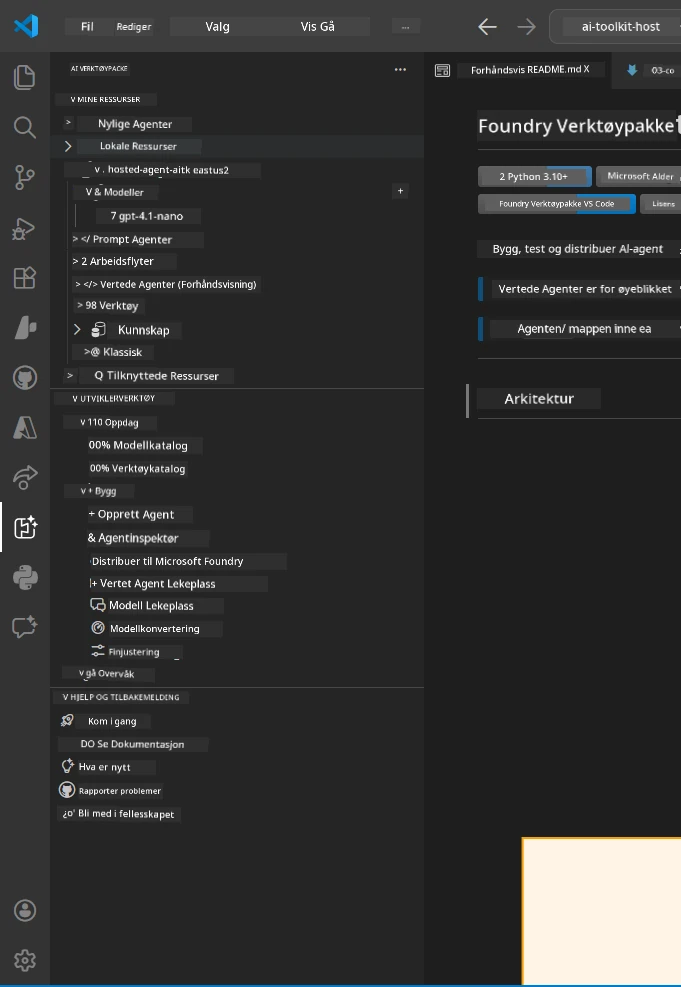
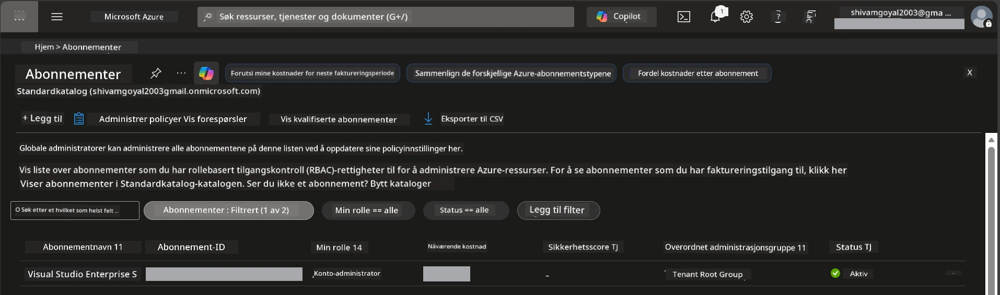
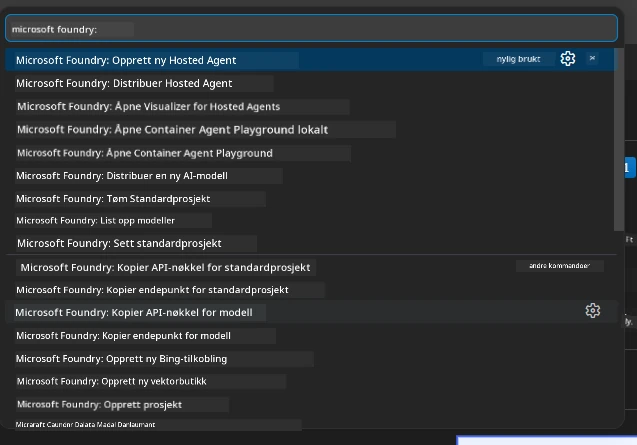
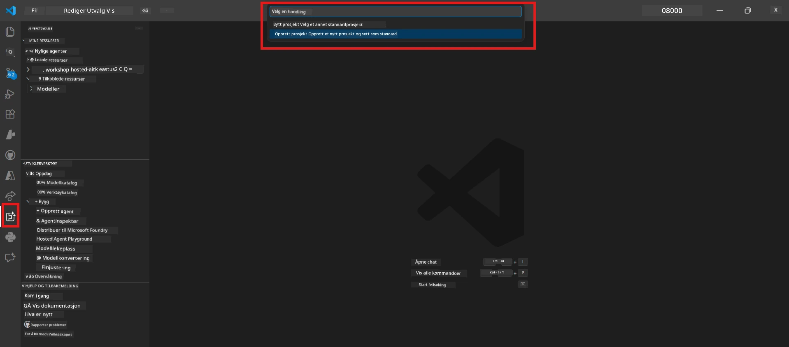
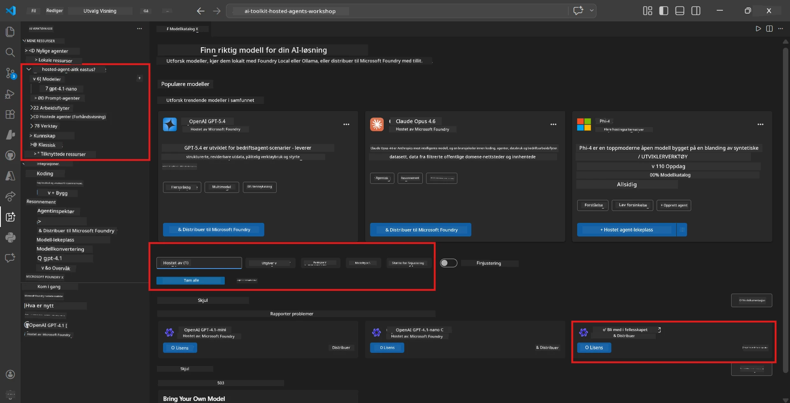
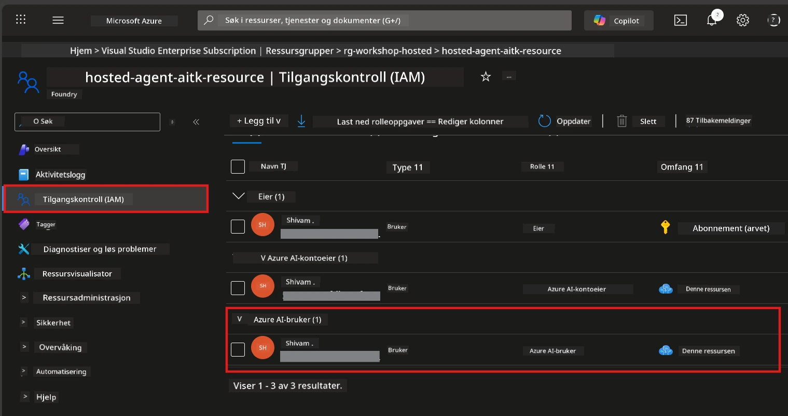

# Oppsett: Utvidelse, Prosjekt & Modell

⏱️ ~15 min

I denne modulen installerer og verifiserer du Foundry Toolkit-utvidelsen, oppretter (eller kobler til) et Foundry-prosjekt, og distribuerer en modell agenten din vil bruke.

## Trinn 1: Installer Foundry Toolkit

**Foundry Toolkit for VS Code** er hovedutvidelsen for denne workshopen. Den tilbyr prosjektopprettelse, modellutrulling, agentskjelett, lokal testing (Agent Inspector) og skyutrulling – alt fra VS Code.

1. Åpne VS Code og trykk `Ctrl+Shift+X` for å åpne **Extensions**-panelet.
2. Søk etter **Foundry Toolkit**.
3. Installer **Foundry Toolkit for VS Code** (Utgiver: Microsoft, ID: `ms-windows-ai-studio.windows-ai-studio`).
4. Etter installasjon vises **Foundry Toolkit**-ikonet i aktivitetslinjen (venstre sidepanel).

> *Merk: Aktivitetslinjen kan vise "AI TOOLKIT" i eldre versjoner av utvidelsen. Funksjonaliteten er identisk.*



## Trinn 2: Sett opp basert på din tilgang

> **Velg din vei:** Utvid seksjonen under som passer ditt oppsett. Du trenger bare å fullføre **én** vei.

<details>
<summary><strong>🅰️ Vei A - Azure sky (krever Azure-abonnement)</strong></summary>

### Azure CLI

1. Installer fra [learn.microsoft.com/cli/azure/install-azure-cli](https://learn.microsoft.com/cli/azure/install-azure-cli).
2. Verifiser: `az --version` (forvent 2.80.0+).
3. Logg inn: `az login`

### Autentiseringsvalg

[Microsoft Agent Framework](https://learn.microsoft.com/agent-framework/overview/) bruker [`DefaultAzureCredential`](https://learn.microsoft.com/azure/developer/python/sdk/authentication/credential-chains#defaultazurecredential-overview) som prøver flere autentiseringsmetoder i rekkefølge. Velg den som passer ditt miljø:

#### Alternativ 1: VS Code-kontoer (anbefalt for workshops)
1. Klikk på **Accounts**-ikonet (person-silhuett) nederst til venstre i VS Code.
2. Velg **Sign in to use Microsoft Foundry** (eller **Sign in with Azure**).
3. En nettleser åpnes – logg inn med Azure-kontoen som har tilgang til abonnementet ditt.
4. Gå tilbake til VS Code. Du skal se kontonavnet ditt nederst til venstre.

#### Alternativ 2: Azure CLI
```bash
az login
az account set --subscription "<your-subscription-id>"
```

#### Alternativ 3: Service Principal (Enterprise/CI)
For låste miljøer eller CI/CD-pipelines, sett disse miljøvariablene i `.env`-filen din:
```env
AZURE_TENANT_ID=<your-tenant-id>
AZURE_CLIENT_ID=<your-client-id>
AZURE_CLIENT_SECRET=<your-client-secret>
```

> **Hvordan `DefaultAzureCredential` fungerer:** Den prøver først miljøvariabler, deretter managed identity, så VS Code-pålogging og til slutt Azure CLI – og bruker den som lykkes først. Se [dokumentasjon om credential chain](https://learn.microsoft.com/azure/developer/python/sdk/authentication/credential-chains#defaultazurecredential-overview).

### Azure Developer CLI (azd)

1. Installer: `winget install microsoft.azd` (Windows) eller se [installasjonsdokumentasjon](https://learn.microsoft.com/azure/developer/azure-developer-cli/install-azd).
2. Verifiser: `azd version`
3. Logg inn: `azd auth login`

### Docker Desktop (valgfritt)

Docker er kun nødvendig hvis du vil bygge containere lokalt. Foundry-utvidelsen håndterer bygg automatisk under distribusjon.

1. Installer fra [docs.docker.com/get-docker](https://docs.docker.com/get-docker/).
2. Verifiser: `docker info`

### Azure-abonnement & RBAC

1. Logg inn på [portal.azure.com](https://portal.azure.com).
2. Naviger til **Subscriptions** og bekreft at minst ett er **Aktivt**.
3. Merk deg **Subscription ID** – du trenger den i Modul 01.



#### RBAC scenariotabell

[Hosted Agent](https://learn.microsoft.com/azure/foundry/agents/concepts/hosted-agents) distribusjon krever **data action** tillatelser som standard Azure-roller `Owner` og `Contributor` **ikke** inkluderer. Bruk tabellen under for å finne ut hvilke roller du trenger:

| Scenario | Påkrevde roller | Hvor du tildeler dem |
|----------|-----------------|---------------------|
| Opprett nytt Foundry-prosjekt | **Azure AI Owner** på Foundry-ressurs | Foundry-ressurs i Azure Portal |
| Distribuer til eksisterende prosjekt (nye ressurser) | **Azure AI Owner** + **Contributor** på abonnement | Abonnement + Foundry-ressurs |
| Distribuer til fullstendig konfigurert prosjekt | **Reader** på konto + **Azure AI User** på prosjekt | Konto + Prosjekt i Azure Portal |
| Kun lokal testing (ingen distribusjon) | **Azure AI User** på prosjekt | Prosjekt i Azure Portal |

> **Viktig poeng:** Azure-roller `Owner` og `Contributor` dekker kun *administrasjonstillatelser* (ARM-operasjoner). Du trenger [**Azure AI User**](https://learn.microsoft.com/azure/foundry/concepts/rbac-foundry#built-in-roles) (eller høyere) for *data handlinger* som `agents/write` som kreves for å opprette og distribuere agenter.

## Koble til eller opprett et Foundry-prosjekt



1. Trykk `Ctrl+Shift+P` → skriv **Foundry Toolkit: Create Project** → velg det.
2. Velg ditt **Azure-abonnement** fra nedtrekksmenyen.
3. Velg eller opprett en **ressursgruppe** (f.eks. `rg-hosted-agents-workshop`).
4. Velg en **region** som støtter hosted agents: `East US`, `West US 2`, eller `Sweden Central`. Se [regionstilgjengelighet](https://learn.microsoft.com/azure/foundry/agents/concepts/hosted-agents#region-availability).
5. Skriv inn et prosjektnavn (f.eks. `workshop-agents`).
6. Vent 2–5 minutter på provisjonering. En fremdriftsvarsling vises i VS Code.
7. Når ferdig, vises prosjektet ditt i **Foundry Toolkit** sidepanelet under **MINE RESSURSER**.



## Distribuer en modell & tilordne RBAC

Din hosted agent trenger en AI-modell for å generere svar.

#### Modellvalgmatrise
Avhengig av dine behov kan du velge blant forskjellige modellnivåer:

| Modell | Best for | Kostnad | Notater |
|--------|----------|---------|---------|
| `gpt-4.1` | Høykvalitets, nyanserte svar | Høyere | Beste resultater, anbefalt for slutt-testing |
| `gpt-4.1-mini/gpt-5-mini` | Rask iterasjon, lavere kostnad | Lavere | Godt for workshoputvikling og rask testing |
| `gpt-4.1-nano` | Lettere oppgaver | Lavest | Mest kostnadseffektiv, men enklere svar |

1. Trykk `Ctrl+Shift+P` → **Foundry Toolkit: Open Model Catalog** (eller klikk **Model Catalog** i sidepanelet under UTVIKLERTOOLER → Oppdag).
2. Søk etter **gpt-4.1** i katalogen.
3. Finn **OpenAI GPT-4.1-mini** (eller `gpt-5-mini` for bedre kvalitet) og klikk **Deploy**.



4. I distribusjonskonfigurasjonen:
   - **Navn på distribusjon:** La det stå som standard eller skriv inn et egendefinert navn. **Husk dette navnet.**
   - **Mål:** Velg **Distribuer til Foundry Toolkit** → velg prosjektet ditt.
5. Klikk **Deploy** og vent 1–3 minutter.

> **Anbefaling:** Bruk `gpt-4.1-mini/gpt-5-mini` for workshopen – raskt, rimelig og gir gode resultater.

### Merk deg verdiene dine

Etter distribusjon, noter disse to verdiene (du trenger dem i Modul 03):

| Verdi | Hvor du finner den |
|-------|--------------------|
| **Prosjektendepunkt** | Klikk prosjektet ditt i sidepanelet → detaljvisningen viser URL (f.eks. `https://<account>.services.ai.azure.com/api/projects/<project>`) |
| **Navn på modelldistribusjon** | Utvid prosjekt → **Modeller** → navnet ved siden av distribuert modell (f.eks. `gpt-4.1-mini/gpt-5-mini`) |

### Tilordne RBAC-rolle

> ⚠️ **Dette er det vanligste steget som blir glemt.** Uten riktig rolle vil distribusjon i Modul 05 feile.

#### Hvilken rolle trenger jeg?
Avhengig av scenariet ditt trenger du følgende rollekomboer:

| Scenario | Påkrevde roller | Hvor du tildeler dem |
|----------|-----------------|---------------------|
| Opprett nytt Foundry-prosjekt | **Azure AI Owner** på Foundry-ressurs | Foundry-ressurs i Azure Portal |
| Distribuer til eksisterende prosjekt (nye ressurser) | **Azure AI Owner** + **Contributor** på abonnement | Abonnement + Foundry-ressurs |
| Distribuer til fullstendig konfigurert prosjekt | **Reader** på konto + **Azure AI User** på prosjekt | Konto + Prosjekt i Azure Portal |

**Viktig poeng:** Azure-roller `Owner` og `Contributor` dekker kun *administrasjons* tillatelser. Du trenger **Azure AI User** (eller høyere) for *data handlinger* som `agents/write` som kreves for å opprette og distribuere agenter.

1. Åpne [portal.azure.com](https://portal.azure.com).
2. Søk etter ditt **Foundry-prosjekt** navn → klikk på resultatet med typen **"Foundry Toolkit project"** (IKKE hovedkontoen).
3. Klikk **Access control (IAM)** i venstremenyen.
4. Klikk **+ Legg til** → **Legg til rolleoppgave**.
5. **Rolle-fanen:** Søk etter **Azure AI User**, velg den, klikk **Neste**.
6. **Medlemmer-fanen:** Velg **Bruker, gruppe, eller tjenesteprinsipp** → klikk **+ Velg medlemmer** → finn og velg deg selv → klikk **Velg**.
7. Klikk **Gjennomgå + tildel** → **Gjennomgå + tildel** igjen.
8. **Vent 1–2 minutter** på at det skal tre i kraft.

> **Hvorfor denne rollen?** Azure `Owner`/`Contributor` gir bare administrasjonstillatelser. Rollen **Azure AI User** gir data handlingen `agents/write` som trengs for å opprette og distribuere agenter. Se [Foundry RBAC dokumentasjon](https://learn.microsoft.com/azure/foundry/concepts/rbac-foundry#built-in-roles).



</details>

<details>
<summary><strong>🅱️ Vei B - Lokal / gratisnivå (krever ikke Azure-abonnement)</strong></summary>

### Foundry Local

Foundry Local lar deg kjøre AI-modeller på din egen maskin – ingen sky-konto nødvendig. Du kan få tilgang til Foundry Local-modeller via Foundry Toolkit gjennom modellkatalogen slik:

1. Gå til Foundry Toolkit-utvidelsen.
2. I Foundry Toolkit-navigasjonen gå til **Developer Tools** > og velg **Model Catalog**
3. I det nye vinduet, velg **local** fra navigasjonslinjen.
4. Scroll ned til **Phi 4 Mini,** og klikk på **legg til-knappen** en popup vil vises som indikerer at modellen lastes ned.
5. Når modellen er lastet ned, kan du fortsette til neste steg.

</details>

### ✅ Sjekkpunkt


- [ ] `Ctrl+Shift+P` → "Foundry Toolkit" viser tilgjengelige kommandoer
- [ ] Foundry Toolkit-utvidelsen installert og sidepanelet lastes uten feil
- [ ] VS Code åpner og kjører korrekt
- [ ] `python --version` viser 3.10+
- [ ] Foundry Toolkit-ikon synlig i VS Code aktivitetslinje
- [ ] **Vei A:** `az login` lykkes, abonnementet er aktivt
- [ ] **Vei B:** Foundry Local kjører (`foundry local status`)
- [ ] **Vei A:** Foundry-prosjekt synlig i sidepanelet, modell distribuert, Azure AI User-rolle tildelt
- [ ] **Vei B:** Foundry Local kjører med en modell
- [ ] Du har notert deg **endepunkt** og **navn på modelldistribusjon**


**Forrige:** [00 - Forutsetninger](00-prerequisites.md) · **Neste:** [02 - Opprett Hosted Agent →](02-create-hosted-agent.md)

---

<!-- CO-OP TRANSLATOR DISCLAIMER START -->
**Ansvarsfraskrivelse**:
Dette dokumentet er oversatt ved hjelp av AI-oversettelsestjenesten [Co-op Translator](https://github.com/Azure/co-op-translator). Selv om vi streber etter nøyaktighet, vær oppmerksom på at automatiske oversettelser kan inneholde feil eller unøyaktigheter. Det opprinnelige dokumentet på originalspråket skal betraktes som den autoritative kilden. For kritisk informasjon anbefales profesjonell menneskelig oversettelse. Vi er ikke ansvarlige for eventuelle misforståelser eller feiltolkninger som oppstår ved bruk av denne oversettelsen.
<!-- CO-OP TRANSLATOR DISCLAIMER END -->