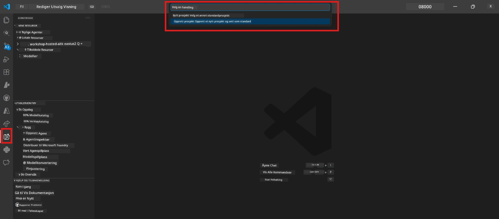
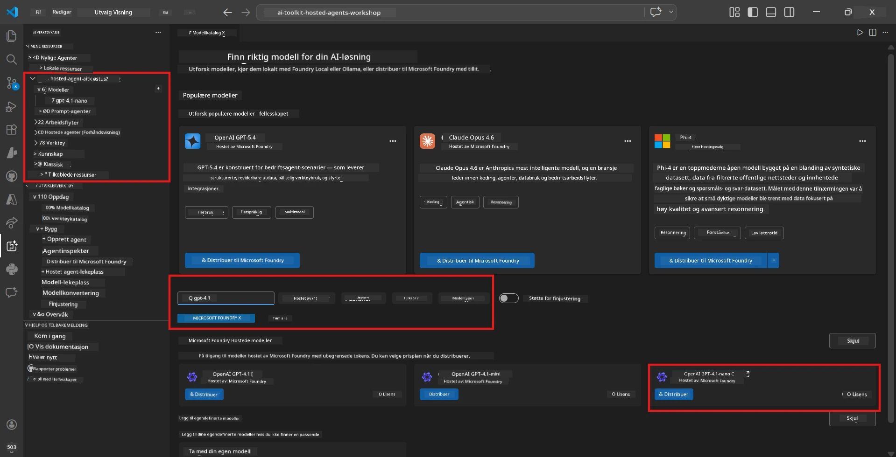
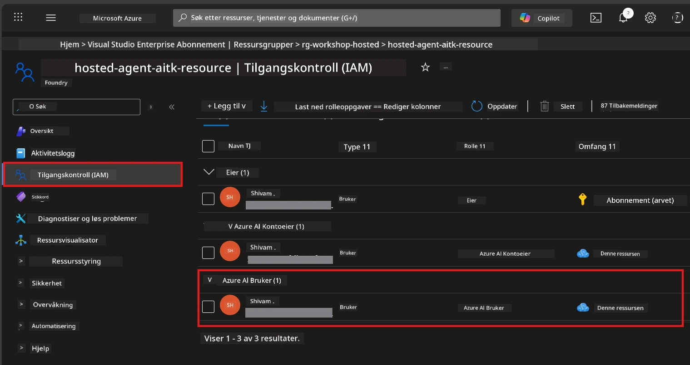

# Module 2 - Opprett et Foundry-prosjekt og distribuer en modell

I denne modulen oppretter du (eller velger) et Microsoft Foundry-prosjekt og distribuerer en modell som agenten din skal bruke. Hvert trinn er skrevet ut eksplisitt - følg dem i rekkefølge.

> Hvis du allerede har et Foundry-prosjekt med en distribuert modell, hopp til [Modul 3](03-create-hosted-agent.md).

---

## Trinn 1: Opprett et Foundry-prosjekt fra VS Code

Du bruker Microsoft Foundry-utvidelsen for å opprette et prosjekt uten å forlate VS Code.

1. Trykk `Ctrl+Shift+P` for å åpne **Command Palette**.
2. Skriv: **Microsoft Foundry: Create Project** og velg det.
3. En nedtrekksmeny vises – velg ditt **Azure-abonnement** fra listen.
4. Du blir bedt om å velge eller opprette en **resource group**:
   - For å opprette en ny: skriv et navn (f.eks. `rg-hosted-agents-workshop`) og trykk Enter.
   - For å bruke en eksisterende: velg den fra nedtrekksmenyen.
5. Velg en **region**. **Viktig:** Velg en region som støtter hostede agenter. Sjekk [regiontilgjengelighet](https://learn.microsoft.com/azure/foundry/agents/concepts/hosted-agents#region-availability) - vanlige valg er `East US`, `West US 2` eller `Sweden Central`.
6. Skriv inn et **navn** for Foundry-prosjektet (f.eks. `workshop-agents`).
7. Trykk Enter og vent til provisjoneringen er fullført.

> **Provisjoneringen tar 2-5 minutter.** Du vil se en fremdriftsvarsling nederst til høyre i VS Code. Ikke lukk VS Code under provisjoneringen.

8. Når det er fullført, vil **Microsoft Foundry**-sidepanelet vise ditt nye prosjekt under **Resources**.
9. Klikk på prosjektnavnet for å utvide og bekrefte at det viser seksjoner som **Models + endpoints** og **Agents**.



### Alternativt: Opprett via Foundry-portalen

Hvis du foretrekker å bruke nettleseren:

1. Åpne [https://ai.azure.com](https://ai.azure.com) og logg inn.
2. Klikk på **Create project** på startsiden.
3. Skriv inn et prosjektnavn, velg abonnement, resource group og region.
4. Klikk **Create** og vent til provisjoneringen er fullført.
5. Når det er opprettet, gå tilbake til VS Code – prosjektet skal vises i Foundry-sidepanelet etter en oppdatering (klikk på oppdateringsikonet).

---

## Trinn 2: Distribuer en modell

Din [hostede agent](https://learn.microsoft.com/azure/foundry/agents/concepts/hosted-agents) trenger en Azure OpenAI-modell for å generere svar. Du skal [distribuere en nå](https://learn.microsoft.com/azure/ai-foundry/openai/how-to/create-resource#deploy-a-model).

1. Trykk `Ctrl+Shift+P` for å åpne **Command Palette**.
2. Skriv: **Microsoft Foundry: Open [Model Catalog](https://learn.microsoft.com/azure/ai-foundry/openai/concepts/models)** og velg det.
3. Model Catalog-visningen åpnes i VS Code. Bla eller bruk søkefeltet for å finne **gpt-4.1**.
4. Klikk på modellkortet for **gpt-4.1** (eller `gpt-4.1-mini` om du foretrekker lavere kostnad).
5. Klikk **Deploy**.


6. I distribusjonskonfigurasjonen:
   - **Deployment name**: La standard være (f.eks. `gpt-4.1`) eller skriv inn et egendefinert navn. **Husk dette navnet** – du trenger det i modul 4.
   - **Target**: Velg **Deploy to Microsoft Foundry** og velg prosjektet du nettopp opprettet.
7. Klikk **Deploy** og vent til distribusjonen er ferdig (1-3 minutter).

### Velge en modell

| Modell | Best for | Kostnad | Notater |
|--------|----------|---------|---------|
| `gpt-4.1` | Høykvalitets, nyanserte svar | Høyere | Beste resultater, anbefalt for sluttesting |
| `gpt-4.1-mini` | Rask iterasjon, lavere kostnad | Lavere | God for utvikling og rask testing i workshop |
| `gpt-4.1-nano` | Lettvektsoppgaver | Lavest | Mest kostnadseffektivt, men enklere svar |

> **Anbefaling for denne workshoppen:** Bruk `gpt-4.1-mini` til utvikling og testing. Den er rask, billig og gir gode resultater til oppgavene.

### Verifiser modellens distribusjon

1. I **Microsoft Foundry**-sidepanelet, utvid prosjektet ditt.
2. Se under **Models + endpoints** (eller tilsvarende seksjon).
3. Du bør se din distribuerte modell (f.eks. `gpt-4.1-mini`) med status **Succeeded** eller **Active**.
4. Klikk på modell distribusjonen for å se detaljer.
5. **Skriv ned** disse to verdiene - du trenger dem i modul 4:

   | Innstilling | Hvor finne det | Eksempelverdi |
   |-------------|----------------|---------------|
   | **Project endpoint** | Klikk på prosjektnavnet i Foundry-sidepanelet. Endepunkt-URL vises i detaljvisning. | `https://<account>.services.ai.azure.com/api/projects/<project>` |
   | **Model deployment name** | Navnet ved siden av den distribuerte modellen. | `gpt-4.1-mini` |

---

## Trinn 3: Tildel nødvendige RBAC-roller

Dette er **det mest vanlige trinnet som glemmes**. Uten riktige roller vil distribusjon i modul 6 mislykkes med en tillatelsesfeil.

### 3.1 Tildel Azure AI User-rolle til deg selv

1. Åpne en nettleser og gå til [https://portal.azure.com](https://portal.azure.com).
2. Skriv inn navnet på **Foundry-prosjektet** ditt i søkefeltet øverst og klikk det i resultatene.
   - **Viktig:** Naviger til **prosjektet** ressursen (type: "Microsoft Foundry project"), **ikke** hovedkonto-/hub-ressursen.
3. I prosjektets venstremeny, klikk **Access control (IAM)**.
4. Klikk **+ Add** øverst → velg **Add role assignment**.
5. I fanen **Role**, søk etter [**Azure AI User**](https://learn.microsoft.com/azure/foundry/concepts/rbac-foundry#built-in-roles) og velg det. Klikk **Next**.
6. I fanen **Members**:
   - Velg **User, group, or service principal**.
   - Klikk **+ Select members**.
   - Søk opp ditt navn eller e-post, velg deg selv og klikk **Select**.
7. Klikk **Review + assign** → deretter trykk **Review + assign** igjen for å bekrefte.



### 3.2 (Valgfritt) Tildel Azure AI Developer-rolle

Hvis du trenger å opprette flere ressurser i prosjektet eller administrere distribusjoner programmert:

1. Gjenta trinnene over, men i steg 5 velg **Azure AI Developer**.
2. Tildel dette på **Foundry-ressurs (konto)** nivå, ikke bare på prosjekt-nivå.

### 3.3 Verifiser rolletildelinger

1. På prosjektets **Access control (IAM)**-side, klikk fanen **Role assignments**.
2. Søk etter ditt navn.
3. Du skal se minst **Azure AI User** for prosjektets omfang.

> **Hvorfor dette er viktig:** Rollen [`Azure AI User`](https://learn.microsoft.com/azure/foundry/concepts/rbac-foundry#built-in-roles) gir datahandlingen `Microsoft.CognitiveServices/accounts/AIServices/agents/write`. Uten denne vil du få denne feilen under distribusjon:
>
> ```
> Error: lacks the required data action 
> Microsoft.CognitiveServices/accounts/AIServices/agents/write 
> to perform POST /api/projects/{projectName}/assistants operation.
> ```
>
> Se [Modul 8 - Feilsøking](08-troubleshooting.md) for mer informasjon.

---

### Sjekkpunkter

- [ ] Foundry-prosjektet eksisterer og er synlig i Microsoft Foundry-sidepanelet i VS Code
- [ ] Minst én modell er distribuert (f.eks. `gpt-4.1-mini`) med status **Succeeded**
- [ ] Du har notert ned **project endpoint** URL og **model deployment name**
- [ ] Du har **Azure AI User**-rollen tildelt på **prosjekt**-nivå (verifiser i Azure Portal → IAM → Role assignments)
- [ ] Prosjektet er i en [støttet region](https://learn.microsoft.com/azure/foundry/agents/concepts/hosted-agents#region-availability) for hostede agenter

---

**Forrige:** [01 - Install Foundry Toolkit](01-install-foundry-toolkit.md) · **Neste:** [03 - Opprett en Hosted Agent →](03-create-hosted-agent.md)

---

<!-- CO-OP TRANSLATOR DISCLAIMER START -->
**Ansvarsfraskrivelse**:  
Dette dokumentet er oversatt ved hjelp av AI-oversettelsestjenesten [Co-op Translator](https://github.com/Azure/co-op-translator). Selv om vi streber etter nøyaktighet, vennligst vær oppmerksom på at automatiske oversettelser kan inneholde feil eller unøyaktigheter. Det opprinnelige dokumentet på originalspråket skal anses som den autoritative kilden. For kritisk informasjon anbefales profesjonell menneskelig oversettelse. Vi er ikke ansvarlige for eventuelle misforståelser eller feilfortolkninger som følge av bruk av denne oversettelsen.
<!-- CO-OP TRANSLATOR DISCLAIMER END -->