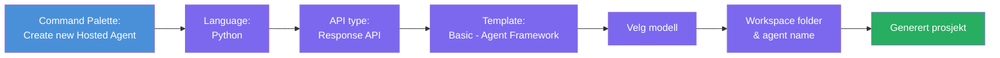
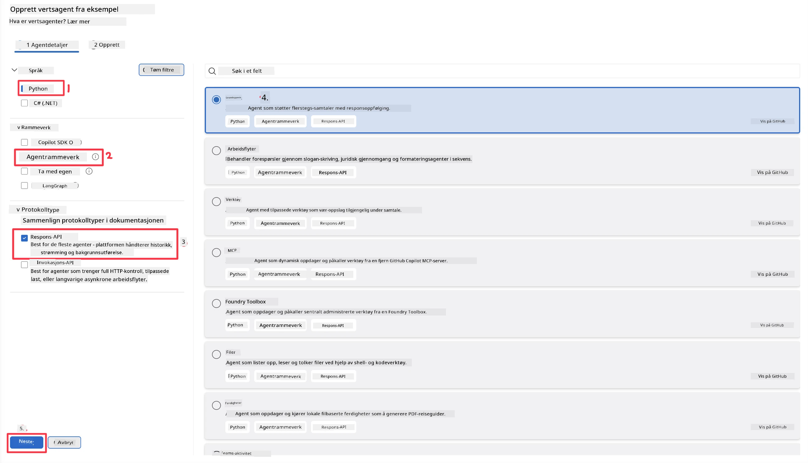
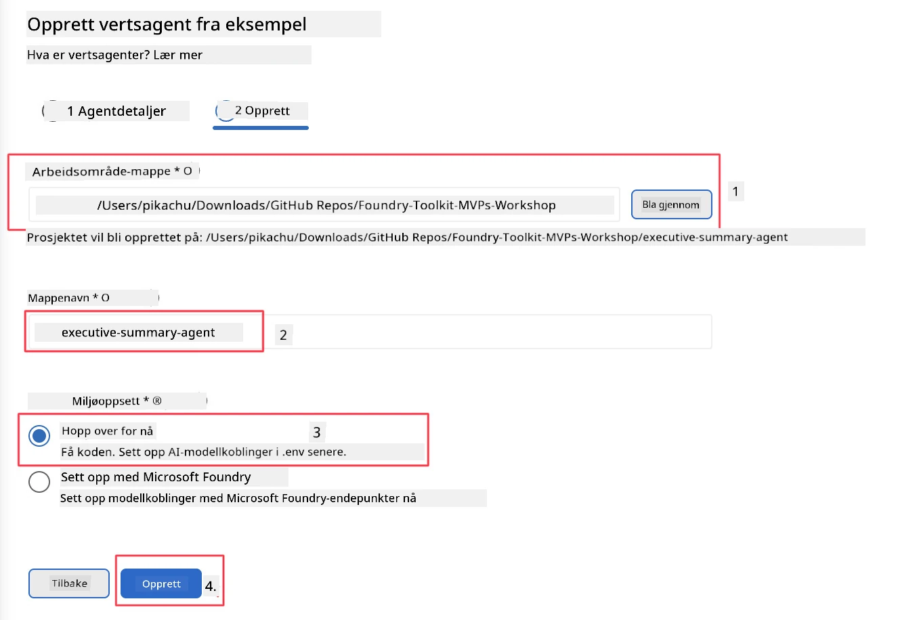

# Modul 2 - Opprett en ny hostet agent

⏱️ ~5 min

I denne modulen bruker du Foundry Toolkit til å **støtte et hostet agent-prosjekt**. Støtten genererer hele prosjektstrukturen - `agent.yaml`, `main.py`, `Dockerfile`, `requirements.txt` og VS Code debug-konfigurasjon - slik at du kan fokusere på å tilpasse agentens atferd.

> **Nøkkelkonsept:** Mappen `agent/` i dette laboratoriet er et eksempel på hva Foundry Toolkit genererer. Du skriver ikke disse filene fra bunnen av.

### Støtteveiviserflyt



---

## Trinn 1: Åpne veiviseren for opprettelse av hostet agent

1. Trykk `Ctrl+Shift+P` for å åpne **Kommando-paletten**.
2. Skriv: **Foundry Toolkit: Create new Hosted Agent** og velg den.

> **Alternativ: Opprett via Foundry Portal**
> Hvis du foretrekker nettleseren, kan du opprette prosjektet ditt på [https://ai.azure.com](https://ai.azure.com). Når prosjektet er tilrettelagt, gå tilbake til VS Code og bruk **Foundry Toolkit**-sidepanelet for å koble til det.

> **Alternativ:** Klikk på **+**-ikonet ved siden av **Hosted Agents (Preview)** i Foundry Toolkit-sidepanelet.

## Trinn 2: Velg innstillinger



1. I venstre navigasjons-/valgseksjon velg følgende:

| Meny | Valg | Notater |
|--------|-----------|-------|
| **Språk** | Python | C# støttes også |
| **Rammeverk** | Agent Framework | Enkelt utgangspunkt ved bruk av Agent Framework SDK |
| **API-type** | Response API | `POST /responses` - konverserende, med plattformadministrert historikk |
| **Mal** | Basic | Enkelt utgangspunkt ved bruk av Agent Framework SDK |

2. Når valgt, klikk **Neste**



3. I neste vindu velg følgende:

| Meny | Valg | Notater |
|--------|-----------|-------|
| **Arbeidsmappe** | Velg en målmapppe | f.eks. `/workspace/Foundry_Toolkit_for_VSCode_Lab/` eller en undermappe i dette repoet |
| **Agentnavn** | Skriv inn et navn | f.eks. `executive-summary-agent` |
| **Miljøoppsett** | hopp over oppsett for nå |  |

Klikk **create** for å opprette agenten vår. En ny mappe vil bli opprettet med navnet på den hostede agenten.

## Trinn 3: Undersøk det genererte prosjektet

Etter at støtten er fullført, sjekk at du ser disse filene i Utforskeren (`Ctrl+Shift+E`):

```
📂 my-agent/
├── .env                ← Environment variables (placeholders)
├── .vscode/
│   ├── launch.json     ← Debug config (F5 → run + Agent Inspector)
│   └── tasks.json      ← VS Code task definitions
├── agent.yaml          ← Agent definition (kind: hosted)
├── Dockerfile          ← Container config for deployment
├── main.py             ← Agent entry point (your main code)
└── requirements.txt    ← Python dependencies
```

### Forklaring av nøkkelfiler

| Fil | Formål |
|------|---------|
| `agent.yaml` | Deklarerer agenten som `kind: hosted`, kartlegger miljøvariabler, definerer `/responses`-protokollen |
| `main.py` | Oppretter en `FoundryChatClient` → pakker den inn i en `Agent` med instruksjoner → betjener via `ResponsesHostServer` på port 8088 |
| `Dockerfile` | Bruker `python:3.12-slim`, installerer avhengigheter, eksponerer port 8088, kjører `main.py` |
| `requirements.txt` | `agent-framework-foundry`, `agent-framework-foundry-hosting`, `mcp`, `debugpy` |

> **Viktig:** Åpne den støttede agentmappen direkte i VS Code (selve `agent/`-mappen) slik at `.vscode/launch.json` og `tasks.json` fungerer korrekt for F5-debugging.

---

### ✅ Sjekkpunkter

- [ ] Støttet prosjekt opprettet med alle forventede filer
- [ ] `agent.yaml` viser `kind: hosted` og `protocol: responses`
- [ ] `main.py` importerer `Agent`, `FoundryChatClient`, `ResponsesHostServer`
- [ ] Agent-mappen er åpnet i VS Code som arbeidsromets rot

---

**Forrige:** [01 - Setup](01-setup.md) · **Neste:** [03 - Konfigurer & koding →](03-configure-and-code.md)

---

<!-- CO-OP TRANSLATOR DISCLAIMER START -->
**Ansvarsfraskrivelse**:
Dette dokumentet er oversatt ved hjelp av AI-oversettelsestjenesten [Co-op Translator](https://github.com/Azure/co-op-translator). Selv om vi streber etter nøyaktighet, vær oppmerksom på at automatiske oversettelser kan inneholde feil eller unøyaktigheter. Det opprinnelige dokumentet på originalspråket skal betraktes som den autoritative kilden. For kritisk informasjon anbefales profesjonell menneskelig oversettelse. Vi er ikke ansvarlige for eventuelle misforståelser eller feiltolkninger som oppstår ved bruk av denne oversettelsen.
<!-- CO-OP TRANSLATOR DISCLAIMER END -->