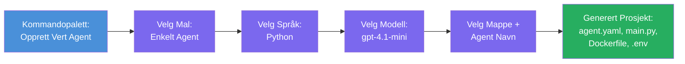

# Modul 3 - Opprett en ny hostet agent (Auto-generert av Foundry-utvidelsen)

I denne modulen bruker du Microsoft Foundry-utvidelsen for å **generere et nytt [hostet agent](https://learn.microsoft.com/azure/foundry/agents/concepts/hosted-agents)-prosjekt**. Utvidelsen genererer hele prosjektstrukturen for deg - inkludert `agent.yaml`, `main.py`, `Dockerfile`, `requirements.txt`, en `.env`-fil og en VS Code-debuggkonfigurasjon. Etter genereringen tilpasser du disse filene med agentens instruksjoner, verktøy og konfigurasjon.

> **Nøkkelkonsept:** `agent/`-mappen i dette laboratoriet er et eksempel på hva Foundry-utvidelsen genererer når du kjører denne scaffold-kommandoen. Du skriver ikke disse filene fra bunnen av – utvidelsen lager dem, og så endrer du dem.

### Scaffold-veiviseren


---

## Steg 1: Åpne veiviseren for å opprette hostet agent

1. Trykk `Ctrl+Shift+P` for å åpne **Command Palette**.
2. Skriv: **Microsoft Foundry: Create a New Hosted Agent** og velg den.
3. Veiviseren for opprettelse av hostet agent åpnes.

> **Alternativ vei:** Du kan også komme til denne veiviseren fra Microsoft Foundry-sidepanelet → klikk **+**-ikonet ved siden av **Agents** eller høyreklikk og velg **Create New Hosted Agent**.

---

## Steg 2: Velg mal

Veiviseren ber deg velge en mal. Du vil se alternativer som:

| Mal | Beskrivelse | Når brukes den |
|-----|-------------|----------------|
| **Enkeltagent** | En agent med egen modell, instruksjoner og valgfrie verktøy | Dette workshop (Lab 01) |
| **Multi-Agent-arbeidsflyt** | Flere agenter som samarbeider sekvensielt | Lab 02 |

1. Velg **Enkeltagent**.
2. Klikk **Neste** (eller valget fortsetter automatisk).

---

## Steg 3: Velg programmeringsspråk

1. Velg **Python** (anbefalt for dette workshopen).
2. Klikk **Neste**.

> **C# støttes også** hvis du foretrekker .NET. Scaffold-strukturen er lik (bruker `Program.cs` istedenfor `main.py`).

---

## Steg 4: Velg modell

1. Veiviseren viser modellene som er distribuert i ditt Foundry-prosjekt (fra Modul 2).
2. Velg modellen du distribuerte - f.eks. **gpt-4.1-mini**.
3. Klikk **Neste**.

> Hvis du ikke ser noen modeller, gå tilbake til [Modul 2](02-create-foundry-project.md) og distribuer en først.

---

## Steg 5: Velg mappeplassering og agentnavn

1. En fil-dialog åpnes - velg en **målmappe** der prosjektet skal opprettes. For dette workshopen:
   - Hvis du starter helt fra bunnen: velg hvilken som helst mappe (f.eks. `C:\Projects\my-agent`)
   - Hvis du jobber innenfor workshop-repoet: opprett en ny undermappe under `workshop/lab01-single-agent/agent/`
2. Skriv inn et **navn** for den hostede agenten (f.eks. `executive-summary-agent` eller `my-first-agent`).
3. Klikk **Create** (eller trykk Enter).

---

## Steg 6: Vent til genereringen er ferdig

1. VS Code åpner et **nytt vindu** med det genererte prosjektet.
2. Vent noen sekunder til prosjektet er helt lastet.
3. Du skal se følgende filer i Utforsker-panelet (`Ctrl+Shift+E`):

```
📂 my-first-agent/
├── .env                ← Environment variables (auto-generated with placeholders)
├── .vscode/
│   └── launch.json     ← Debug configuration (F5 to run + Agent Inspector)
├── agent.yaml          ← Agent definition (kind: hosted)
├── Dockerfile          ← Container configuration for deployment
├── main.py             ← Agent entry point (your main code file)
└── requirements.txt    ← Python dependencies
```

> **Dette er samme struktur som `agent/`-mappen** i dette laboratoriet. Foundry-utvidelsen genererer disse filene automatisk – du trenger ikke lage dem manuelt.

> **Workshop-merknad:** I dette workshop-repositoriet ligger `.vscode/`-mappen i **arbeidsområde-rot** (ikke inne i hvert prosjekt). Den inneholder en delt `launch.json` og `tasks.json` med to debuggkonfigurasjoner - **"Lab01 - Single Agent"** og **"Lab02 - Multi-Agent"** - hver peker til riktig labs `cwd`. Når du trykker F5, velger du konfigurasjonen som passer til labben du jobber på i nedtrekksmenyen.

---

## Steg 7: Forstå hver generert fil

Ta et øyeblikk til å undersøke hver fil veiviseren opprettet. Å forstå dem er viktig for Modul 4 (tilpasning).

### 7.1 `agent.yaml` - Agentdefinisjon

Åpne `agent.yaml`. Den ser slik ut:

```yaml
# yaml-language-server: $schema=https://raw.githubusercontent.com/microsoft/AgentSchema/refs/heads/main/schemas/v1.0/ContainerAgent.yaml

kind: hosted
name: my-first-agent
description: >
  A hosted agent deployed to Microsoft Foundry Agent Service.
metadata:
  authors:
    - Microsoft
  tags:
    - Azure AI AgentServer
    - Microsoft Agent Framework
    - Hosted Agent
protocols:
  - protocol: responses
    version: v1
environment_variables:
  - name: AZURE_AI_PROJECT_ENDPOINT
    value: ${PROJECT_ENDPOINT}
  - name: AZURE_AI_MODEL_DEPLOYMENT_NAME
    value: ${MODEL_DEPLOYMENT_NAME}
dockerfile_path: Dockerfile
resources:
  cpu: '0.25'
  memory: 0.5Gi
```

**Viktige felt:**

| Felt | Formål |
|-------|---------|
| `kind: hosted` | Angir at dette er en hostet agent (container-basert, distribuert til [Foundry Agent Service](https://learn.microsoft.com/azure/foundry/agents/overview)) |
| `protocols: responses v1` | Agenten eksponerer OpenAI-kompatibelt `/responses` HTTP-endepunkt |
| `environment_variables` | Kobler `.env`-verdier til containerens miljøvariabler ved distribusjon |
| `dockerfile_path` | Pekere til Dockerfilen som brukes for å bygge containerbildet |
| `resources` | CPU- og minnetildeling for containeren (0.25 CPU, 0.5Gi minne) |

### 7.2 `main.py` - Agentens inngangspunkt

Åpne `main.py`. Dette er hoved-Python-filen hvor agentlogikken din bor. Scaffoldet inkluderer:

```python
from agent_framework.azure import AzureAIAgentClient
from azure.ai.agentserver.agentframework import from_agent_framework
from azure.identity.aio import DefaultAzureCredential
```

**Viktige imports:**

| Import | Formål |
|--------|--------|
| `AzureAIAgentClient` | Kobler til ditt Foundry-prosjekt og lager agenter via `.as_agent()` |
| [`DefaultAzureCredential`](https://learn.microsoft.com/azure/developer/python/sdk/authentication/credential-chains#defaultazurecredential-overview) | Håndterer autentisering (Azure CLI, VS Code pålogging, managed identity eller tjenestepålogging) |
| `from_agent_framework` | Pakker agenten som en HTTP-server som eksponerer `/responses`-endepunktet |

Hovedflyten er:
1. Opprett et credential → opprett en klient → kall `.as_agent()` for å få en agent (async context manager) → pakk den som en server → kjør

### 7.3 `Dockerfile` - Containerbilde

```dockerfile
FROM python:3.14-slim

WORKDIR /app

COPY ./ .

RUN pip install --upgrade pip && \
    if [ -f requirements.txt ]; then \
        pip install -r requirements.txt; \
    else \
        echo "No requirements.txt found" >&2; exit 1; \
    fi

EXPOSE 8088

CMD ["python", "main.py"]
```

**Viktige detaljer:**
- Bruker `python:3.14-slim` som basebilde.
- Kopierer alle prosjektfiler til `/app`.
- Oppgraderer `pip`, installerer avhengigheter fra `requirements.txt` og feiler raskt hvis filen mangler.
- **Eksponerer port 8088** - dette er påkrevd port for hostede agenter. Ikke endre den.
- Starter agenten med `python main.py`.

### 7.4 `requirements.txt` - Avhengigheter

```
agent-framework-azure-ai==1.0.0rc3
agent-framework-core==1.0.0rc3
azure-ai-agentserver-agentframework==1.0.0b16
azure-ai-agentserver-core==1.0.0b16
debugpy
agent-dev-cli
```

| Pakke | Formål |
|--------|--------|
| `agent-framework-azure-ai` | Azure AI-integrasjon for Microsoft Agent Framework |
| `agent-framework-core` | Kjerne-runtime for å bygge agenter (inkluderer `python-dotenv`) |
| `azure-ai-agentserver-agentframework` | Hostet agentserver-runtime for Foundry Agent Service |
| `azure-ai-agentserver-core` | Kjerne-agentserver-abstraksjoner |
| `debugpy` | Python-debuggestøtte (gir F5-debugging i VS Code) |
| `agent-dev-cli` | Lokal utviklings-CLI for å teste agenter (brukes av debugg/kjør-konfigurasjonen) |

---

## Forstå agentprotokollen

Hostede agenter kommuniserer via **OpenAI Responses API**-protokollen. Når den kjører (lokalt eller i skyen), eksponerer agenten et enkelt HTTP-endepunkt:

```
POST http://localhost:8088/responses
Content-Type: application/json

{
  "input": "Your prompt here",
  "stream": false
}
```

Foundry Agent Service kaller dette endepunktet for å sende brukerforespørsler og motta agentens svar. Dette er samme protokoll som OpenAI API bruker, så agenten din er kompatibel med hvilken som helst klient som bruker OpenAI Responses-formatet.

---

### Kontrollpunkt

- [ ] Veiviseren fullførte uten feil og et **nytt VS Code-vindu** åpnet
- [ ] Du kan se alle 5 filene: `agent.yaml`, `main.py`, `Dockerfile`, `requirements.txt`, `.env`
- [ ] `.vscode/launch.json`-filen finnes (gir F5-debugging - i denne workshop ligger den i arbeidsområdets rot med lab-spesifikke konfigurasjoner)
- [ ] Du har lest gjennom hver fil og forstår formålet deres
- [ ] Du forstår at port `8088` er påkrevd og at `/responses`-endepunktet er protokollen

---

**Forrige:** [02 - Opprett Foundry-prosjekt](02-create-foundry-project.md) · **Neste:** [04 - Konfigurer & Kode →](04-configure-and-code.md)

---

<!-- CO-OP TRANSLATOR DISCLAIMER START -->
**Ansvarsfraskrivelse**:  
Dette dokumentet er oversatt ved hjelp av AI-oversettelsestjenesten [Co-op Translator](https://github.com/Azure/co-op-translator). Selv om vi streber etter nøyaktighet, vennligst vær oppmerksom på at automatiske oversettelser kan inneholde feil eller unøyaktigheter. Det opprinnelige dokumentet på dets morsmål bør anses som den autoritative kilden. For kritisk informasjon anbefales profesjonell menneskelig oversettelse. Vi er ikke ansvarlige for eventuelle misforståelser eller feiltolkninger som oppstår ved bruk av denne oversettelsen.
<!-- CO-OP TRANSLATOR DISCLAIMER END -->