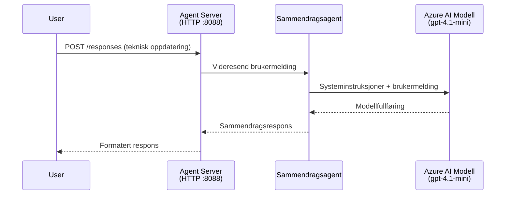
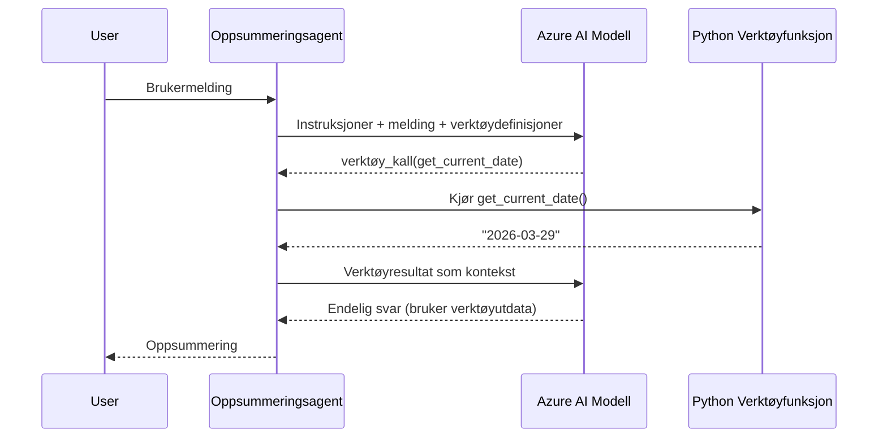

# Modul 4 - Konfigurer instruksjoner, miljø og installer avhengigheter

I denne modulen tilpasser du de automatisk opprettede agentfilene fra Modul 3. Her forvandler du det generiske rammeverket til **din** agent – ved å skrive instruksjoner, sette miljøvariabler, eventuelt legge til verktøy og installere avhengigheter.

> **Påminnelse:** Foundry-utvidelsen genererte prosjektfilene dine automatisk. Nå endrer du dem. Se [`agent/`](../../../../../workshop/lab01-single-agent/agent) mappen for et komplett fungerende eksempel på en tilpasset agent.

---

## Hvordan komponentene henger sammen

### Forespørsel livssyklus (enkel agent)


> **Med verktøy:** Hvis agenten har registrerte verktøy, kan modellen returnere et verktøy-kall i stedet for en direkte fullføring. Rammeverket kjører verktøyet lokalt, sender resultatet tilbake til modellen, som deretter genererer det endelige svaret.


---

## Steg 1: Konfigurer miljøvariabler

Rammen opprettet en `.env` fil med plassholderverdier. Du må fylle inn de reelle verdiene fra Modul 2.

1. Åpne **`.env`**-filen i prosjektet ditt (den ligger i rotmappen).
2. Erstatt plassholderverdiene med dine faktiske Foundry-prosjektdetaljer:

   ```env
   PROJECT_ENDPOINT=https://<your-account>.services.ai.azure.com/api/projects/<your-project>
   MODEL_DEPLOYMENT_NAME=gpt-4.1-mini
   ```

3. Lagre filen.

### Hvor finner du disse verdiene

| Verdi | Hvordan finne |
|-------|---------------|
| **Prosjektendepunkt** | Åpne **Microsoft Foundry**-sidepanelet i VS Code → klikk på prosjektet ditt → endepunkt-URL vises i detaljvisningen. Den ser slik ut: `https://<account-name>.services.ai.azure.com/api/projects/<project-name>` |
| **Modelldistribusjonsnavn** | I Foundry-sidepanelet, utvid prosjektet ditt → se under **Models + endpoints** → navnet står ved siden av distribuert modell (f.eks., `gpt-4.1-mini`) |

> **Sikkerhet:** Aldri sjekk inn `.env`-filen i versjonskontroll. Den er allerede inkludert i `.gitignore` som standard. Hvis ikke, legg den til selv:
> ```
> .env
> ```

### Hvordan miljøvariabler flyter

Kartleggingskjeden er: `.env` → `main.py` (leser via `os.getenv`) → `agent.yaml` (kartlegger til containerens miljøvariabler ved distribusjon).

I `main.py` leser rammen disse verdiene slik:

```python
PROJECT_ENDPOINT = os.getenv("AZURE_AI_PROJECT_ENDPOINT") or os.getenv("PROJECT_ENDPOINT")
MODEL_DEPLOYMENT_NAME = os.getenv("AZURE_AI_MODEL_DEPLOYMENT_NAME", os.getenv("MODEL_DEPLOYMENT_NAME", "gpt-4.1-mini"))
```

Både `AZURE_AI_PROJECT_ENDPOINT` og `PROJECT_ENDPOINT` aksepteres (men `agent.yaml` bruker `AZURE_AI_*` prefikset).

---

## Steg 2: Skriv agentinstruksjoner

Dette er det viktigste tilpasningssteget. Instruksjonene definerer agentens personlighet, oppførsel, utdataformat og sikkerhetsbegrensninger.

1. Åpne `main.py` i prosjektet ditt.
2. Finn instruksjons-strengen (rammeverket inkluderer en standard/generisk).
3. Bytt den ut med detaljerte, strukturerte instruksjoner.

### Hva gode instruksjoner inkluderer

| Komponent | Formål | Eksempel |
|-----------|--------|----------|
| **Rolle** | Hva agenten er og gjør | "Du er en utgiftsoppsummeringsagent" |
| **Målgruppe** | Hvem svarene er for | "Seniorledere med begrenset teknisk bakgrunn" |
| **Inndata definisjon** | Hvilke typer oppfordringer den håndterer | "Tekniske hendelsesrapporter, operasjonelle oppdateringer" |
| **Utdataformat** | Eksakt struktur for svarene | "Utgiftsoppsummering: - Hva skjedde: ... - Forretningspåvirkning: ... - Neste steg: ..." |
| **Regler** | Begrensninger og refusjonsbetingelser | "Ikke legg til informasjon utover det som ble gitt" |
| **Sikkerhet** | Forhindre misbruk og hallusinasjoner | "Hvis inndata er uklar, be om en avklaring" |
| **Eksempler** | Inndata/utdata-par for å styre oppførsel | Inkluder 2-3 eksempler med varierte inndata |

### Eksempel: Instruksjoner for utgiftsoppsummeringsagent

Her er instruksjonene brukt i workshopens [`agent/main.py`](../../../../../workshop/lab01-single-agent/agent/main.py):

```python
AGENT_INSTRUCTIONS = """You are an "Explain Like I'm an Executive" agent.

Purpose:
Your job is to translate complex technical or operational information into
clear, concise, and outcome-focused summaries that can be easily understood
by non-technical executives.

Audience:
Senior leaders with limited technical background who care about impact,
risk, and what happens next.

What you must do:
- Rephrase the input so it is understandable to a non-technical audience
- Prioritize clarity, brevity, and outcomes over technical accuracy
- Remove technical jargon, logs, metrics, stack traces, and deep root-cause details
- Translate technical causes into simple cause-and-effect statements
- Explicitly call out business impact
- Always include a clear next step or action
- Maintain a neutral, factual, and calm executive tone
- Do NOT add new facts or speculate beyond the input

Standard Output Structure (always use this wording):

Executive Summary:
- What happened: <plain-language description>
- Business impact: <clear, non-technical impact>
- Next step: <clear action or mitigation>

Rules:
- Keep responses under 100 words
- Do NOT add facts beyond the input
- If input is unclear, ask for clarification
"""
```

4. Bytt ut instruksjons-strengen i `main.py` med dine egne instruksjoner.
5. Lagre filen.

---

## Steg 3: (Valgfritt) Legg til egendefinerte verktøy

Hosted-agenter kan kjøre **lokale Python-funksjoner** som [verktøy](https://learn.microsoft.com/azure/foundry/agents/concepts/tool-catalog). Dette er en viktig fordel med kodebaserte hosted-agenter over bare prompt-agenter – agenten din kan kjøre vilkårlig serverlogikk.

### 3.1 Definer en verktøyfunksjon

Legg til en verktøyfunksjon i `main.py`:

```python
from agent_framework import tool

@tool
def get_current_date() -> str:
    """Returns the current date in YYYY-MM-DD format."""
    from datetime import date
    return str(date.today())
```

`@tool`-dekortøren gjør en standard Python-funksjon til et agentverktøy. Docstringen blir verktøybeskrivelsen modellen ser.

### 3.2 Registrer verktøyet med agenten

Når du oppretter agenten via `.as_agent()` kontekstbehandleren, send verktøyet inn i `tools`-parameteren:

```python
async with AzureAIAgentClient(
    project_endpoint=PROJECT_ENDPOINT,
    model_deployment_name=MODEL_DEPLOYMENT_NAME,
    credential=credential,
).as_agent(
    name="my-agent",
    instructions=AGENT_INSTRUCTIONS,
    tools=[get_current_date],
) as agent:
    server = from_agent_framework(agent)
    await server.run_async()
```

### 3.3 Hvordan verktøys-kall fungerer

1. Brukeren sender en prompt.
2. Modellen avgjør om et verktøy trengs (basert på prompt, instruksjoner og verktøybeskrivelser).
3. Hvis verktøy trengs, kaller rammeverket din Python-funksjon lokalt (inne i containeren).
4. Verktøyets returverdi sendes tilbake til modellen som kontekst.
5. Modellen genererer det endelige svaret.

> **Verktøy kjøres server-side** – de kjører inne i containeren din, ikke i brukerens nettleser eller modellen. Det betyr at du kan få tilgang til databaser, API-er, filsystemer eller hvilken som helst Python-bibliotek.

---

## Steg 4: Opprett og aktiver et virtuelt miljø

Før du installerer avhengigheter, opprett et isolert Python-miljø.

### 4.1 Opprett det virtuelle miljøet

Åpne en terminal i VS Code (`` Ctrl+` ``) og kjør:

```powershell
python -m venv .venv
```

Dette oppretter en `.venv`-mappe i prosjektmappen din.

### 4.2 Aktiver det virtuelle miljøet

**PowerShell (Windows):**

```powershell
.\.venv\Scripts\Activate.ps1
```

**Command Prompt (Windows):**

```cmd
.venv\Scripts\activate.bat
```

**macOS/Linux (Bash):**

```bash
source .venv/bin/activate
```

Du bør se `(.venv)` vises ved starten av terminalprompten, noe som indikerer at det virtuelle miljøet er aktivt.

### 4.3 Installer avhengigheter

Med det virtuelle miljøet aktivt, installer de nødvendige pakkene:

```powershell
pip install -r requirements.txt
```

Dette installerer:

| Pakke | Formål |
|---------|---------|
| `agent-framework-azure-ai==1.0.0rc3` | Azure AI-integrasjon for [Microsoft Agent Framework](https://learn.microsoft.com/agent-framework/overview/) |
| `agent-framework-core==1.0.0rc3` | Kjernetid for å bygge agenter (inkluderer `python-dotenv`) |
| `azure-ai-agentserver-agentframework==1.0.0b16` | Hosted agent server runtime for [Foundry Agent Service](https://learn.microsoft.com/azure/foundry/agents/overview) |
| `azure-ai-agentserver-core==1.0.0b16` | Kjerneabstraksjoner for agentserver |
| `debugpy` | Python debugging (aktiverer F5-debugging i VS Code) |
| `agent-dev-cli` | Lokal utviklings-CLI for testing av agenter |

### 4.4 Verifiser installasjon

```powershell
pip list | Select-String "agent-framework|agentserver"
```

Forventet utdata:
```
agent-framework-azure-ai   1.0.0rc3
agent-framework-core       1.0.0rc3
azure-ai-agentserver-agentframework 1.0.0b16
azure-ai-agentserver-core  1.0.0b16
```

---

## Steg 5: Verifiser autentisering

Agenten bruker [`DefaultAzureCredential`](https://learn.microsoft.com/azure/developer/python/sdk/authentication/credential-chains#defaultazurecredential-overview) som forsøker flere autentiseringsmetoder i denne rekkefølgen:

1. **Miljøvariabler** – `AZURE_CLIENT_ID`, `AZURE_TENANT_ID`, `AZURE_CLIENT_SECRET` (service-principal)
2. **Azure CLI** – bruker din `az login`-sesjon
3. **VS Code** – bruker kontoen du er logget inn i VS Code med
4. **Managed Identity** – brukes når den kjører i Azure (ved distribusjon)

### 5.1 Verifiser for lokal utvikling

Minst én av disse bør fungere:

**Alternativ A: Azure CLI (anbefalt)**

```powershell
az account show --query "{name:name, id:id}" --output table
```

Forventet: Viser navnet og ID på abonnementet ditt.

**Alternativ B: VS Code pålogging**

1. Se nede til venstre i VS Code etter **Kontoer**-ikonet.
2. Hvis du ser navn på kontoen din, er du autentisert.
3. Hvis ikke, klikk på ikonet → **Logg inn for å bruke Microsoft Foundry**.

**Alternativ C: Service principal (for CI/CD)**

```powershell
$env:AZURE_TENANT_ID = "<your-tenant-id>"
$env:AZURE_CLIENT_ID = "<your-client-id>"
$env:AZURE_CLIENT_SECRET = "<your-client-secret>"
```

### 5.2 Vanlig autentiseringsproblem

Hvis du er logget inn på flere Azure-kontoer, sørg for at riktig abonnement er valgt:

```powershell
az account set --subscription "<your-subscription-id>"
```

---

### Sjekkliste

- [ ] `.env`-filen har gyldige `PROJECT_ENDPOINT` og `MODEL_DEPLOYMENT_NAME` (ikke plassholdere)
- [ ] Agentinstruksjonene er tilpasset i `main.py` - de definerer rolle, målgruppe, utdataformat, regler og sikkerhetsbegrensninger
- [ ] (Valgfritt) Egne verktøy er definert og registrert
- [ ] Virtuelt miljø er opprettet og aktivert (`(.venv)` synlig i terminalprompt)
- [ ] `pip install -r requirements.txt` fullføres uten feil
- [ ] `pip list | Select-String "azure-ai-agentserver"` viser at pakken er installert
- [ ] Autentisering er gyldig – `az account show` returnerer abonnementet ditt ELLER du er innlogget i VS Code

---

**Forrige:** [03 - Lag Hosted Agent](03-create-hosted-agent.md) · **Neste:** [05 - Test Lokalt →](05-test-locally.md)

---

<!-- CO-OP TRANSLATOR DISCLAIMER START -->
**Ansvarsfraskrivelse**:
Dette dokumentet er oversatt ved hjelp av AI-oversettelsestjenesten [Co-op Translator](https://github.com/Azure/co-op-translator). Selv om vi streber etter nøyaktighet, vennligst vær oppmerksom på at automatiserte oversettelser kan inneholde feil eller unøyaktigheter. Det originale dokumentet på dets opprinnelige språk skal anses som den autoritative kilden. For kritisk informasjon anbefales profesjonell menneskelig oversettelse. Vi påtar oss ikke ansvar for eventuelle misforståelser eller feiltolkninger som oppstår ved bruk av denne oversettelsen.
<!-- CO-OP TRANSLATOR DISCLAIMER END -->