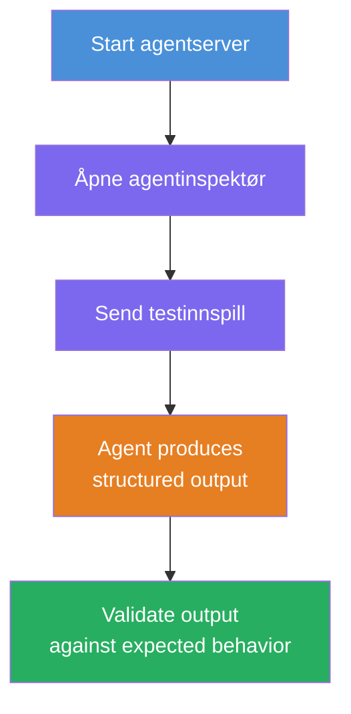
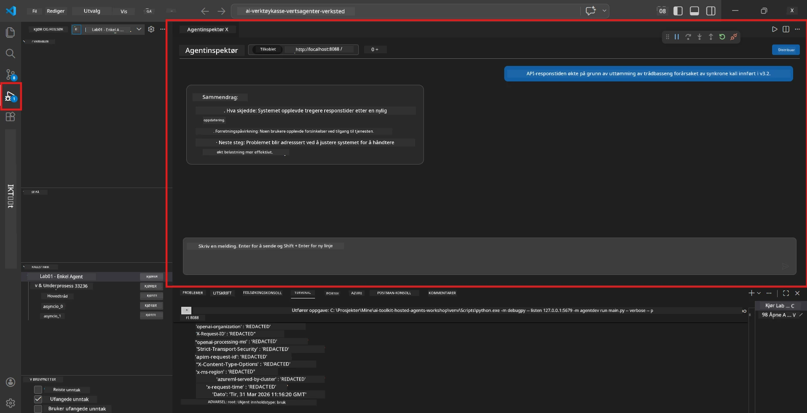
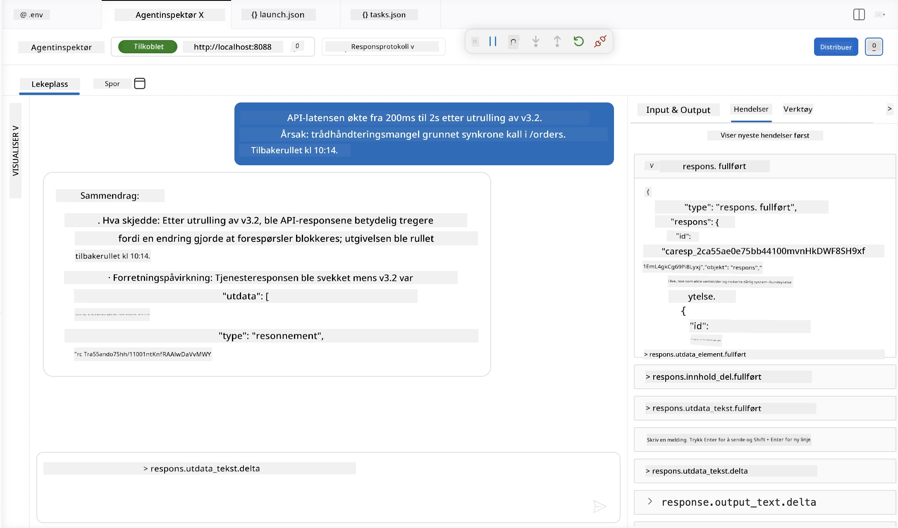

# Modul 4 - Test lokalt

⏱️ ~10 min

I denne modulen kjører du agenten din lokalt og validerer at den fungerer korrekt ved å bruke **happy-path funksjonstester**. Du vil bruke Agent Inspector (visuelt grensesnitt) eller direkte HTTP-kall for å bekrefte at agenten produserer strukturerte, nøyaktige svar.

### Lokal testflyt



---

## Alternativ 1: Trykk F5 - Feilsøk med Agent Inspector (anbefalt)

### Start feilsøkeren

1. Åpne **executive-summary-agent/**-mappen direkte i VS Code (`Fil → Åpne mappe`).
2. Åpne **Kjør og Feilsøk**-panelet (`Ctrl+Shift+D`).
3. Velg **Debug Local Agent Server** fra nedtrekksmenyen.
4. Trykk **F5** (eller klikk ▶ Start feilsøking).

> ⚠️ **Kritisk: Velg din Python-tolk**
> Hvis du får "ModuleNotFoundError" eller feilsøkeren ikke starter, må du fortelle VS Code å bruke ditt virtuelle miljø:
  > 1. Trykk `Ctrl+Shift+P` $\rightarrow$ skriv **Python: Select Interpreter**.
  > 2. Velg tolken som er plassert i prosjektets `.venv`-mappe (for eksempel `.\.venv\Scripts\python.exe` på Windows).
  > 3. Start feilsøkingsøkten på nytt.
> Hvis du fortsatt får feil, oppdater manuelt filen `tasks.json` slik:
  > 1. Naviger til `.vscode/tasks.json`-filen
  > 2. Gå til kommandoen merket: `Run Agent/Workflow HTTP Server`
  > 3. Oppdater kommandoverdien slik: `"value": "${workspaceFolder}/.venv/bin/python",`

### Hva skjer

1. HTTP-serveren starter på `http://localhost:8088/responses`.
2. **Agent Inspector**-panelet åpnes automatisk - et visuelt chattegrensesnitt for testing.
3. Breakpoints er aktivert i `main.py`.

Følg med på Terminalen for:
```
Starting executive summary hosted agent
Executive agent server running on http://localhost:8088
```

> **Hvis Agent Inspector ikke åpnes:** Trykk `Ctrl+Shift+P` → **Foundry Toolkit: Open Agent Inspector**.



> *Skjermbildet kan vise eldre 'AI TOOLKIT'-branding fra en tidligere utgave av utvidelsen.*

---

## Alternativ 2: Test via terminal (alternativ)

Start agenten i ett terminalvindu, send forespørsler fra et annet:

```bash
# Terminal 1: Start agenten
cd executive-summary-agent/
source .venv/bin/activate
python main.py
```

```bash
# Terminal 2: Send test (curl)
curl -sS -X POST http://localhost:8088/responses \
  -H "Content-Type: application/json" \
  -d '{"input": "The API latency increased due to thread pool exhaustion caused by sync calls in v3.2.", "stream": false}'
```

---

## Scenario-tester: Happy-path funksjonell validering

Kjør **alle tre** scenariene nedenfor. Disse validerer at agenten din produserer korrekt, strukturert output for realistiske input.



### Scenario 1: IT-hendelse - økning i API-latens

**Input:**
```
The API latency increased from 200ms to 2s after deploying v3.2.
Root cause: thread pool starvation from synchronous calls in /orders.
Rolled back at 10:14.
```

**Forventet oppførsel:**
- ✅ Følger "Executive Summary"-strukturen (Hva skjedde / Forretningspåvirkning / Neste steg)
- ✅ Ingen teknisk sjargong (ingen "thread pool", ingen "/orders", ingen "v3.2")
- ✅ Klart angir forretningspåvirkning (f.eks. brukere opplevde forsinkelser)
- ✅ Inkluderer et neste steg (f.eks. løsning implementert, overvåking på plass)

---

### Scenario 2: Datapipeline - ETL-feil

**Input:**
```
The nightly ETL job failed because the upstream schema changed. APAC dashboards show missing data.
```

**Forventet oppførsel:**
- ✅ Oppsummerer dataoppdateringsfeilen i vanlig språk
- ✅ Nevner APAC-dashboard-påvirkningen
- ✅ Inkluderer et utbedringssteg
- ✅ Nevner IKKE "ETL", "skjema" eller andre tekniske termer

---

### Scenario 3: Sikkerhet - Eksponert legitimasjon

**Input:**
```
Static analysis flagged a hardcoded secret in the repository.
The secret may have been exposed in commit history.
```

**Forventet oppførsel:**
- ✅ Beskriver et legitimasjons-/sikkerhetsproblem på et ledelsesvennlig språk
- ✅ Påpeker potensiell risiko (uautorisert tilgang)
- ✅ Angir utbedrende tiltak (rullering av legitimasjon, revisjon)
- ✅ Inkluderer IKKE termer som "statisk analyse", "commit-historikk" eller "hardkodet"

---

## Valideringskriterier

For hvert scenario, sjekk:

| # | Kriterium | Godkjent betingelse |
|---|----------|---------------------|
| 1 | **Struktur** | Svaret bruker "Executive Summary"-format med alle tre punkter |
| 2 | **Vanlig språk** | Ingen teknisk sjargong som en leder ikke ville forstå |
| 3 | **Nøyaktighet** | Oppsummeringen reflekterer input - ingen fabrikerte detaljer |
| 4 | **Kortfattethet** | Svaret er under 100 ord |
| 5 | **Neste steg** | En klar handling eller avbøtning er angitt |

---

## Feilsøkingstips

| Problem | Løsning |
|---------|---------|
| Agent starter ikke | Sjekk `.env`-verdier, verifiser at venv er aktivert, kjør `pip install -r requirements.txt` |
| Tomt eller generisk svar | Se gjennom instruksjoner i `main.py` - sørg for at utdataformat er spesifisert |
| Svaret inneholder sjargong | Styrk reglene for "fjern tekniske termer" i instruksjonene |
| Agent Inspector åpnes ikke | `Ctrl+Shift+P` → **Foundry Toolkit: Open Agent Inspector** |
| Modellfeil i Terminal | Verifiser at `AZURE_AI_MODEL_DEPLOYMENT_NAME` stemmer eksakt (skiller mellom store og små bokstaver) |

---

### ✅ Kontrollpunkt

- [ ] Agent starter lokalt uten feil
- [ ] Agent Inspector åpnes og viser chattegrensesnitt (hvis du bruker F5)
- [ ] **Scenario 1** (IT-hendelse) - strukturert Executive Summary, ingen sjargong
- [ ] **Scenario 2** (datapipeline) - relevant oppsummering med forretningspåvirkning
- [ ] **Scenario 3** (sikkerhetsvarsling) - passende risikokommunikasjon
- [ ] Alle svar følger definert utdata-struktur

> **Lagre svarene dine** (kopier eller ta skjermbilde) - du skal sammenligne dem med sky-resultater i Modul 06.

---

**Forrige:** [03 - Konfigurer & Kode](03-configure-and-code.md) · **Neste:** [05 - Deploy til Foundry →](05-deploy-to-foundry.md)

---

<!-- CO-OP TRANSLATOR DISCLAIMER START -->
**Ansvarsfraskrivelse**:
Dette dokumentet er oversatt ved hjelp av AI-oversettelsestjenesten [Co-op Translator](https://github.com/Azure/co-op-translator). Selv om vi streber etter nøyaktighet, vær oppmerksom på at automatiske oversettelser kan inneholde feil eller unøyaktigheter. Det opprinnelige dokumentet på originalspråket skal betraktes som den autoritative kilden. For kritisk informasjon anbefales profesjonell menneskelig oversettelse. Vi er ikke ansvarlige for eventuelle misforståelser eller feiltolkninger som oppstår ved bruk av denne oversettelsen.
<!-- CO-OP TRANSLATOR DISCLAIMER END -->