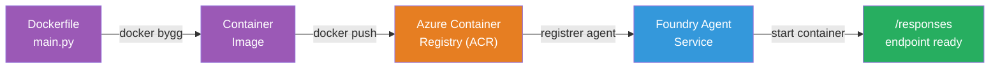
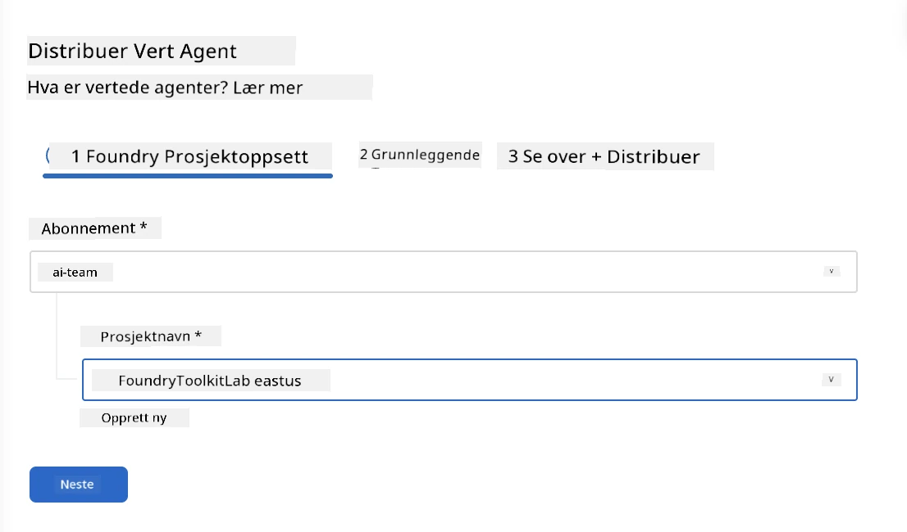
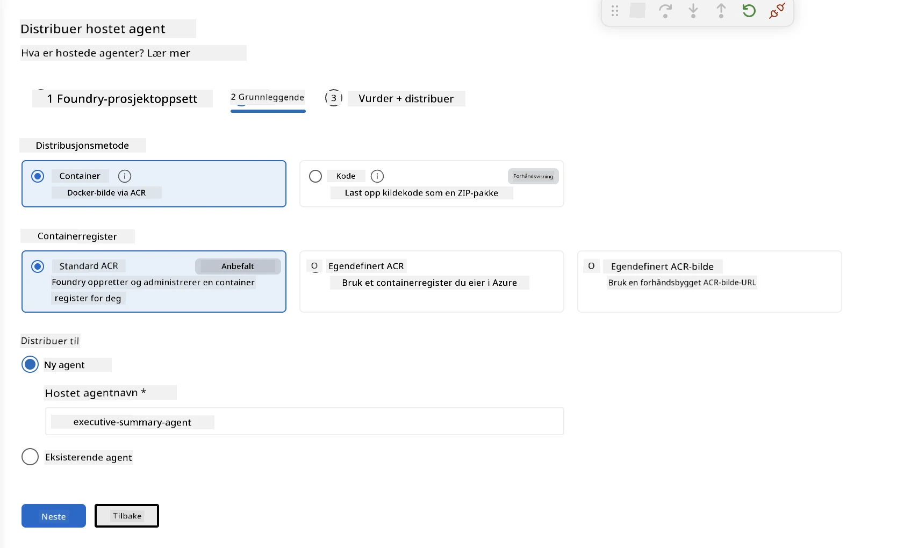
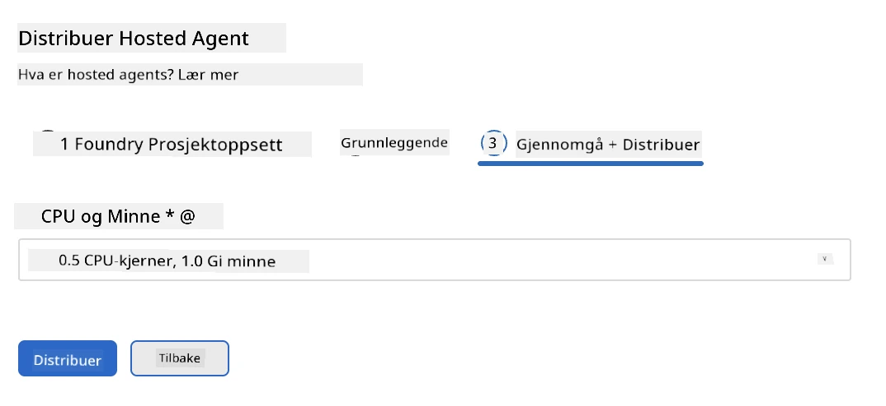
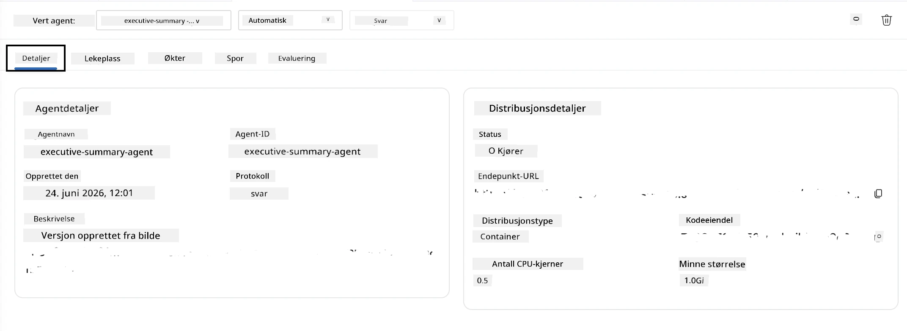

# Modul 5 - Distribuer til Foundry Agent-tjeneste

⏱️ ~10 min

> ⚠️ **Brukere i sti B:** Denne modulen krever et Foundry-abonnement. Hvis du bruker Foundry Local, hopp til [Modul 07 - Oppsummering](07-summary.md). Du har fullført den lokale utviklingsflyten!

I denne modulen distribuerer du agenten din, som er testet lokalt, til Microsoft Foundry som en **Hosted Agent**. Distribueringen bygger et containerbilde, skyver det til Azure Container Registry, og starter agenten i Foundrys administrerte infrastruktur.

### Distribusjonspipeline

---

## Sjekk av forutsetninger

Før distribusjon, verifiser:

- [ ] Agenten består alle 3 lokale scenarioer fra [Modul 04](04-test-locally.md)
- [ ] Du har **Azure AI User**-rollen på prosjektnivå ([Modul 01, Tildel RBAC](01-setup.md#deploy-a-model--assign-rbac))
- [ ] Du er pålogget Azure i VS Code (Konto-ikon viser navnet ditt)

---

## Steg 1: Start distribusjonen

### Valg A: Distribuer fra Agent Inspector (anbefalt)

Hvis Agent Inspector er åpen (fra testing):
1. Klikk på **Deploy**-knappen øverst til høyre (sky-ikon ↑).

### Valg B: Distribuer fra Kommandomeny

1. Trykk `Ctrl+Shift+P` → **Foundry Toolkit: Deploy Hosted Agent**.

---

## Steg 2: Konfigurer distribusjonen

Veiviseren spør deg om:

| Spørsmål | Valg |
|--------|-----------|
| **Abonnement** | Ditt Azure-abonnement |
| **Målprosjekt** | Ditt Foundry-prosjekt (f.eks. `workshop-agents`) |

Klikk **neste** for å konfigurere agenten din.

| Spørsmål | Valg |
|--------|-----------|
| **Distribusjonsmetode** | Container |
| **Container-register** | **Standard ACR** (Microsoft Foundry oppretter og administrerer et for deg) |
| **Distribuer til** | Ny agent (navn, `executive-summary-agent`) |

Klikk **neste** for å gjennomgå og distribuere agenten.

| Spørsmål | Valg |
|--------|-----------|
| **CPU og minne** | **0.25 CPU-kjerner, 0.5 Gi minne** (nok for workshopen) |

---

## Steg 3: Distribuer og overvåk

1. Klikk **Deploy**.
2. Se på **Utdata**-panelet (velg **Microsoft Foundry** fra rullegardinmenyen).
3. Distribusjonen går gjennom disse fasene:
   - **Docker build** - bygger container fra din Dockerfil
   - **Docker push** - skyver bildet til ACR (1–3 min ved første distribusjon)
   - **Agent-registrering** - oppretter hostet agent i Foundry
   - **Container start** - starter med system-administrert identitet

4. Når ferdig, vises en melding:
   > **my-agent er distribuert med suksess.** `Se logger` `Kjør agent`

5. Klikk **Kjør agent** for å åpne Agent Playground.

### Verdier for distribusjonsstatus

| Status | Betydning |
|--------|---------|
| **Running** | Container klar, agent responderer |
| **Pending** | Container starter - vent 30–60 sekunder |
| **Failed** | Sjekk logger (se feilsøking nedenfor) |

---

## Vanlige distribusjonsfeil

| Feil | Årsak | Løsning |
|-------|-----------|-----|
| `agents/write`-tillatelse nektet | Mangler **Azure AI User**-rolle på prosjektnivå | [Modul 01, Tildel RBAC](01-setup.md#deploy-a-model--assign-rbac) |
| Docker kjører ikke | Docker Desktop ikke startet | Start Docker Desktop → verifiser `docker info` |
| ACR-autorisering | Administrert identitet kan ikke hente bilde | Se [Modul 08 - Feilsøking](08-troubleshooting.md) |

---

### ✅ Sjekkpunkter

- [ ] Distribusjon fullført uten feil
- [ ] Agent vises under **Hosted Agents (Preview)** i Foundry sidepanelet
- [ ] Containerstatus viser **Running**
- [ ] Agent Playground-fanen åpnet og viser agentdetaljer og endepunkt-URL

---

**Forrige:** [04 - Test lokalt](04-test-locally.md) · **Neste:** [06 - Verifiser i Playground →](06-verify-in-playground.md)

---

<!-- CO-OP TRANSLATOR DISCLAIMER START -->
**Ansvarsfraskrivelse**:
Dette dokumentet er oversatt ved hjelp av AI-oversettelsestjenesten [Co-op Translator](https://github.com/Azure/co-op-translator). Selv om vi streber etter nøyaktighet, vær oppmerksom på at automatiske oversettelser kan inneholde feil eller unøyaktigheter. Det opprinnelige dokumentet på originalspråket skal betraktes som den autoritative kilden. For kritisk informasjon anbefales profesjonell menneskelig oversettelse. Vi er ikke ansvarlige for eventuelle misforståelser eller feiltolkninger som oppstår ved bruk av denne oversettelsen.
<!-- CO-OP TRANSLATOR DISCLAIMER END -->