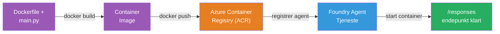
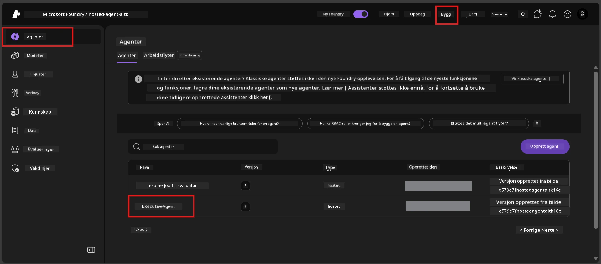

# Modul 6 - Distribuer til Foundry Agent Service

I denne modulen distribuerer du den lokalt testede agenten til Microsoft Foundry som en [**Hosted Agent**](https://learn.microsoft.com/azure/foundry/agents/concepts/hosted-agents). Distribusjonsprosessen bygger et Docker-containerbilde fra prosjektet ditt, skyver det til [Azure Container Registry (ACR)](https://learn.microsoft.com/azure/container-registry/container-registry-intro), og lager en versjon av den hostede agenten i [Foundry Agent Service](https://learn.microsoft.com/azure/foundry/agents/overview).

### Distribusjonspipeline


---

## Forutsetningssjekk

Før du distribuerer, verifiser hvert punkt nedenfor. Å hoppe over disse er den vanligste årsaken til distribusjonsfeil.

1. **Agenten består lokale røyktester:**
   - Du fullførte alle 4 testene i [Modul 5](05-test-locally.md) og agenten svarte riktig.

2. **Du har [Azure AI User](https://learn.microsoft.com/azure/foundry/concepts/rbac-foundry#built-in-roles) rolle:**
   - Denne ble tildelt i [Modul 2, trinn 3](02-create-foundry-project.md). Hvis du er usikker, verifiser nå:
   - Azure-portalen → ditt Foundry **prosjekt**-ressurs → **Kontroll for tilgang (IAM)** → fanen **Rolleoppdrag** → søk etter navnet ditt → bekreft at **Azure AI User** er oppført.

3. **Du er logget inn i Azure i VS Code:**
   - Sjekk Konto-ikonet nederst til venstre i VS Code. Kontonavnet ditt skal være synlig.

4. **(Valgfritt) Docker Desktop kjører:**
   - Docker trengs bare hvis Foundry-utvidelsen ber deg om å bygge lokalt. I de fleste tilfeller håndterer utvidelsen containerbygg automatisk under distribusjonen.
   - Hvis du har Docker installert, verifiser at det kjører: `docker info`

---

## Trinn 1: Start distribusjonen

Du har to måter å distribuere på - begge leder til samme resultat.

### Alternativ A: Distribuer fra Agent Inspector (anbefalt)

Hvis du kjører agenten med debuggeren (F5) og Agent Inspector er åpen:

1. Se på **øverst til høyre** i Agent Inspector-panelet.
2. Klikk på **Deploy**-knappen (skyikon med en pil opp ↑).
3. Distribusjonsveiviseren åpnes.

### Alternativ B: Distribuer fra Kommandopaletten

1. Trykk `Ctrl+Shift+P` for å åpne **Kommandopaletten**.
2. Skriv: **Microsoft Foundry: Deploy Hosted Agent** og velg det.
3. Distribusjonsveiviseren åpnes.

---

## Trinn 2: Konfigurer distribusjonen

Distribusjonsveiviseren leder deg gjennom konfigurasjonen. Fyll ut hvert spørsmål:

### 2.1 Velg målprosjektet

1. En nedtrekksliste viser Foundry-prosjektene dine.
2. Velg prosjektet du opprettet i Modul 2 (f.eks. `workshop-agents`).

### 2.2 Velg container agentfil

1. Du blir bedt om å velge agentens inngangspunkt.
2. Velg **`main.py`** (Python) - denne filen bruker veiviseren for å identifisere agentprosjektet ditt.

### 2.3 Konfigurer ressurser

| Innstilling | Anbefalt verdi | Notater |
|-------------|----------------|---------|
| **CPU**     | `0.25`         | Standard, tilstrekkelig for workshop. Øk for produksjonsarbeidslaster |
| **Minne**   | `0.5Gi`        | Standard, tilstrekkelig for workshop |

Disse samsvarer med verdiene i `agent.yaml`. Du kan godta standardinnstillingene.

---

## Trinn 3: Bekreft og distribuer

1. Veiviseren viser en distribusjonssammendrag med:
   - Målprosjektets navn
   - Agentnavn (fra `agent.yaml`)
   - Containerfil og ressurser
2. Gå gjennom sammendraget og klikk **Confirm and Deploy** (eller **Deploy**).
3. Følg fremdriften i VS Code.

### Hva skjer under distribusjonen (trinn for trinn)

Distribusjonen er en flerstegsprosess. Se VS Code **Output**-panelet (velg "Microsoft Foundry" fra nedtrekkslisten) for å følge med:

1. **Docker build** - VS Code bygger et Docker containerbilde fra din `Dockerfile`. Du vil se Docker-lagmeldinger:
   ```
   Step 1/6 : FROM python:<version>-slim
   Step 2/6 : WORKDIR /app
   ...
   Successfully built abc123def456
   ```

2. **Docker push** - Bildet skyves til **Azure Container Registry (ACR)** knyttet til Foundry-prosjektet ditt. Dette kan ta 1-3 minutter ved første distribusjon (basebildet er >100MB).

3. **Agentregistering** - Foundry Agent Service oppretter en ny hostet agent (eller en ny versjon hvis agenten allerede finnes). Agentmetadata fra `agent.yaml` brukes.

4. **Containerstart** - Containeren starter i Foundrys administrerte infrastruktur. Plattformen tildeler en [systemadministrert identitet](https://learn.microsoft.com/azure/foundry/agents/concepts/agent-identity) og eksponerer `/responses` endepunktet.

> **Første distribusjon er tregere** (Docker må skyve alle lag). Påfølgende distribusjoner går raskere fordi Docker cacher uendrede lag.

---

## Trinn 4: Verifiser distribusjonsstatus

Når distribusjonskommandoen er fullført:

1. Åpne **Microsoft Foundry** sidepanelet ved å klikke på Foundry-ikonet i Aktivitetslinjen.
2. Utvid **Hosted Agents (Preview)**-seksjonen under prosjektet ditt.
3. Du skal se agentnavnet ditt (f.eks. `ExecutiveAgent` eller navnet fra `agent.yaml`).
4. **Klikk på agentnavnet** for å utvide det.
5. Du vil se en eller flere **versjoner** (f.eks. `v1`).
6. Klikk på versjonen for å se **Containerdetaljer**.
7. Sjekk feltet **Status**:

   | Status   | Betydning                     |
   |----------|-------------------------------|
   | **Started** eller **Running** | Containeren kjører og agenten er klar |
   | **Pending**                  | Container starter opp (vent 30-60 sekunder) |
   | **Failed**                  | Containeren klarte ikke å starte (sjekk logger - se feilsøking nedenfor) |



> **Hvis du ser "Pending" i mer enn 2 minutter:** Containeren kan holde på å hente basebildet. Vent litt lenger. Hvis det forblir pending, sjekk containerloggene.

---

## Vanlige distribusjonsfeil og løsninger

### Feil 1: Tillatelse nektet - `agents/write`

```
Error: lacks the required data action 
Microsoft.CognitiveServices/accounts/AIServices/agents/write 
to perform POST /api/projects/{projectName}/assistants operation.
```

**Årsak:** Du har ikke `Azure AI User`-rollen på **prosjektnivå**.

**Løsning trinn for trinn:**

1. Åpne [https://portal.azure.com](https://portal.azure.com).
2. Søk etter ditt Foundry **prosjekt** i søkefeltet og klikk på det.
   - **Kritisk:** Sørg for at du navigerer til **prosjekt-ressursen** (type: "Microsoft Foundry project"), IKKE den overordnede konto-/hub-ressursen.
3. Klikk på **Kontroll for tilgang (IAM)** i venstremenyen.
4. Klikk **+ Legg til** → **Legg til rolleoppdrag**.
5. I fanen **Rolle**, søk etter [**Azure AI User**](https://learn.microsoft.com/azure/foundry/concepts/rbac-foundry#built-in-roles) og velg den. Klikk **Neste**.
6. I fanen **Medlemmer**, velg **Bruker, gruppe eller tjeneste-principal**.
7. Klikk **+ Velg medlemmer**, søk etter navnet/e-posten din, velg deg selv, klikk **Velg**.
8. Klikk **Gjennomgå + tilordne** → **Gjennomgå + tilordne** igjen.
9. Vent 1-2 minutter for rolleoppdraget å tre i kraft.
10. **Prøv distribusjonen på nytt** fra trinn 1.

> Rollen må være på **prosjektnivå**, ikke bare konto-nivå. Dette er den vanligste årsaken til distribusjonsfeil.

### Feil 2: Docker kjører ikke

```
Error: Docker build failed / Cannot connect to Docker daemon
```

**Løsning:**
1. Start Docker Desktop (finn det i Start-menyen eller systemstatusfeltet).
2. Vent til det viser "Docker Desktop is running" (30-60 sekunder).
3. Verifiser med: `docker info` i et terminalvindu.
4. **Spesielt for Windows:** Sørg for at WSL 2 backend er aktivert i Docker Desktop-innstillinger → **General** → **Use the WSL 2 based engine**.
5. Prøv distribusjonen på nytt.

### Feil 3: ACR-autorisering - `AcrPullUnauthorized`

```
Error: AcrPullUnauthorized
```

**Årsak:** Foundry-prosjektets administrerte identitet har ikke lesetilgang til containerregisteret.

**Løsning:**
1. I Azure-portalen, gå til din **[Container Registry](https://learn.microsoft.com/azure/container-registry/container-registry-intro)** (den er i samme ressursgruppe som Foundry-prosjektet ditt).
2. Gå til **Kontroll for tilgang (IAM)** → **Legg til** → **Legg til rolleoppdrag**.
3. Velg **[AcrPull](https://learn.microsoft.com/azure/container-registry/container-registry-roles)**-rollen.
4. Under Medlemmer, velg **Administrert identitet** → finn prosjektets administrerte identitet.
5. **Gjennomgå + tilordne**.

> Dette settes vanligvis opp automatisk av Foundry-utvidelsen. Hvis du ser denne feilen, kan det bety at den automatiske oppsettet feilet.

### Feil 4: Feil plattform for container (Apple Silicon)

Hvis du distribuerer fra en Apple Silicon Mac (M1/M2/M3), må containeren bygges for `linux/amd64`:

```bash
docker build --platform linux/amd64 -t myagent:v1 .
```

> Foundry-utvidelsen håndterer dette automatisk for de fleste brukere.

---

### Sjekkpunkter

- [ ] Distribusjonskommandoen fullført uten feil i VS Code
- [ ] Agent vises under **Hosted Agents (Preview)** i Foundry sidepanelet
- [ ] Du klikket på agenten → valgte en versjon → så **Containerdetaljer**
- [ ] Containerstatus viser **Started** eller **Running**
- [ ] (Hvis feil oppstod) Du identifiserte feilen, brukte løsningen, og distribuerte på nytt med suksess

---

**Forrige:** [05 - Test Locally](05-test-locally.md) · **Neste:** [07 - Verify in Playground →](07-verify-in-playground.md)

---

<!-- CO-OP TRANSLATOR DISCLAIMER START -->
**Ansvarsfraskrivelse**:  
Dette dokumentet er oversatt ved hjelp av AI-oversettelsestjenesten [Co-op Translator](https://github.com/Azure/co-op-translator). Selv om vi streber etter nøyaktighet, vær oppmerksom på at automatiserte oversettelser kan inneholde feil eller unøyaktigheter. Det opprinnelige dokumentet på originalspråket bør anses som den autoritative kilden. For kritisk informasjon anbefales profesjonell menneskelig oversettelse. Vi er ikke ansvarlige for misforståelser eller feiltolkninger som oppstår ved bruk av denne oversettelsen.
<!-- CO-OP TRANSLATOR DISCLAIMER END -->