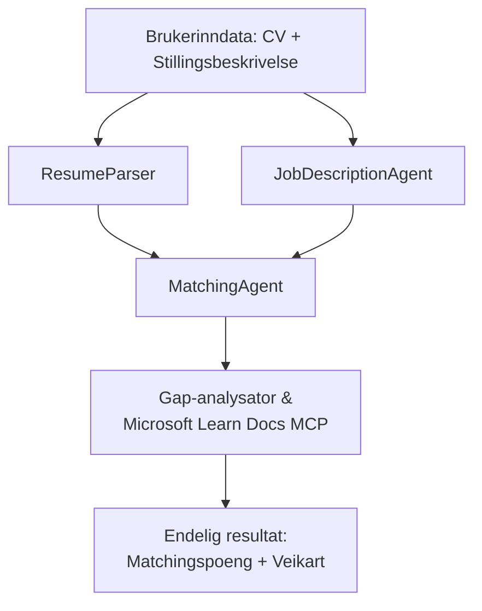

# PersonalCareerCopilot - CV → Jobbanalyserer

En fleragent arbeidsflyt som vurderer hvor godt en CV matcher en stillingsbeskrivelse, og deretter genererer en personlig læringsplan for å lukke gapene.

---

## Agenter

| Agent | Rolle | Verktøy |
|-------|------|-------|
| **ResumeParser** | Henter ut strukturerte ferdigheter, erfaring, sertifiseringer fra CV-tekst | - |
| **JobDescriptionAgent** | Henter ut nødvendige/foretrukne ferdigheter, erfaring, sertifiseringer fra en stillingsbeskrivelse | - |
| **MatchingAgent** | Sammenligner profil mot krav → tilpasningspoeng (0-100) + matchede/manglende ferdigheter | - |
| **GapAnalyzer** | Lager en personlig læringsplan med Microsoft Learn-ressurser | `search_microsoft_learn_for_plan` (MCP) |

## Arbeidsflyt


---

## Kom raskt i gang

### 1. Sett opp miljø

```powershell
cd workshop\lab02-multi-agent\PersonalCareerCopilot
python -m venv .venv
.\.venv\Scripts\Activate.ps1          # Windows PowerShell
# source .venv/bin/activate            # macOS / Linux
pip install -r requirements.txt
```

### 2. Konfigurer legitimasjon

Kopier eksempel-enkelfilen og fyll inn detaljer for Foundry-prosjektet ditt:

```powershell
cp .env.example .env
```

Rediger `.env`:

```env
PROJECT_ENDPOINT=https://<your-account>.services.ai.azure.com/api/projects/<your-project>
MODEL_DEPLOYMENT_NAME=gpt-4.1-mini
```

| Verdi | Hvor du finner den |
|-------|-----------------|
| `PROJECT_ENDPOINT` | Microsoft Foundry sidepanel i VS Code → høyreklikk prosjektet ditt → **Copy Project Endpoint** |
| `MODEL_DEPLOYMENT_NAME` | Foundry sidepanel → utvid prosjekt → **Models + endpoints** → distribusjonsnavn |

### 3. Kjør lokalt

```powershell
python -m debugpy --listen 127.0.0.1:5679 -m agentdev run main.py --verbose --port 8088
```

Eller bruk VS Code-tasken: `Ctrl+Shift+P` → **Tasks: Run Task** → **Run Lab02 HTTP Server**.

### 4. Test med Agent Inspector

Åpne Agent Inspector: `Ctrl+Shift+P` → **Foundry Toolkit: Open Agent Inspector**.

Lim inn denne testprompten:

```
Resume:
Jane Doe
Senior Software Engineer with 5 years of experience in Python, Django, and AWS.
Built microservices handling 10K+ requests/second. Led a team of 4 developers.
Certifications: AWS Solutions Architect Associate.
Education: B.S. Computer Science, State University.

Job Description:
Senior Cloud Engineer at Contoso Ltd.
Required: Python, Azure, Kubernetes, Terraform, CI/CD pipelines.
Preferred: Go, monitoring (Prometheus/Grafana), cost optimization.
Experience: 5+ years in cloud infrastructure.
Certifications: Azure Solutions Architect Expert preferred.
```

**Forventet:** En tilpasningsscore (0-100), matchede/manglende ferdigheter, og en personlig læringsplan med Microsoft Learn-URLer.

### 5. Distribuer til Foundry

`Ctrl+Shift+P` → **Microsoft Foundry: Deploy Hosted Agent** → velg prosjekt → bekreft.

---

## Prosjektstruktur

```
PersonalCareerCopilot/
├── .env.example        ← Template for environment variables
├── .env                ← Your credentials (git-ignored)
├── agent.yaml          ← Hosted agent definition (name, resources, env vars)
├── Dockerfile          ← Container image for Foundry deployment
├── main.py             ← 4-agent workflow (instructions, MCP tool, WorkflowBuilder)
└── requirements.txt    ← Python dependencies
```

## Viktige filer

### `agent.yaml`

Definerer den hostede agenten for Foundry Agent Service:
- `kind: hosted` - kjører som en administrert container
- `protocols: [responses v1]` - eksponerer `/responses` HTTP-endepunktet
- `environment_variables` - `PROJECT_ENDPOINT` og `MODEL_DEPLOYMENT_NAME` injiseres ved distribusjon

### `main.py`

Inneholder:
- **Agentinstruksjoner** - fire `*_INSTRUCTIONS` konstanter, én per agent
- **MCP verktøy** - `search_microsoft_learn_for_plan()` kaller `https://learn.microsoft.com/api/mcp` via Streamable HTTP
- **Agentopprettelse** - `create_agents()` kontekstbehandler bruker `AzureAIAgentClient.as_agent()`
- **Arbeidsflyt graf** - `create_workflow()` bruker `WorkflowBuilder` for å koble agenter med fan-out/fan-in/sekvensielle mønstre
- **Serverstart** - `from_agent_framework(agent).run_async()` på port 8088

### `requirements.txt`

| Pakke | Versjon | Formål |
|---------|---------|---------|
| `agent-framework-azure-ai` | `1.0.0rc3` | Azure AI-integrasjon for Microsoft Agent Framework |
| `agent-framework-core` | `1.0.0rc3` | Kjerne runtime (inkluderer WorkflowBuilder) |
| `azure-ai-agentserver-agentframework` | `1.0.0b16` | Hosted agent server runtime |
| `azure-ai-agentserver-core` | `1.0.0b16` | Kjerne agent server abstraksjoner |
| `debugpy` | nyeste | Python-debugging (F5 i VS Code) |
| `agent-dev-cli` | `--pre` | Lokalt utviklings-CLI + Agent Inspector backend |

---

## Feilsøking

| Problem | Løsning |
|-------|-----|
| `RuntimeError: Missing required environment variable(s)` | Lag `.env` med `PROJECT_ENDPOINT` og `MODEL_DEPLOYMENT_NAME` |
| `ModuleNotFoundError: No module named 'agent_framework'` | Aktiver venv og kjør `pip install -r requirements.txt` |
| Ingen Microsoft Learn-URLer i output | Sjekk internettforbindelse til `https://learn.microsoft.com/api/mcp` |
| Bare 1 gap-kort (avkuttet) | Kontroller at `GAP_ANALYZER_INSTRUCTIONS` inkluderer `CRITICAL:` blokken |
| Port 8088 i bruk | Stopp andre servere: `netstat -ano \| findstr :8088` |

For detaljert feilsøking, se [Module 8 - Troubleshooting](../docs/08-troubleshooting.md).

---

**Full gjennomgang:** [Lab 02 Docs](../docs/README.md) · **Tilbake til:** [Lab 02 README](../README.md) · [Workshop Home](../../../README.md)

---

<!-- CO-OP TRANSLATOR DISCLAIMER START -->
**Ansvarsfraskrivelse**:
Dette dokumentet er oversatt ved hjelp av AI-oversettelsestjenesten [Co-op Translator](https://github.com/Azure/co-op-translator). Selv om vi streber etter nøyaktighet, vennligst vær oppmerksom på at automatiske oversettelser kan inneholde feil eller unøyaktigheter. Det opprinnelige dokumentet på dets opprinnelige språk skal anses som den autoritative kilden. For kritisk informasjon anbefales profesjonell menneskelig oversettelse. Vi er ikke ansvarlige for eventuelle misforståelser eller feiltolkninger som oppstår fra bruken av denne oversettelsen.
<!-- CO-OP TRANSLATOR DISCLAIMER END -->