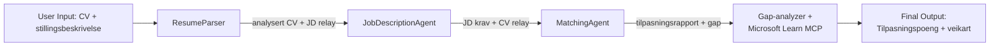

# PersonalCareerCopilot - CV → Jobbmatch Evaluator

En arbeidsflyt-først multi-agent app som evaluerer hvor godt en CV samsvarer med en stillingsbeskrivelse, og deretter genererer en personlig læringsplan for å tette hullene.

---

## Agenter

| Agent | Rolle | Verktøy |
|-------|------|-------|
| **ResumeParser** | Henter ut strukturerte ferdigheter, erfaring, sertifiseringer fra CV-tekst | - |
| **JobDescriptionAgent** | Henter ut nødvendige/foretrukne ferdigheter, erfaring, sertifiseringer fra en stillingsbeskrivelse | - |
| **MatchingAgent** | Sammenligner profil vs krav → matchingspoeng (0-100) + matchede/manglende ferdigheter | - |
| **GapAnalyzer** | Lager en personlig læringsplan med Microsoft Learn-ressurser | `search_microsoft_learn_for_plan` (MCP) |

## Arbeidsflyt


```mermaid
flowchart LR
    UserInput["User Input: CV + stillingsbeskrivelse"] --> ResumeParser
    ResumeParser -- "analysert CV + JD relay" --> JobDescriptionAgent
    JobDescriptionAgent -- "JD krav + CV relay" --> MatchingAgent
    MatchingAgent -- "tilpasningsrapport + gap" --> GapAnalyzerMCP["Gap-analyzer +\nMicrosoft Learn MCP"]
    GapAnalyzerMCP --> FinalOutput["Final Output:\nTilpasningspoeng + veikart"]
```

---

## Rask start

### 1. Sett opp miljø

Denne mappen er referanseimplementeringen for arbeidsflytbasert Lab 02-rammeverk. Dens `main.py` bruker eksisterende promptblokker pluss `WorkflowBuilder` for å koble de fire agentene sammen.

```powershell
cd workshop\lab02-multi-agent\PersonalCareerCopilot
python -m venv .venv
.\.venv\Scripts\Activate.ps1          # Windows PowerShell
# source .venv/bin/activate            # macOS / Linux
pip install -r requirements.txt
```

### 2. Konfigurer legitimasjon

Lag en `.env`-fil i denne mappen:

```powershell
copy .env .env.bak 2>$null; echo $null > .env
```

Rediger `.env`:

```env
FOUNDRY_PROJECT_ENDPOINT=https://<your-account>.services.ai.azure.com/api/projects/<your-project>
AZURE_AI_MODEL_DEPLOYMENT_NAME=gpt-4.1-mini
```

| Verdi | Hvor finne den |
|-------|------------------|
| `FOUNDRY_PROJECT_ENDPOINT` | Foundry Toolkit sidefelt → høyreklikk prosjektet ditt → **Kopier prosjektendepunkt** |
| `AZURE_AI_MODEL_DEPLOYMENT_NAME` | Foundry sidefelt → utvid prosjekt → **Modeller + endepunkter** → distribusjonsnavn |

### 3. Kjør lokalt

```powershell
python -m debugpy --listen 127.0.0.1:5679 main.py --port 8088
```

Eller bruk VS Code-oppgaven: `Ctrl+Shift+P` → **Oppgaver: Kjør Oppgave** → **Kjør Agent HTTP Server**.

For F5-feilsøking, bruk **Debug Local Agent HTTP Server**.

### 4. Test med Agent Inspector

Åpne Agent Inspector: `Ctrl+Shift+P` → **Foundry Toolkit: Åpne Agent Inspector**.

Lim inn denne testprompten:

```
Resume:
Jane Doe
Senior Software Engineer with 5 years of experience in Python, Django, and AWS.
Built microservices handling 10K+ requests/second. Led a team of 4 developers.
Certifications: AWS Solutions Architect Associate.
Education: B.S. Computer Science, State University.

Job Description:
Senior Cloud Engineer at Contoso Ltd.
Required: Python, Azure, Kubernetes, Terraform, CI/CD pipelines.
Preferred: Go, monitoring (Prometheus/Grafana), cost optimization.
Experience: 5+ years in cloud infrastructure.
Certifications: Azure Solutions Architect Expert preferred.
```

**Forventet:** En matchingscore (0-100), matchede/manglende ferdigheter, og en personlig læringsplan med Microsoft Learn URL-er.

### 5. Distribuer til Foundry

`Ctrl+Shift+P` → **Foundry Toolkit: Distribuer Hostet Agent** → velg prosjektet ditt → bekreft.

---

## Prosjektstruktur

```
PersonalCareerCopilot/
├── .env                ← Your credentials (git-ignored)
├── agent.yaml          ← Hosted agent definition (name, resources, env vars)
├── Dockerfile          ← Container image for Foundry deployment
├── main.py             ← 4-agent workflow (instructions, MCP tool, WorkflowBuilder)
└── requirements.txt    ← Python dependencies
```

## Nøkkelefiler

### `agent.yaml`

Definerer den hostede agenten for Foundry Agent Service:
- `kind: hosted` - kjører som en administrert container
- `protocols` - `responses` protokoll med `version: 1.0.0`, eksponerer `/responses` HTTP endepunkt
- `environment_variables` - `AZURE_AI_MODEL_DEPLOYMENT_NAME` er deklarert her; `FOUNDRY_PROJECT_ENDPOINT` injiseres automatisk ved distribusjon

### `main.py`

Inneholder:
- **Agentinstruksjoner** - fire `*_INSTRUCTIONS` konstanter, en per agent
- **MCP verktøy** - `search_microsoft_learn_for_plan()` kaller `https://learn.microsoft.com/api/mcp` via Streamable HTTP
- **Agentopprettelse** - fire `Agent()` + `AgentExecutor()` instanser som deler en `FoundryChatClient`
- **Arbeidsflyt graf** - `WorkflowBuilder` kobler agenter som en sekvensiell pipeline: ResumeParser → JD Agent → MatchingAgent → GapAnalyzer
- **Serverstart** - `ResponsesHostServer` kjører på port 8088

### `requirements.txt`

| Pakke | Formål |
|---------|----------|
| `agent-framework-foundry` | Kjernetid: `Agent`, `AgentExecutor`, `WorkflowBuilder`, `@tool`, `FoundryChatClient` |
| `agent-framework-foundry-hosting` | `ResponsesHostServer` + Foundry hosting integrasjon |
| `mcp<2,>=1.24.0` | MCP klient for GapAnalyzer (`streamable_http_client`) |
| `debugpy` | Python feilsøking (F5 i VS Code) |

---

## Feilsøking

| Problem | Løsning |
|-------|-----|
| `KeyError: 'FOUNDRY_PROJECT_ENDPOINT'` eller `KeyError: 'AZURE_AI_MODEL_DEPLOYMENT_NAME'` | Lag `.env` med både `FOUNDRY_PROJECT_ENDPOINT` og `AZURE_AI_MODEL_DEPLOYMENT_NAME` satt |
| `ModuleNotFoundError: No module named 'agent_framework'` | Aktiver venv og kjør `pip install -r requirements.txt` |
| Ingen Microsoft Learn URL-er i utdata | Sjekk internettforbindelse til `https://learn.microsoft.com/api/mcp` |
| Kun 1 gap-kort (avkortet) | Verifiser at `GAP_ANALYZER_INSTRUCTIONS` inkluderer `CRITICAL:`-blokken |
| Port 8088 er i bruk | Stopp andre servere: `netstat -ano \| findstr :8088` |

For detaljert feilsøking, se [Module 8 - TroubleShooting](../docs/08-troubleshooting.md).

---

**Full gjennomgang:** [Lab 02 Docs](../docs/README.md) · **Tilbake til:** [Lab 02 README](../README.md) · [Workshop Hjem](../../../README.md)

---

<!-- CO-OP TRANSLATOR DISCLAIMER START -->
**Ansvarsfraskrivelse**:
Dette dokumentet er oversatt ved hjelp av AI-oversettelsestjenesten [Co-op Translator](https://github.com/Azure/co-op-translator). Selv om vi streber etter nøyaktighet, vær oppmerksom på at automatiske oversettelser kan inneholde feil eller unøyaktigheter. Det opprinnelige dokumentet på originalspråket skal betraktes som den autoritative kilden. For kritisk informasjon anbefales profesjonell menneskelig oversettelse. Vi er ikke ansvarlige for eventuelle misforståelser eller feiltolkninger som oppstår ved bruk av denne oversettelsen.
<!-- CO-OP TRANSLATOR DISCLAIMER END -->