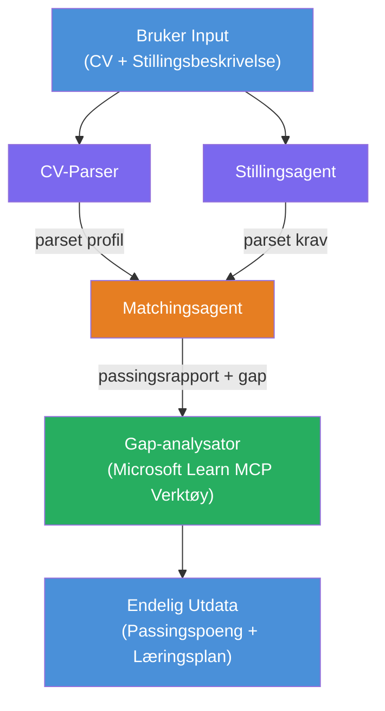

# Lab 02 - Multi-Agent Arbeidsflyt: CV → Jobbpass Evaluator

---

## Hva du skal bygge

En **CV → Jobbpass Evaluator** - en multi-agent arbeidsflyt der fire spesialiserte agenter samarbeider for å evaluere hvor godt en kandidats CV passer til en stillingsbeskrivelse, og deretter generere en personlig læringsplan for å tette hullene.

### Agentene

| Agent | Rolle |
|-------|-------|
| **Resume Parser** | Trekker ut strukturerte ferdigheter, erfaring, sertifiseringer fra CV-tekst |
| **Job Description Agent** | Trekker ut nødvendige/ønskede ferdigheter, erfaring, sertifiseringer fra en stillingsbeskrivelse |
| **Matching Agent** | Sammenligner profil vs krav → passformscore (0-100) + matchede/manglende ferdigheter |
| **Gap Analyzer** | Lager en personlig læreplan med ressurser, tidslinjer og raskvinn-prosjekter |

### Demo flyt

Last opp en **CV + stillingsbeskrivelse** → få en **passformscore + manglende ferdigheter** → mottar en **personlig læreplan**.

### Arbeidsflytarkitektur

> Lilla = parallelle agenter | Oransje = aggregeringspunkt | Grønn = endelig agent med verktøy. Se [Modul 1 - Forstå arkitekturen](docs/01-understand-multi-agent.md) og [Modul 4 - Orkestreringsmønstre](docs/04-orchestration-patterns.md) for detaljerte diagrammer og dataflyt.

### Temaer dekket

- Lage en multi-agent arbeidsflyt med **WorkflowBuilder**
- Definere agentroller og orkestreringsflyt (parallell + sekvensiell)
- Kommunikasjonsmønstre mellom agenter
- Lokal testing med Agent Inspector
- Distribuere multi-agent arbeidsflyter til Foundry Agent Service

---

## Forutsetninger

Fullfør Lab 01 først:

- [Lab 01 - Single Agent](../lab01-single-agent/README.md)

---

## Kom i gang

Se full oppsettsinstruksjon, kodegjennomgang og testkommandoer i:

- [Lab 2 Docs - Forutsetninger](docs/00-prerequisites.md)
- [Lab 2 Docs - Full læringssti](docs/README.md)
- [PersonalCareerCopilot kjøreguide](PersonalCareerCopilot/README.md)

## Orkestreringsmønstre (agentiske alternativer)

Lab 2 inkluderer standard **parallell → aggregator → planlegger** flyt, og dokumentasjonen
beskriver også alternative mønstre for å demonstrere sterkere agentisk oppførsel:

- **Fan-out/Fan-in med vektet konsensus**
- **Anmelder/kritikkrunde før endelig veikart**
- **Betinget ruting** (veisvalg basert på passformscore og manglende ferdigheter)

Se [docs/04-orchestration-patterns.md](docs/04-orchestration-patterns.md).

---

**Forrige:** [Lab 01 - Single Agent](../lab01-single-agent/README.md) · **Tilbake til:** [Workshop Hjem](../../README.md)

---

<!-- CO-OP TRANSLATOR DISCLAIMER START -->
**Ansvarsfraskrivelse**:  
Dette dokumentet er oversatt ved hjelp av AI-oversettelsestjenesten [Co-op Translator](https://github.com/Azure/co-op-translator). Selv om vi streber etter nøyaktighet, vennligst vær oppmerksom på at automatiske oversettelser kan inneholde feil eller unøyaktigheter. Det opprinnelige dokumentet på dets opprinnelige språk bør betraktes som den autoritative kilden. For kritisk informasjon anbefales profesjonell menneskelig oversettelse. Vi er ikke ansvarlige for eventuelle misforståelser eller feiltolkninger som oppstår fra bruken av denne oversettelsen.
<!-- CO-OP TRANSLATOR DISCLAIMER END -->