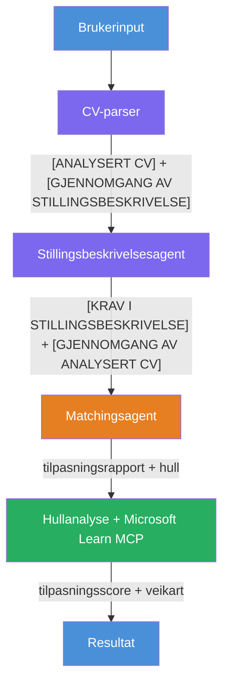

# Lab 02 - Multi-Agent arbeidsflyt: CV → Job Fit Evaluator

## Oversikt

I denne praktiske labben skal du bygge en **arbeidsflyt-først multi-agent app** ved hjelp av Foundry Toolkit i VS Code, og distribuere den til Microsoft Foundry Agent Service.

**Det du skal bygge:** en CV → Job Fit Evaluator som analyserer en CV og stillingsbeskrivelse, vurderer treffet, og produserer en personlig læringsplan ved bruk av Microsoft Learn-ressurser.

---

## Arkitektur

```mermaid
flowchart TD
    A["Brukerinput"] --> B["CV-parser"]
    B -->|"[ANALYSERT CV] + [GJENNOMGANG AV STILLINGSBESKRIVELSE]"| C["Stillingsbeskrivelsesagent"]
    C -->|"[KRAV I STILLINGSBESKRIVELSE] + [GJENNOMGANG AV ANALYSERT CV]"| D["Matchingsagent"]
    D -->|tilpasningsrapport + hull| E["Hullanalyse + Microsoft Learn MCP"]
    E -->|tilpasningsscore + veikart| F["Resultat"]

    style A fill:#4A90D9,color:#fff
    style B fill:#7B68EE,color:#fff
    style C fill:#7B68EE,color:#fff
    style D fill:#E67E22,color:#fff
    style E fill:#27AE60,color:#fff
    style F fill:#4A90D9,color:#fff
```

**Slik fungerer det:**
1. Brukeren limer inn en CV og stillingsbeskrivelse.
2. **ResumeParser** analyserer CV-en og kopierer JD ordrett inn i en `[JOB DESCRIPTION PASS-THROUGH]` seksjon.
3. **JD Agent** ekstraherer strukturerte krav fra pass-through, og sender videre `[PARSED RESUME]` som `[PARSED RESUME PASS-THROUGH]`.
4. **MatchingAgent** sammenligner `[PARSED RESUME PASS-THROUGH]` mot `[JD REQUIREMENTS]` og produserer en treffscore.
5. **GapAnalyzer** omgjør gapene til en praktisk veikart og henter ekte Microsoft Learn-lenker via MCP.

---

## Forutsetninger

Fullfør Lab 01 først:

- [Lab 01 - Single Agent](../lab01-single-agent/README.md)

---

## Del 1: Les modulene i rekkefølge

Se hele læringsløpet i:

- [Lab 2 Docs - Forutsetninger](docs/00-prerequisites.md)
- [Lab 2 Docs - Hele læringsløpet](docs/README.md)
- [PersonalCareerCopilot kjøreveiledning](PersonalCareerCopilot/README.md)

---

## Del 2: Bygg og test arbeidsflyten

1. Bruk Foundry Toolkit-veiviseren til å scaffolde prosjektet basert på arbeidsflyt.
2. Kopier prompt-blokkene og arbeidsflytdiagrammet fra `PersonalCareerCopilot/main.py` til arbeidsområdet ditt.
3. Kjør lokalt med Agent Inspector og verifiser alle fire agenter pluss MCP-verktøyet.
4. Distribuer den hostede agenten til Foundry når lokal testing er godkjent.

---

## Orkestreringsmønstre

Lab 02 inkluderer standard **fan-out → fan-in → sekvensiell** flyt, og dokumentasjonen beskriver også alternative orkestreringsmønstre for eksperimentering.

- **Fan-out/Fan-in med vektet konsensus**
- **Gjennomgang/ kritikk før endelig veikart**
- **Betinget ruting** basert på treffscore og manglende ferdigheter

Se [docs/04-orchestration-patterns.md](docs/04-orchestration-patterns.md).

---

**Forrige:** [Lab 01 - Single Agent](../lab01-single-agent/README.md) · **Tilbake til:** [Workshop Hjem](../../README.md)

---

<!-- CO-OP TRANSLATOR DISCLAIMER START -->
**Ansvarsfraskrivelse**:
Dette dokumentet er oversatt ved hjelp av AI-oversettelsestjenesten [Co-op Translator](https://github.com/Azure/co-op-translator). Selv om vi streber etter nøyaktighet, vær oppmerksom på at automatiske oversettelser kan inneholde feil eller unøyaktigheter. Det opprinnelige dokumentet på originalspråket skal betraktes som den autoritative kilden. For kritisk informasjon anbefales profesjonell menneskelig oversettelse. Vi er ikke ansvarlige for eventuelle misforståelser eller feiltolkninger som oppstår ved bruk av denne oversettelsen.
<!-- CO-OP TRANSLATOR DISCLAIMER END -->