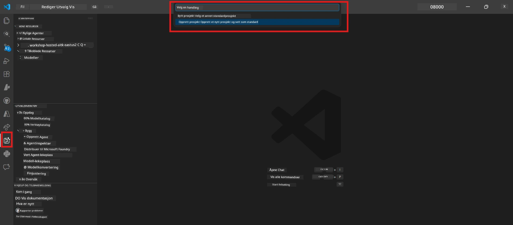

# Module 0 - Forutsetninger

Før du starter Lab 02, bekreft at du har fullført følgende. Denne laben bygger direkte på Lab 01 - ikke hopp over den.

---

## 1. Fullfør Lab 01

Lab 02 forutsetter at du allerede har:

- [x] Fullført alle 8 moduler i [Lab 01 - Single Agent](../../lab01-single-agent/README.md)
- [x] Lykke til med å distribuere en enkelt agent til Foundry Agent Service
- [x] Verifisert at agenten fungerer både i lokal Agent Inspector og Foundry Playground

Hvis du ikke har fullført Lab 01, gå tilbake og fullfør den nå: [Lab 01 Docs](../../lab01-single-agent/docs/00-prerequisites.md)

---

## 2. Verifiser eksisterende oppsett

Alle verktøy fra Lab 01 skal fortsatt være installert og fungere. Kjør disse raske kontrollene:

### 2.1 Azure CLI

```powershell
az account show --query "{name:name, id:id}" --output table
```

Forventet: Viser navnet og ID-en til abonnementet ditt. Hvis dette mislykkes, kjør [`az login`](https://learn.microsoft.com/cli/azure/authenticate-azure-cli-interactively).

### 2.2 VS Code utvidelser

1. Trykk `Ctrl+Shift+P` → skriv **"Microsoft Foundry"** → bekreft at du ser kommandoer (f.eks. `Microsoft Foundry: Create a New Hosted Agent`).
2. Trykk `Ctrl+Shift+P` → skriv **"Foundry Toolkit"** → bekreft at du ser kommandoer (f.eks. `Foundry Toolkit: Open Agent Inspector`).

### 2.3 Foundry prosjekt & modell

1. Klikk på **Microsoft Foundry**-ikonet i VS Code Activity Bar.
2. Bekreft at prosjektet ditt er listet opp (f.eks. `workshop-agents`).
3. Utvid prosjektet → bekreft at en distribuert modell finnes (f.eks. `gpt-4.1-mini`) med status **Succeeded**.

> **Hvis modell-distribusjonen din utløp:** Noen gratis-distribusjoner utløper automatisk. Distribuer på nytt fra [Model Catalog](https://learn.microsoft.com/azure/foundry/foundry-models/concepts/models-sold-directly-by-azure) (`Ctrl+Shift+P` → **Microsoft Foundry: Open Model Catalog**).



### 2.4 RBAC roller

Bekreft at du har **Azure AI User** på Foundry-prosjektet ditt:

1. [Azure Portal](https://portal.azure.com) → din Foundry **prosjekt**-ressurs → **Access control (IAM)** → **[Role assignments](https://learn.microsoft.com/azure/foundry/concepts/rbac-foundry)**-fanen.
2. Søk etter navnet ditt → bekreft at **[Azure AI User](https://aka.ms/foundry-ext-project-role)** er oppført.

---

## 3. Forstå multi-agent konsepter (nytt for Lab 02)

Lab 02 introduserer konsepter som ikke ble dekket i Lab 01. Les gjennom disse før du fortsetter:

### 3.1 Hva er en multi-agent arbeidsflyt?

I stedet for at én agent håndterer alt, deler en **multi-agent arbeidsflyt** arbeidet på flere spesialiserte agenter. Hver agent har:

- Sine egne **instruksjoner** (systemprompt)
- Sin egen **rolle** (hva den er ansvarlig for)
- Valgfrie **verktøy** (funksjoner den kan kalle)

Agentene kommuniserer via en **orkestreringsgraf** som definerer hvordan data flyter mellom dem.

### 3.2 WorkflowBuilder

[`WorkflowBuilder`](https://learn.microsoft.com/agent-framework/workflows/agents-in-workflows) klassen fra `agent_framework` er SDK-komponenten som kobler sammen agenter:

```python
from agent_framework import WorkflowBuilder

workflow = (
    WorkflowBuilder(
        name="MyWorkflow",
        start_executor=agent_a,
        output_executors=[agent_d],
    )
    .add_edge(agent_a, agent_b)
    .add_edge(agent_a, agent_c)
    .add_edge(agent_b, agent_d)
    .add_edge(agent_c, agent_d)
    .build()
)
```

- **`start_executor`** - Den første agenten som mottar brukerinput
- **`output_executors`** - Agent(en) hvis output blir det endelige svaret
- **`add_edge(source, target)`** - Definerer at `target` mottar `source` sin output

### 3.3 MCP (Model Context Protocol) verktøy

Lab 02 bruker et **MCP-verktøy** som kaller Microsoft Learn API for å hente læringsressurser. [MCP (Model Context Protocol)](https://modelcontextprotocol.io/introduction) er en standardisert protokoll for å koble AI-modeller til eksterne datakilder og verktøy.

| Term | Definisjon |
|------|-----------|
| **MCP server** | En tjeneste som eksponerer verktøy/ressurser via [MCP-protokollen](https://learn.microsoft.com/azure/foundry/agents/how-to/tools/model-context-protocol) |
| **MCP klient** | Agentkoden din som kobler til en MCP-server og kaller dens verktøy |
| **[Streamable HTTP](https://learn.microsoft.com/agent-framework/agents/tools/hosted-mcp-tools)** | Transportmetoden som brukes for å kommunisere med MCP-serveren |

### 3.4 Hvordan Lab 02 skiller seg fra Lab 01

| Aspekt | Lab 01 (Single Agent) | Lab 02 (Multi-Agent) |
|--------|----------------------|---------------------|
| Agenter | 1 | 4 (spesialiserte roller) |
| Orkestrering | Ingen | WorkflowBuilder (parallelt + sekvensielt) |
| Verktøy | Valgfri `@tool` funksjon | MCP-verktøy (ekstern API-kall) |
| Kompleksitet | Enkel prompt → svar | CV + stillingsbeskrivelse → matchscore → veikart |
| Kontekstflyt | Direkte | Agent-til-agent overlevering |

---

## 4. Workshop repository struktur for Lab 02

Sørg for at du vet hvor Lab 02 filene er:

```
workshop/
└── lab02-multi-agent/
    ├── README.md                       ← Lab overview
    ├── docs/                           ← You are here
    │   ├── README.md                   ← Learning path index
    │   ├── 00-prerequisites.md         ← This file
    │   ├── 01-understand-multi-agent.md
    │   ├── ...
    │   └── 08-troubleshooting.md
    └── PersonalCareerCopilot/          ← The agent project
        ├── agent.yaml                  ← Agent definition
        ├── main.py                     ← 4-agent workflow code
        ├── Dockerfile                  ← Container configuration
        └── requirements.txt            ← Python dependencies
```

---

### Sjekkpunkter

- [ ] Lab 01 er fullstendig fullført (alle 8 moduler, agent distribuert og verifisert)
- [ ] `az account show` returnerer abonnementet ditt
- [ ] Microsoft Foundry og Foundry Toolkit-utvidelser er installert og svarer
- [ ] Foundry prosjekt har en distribuert modell (f.eks. `gpt-4.1-mini`)
- [ ] Du har **Azure AI User**-rollen på prosjektet
- [ ] Du har lest delen om multi-agent konsepter over og forstår WorkflowBuilder, MCP og agent-orkestrering

---

**Neste:** [01 - Forstå Multi-Agent Arkitektur →](01-understand-multi-agent.md)

---

<!-- CO-OP TRANSLATOR DISCLAIMER START -->
**Ansvarsfraskrivelse**:  
Dette dokumentet er oversatt ved hjelp av AI-oversettelsestjenesten [Co-op Translator](https://github.com/Azure/co-op-translator). Selv om vi streber etter nøyaktighet, vær oppmerksom på at automatiserte oversettelser kan inneholde feil eller unøyaktigheter. Det opprinnelige dokumentet på morsmålet bør anses som den autoritative kilden. For kritisk informasjon anbefales profesjonell menneskelig oversettelse. Vi påtar oss ikke ansvar for eventuelle misforståelser eller feiltolkninger som oppstår ved bruk av denne oversettelsen.
<!-- CO-OP TRANSLATOR DISCLAIMER END -->