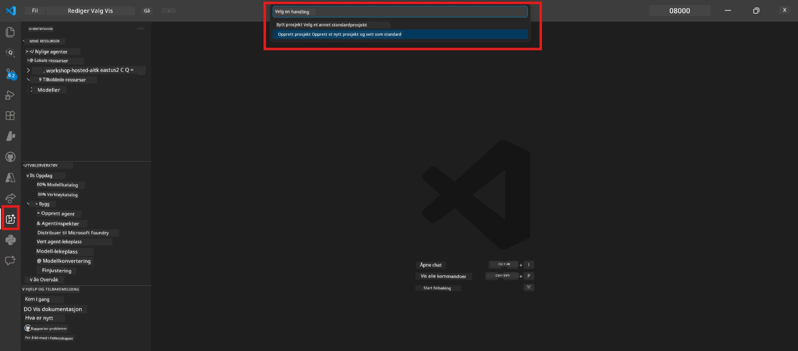

# Modul 0 - Introduksjon

⏱️ ~10 min

> [!WARNING]
> **Forhåndsvisning og begrensninger:** [Hosted Agents](https://learn.microsoft.com/azure/foundry/agents/concepts/hosted-agents) er for øyeblikket i **offentlig forhåndsvisning** – ikke anbefalt for produksjonsarbeidsbelastninger. Noen funksjoner vist i denne workshopen kan endres etter hvert som tjenesten nærmer seg GA.

## Hva du skal bygge

I denne labben utvider du enkeltagentferdighetene fra Lab 01 for å bygge en **multi-agent arbeidsflyt** – CV → Jobbfittevaluering.

Du limer inn en **CV** og en **jobbannonse**. Fire spesialiserte agenter bearbeider inndataene sekvensielt, og returnerer deretter:
- En fit-poengsum (0–100 med detaljert poengfordeling)
- En liste over ferdighets- og sertifiseringsgap
- En personlig læringsplan med virkelige Microsoft Learn-lenker for hvert gap

**Arbeidsflyten bruker:**
- **Microsoft Agent Framework** - `WorkflowBuilder` for sekvensiell pipeline-orkestrering
- **Foundry Toolkit for VS Code** - bygge ut, test lokalt, deployere
- **En AI-modell** (f.eks. `gpt-4.1-mini`) - brukt av alle fire agenter
- **Microsoft Learn MCP-server** - tilbyr virkelige læringsressurslenker for hvert ferdighetsgap

---

## Velg din vei

> ⚠️ **Fortsett med samme vei som du brukte i Lab 01.**

<details open>
<summary><strong>🅰️ Vei A - Azure sky (krever Azure-abonnement)</strong></summary>

| | Detaljer |
|---|---|
| **Hvem er dette for?** | Du fullførte Lab 01 med et Azure-abonnement |
| **Modell** | Azure OpenAI via Foundry (f.eks. `gpt-4.1-mini`) |
| **Moduler dekket** | Alle moduler (00–09) |
| **Deploy til skyen?** | ✅ Ja - full ende-til-ende utrulling |

</details>

<details open>
<summary><strong>🅱️ Vei B - Foundry Local (ikke behov for Azure-abonnement)</strong></summary>

| | Detaljer |
|---|---|
| **Hvem er dette for?** | Du fullførte Lab 01 med Foundry Local |
| **Modell** | Foundry Local (gratis, kjører på din maskin) |
| **Moduler dekket** | Moduler 00–05 (hopp over 06–07 – deploy & skyverifisering) |
| **Deploy til skyen?** | ❌ Nei - kun lokal testing via Agent Inspector |

</details>

---

## Sjekk Lab 01

Lab 02 bygger direkte på Lab 01. Fullfør Lab 01 først før du starter her.

Har du ikke gjort Lab 01 enda? Start her: [Lab 01 - Introduksjon](../../lab01-single-agent/docs/00-prerequisites.md)

<details open>
<summary><strong>🅰️ Vei A - Azure sky</strong></summary>

```powershell
az account show --query "{name:name, id:id}" --output table
```

Hvis dette feiler, kjør `az login`. Deretter verifiser i VS Code:

1. `Ctrl+Shift+P` → skriv **Foundry Toolkit** → bekreft at kommandoer vises.
2. Klikk på **Foundry Toolkit**-ikonet → prosjektet og deployert modell vises som **Vel lykkes**.



> **RBAC:** Du tildelte **Foundry User** i Lab 01. Hvis du må tildele på nytt, se [Lab 01, Modul 1](../../lab01-single-agent/docs/01-setup.md#deploy-a-model--assign-rbac). Rollen het tidligere **Azure AI User** - samme tillatelser.

</details>

<details open>
<summary><strong>🅱️ Vei B - Foundry Local</strong></summary>

```powershell
Invoke-WebRequest -Uri "http://localhost:5273/v1/health" -UseBasicParsing | Select-Object StatusCode
```

Forventet: `StatusCode: 200`. Hvis ikke, start Foundry Local på nytt fra Foundry Toolkit sidefelt.

> All inferens kjører på din maskin. Det eneste eksterne kallet er MCP-verktøyet til `https://learn.microsoft.com/api/mcp`.

</details>

---

## Hva er nytt i Lab 02

| | Lab 01 | Lab 02 |
|--|--------|--------|
| Agenter | 1 | 4 (kjedet med WorkflowBuilder) |
| Scaffold-mal | Grunnleggende - Agent Framework | Arbeidsflyter - Agent Framework |
| Nytt paket | - | `mcp` |
| Orkestrering | Enkelt konversasjonsagent | Sekvensiell pipeline (WorkflowBuilder) |
| Nytt verktøy | - | `search_microsoft_learn_for_plan` (MCP) |

---

**Neste:** [01 - Forstå arkitekturen →](01-understand-multi-agent.md)

---

<!-- CO-OP TRANSLATOR DISCLAIMER START -->
**Ansvarsfraskrivelse**:
Dette dokumentet er oversatt ved hjelp av AI-oversettelsestjenesten [Co-op Translator](https://github.com/Azure/co-op-translator). Selv om vi streber etter nøyaktighet, vær oppmerksom på at automatiske oversettelser kan inneholde feil eller unøyaktigheter. Det opprinnelige dokumentet på originalspråket skal betraktes som den autoritative kilden. For kritisk informasjon anbefales profesjonell menneskelig oversettelse. Vi er ikke ansvarlige for eventuelle misforståelser eller feiltolkninger som oppstår ved bruk av denne oversettelsen.
<!-- CO-OP TRANSLATOR DISCLAIMER END -->