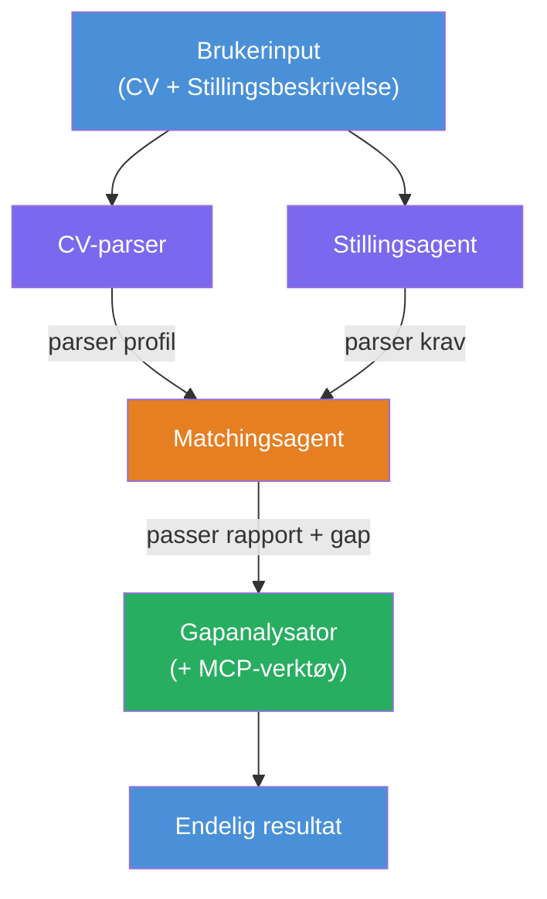
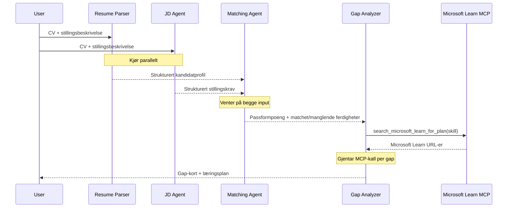
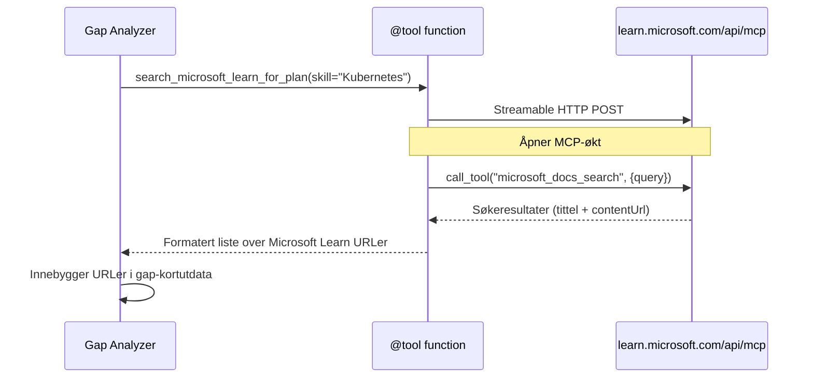

# Modul 1 - Forstå Multi-Agent-arkitekturen

I denne modulen lærer du arkitekturen til Resume → Job Fit Evaluator før du skriver noen kode. Å forstå orkestreringsgrafen, agentroller og dataflyt er avgjørende for feilsøking og utvidelse av [multi-agent arbeidsflyter](https://learn.microsoft.com/azure/architecture/ai-ml/idea/multiple-agent-workflow-automation).

---

## Problemet dette løser

Å matche en CV med en stillingsbeskrivelse involverer flere distinkte ferdigheter:

1. **Parsing** - Utdrage strukturert data fra ustrukturert tekst (CV)
2. **Analyse** - Utdrage krav fra en stillingsbeskrivelse
3. **Sammenligning** - Score samsvaret mellom de to
4. **Planlegging** - Lage en læringsplan for å tette hull

En enkelt agent som gjør alle fire oppgaver i en prompt produserer ofte:
- Ufullstendig utdrag (den haster gjennom parsing for å komme til poengsummen)
- Grunn score (ingen evidensbasert nedbrytning)
- Generiske læringsplaner (ikke tilpasset de spesifikke hullene)

Ved å splitte inn i **fire spesialiserte agenter**, fokuserer hver på sin oppgave med dedikerte instruksjoner, og produserer høyere kvalitet på utdata i hvert steg.

---

## De fire agentene

Hver agent er en full [Microsoft Foundry](https://learn.microsoft.com/azure/foundry/agents/concepts/hosted-agents) agent opprettet via `AzureAIAgentClient.as_agent()`. De deler samme modellutrulling, men har forskjellige instruksjoner og (valgfritt) forskjellige verktøy.

| # | Agentnavn | Rolle | Input | Output |
|---|-----------|-------|-------|--------|
| 1 | **ResumeParser** | Utdrar strukturert profil fra CV-tekst | Rå CV-tekst (fra bruker) | Kandidatprofil, Teknisk kompetanse, Myke ferdigheter, Sertifiseringer, Domeneerfaring, Prestasjoner |
| 2 | **JobDescriptionAgent** | Utdrar strukturerte krav fra en stillingsbeskrivelse | Rå stillingsbeskrivelse (fra bruker, videresendt via ResumeParser) | Rolloverblikk, Påkrevde ferdigheter, Foretrukne ferdigheter, Erfaring, Sertifiseringer, Utdanning, Ansvarsområder |
| 3 | **MatchingAgent** | Beregner evidensbasert samsvars-score | Output fra ResumeParser + JobDescriptionAgent | Samsvarsscore (0-100 med nedbrytning), Matchede ferdigheter, Manglende ferdigheter, Hull |
| 4 | **GapAnalyzer** | Lager personlig læringsplan | Output fra MatchingAgent | Hullkort (per ferdighet), Læringsrekkefølge, Tidslinje, Ressurser fra Microsoft Learn |

---

## Orkestreringsgrafen

Arbeidsflyten bruker **parallell forgrening** etterfulgt av **sekvensiell aggregering**:


> **Forklaring:** Lilla = parallelle agenter, Oransje = aggregeringspunkt, Grønn = siste agent med verktøy

### Hvordan data flyter


1. **Bruker sender** en melding som inneholder CV og stillingsbeskrivelse.
2. **ResumeParser** mottar hele brukerinputen og utdrar en strukturert kandidatprofil.
3. **JobDescriptionAgent** mottar brukerinput parallelt og utdrar strukturerte krav.
4. **MatchingAgent** mottar output fra **både** ResumeParser og JobDescriptionAgent (rammeverket venter på at begge er fullført før MatchingAgent kjører).
5. **GapAnalyzer** mottar output fra MatchingAgent og kaller **Microsoft Learn MCP-verktøyet** for å hente virkelige læringsressurser for hvert hull.
6. **Endelig output** er GapAnalyzers svar, som inkluderer samsvarsscore, hullkort og en komplett læringsplan.

### Hvorfor parallell forgrening er viktig

ResumeParser og JobDescriptionAgent kjører **parallelt** fordi ingen av dem avhenger av den andre. Dette:
- Reduserer total ventetid (begge kjører samtidig i stedet for sekvensielt)
- Er en naturlig oppdeling (parsing av CV vs. parsing av stillingsbeskrivelse er uavhengige oppgaver)
- Demonstrerer et vanlig multi-agent-mønster: **forgren → aggreger → utfør**

---

## WorkflowBuilder i kode

Slik kobles grafen over til [`WorkflowBuilder`](https://learn.microsoft.com/agent-framework/workflows/agents-in-workflows) API-kall i `main.py`:

```python
from agent_framework import WorkflowBuilder

workflow = (
    WorkflowBuilder(
        name="ResumeJobFitEvaluator",
        start_executor=resume_parser,       # Første agent som mottar brukerinput
        output_executors=[gap_analyzer],     # Endelig agent hvis output returneres
    )
    .add_edge(resume_parser, jd_agent)      # ResumeParser → JobDescriptionAgent
    .add_edge(resume_parser, matching_agent) # ResumeParser → MatchingAgent
    .add_edge(jd_agent, matching_agent)      # JobDescriptionAgent → MatchingAgent
    .add_edge(matching_agent, gap_analyzer)  # MatchingAgent → GapAnalyzer
    .build()
)
```

**Forstå kantene (edges):**

| Kant | Hva det betyr |
|------|---------------|
| `resume_parser → jd_agent` | JD Agent mottar ResumeParser sin output |
| `resume_parser → matching_agent` | MatchingAgent mottar ResumeParser sin output |
| `jd_agent → matching_agent` | MatchingAgent mottar også JD Agent sin output (venter på begge) |
| `matching_agent → gap_analyzer` | GapAnalyzer mottar MatchingAgent sin output |

Siden `matching_agent` har **to innkommende kanter** (`resume_parser` og `jd_agent`), venter rammeverket automatisk på begge før Matching Agent kjøres.

---

## MCP-verktøyet

GapAnalyzer-agenten har ett verktøy: `search_microsoft_learn_for_plan`. Dette er et **[MCP-verktøy](https://learn.microsoft.com/agent-framework/agents/tools/hosted-mcp-tools)** som kaller Microsoft Learn API for å hente kuraterte læringsressurser.

### Hvordan det fungerer

```python
@tool
async def search_microsoft_learn_for_plan(
    skill: str, role: str = "", max_results: int = 5
) -> str:
    """Search Microsoft Learn MCP and return curated official links."""
    # Koble til https://learn.microsoft.com/api/mcp via Streamable HTTP
    # Kjører 'microsoft_docs_search'-verktøyet på MCP-serveren
    # Returnerer formatert liste over Microsoft Learn URL-er
```

### MCP kallflyt


1. GapAnalyzer bestemmer at det trengs læringsressurser for en ferdighet (f.eks. "Kubernetes")
2. Rammeverket kaller `search_microsoft_learn_for_plan(skill="Kubernetes")`
3. Funksjonen åpner en [Streamable HTTP](https://learn.microsoft.com/agent-framework/agents/tools/hosted-mcp-tools)-tilkobling til `https://learn.microsoft.com/api/mcp`
4. Den kaller `microsoft_docs_search` verktøyet på [MCP-serveren](https://learn.microsoft.com/azure/foundry/agents/how-to/tools/model-context-protocol)
5. MCP-serveren returnerer søkeresultater (tittel + URL)
6. Funksjonen formaterer resultatene og returnerer dem som en streng
7. GapAnalyzer bruker de returnerte URL-ene i sitt hullkort-output

### Forventede MCP-logger

Når verktøyet kjører, vil du se loggoppføringer som:

```
GET https://learn.microsoft.com/api/mcp → 405 (Method Not Allowed)
POST https://learn.microsoft.com/api/mcp → 200
DELETE https://learn.microsoft.com/api/mcp → 405 (Method Not Allowed)
```

**Disse er normale.** MCP-klienten sender GET og DELETE under initialisering - at disse returnerer 405 er forventet oppførsel. Selve verktøykallet bruker POST og returnerer 200. Bare bekymre deg hvis POST-kall feiler.

---

## Agentopprettingsmønster

Hver agent opprettes med den **asynkrone kontekstbehandleren [`AzureAIAgentClient.as_agent()`](https://learn.microsoft.com/python/api/overview/azure/ai-agents-readme)**. Dette er Foundry SDK-mønsteret for å lage agenter som automatisk ryddes opp:

```python
async with (
    get_credential() as credential,
    AzureAIAgentClient(
        project_endpoint=PROJECT_ENDPOINT,
        model_deployment_name=MODEL_DEPLOYMENT_NAME,
        credential=credential,
    ).as_agent(
        name="ResumeParser",
        instructions=RESUME_PARSER_INSTRUCTIONS,
    ) as resume_parser,
    # ... gjenta for hver agent ...
):
    # Alle 4 agenter eksisterer her
    workflow = create_workflow(resume_parser, jd_agent, matching_agent, gap_analyzer)
```

**Viktige punkter:**
- Hver agent får sin egen `AzureAIAgentClient`-instans (SDK krever at agentnavnet er avgrenset til klienten)
- Alle agenter deler samme `credential`, `PROJECT_ENDPOINT` og `MODEL_DEPLOYMENT_NAME`
- `async with`-blokken sørger for at alle agenter ryddes opp ved servernedstengning
- GapAnalyzer mottar i tillegg `tools=[search_microsoft_learn_for_plan]`

---

## Serveroppstart

Etter å ha opprettet agenter og bygget arbeidsflyten, starter serveren:

```python
from azure.ai.agentserver.agentframework import from_agent_framework

agent = create_workflow(resume_parser, jd_agent, matching_agent, gap_analyzer)
await from_agent_framework(agent).run_async()
```

`from_agent_framework()` pakker arbeidsflyten som en HTTP-server som eksponerer `/responses` endepunktet på port 8088. Dette er samme mønster som Lab 01, men "agenten" er nå hele [arbeidsflytgrafen](https://learn.microsoft.com/agent-framework/workflows/as-agents).

---

### Sjekkliste

- [ ] Du forstår 4-agent-arkitekturen og hver agents rolle
- [ ] Du kan følge dataflyten: Bruker → ResumeParser → (parallelt) JD Agent + MatchingAgent → GapAnalyzer → Output
- [ ] Du forstår hvorfor MatchingAgent venter på både ResumeParser og JD Agent (to innkommende kanter)
- [ ] Du forstår MCP-verktøyet: hva det gjør, hvordan det kalles, og at GET 405 logger er normalt
- [ ] Du forstår `AzureAIAgentClient.as_agent()`-mønsteret og hvorfor hver agent har sin egen klientinstans
- [ ] Du kan lese `WorkflowBuilder`-koden og koble den til den visuelle grafen

---

**Forrige:** [00 - Forutsetninger](00-prerequisites.md) · **Neste:** [02 - Bygg Multi-Agent-prosjektet →](02-scaffold-multi-agent.md)

---

<!-- CO-OP TRANSLATOR DISCLAIMER START -->
**Ansvarsfraskrivelse**:  
Dette dokumentet er oversatt ved hjelp av AI-oversettelsestjenesten [Co-op Translator](https://github.com/Azure/co-op-translator). Selv om vi streber etter nøyaktighet, vennligst vær oppmerksom på at automatiserte oversettelser kan inneholde feil eller unøyaktigheter. Det originale dokumentet på originalspråket bør betraktes som den autoritative kilden. For kritisk informasjon anbefales profesjonell menneskelig oversettelse. Vi er ikke ansvarlige for eventuelle misforståelser eller feiltolkninger som oppstår ved bruk av denne oversettelsen.
<!-- CO-OP TRANSLATOR DISCLAIMER END -->