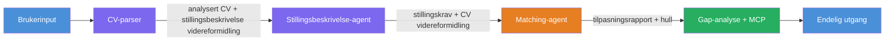

# Modul 1 - Forstå arkitekturen

⏱️ ~5 min

Før du skriver kode, her er en rask oversikt over hva du bygger og hvordan det fungerer.

---

## Hva du bygger

Du limer inn en **CV** og en **stillingsbeskrivelse**. Arbeidsflyten returnerer:

- En matchingsscore (0–100 med en detaljert oversikt)
- En liste over ferdighets- og sertifiseringsgap
- En personlig læringsplan med Microsoft Learn-lenker for hvert gap

---

## De fire agentene

En enkelt agent som prøver å analysere, score og planlegge alt på en gang har en tendens til å haste og produsere overfladisk output. Å dele opp arbeidet i fire spesialiserte agenter gir bedre resultater:

| Agent | Hva den gjør |
|-------|-------------|
| **ResumeParser** | Parser CV-en; kopierer stillingsbeskrivelsen ordrett inn i `[JOB DESCRIPTION PASS-THROUGH]` for påfølgende agenter |
| **JobDescriptionAgent** | Utvinner krav fra stillingsbeskrivelsen; videresender `[PARSED RESUME]` som `[PARSED RESUME PASS-THROUGH]` |
| **MatchingAgent** | Sammenligner begge merkede seksjoner; produserer en matchingsscore (0–100) og gapanalyse |
| **GapAnalyzer** | Lager en læringsplan; søker på Microsoft Learn for hvert gap |

---

## Orkestreringsgrafen

Arbeidsflyten er en **sekvensiell pipeline** - hver agent sender output videre til den neste:


```mermaid
flowchart LR
    A["Brukerinput"] --> B["CV-parser"]
    B -- "analysert CV + stillingsbeskrivelse videreformidling" --> C["Stillingsbeskrivelse-agent"]
    C -- "stillingskrav + CV videreformidling" --> D["Matching-agent"]
    D -- "tilpasningsrapport + hull" --> E["Gap-analyse + MCP"]
    E --> F["Endelig utgang"]

    style A fill:#4A90D9,color:#fff
    style B fill:#7B68EE,color:#fff
    style C fill:#7B68EE,color:#fff
    style D fill:#E67E22,color:#fff
    style E fill:#27AE60,color:#fff
    style F fill:#4A90D9,color:#fff
```

1. **ResumeParser** mottar brukerinput, analyserer CV-en, og kopierer stillingsbeskrivelsen inn i `[JOB DESCRIPTION PASS-THROUGH]`.
2. **JD Agent** utvinner strukturerte krav og videresender `[PARSED RESUME PASS-THROUGH]`.
3. **MatchingAgent** sammenligner begge seksjonene og lager en matchingsscore og gapanalyse.
4. **GapAnalyzer** lager læringsplanen og kaller Microsoft Learn MCP-verktøyet for hvert gap.

---

## Hvordan dette mapper til kode

I `main.py` beskriver du denne grafen med `WorkflowBuilder`:

```python
workflow_agent = (
    WorkflowBuilder(
        start_executor=resume_executor,       # første agent til å motta brukerinput
        output_executors=[gap_executor],      # siste agent - dens utgang er svaret
    )
    .add_edge(resume_executor, jd_executor)       # ResumeParser → JD-agent
    .add_edge(jd_executor, matching_executor)     # JD-agent → MatchingAgent
    .add_edge(matching_executor, gap_executor)    # MatchingAgent → GapAnalyzer
    .build()
    .as_agent()
)
```

Hver `Agent` er pakket inn i en `AgentExecutor`. `add_edge()`-kallene definerer en strikt sekvensiell pipeline - hver agent mottar kun output fra sin direkte forløper.

> `context_mode="last_agent"` betyr at hver executor kun ser output fra sin direkte forløper. ResumeParser og JD Agent videresender data i merkede seksjoner slik at hver påfølgende agent har akkurat det den trenger.

---

## MCP-verktøyet

GapAnalyzer har ett verktøy: `search_microsoft_learn_for_plan`. Det kobler til `https://learn.microsoft.com/api/mcp` og returnerer ekte Microsoft Learn-lenker for hvert ferdighetsgap.

Når verktøyet kjører vil du se disse loggene - alt forventet:

```
GET  https://learn.microsoft.com/api/mcp → 405   ← connection probe, normal
POST https://learn.microsoft.com/api/mcp → 200   ← actual tool call
DELETE https://learn.microsoft.com/api/mcp → 405 ← cleanup probe, normal
```

Bare bekymre deg hvis `POST`-forespørselen returnerer en feil.

---

**Forrige:** [00 - Forutsetninger](00-prerequisites.md) · **Neste:** [02 - Bygg prosjektstrukturen →](02-scaffold-multi-agent.md)

---

<!-- CO-OP TRANSLATOR DISCLAIMER START -->
**Ansvarsfraskrivelse**:
Dette dokumentet er oversatt ved hjelp av AI-oversettelsestjenesten [Co-op Translator](https://github.com/Azure/co-op-translator). Selv om vi streber etter nøyaktighet, vær oppmerksom på at automatiske oversettelser kan inneholde feil eller unøyaktigheter. Det opprinnelige dokumentet på originalspråket skal betraktes som den autoritative kilden. For kritisk informasjon anbefales profesjonell menneskelig oversettelse. Vi er ikke ansvarlige for eventuelle misforståelser eller feiltolkninger som oppstår ved bruk av denne oversettelsen.
<!-- CO-OP TRANSLATOR DISCLAIMER END -->