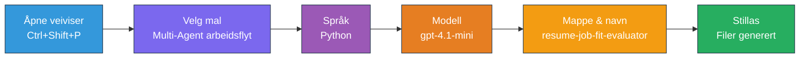
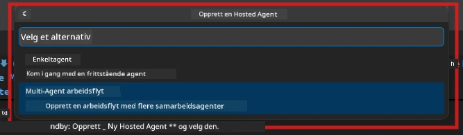

# Module 2 - Still opp Multi-Agent-prosjektet

I denne modulen bruker du [Microsoft Foundry-utvidelsen](https://marketplace.visualstudio.com/items?itemName=TeamsDevApp.vscode-ai-foundry) til å **stille opp et multi-agent arbeidsflytprosjekt**. Utvidelsen genererer hele prosjektstrukturen - `agent.yaml`, `main.py`, `Dockerfile`, `requirements.txt`, `.env`, og feilsøkingskonfigurasjon. Du tilpasser deretter disse filene i modul 3 og 4.

> **Merk:** Mappen `PersonalCareerCopilot/` i dette laboratoriet er et komplett, fungerende eksempel på et tilpasset multi-agent prosjekt. Du kan enten stille opp et nytt prosjekt (anbefales for læring) eller studere den eksisterende koden direkte.

---

## Trinn 1: Åpne Opprett Hosted Agent-veiviseren


1. Trykk `Ctrl+Shift+P` for å åpne **Kommando-paletten**.
2. Skriv: **Microsoft Foundry: Create a New Hosted Agent** og velg det.
3. Veiviseren for hosting av agent åpnes.

> **Alternativ:** Klikk på **Microsoft Foundry**-ikonet i aktivitetsfeltet → klikk på **+**-ikonet ved siden av **Agents** → **Create New Hosted Agent**.

---

## Trinn 2: Velg malen Multi-Agent Workflow

Veiviseren ber deg velge en mal:

| Mal | Beskrivelse | Når brukes |
|----------|-------------|-------------|
| Single Agent | Én agent med instruksjoner og valgfrie verktøy | Lab 01 |
| **Multi-Agent Workflow** | Flere agenter som samarbeider via WorkflowBuilder | **Dette lab (Lab 02)** |

1. Velg **Multi-Agent Workflow**.
2. Klikk **Neste**.



---

## Trinn 3: Velg programmeringsspråk

1. Velg **Python**.
2. Klikk **Neste**.

---

## Trinn 4: Velg modellen din

1. Veiviseren viser modeller som er distribuert i ditt Foundry-prosjekt.
2. Velg samme modell som du brukte i Lab 01 (f.eks. **gpt-4.1-mini**).
3. Klikk **Neste**.

> **Tips:** [`gpt-4.1-mini`](https://learn.microsoft.com/azure/foundry/foundry-models/concepts/models-sold-directly-by-azure#gpt-41-series) anbefales for utvikling – den er rask, rimelig, og håndterer multi-agent arbeidsflyter godt. Bytt til `gpt-4.1` for endelig produksjonsdistribusjon hvis du ønsker høyere kvalitetsutgang.

---

## Trinn 5: Velg mappesteden og agentnavn

1. En fil-dialog åpnes. Velg en målmappe:
   - Hvis du følger med workshop-repoet: naviger til `workshop/lab02-multi-agent/` og opprett en ny undermappe
   - Hvis du starter fra bunnen: velg hvilken som helst mappe
2. Skriv inn et **navn** for den hostede agenten (f.eks. `resume-job-fit-evaluator`).
3. Klikk **Opprett**.

---

## Trinn 6: Vent til oppsettet fullføres

1. VS Code åpner et nytt vindu (eller det nåværende vinduet oppdateres) med det oppsatte prosjektet.
2. Du skal se denne filstrukturen:

```
resume-job-fit-evaluator/
├── .env                ← Environment variables (placeholders)
├── .vscode/
│   └── launch.json     ← Debug configuration
├── agent.yaml          ← Agent definition (kind: hosted)
├── Dockerfile          ← Container configuration
├── main.py             ← Multi-agent workflow code (scaffold)
└── requirements.txt    ← Python dependencies
```

> **Workshop-notat:** I workshop-repositoriet ligger `.vscode/`-mappen i **arbeidsområde-roten** med delte `launch.json` og `tasks.json`. Feilsøkingskonfigurasjonene for Lab 01 og Lab 02 er begge inkludert. Når du trykker F5, velger du **"Lab02 - Multi-Agent"** fra nedtrekksmenyen.

---

## Trinn 7: Forstå de oppsatte filene (spesifikt for multi-agent)

Det multi-agent oppsettet skiller seg fra enkeltagent-oppsettet på flere viktige måter:

### 7.1 `agent.yaml` - Agentdefinisjon

```yaml
kind: hosted
name: resume-job-fit-evaluator
description: >
  A multi-agent workflow that evaluates resume-to-job fit.
metadata:
  authors:
    - Microsoft
  tags:
    - Multi-Agent Workflow
    - Resume Evaluator
protocols:
  - protocol: responses
    version: v1
environment_variables:
  - name: PROJECT_ENDPOINT
    value: ${PROJECT_ENDPOINT}
  - name: MODEL_DEPLOYMENT_NAME
    value: ${MODEL_DEPLOYMENT_NAME}
```

**Viktig forskjell fra Lab 01:** Seksjonen `environment_variables` kan inkludere flere variabler for MCP-endepunkter eller annen verktøykonfigurasjon. `name` og `description` reflekterer multi-agent brukstilfellet.

### 7.2 `main.py` - Multi-agent arbeidsflyt-kode

Oppsettet inkluderer:
- **Flere agentinstruksjonsstrenger** (en konstant per agent)
- **Flere [`AzureAIAgentClient.as_agent()`](https://learn.microsoft.com/python/api/overview/azure/ai-agents-readme) kontekstbehandlere** (en per agent)
- **[`WorkflowBuilder`](https://learn.microsoft.com/agent-framework/workflows/agents-in-workflows)** for å koble agentene sammen
- **`from_agent_framework()`** for å serve arbeidsflyten som et HTTP-endepunkt

```python
from agent_framework import WorkflowBuilder, tool
from agent_framework.azure import AzureAIAgentClient
from azure.ai.agentserver.agentframework import from_agent_framework
```

Den ekstra importen [`WorkflowBuilder`](https://learn.microsoft.com/agent-framework/workflows/agents-in-workflows) er ny sammenlignet med Lab 01.

### 7.3 `requirements.txt` - Tilleggsavhengigheter

Multi-agent-prosjektet bruker de samme basis-pakkene som Lab 01, pluss eventuelle MCP-relaterte pakker:

```
agent-framework-azure-ai==1.0.0rc3
agent-framework-core==1.0.0rc3
azure-ai-agentserver-agentframework==1.0.0b16
azure-ai-agentserver-core==1.0.0b16
debugpy
agent-dev-cli --pre
```

> **Viktig versjonsnotat:** Pakken `agent-dev-cli` krever flagget `--pre` i `requirements.txt` for å installere siste forhåndsvisningsversjon. Dette er nødvendig for kompatibilitet med Agent Inspector med `agent-framework-core==1.0.0rc3`. Se [Modul 8 - Feilsøking](08-troubleshooting.md) for versjonsdetaljer.

| Pakke | Versjon | Formål |
|---------|---------|---------|
| [`agent-framework-azure-ai`](https://learn.microsoft.com/agent-framework/overview/) | `1.0.0rc3` | Azure AI-integrasjon for [Microsoft Agent Framework](https://github.com/microsoft/agent-framework) |
| [`agent-framework-core`](https://learn.microsoft.com/agent-framework/overview/) | `1.0.0rc3` | Kjerne runtime (inkluderer WorkflowBuilder) |
| `azure-ai-agentserver-agentframework` | `1.0.0b16` | Runtime for hosted agent-server |
| `azure-ai-agentserver-core` | `1.0.0b16` | Kjerne-abstraksjoner for agent-server |
| `debugpy` | siste | Python feilsøking (F5 i VS Code) |
| `agent-dev-cli` | `--pre` | Lokalt utviklings-CLI + Agent Inspector backend |

### 7.4 `Dockerfile` - Samme som Lab 01

Dockerfile er identisk med den i Lab 01 - den kopierer filer, installerer avhengigheter fra `requirements.txt`, åpner port 8088, og kjører `python main.py`.

```dockerfile
FROM python:3.14-slim
WORKDIR /app
COPY ./ .
RUN pip install --upgrade pip && \
    if [ -f requirements.txt ]; then \
        pip install -r requirements.txt; \
    else \
      echo "No requirements.txt found" >&2; exit 1; \
    fi
EXPOSE 8088
CMD ["python", "main.py"]
```

---

### Sjekkpunkt

- [ ] Veiviseren for oppsett er fullført → ny prosjektstruktur er synlig
- [ ] Du kan se alle filer: `agent.yaml`, `main.py`, `Dockerfile`, `requirements.txt`, `.env`
- [ ] `main.py` inkluderer import av `WorkflowBuilder` (bekrefter at multi-agent malen ble valgt)
- [ ] `requirements.txt` inkluderer både `agent-framework-core` og `agent-framework-azure-ai`
- [ ] Du forstår hvordan multi-agent oppsettet skiller seg fra enkeltagent-oppsett (flere agenter, WorkflowBuilder, MCP-verktøy)

---

**Forrige:** [01 - Understand Multi-Agent Architecture](01-understand-multi-agent.md) · **Neste:** [03 - Configure Agents & Environment →](03-configure-agents.md)

---

<!-- CO-OP TRANSLATOR DISCLAIMER START -->
**Ansvarsfraskrivelse**:  
Dette dokumentet er oversatt ved hjelp av AI-oversettelsestjenesten [Co-op Translator](https://github.com/Azure/co-op-translator). Selv om vi streber etter nøyaktighet, vennligst vær oppmerksom på at automatiske oversettelser kan inneholde feil eller unøyaktigheter. Det opprinnelige dokumentet på originalspråket bør betraktes som den autoritative kilden. For kritisk informasjon anbefales profesjonell menneskelig oversettelse. Vi er ikke ansvarlige for eventuelle misforståelser eller feiltolkninger som oppstår fra bruk av denne oversettelsen.
<!-- CO-OP TRANSLATOR DISCLAIMER END -->