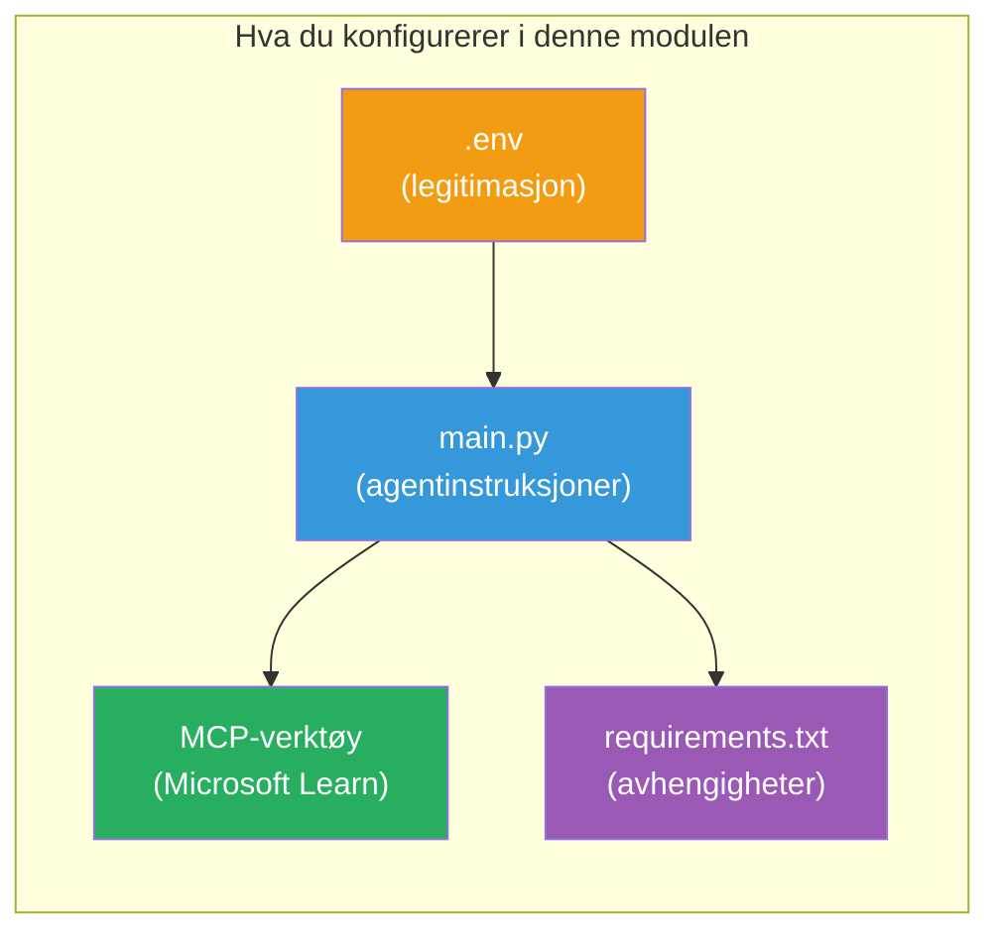

# Modul 3 - Konfigurer agenter, MCP-verktøy og miljø

I denne modulen tilpasser du det stillaslagte multi-agent prosjektet. Du skal skrive instruksjoner for alle fire agenter, sette opp MCP-verktøyet for Microsoft Learn, konfigurere miljøvariabler og installere avhengigheter.


> **Referanse:** Den komplette fungerende koden finnes i [`PersonalCareerCopilot/main.py`](../../../../../workshop/lab02-multi-agent/PersonalCareerCopilot/main.py). Bruk den som referanse mens du bygger din egen.

---

## Steg 1: Konfigurer miljøvariabler

1. Åpne **`.env`**-filen i prosjektets rotmappe.
2. Fyll inn detaljene for ditt Foundry-prosjekt:

   ```env
   PROJECT_ENDPOINT=https://<your-account>.services.ai.azure.com/api/projects/<your-project>
   MODEL_DEPLOYMENT_NAME=gpt-4.1-mini
   ```

3. Lagre filen.

### Hvor du kan finne disse verdiene

| Verdi | Hvordan finne den |
|-------|-------------------|
| **Prosjekt-endepunkt** | Microsoft Foundry sidemeny → klikk på prosjektet ditt → endepunkt-URL i detaljvisning |
| **Modell distribusjonsnavn** | Foundry sidemeny → utvid prosjektet → **Modeller + endepunkter** → navn ved siden av distribuert modell |

> **Sikkerhet:** Ikke legg `.env` inn i versjonskontroll. Legg den til i `.gitignore` hvis det ikke allerede er gjort.

### Kartlegging av miljøvariabler

Multi-agent `main.py` leser både standard og workshop-spesifikke miljøvariabelnavn:

```python
PROJECT_ENDPOINT = os.getenv("AZURE_AI_PROJECT_ENDPOINT") or os.getenv("PROJECT_ENDPOINT")
MODEL_DEPLOYMENT_NAME = os.getenv(
    "AZURE_AI_MODEL_DEPLOYMENT_NAME",
    os.getenv("MODEL_DEPLOYMENT_NAME", "gpt-4.1-mini"),
)
MICROSOFT_LEARN_MCP_ENDPOINT = os.getenv(
    "MICROSOFT_LEARN_MCP_ENDPOINT", "https://learn.microsoft.com/api/mcp"
)
```

MCP-endepunktet har en fornuftig standardverdi - du trenger ikke å sette det i `.env` med mindre du vil overstyre det.

---

## Steg 2: Skriv agentinstruksjoner

Dette er det mest kritiske steget. Hver agent trenger nøye utformede instruksjoner som definerer dens rolle, utdataformat og regler. Åpne `main.py` og opprett (eller endre) instruksjonskonstantene.

### 2.1 CV-parser-agent

```python
RESUME_PARSER_INSTRUCTIONS = """\
You are the Resume Parser.
Extract resume text into a compact, structured profile for downstream matching.

Output exactly these sections:
1) Candidate Profile
2) Technical Skills (grouped categories)
3) Soft Skills
4) Certifications & Awards
5) Domain Experience
6) Notable Achievements

Rules:
- Use only explicit or strongly implied evidence.
- Do not invent skills, titles, or experience.
- Keep concise bullets; no long paragraphs.
- If input is not a resume, return a short warning and request resume text.
"""
```

**Hvorfor disse seksjonene?** MatchingAgent trenger strukturert data å score mot. Konsistente seksjoner gjør overlevering mellom agenter pålitelig.

### 2.2 Jobbbeskrivelses-agent

```python
JOB_DESCRIPTION_INSTRUCTIONS = """\
You are the Job Description Analyst.
Extract a structured requirement profile from a JD.

Output exactly these sections:
1) Role Overview
2) Required Skills
3) Preferred Skills
4) Experience Required
5) Certifications Required
6) Education
7) Domain / Industry
8) Key Responsibilities

Rules:
- Keep required vs preferred clearly separated.
- Only use what the JD states; do not invent hidden requirements.
- Flag vague requirements briefly.
- If input is not a JD, return a short warning and request JD text.
"""
```

**Hvorfor skille på krav og ønsket?** MatchingAgent bruker ulike vekter for hver (Nødvendige ferdigheter = 40 poeng, Foretrukne ferdigheter = 10 poeng).

### 2.3 Matching-agent

```python
MATCHING_AGENT_INSTRUCTIONS = """\
You are the Matching Agent.
Compare parsed resume output vs JD output and produce an evidence-based fit report.

Scoring (100 total):
- Required Skills 40
- Experience 25
- Certifications 15
- Preferred Skills 10
- Domain Alignment 10

Output exactly these sections:
1) Fit Score (with breakdown math)
2) Matched Skills
3) Missing Skills
4) Partially Matched
5) Experience Alignment
6) Certification Gaps
7) Overall Assessment

Rules:
- Be objective and evidence-only.
- Keep partial vs missing separate.
- Keep Missing Skills precise; it feeds roadmap planning.
"""
```

**Hvorfor eksplisitt poengsetting?** Reproduserbar poenggiving gjør det mulig å sammenligne kjøringer og feilsøke problemer. 100-poengs skala er lett for brukere å forstå.

### 2.4 Gap-analysator-agent

```python
GAP_ANALYZER_INSTRUCTIONS = """\
You are the Gap Analyzer and Roadmap Planner.
Create a practical upskilling plan from the matching report.

Microsoft Learn MCP usage (required):
- For EVERY High and Medium priority gap, call tool `search_microsoft_learn_for_plan`.
- Use returned Learn links in Suggested Resources.
- Prefer Microsoft Learn for free resources.

CRITICAL: You MUST produce a SEPARATE detailed gap card for EVERY skill listed in
the Missing Skills and Certification Gaps sections of the matching report. Do NOT
skip or combine gaps. Do NOT summarize multiple gaps into one card.

Output format:
1) Personalized Learning Roadmap for [Role Title]
2) One DETAILED card per gap (produce ALL cards, not just the first):
   - Skill
   - Priority (High/Medium/Low)
   - Current Level
   - Target Level
   - Suggested Resources (include Learn URL from tool results)
   - Estimated Time
   - Quick Win Project
3) Recommended Learning Order (numbered list)
4) Timeline Summary (week-by-week)
5) Motivational Note

Rules:
- Produce every gap card before writing the summary sections.
- Keep it specific, realistic, and actionable.
- Tailor to candidate's existing stack.
- If fit >= 80, focus on polish/interview readiness.
- If fit < 40, be honest and provide a staged path.
"""
```

**Hvorfor "KRITISK" vektlegging?** Uten eksplisitte instruksjoner om å produsere ALLE gap-kort, har modellen en tendens til å generere bare 1-2 kort og oppsummere resten. "KRITISK"-blokken forhindrer denne forkortelsen.

---

## Steg 3: Definer MCP-verktøyet

GapAnalyzer bruker et verktøy som kaller [Microsoft Learn MCP-serveren](https://learn.microsoft.com/azure/foundry/agents/how-to/tools/model-context-protocol). Legg til dette i `main.py`:

```python
import json
from agent_framework import tool
from mcp.client.session import ClientSession
from mcp.client.streamable_http import streamable_http_client

@tool
async def search_microsoft_learn_for_plan(
    skill: str, role: str = "", max_results: int = 5
) -> str:
    """Search Microsoft Learn MCP and return curated official links for roadmap planning."""
    query = " ".join(part for part in [skill, role, "learning path module"] if part).strip()
    query = query or "job skills learning path"

    try:
        async with streamable_http_client(MICROSOFT_LEARN_MCP_ENDPOINT) as (
            read_stream, write_stream, _,
        ):
            async with ClientSession(read_stream, write_stream) as session:
                await session.initialize()
                result = await session.call_tool(
                    "microsoft_docs_search", {"query": query}
                )

        if not result.content:
            return (
                "No results returned from Microsoft Learn MCP. "
                "Fallback: https://learn.microsoft.com/training/support/catalog-api"
            )

        payload_text = getattr(result.content[0], "text", "")
        data = json.loads(payload_text) if payload_text else {}
        items = data.get("results", [])[:max(1, min(max_results, 10))]

        if not items:
            return f"No direct Microsoft Learn results found for '{skill}'."

        lines = [f"Microsoft Learn resources for '{skill}':"]
        for i, item in enumerate(items, start=1):
            title = item.get("title") or item.get("url") or "Microsoft Learn Resource"
            url = item.get("url") or item.get("link") or ""
            lines.append(f"{i}. {title} - {url}".rstrip(" -"))
        return "\n".join(lines)
    except Exception as ex:
        return (
            f"Microsoft Learn MCP lookup unavailable. Reason: {ex}. "
            "Fallbacks: https://learn.microsoft.com/api/mcp"
        )
```

### Hvordan verktøyet fungerer

| Steg | Hva skjer |
|------|-----------|
| 1 | GapAnalyzer bestemmer at den trenger ressurser for en ferdighet (f.eks., "Kubernetes") |
| 2 | Rammeverket kaller `search_microsoft_learn_for_plan(skill="Kubernetes")` |
| 3 | Funksjonen åpner [Streamable HTTP](https://learn.microsoft.com/agent-framework/agents/tools/hosted-mcp-tools)-tilkobling til `https://learn.microsoft.com/api/mcp` |
| 4 | Kaller `microsoft_docs_search` på [MCP-serveren](https://learn.microsoft.com/azure/foundry/agents/how-to/tools/model-context-protocol) |
| 5 | MCP-serveren returnerer søkeresultater (tittel + URL) |
| 6 | Funksjonen formaterer resultatene som en nummerert liste |
| 7 | GapAnalyzer inkluderer URL-ene i gap-kortet |

### MCP-avhengigheter

MCP-klientbibliotekene er inkludert transitivt via [`agent-framework-core`](https://learn.microsoft.com/agent-framework/overview/). Du trenger **ikke** legge dem til separat i `requirements.txt`. Hvis du får importfeil, sjekk:

```powershell
pip list | Select-String "mcp"
```

Forventet: `mcp`-pakken er installert (versjon 1.x eller nyere).

---

## Steg 4: Koble sammen agentene og arbeidsflyten

### 4.1 Opprett agenter med kontekstbehandlere

```python
from contextlib import asynccontextmanager

@asynccontextmanager
async def create_agents():
    async with (
        get_credential() as credential,
        AzureAIAgentClient(
            project_endpoint=PROJECT_ENDPOINT,
            model_deployment_name=MODEL_DEPLOYMENT_NAME,
            credential=credential,
        ).as_agent(
            name="ResumeParser",
            instructions=RESUME_PARSER_INSTRUCTIONS,
        ) as resume_parser,
        AzureAIAgentClient(
            project_endpoint=PROJECT_ENDPOINT,
            model_deployment_name=MODEL_DEPLOYMENT_NAME,
            credential=credential,
        ).as_agent(
            name="JobDescriptionAgent",
            instructions=JOB_DESCRIPTION_INSTRUCTIONS,
        ) as jd_agent,
        AzureAIAgentClient(
            project_endpoint=PROJECT_ENDPOINT,
            model_deployment_name=MODEL_DEPLOYMENT_NAME,
            credential=credential,
        ).as_agent(
            name="MatchingAgent",
            instructions=MATCHING_AGENT_INSTRUCTIONS,
        ) as matching_agent,
        AzureAIAgentClient(
            project_endpoint=PROJECT_ENDPOINT,
            model_deployment_name=MODEL_DEPLOYMENT_NAME,
            credential=credential,
        ).as_agent(
            name="GapAnalyzer",
            instructions=GAP_ANALYZER_INSTRUCTIONS,
            tools=[search_microsoft_learn_for_plan],
        ) as gap_analyzer,
    ):
        yield resume_parser, jd_agent, matching_agent, gap_analyzer
```

**Nøkkelpunkter:**
- Hver agent har sin **egen** `AzureAIAgentClient`-instans
- Bare GapAnalyzer får `tools=[search_microsoft_learn_for_plan]`
- `get_credential()` returnerer [`ManagedIdentityCredential`](https://learn.microsoft.com/python/api/overview/azure/identity-readme#managed-identity-support) i Azure, [`DefaultAzureCredential`](https://learn.microsoft.com/azure/developer/python/sdk/authentication/credential-chains#defaultazurecredential-overview) lokalt

### 4.2 Bygg arbeidsflyt-grafen

```python
def create_workflow(resume_parser, jd_agent, matching_agent, gap_analyzer):
    workflow = (
        WorkflowBuilder(
            name="ResumeJobFitEvaluator",
            start_executor=resume_parser,
            output_executors=[gap_analyzer],
        )
        .add_edge(resume_parser, jd_agent)
        .add_edge(resume_parser, matching_agent)
        .add_edge(jd_agent, matching_agent)
        .add_edge(matching_agent, gap_analyzer)
        .build()
    )
    return workflow.as_agent()
```

> Se [Workflows as Agents](https://learn.microsoft.com/agent-framework/workflows/as-agents) for å forstå `.as_agent()`-mønsteret.

### 4.3 Start serveren

```python
async def main() -> None:
    validate_configuration()
    async with create_agents() as (resume_parser, jd_agent, matching_agent, gap_analyzer):
        agent = create_workflow(resume_parser, jd_agent, matching_agent, gap_analyzer)
        from azure.ai.agentserver.agentframework import from_agent_framework
        await from_agent_framework(agent).run_async()

if __name__ == "__main__":
    asyncio.run(main())
```

---

## Steg 5: Opprett og aktiver virtuelt miljø

### 5.1 Opprett miljøet

```powershell
cd workshop\lab02-multi-agent\PersonalCareerCopilot
python -m venv .venv
```

### 5.2 Aktiver det

**PowerShell (Windows):**
```powershell
.\.venv\Scripts\Activate.ps1
```

**macOS/Linux:**
```bash
source .venv/bin/activate
```

### 5.3 Installer avhengigheter

```powershell
pip install -r requirements.txt
```

> **Merk:** Linjen `agent-dev-cli --pre` i `requirements.txt` sikrer at siste forhåndsvisningsversjon installeres. Dette kreves for kompatibilitet med `agent-framework-core==1.0.0rc3`.

### 5.4 Verifiser installasjon

```powershell
pip list | Select-String "agent-framework|agentserver|agent-dev"
```

Forventet utdata:
```
agent-dev-cli                  0.0.1b260316
agent-framework-azure-ai       1.0.0rc3
agent-framework-core            1.0.0rc3
azure-ai-agentserver-agentframework 1.0.0b16
azure-ai-agentserver-core      1.0.0b16
```

> **Hvis `agent-dev-cli` viser en eldre versjon** (f.eks. `0.0.1b260119`), vil Agent Inspector feile med 403/404 feil. Oppgrader: `pip install agent-dev-cli --pre --upgrade`

---

## Steg 6: Verifiser autentisering

Kjør samme autentiseringstest som i Lab 01:

```powershell
az account show --query "{name:name, id:id}" --output table
```

Hvis dette feiler, kjør [`az login`](https://learn.microsoft.com/cli/azure/authenticate-azure-cli-interactively).

For multi-agent arbeidsflyter deler alle fire agenter samme legitimasjon. Hvis autentisering fungerer for én, fungerer det for alle.

---

### Sjekkliste

- [ ] `.env` har gyldige verdier for `PROJECT_ENDPOINT` og `MODEL_DEPLOYMENT_NAME`
- [ ] Alle 4 agentinstruksjonskonstanter er definert i `main.py` (ResumeParser, JD Agent, MatchingAgent, GapAnalyzer)
- [ ] MCP-verktøyet `search_microsoft_learn_for_plan` er definert og registrert for GapAnalyzer
- [ ] `create_agents()` oppretter alle 4 agenter med individuelle `AzureAIAgentClient`-instanser
- [ ] `create_workflow()` bygger korrekt graf med `WorkflowBuilder`
- [ ] Virtuelt miljø er opprettet og aktivert (`(.venv)` synlig)
- [ ] `pip install -r requirements.txt` fullføres uten feil
- [ ] `pip list` viser alle forventede pakker på korrekte versjoner (rc3 / b16)
- [ ] `az account show` returnerer abonnementet ditt

---

**Forrige:** [02 - Scaffold Multi-Agent Project](02-scaffold-multi-agent.md) · **Neste:** [04 - Orkestreringsmønstre →](04-orchestration-patterns.md)

---

<!-- CO-OP TRANSLATOR DISCLAIMER START -->
**Ansvarsfraskrivelse**:  
Dette dokumentet er oversatt ved hjelp av AI-oversettingstjenesten [Co-op Translator](https://github.com/Azure/co-op-translator). Selv om vi streber etter nøyaktighet, vennligst vær oppmerksom på at automatiske oversettelser kan inneholde feil eller unøyaktigheter. Det opprinnelige dokumentet på sitt opprinnelige språk bør betraktes som den autoritative kilden. For kritisk informasjon anbefales profesjonell menneskelig oversettelse. Vi er ikke ansvarlige for eventuelle misforståelser eller feiltolkninger som oppstår ved bruk av denne oversettelsen.
<!-- CO-OP TRANSLATOR DISCLAIMER END -->