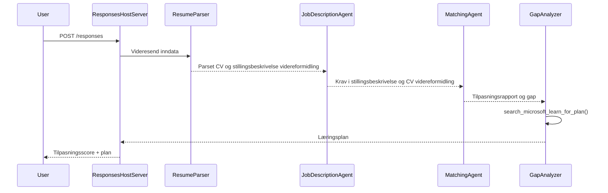

# Modul 3 - Konfigurer instruksjoner, miljø og installer avhengigheter

⏱️ ~15 min

I denne modulen transformerer du den skjemalagte stubben til **din** fleragent-arbeidsflyt - ved å sette miljøvariabler, skrive agentinstruksjoner, legge til MCP-verktøyet, koble arbeidsflyt grafen, og installere avhengigheter.

> **Referanse:** Den komplette fungerende koden finnes i [`PersonalCareerCopilot/main.py`](../../../../../workshop/lab02-multi-agent/PersonalCareerCopilot/main.py). Bruk den som referanse mens du bygger din egen arbeidsflyt graf og prompt-blokker.

---

## Hvordan de fire agentene passer sammen


```mermaid
sequenceDiagram
    participant User
    participant Server as ResponsesHostServer
    participant RP as ResumeParser
    participant JD as JobDescriptionAgent
    participant MA as MatchingAgent
    participant GA as GapAnalyzer

    User->>Server: POST /responses
    Server->>RP: Videresend inndata
    RP-->>JD: Parset CV og stillingsbeskrivelse videreformidling
    JD-->>MA: Krav i stillingsbeskrivelse og CV videreformidling
    MA-->>GA: Tilpasningsrapport og gap
    GA->>GA: search_microsoft_learn_for_plan()
    GA-->>Server: Læringsplan
    Server-->>User: Tilpasningsscore + plan
```

---

## Steg 1: Konfigurer miljøvariabler

1. Åpne **`.env`** filen i ditt prosjektrot (opprettet av skjelettveiviseren).
2. Erstatt plassholderne med dine faktiske verdier fra Lab 01.

<details open>
<summary><strong>🅰️ Vei A - Foundry abonnement</strong></summary>

```env
FOUNDRY_PROJECT_ENDPOINT=https://<your-account>.services.ai.azure.com/api/projects/<your-project>
AZURE_AI_MODEL_DEPLOYMENT_NAME=gpt-4.1-mini
```

> **Hvor finne verdier:** Se [Lab 01, Modul 1](../../lab01-single-agent/docs/01-setup.md#deploy-a-model--assign-rbac).

</details>

<details open>
<summary><strong>🅱️ Vei B - Foundry Lokalt</strong></summary>

```env
FOUNDRY_PROJECT_ENDPOINT=http://localhost:5273/v1
AZURE_AI_MODEL_DEPLOYMENT_NAME=phi-4-mini
```

> All inferens kjører på din maskin - ingen data forlater enheten din. Kjør `foundry model list` for å bekrefte nøyaktig modellalias. Den eneste utgående forespørselen er MCP-verktøyanrop til `https://learn.microsoft.com/api/mcp`.

> **Hvor finne verdier:** Se [Lab 01, Modul 1 - lokal vei](../../lab01-single-agent/docs/01-setup.md#step-2-set-up-based-on-your-access).

</details>

> **Sikkerhet:** Ikke sjekk inn `.env` i versjonskontroll. Den skal allerede være i `.gitignore`.

---

## Steg 2: Skriv agentinstruksjoner

Instruksjoner definerer hver agents rolle, utdataformat og regler. Åpne `main.py` og definer (eller erstatt) de fire instruksjonskonstantene - de komplette strengene finnes i [`PersonalCareerCopilot/main.py`](../../../../../workshop/lab02-multi-agent/PersonalCareerCopilot/main.py).

### 2.1 `RESUME_PARSER_INSTRUCTIONS`
Parser CV-en til en strukturert kandidatprofil **og** kopierer stillingsbeskrivelsen ordrett til `[JOB DESCRIPTION PASS-THROUGH]`. Begge merkede seksjoner må vises i utdata.

> **Hvorfor pass-through?** Med `context_mode="last_agent"` er ResumeParser den **eneste** agenten som ser den opprinnelige brukermeldingen. Hvis den ikke kopierer jobb-beskrivelsen videre, ser ikke downstream-agentene den.

### 2.2 `JOB_DESCRIPTION_INSTRUCTIONS`
Leser `[PARSED RESUME]` og `[JOB DESCRIPTION PASS-THROUGH]` fra ResumeParser-utdata. Leverer `[JD REQUIREMENTS]` (strukturerte krav) og `[PARSED RESUME PASS-THROUGH]` (ordrett CV-kopi for MatchingAgent).

### 2.3 `MATCHING_AGENT_INSTRUCTIONS`
Leser `[JD REQUIREMENTS]` og `[PARSED RESUME PASS-THROUGH]`. Lager en poengsatt matchrapport (0–100) med brutt ned matematikk, matchede ferdigheter, manglende ferdigheter og erfaringsjustering.

### 2.4 `GAP_ANALYZER_INSTRUCTIONS`
Leser matchrapporten. For **hver** manglende ferdighet kaller den `search_microsoft_learn_for_plan` for å hente Microsoft Learn-ressurser. Lager ett detaljert gap-kort per ferdighet pluss en ukes-for-ukes læringsplan.

---

## Steg 3: Legg til MCP-verktøyet

GapAnalyzer kaller [Microsoft Learn MCP-serveren](https://learn.microsoft.com/azure/foundry/agents/how-to/tools/model-context-protocol) for å hente reelle læringsressurser for hvert ferdighetsgap. Hele `search_microsoft_learn_for_plan` funksjonen finnes i [`PersonalCareerCopilot/main.py`](../../../../../workshop/lab02-multi-agent/PersonalCareerCopilot/main.py).

Registrer verktøyet på GapAnalyzer når du oppretter agenten:

```python
gap_analyzer = Agent(
    client=client,
    instructions=GAP_ANALYZER_INSTRUCTIONS,
    name="GapAnalyzer",
    tools=[search_microsoft_learn_for_plan],
)
```

> Se [`PersonalCareerCopilot/main.py`](../../../../../workshop/lab02-multi-agent/PersonalCareerCopilot/main.py) for komplett `WorkflowBuilder` graf med `FoundryChatClient`, `AgentExecutor`, og alle `add_edge()` kall.

---

## Steg 4: Opprett virtuelt miljø og installer avhengigheter

> ⚠️ **Ikke hopp over dette steget.** Uten installerte avhengigheter vil ikke F5 feilsøking fungere.

### 4.1 Opprett det virtuelle miljøet

```powershell
python -m venv .venv
```

### 4.2 Aktiver det

| OS | Kommando |
|----|---------|
| **Windows (PowerShell)** | `.\.venv\Scripts\Activate.ps1` |
| **Windows (CMD)** | `.venv\Scripts\activate.bat` |
| **macOS / Linux** | `source .venv/bin/activate` |

Du skal se `(.venv)` i terminalprompten din.

### 4.3 Installer avhengigheter

```powershell
pip install -r requirements.txt
```

### 4.4 Verifiser

```powershell
pip list | Select-String "agent-framework|mcp|debugpy"
```

Forventet: `agent-framework-foundry`, `agent-framework-foundry-hosting`, `mcp`, og `debugpy` listes opp.

---

## Steg 5: Verifiser autentisering

<details open>
<summary><strong>🅰️ Vei A - Azure legitimasjon</strong></summary>

```powershell
az account show --query "{name:name, id:id}" --output table
```

Hvis dette feiler, kjør [`az login`](https://learn.microsoft.com/cli/azure/authenticate-azure-cli-interactively).

Alle fire agentene deler en `FoundryChatClient` og en `DefaultAzureCredential`. Om autentisering fungerer for én, fungerer det for alle.

</details>

<details open>
<summary><strong>🅱️ Vei B - Foundry Lokalt</strong></summary>

Ingen autentisering kreves for lokal testing.

</details>

---

### ✅ Kontrollpunkt

> Ikke gå videre til Modul 04 før: **(1)** `(.venv)` vises i prompten DIN OG **(2)** `pip install -r requirements.txt` er fullført uten feil.

- [ ] `.env` har gyldig endepunkt og modell distribusjonsnavn (ikke plassholdere)
- [ ] Alle 4 agentinstruksjonskonstanter definert i `main.py` (ResumeParser, JD Agent, MatchingAgent, GapAnalyzer)
- [ ] `search_microsoft_learn_for_plan` MCP-verktøy definert og registrert på GapAnalyzer
- [ ] `FoundryChatClient` + 4 `Agent` + 4 `AgentExecutor` objekter opprettet i `main()`
- [ ] `WorkflowBuilder` bygger korrekt sekvensiell graf med alle 3 `add_edge()` kall
- [ ] Virtuelt miljø opprettet og aktivert (`(.venv)` synlig i prompt)
- [ ] `pip install -r requirements.txt` fullført uten feil
- [ ] **Vei A:** `az account show` lykkes ELLER VS Code Accounts-ikon viser pålogget konto

---

**Forrige:** [02 - Scaffold Multi-Agent Project](02-scaffold-multi-agent.md) · **Neste:** [04 - Orchestration Patterns →](04-orchestration-patterns.md)

---

<!-- CO-OP TRANSLATOR DISCLAIMER START -->
**Ansvarsfraskrivelse**:
Dette dokumentet er oversatt ved hjelp av AI-oversettelsestjenesten [Co-op Translator](https://github.com/Azure/co-op-translator). Selv om vi streber etter nøyaktighet, vær oppmerksom på at automatiske oversettelser kan inneholde feil eller unøyaktigheter. Det opprinnelige dokumentet på originalspråket skal betraktes som den autoritative kilden. For kritisk informasjon anbefales profesjonell menneskelig oversettelse. Vi er ikke ansvarlige for eventuelle misforståelser eller feiltolkninger som oppstår ved bruk av denne oversettelsen.
<!-- CO-OP TRANSLATOR DISCLAIMER END -->