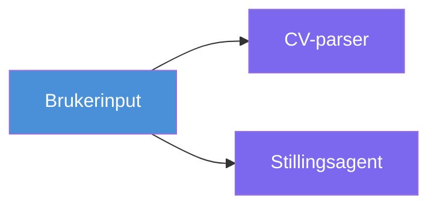
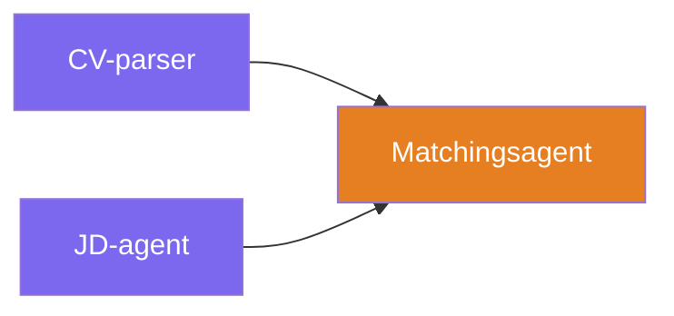
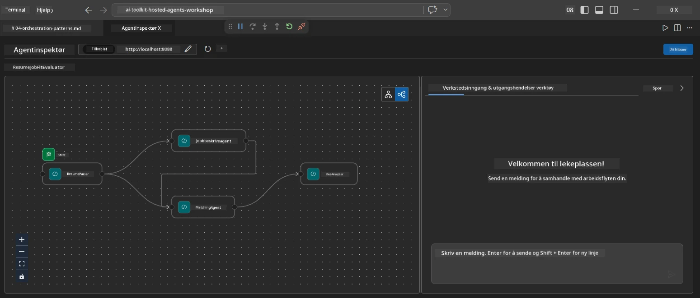
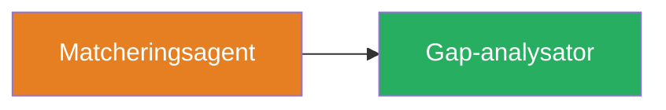
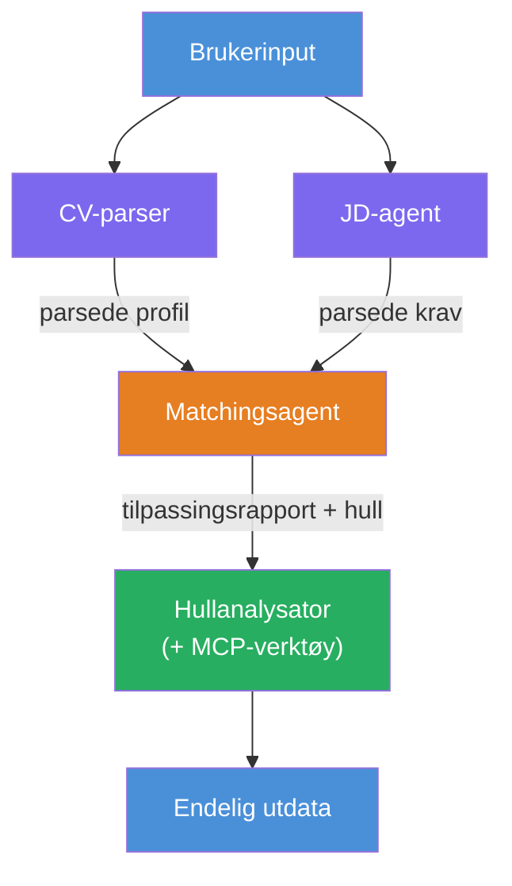
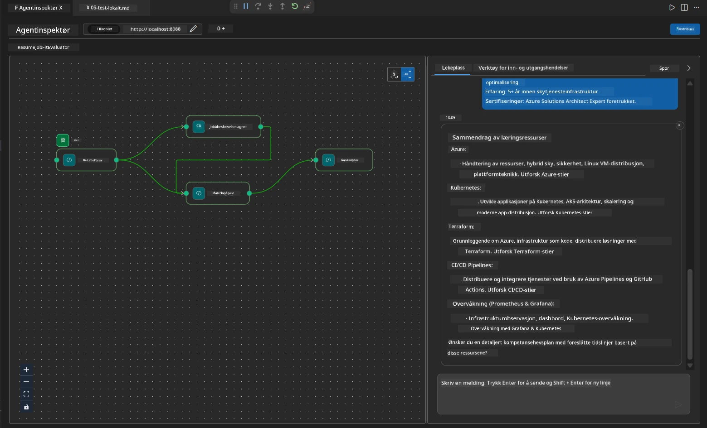

# Module 4 - Orkestreringsmønstre

I denne modulen utforsker du orkestreringsmønstrene brukt i Resume Job Fit Evaluator og lærer hvordan du leser, endrer og utvider arbeidsflytens graf. Å forstå disse mønstrene er essensielt for å feilsøke dataflytproblemer og bygge dine egne [multi-agent arbeidsflyter](https://learn.microsoft.com/agent-framework/workflows/).

---

## Mønster 1: Fan-out (parallell splitt)

Det første mønsteret i arbeidsflyten er **fan-out** - en enkelt inngang sendes til flere agenter samtidig.


I koden skjer dette fordi `resume_parser` er `start_executor` - den mottar først brukerbeskjeden. Siden både `jd_agent` og `matching_agent` har kanter fra `resume_parser`, ruter rammeverket utgangen fra `resume_parser` til begge agenter:

```python
.add_edge(resume_parser, jd_agent)         # ResumeParser-utdata → JD Agent
.add_edge(resume_parser, matching_agent)   # ResumeParser-utdata → MatchingAgent
```

**Hvorfor dette fungerer:** ResumeParser og JD Agent behandler forskjellige aspekter av samme inngang. Å kjøre dem parallelt reduserer total ventetid sammenlignet med sekvensiell kjøring.

### Når bruke fan-out

| Brukstilfelle | Eksempel |
|---------------|----------|
| Uavhengige deloppgaver | Parsing av CV vs. parsing av jobbannonse |
| Redundans / stemming | To agenter analyserer samme data, en tredje velger beste svar |
| Multi-format output | En agent genererer tekst, en annen genererer strukturert JSON |

---

## Mønster 2: Fan-in (aggregasjon)

Det andre mønsteret er **fan-in** - flere agenters utdata samles og sendes til en enkelt agent videre ned i kjeden.


I koden:

```python
.add_edge(resume_parser, matching_agent)   # ResumeParser-utdata → MatchingAgent
.add_edge(jd_agent, matching_agent)        # JD Agent-utdata → MatchingAgent
```

**Nøkkeloppførsel:** Når en agent har **to eller flere inngående kanter**, venter rammeverket automatisk på at **alle** oppstrømsagenter skal fullføre før den kjører nedstrømsagenten. MatchingAgent starter ikke før både ResumeParser og JD Agent er ferdige.

### Det MatchingAgent mottar

Rammeverket sammenføyer utdata fra alle oppstrømsagenter. MatchingAgent sin inngang ser slik ut:

```
[ResumeParser output]
---
Candidate Profile:
  Name: Jane Doe
  Technical Skills: Python, Azure, Kubernetes, ...
  ...

[JobDescriptionAgent output]
---
Role Overview: Senior Cloud Engineer
Required Skills: Python, Azure, Terraform, ...
...
```

> **Merk:** Det eksakte sammenføyningsformatet avhenger av rammeverkets versjon. Agentens instruksjoner bør skrives for å håndtere både strukturert og ustrukturert oppstrømsutdata.



---

## Mønster 3: Sekvensiell kjede

Det tredje mønsteret er **sekvensiell kjeding** - en agents utgang mates direkte inn i neste agent.


I koden:

```python
.add_edge(matching_agent, gap_analyzer)    # MatchingAgent-utdata → GapAnalyzer
```

Dette er det enkleste mønsteret. GapAnalyzer mottar MatchingAgent sin fit-score, matchede/manglende ferdigheter og hull. Den kaller deretter [MCP-verktøyet](https://learn.microsoft.com/azure/foundry/agents/how-to/tools/model-context-protocol) for hvert gap for å hente Microsoft Learn-ressurser.

---

## Hele grafen

Kombinasjonen av alle tre mønstre gir den fullstendige arbeidsflyten:


### Kjøre-tidslinje

```mermaid
gantt
    title Agent Utførelsestidslinje
    dateFormat X
    axisFormat %s

    section Parallell
    Resume Parser       :rp, 0, 3
    JD Agent            :jd, 0, 2

    section Sekvensiell
    Matching Agent      :ma, 3, 5
    Gap Analyzer        :ga, 5, 9
```


> Total veggklokketid er omtrent `max(ResumeParser, JD Agent) + MatchingAgent + GapAnalyzer`. GapAnalyzer er vanligvis tregest fordi den gjør flere MCP-verktøy-kall (ett per gap).

---

## Lese WorkflowBuilder-koden

Her er den komplette `create_workflow()`-funksjonen fra `main.py`, med kommentarer:

```python
def create_workflow(resume_parser, jd_agent, matching_agent, gap_analyzer):
    workflow = (
        WorkflowBuilder(
            name="ResumeJobFitEvaluator",

            # Den første agenten som mottar brukerinput
            start_executor=resume_parser,

            # Agenten(e) hvis output blir det endelige svaret
            output_executors=[gap_analyzer],
        )
        # Fan-out: ResumeParser-output går til både JD-agenten og MatchingAgent
        .add_edge(resume_parser, jd_agent)
        .add_edge(resume_parser, matching_agent)

        # Fan-in: MatchingAgent venter på både ResumeParser og JD-agenten
        .add_edge(jd_agent, matching_agent)

        # Sekvensiell: MatchingAgent-output mater GapAnalyzer
        .add_edge(matching_agent, gap_analyzer)

        .build()
    )
    return workflow.as_agent()
```

### Oppsummeringstabell for kanter

| # | Kant | Mønster | Effekt |
|---|-------|---------|---------|
| 1 | `resume_parser → jd_agent` | Fan-out | JD Agent mottar ResumeParser sin output (pluss original brukerinput) |
| 2 | `resume_parser → matching_agent` | Fan-out | MatchingAgent mottar ResumeParser sin output |
| 3 | `jd_agent → matching_agent` | Fan-in | MatchingAgent mottar også JD Agent sin output (venter på begge) |
| 4 | `matching_agent → gap_analyzer` | Sekvensiell | GapAnalyzer mottar fit-rapport + liste over gap |

---

## Endre grafen

### Legge til ny agent

For å legge til en femte agent (f.eks. en **InterviewPrepAgent** som genererer intervjuspørsmål basert på gap-analysen):

```python
# 1. Definer instruksjoner
INTERVIEW_PREP_INSTRUCTIONS = """\
You are the Interview Prep Agent.
Given a gap analysis and fit report, generate 10 targeted interview questions
the candidate should prepare for.
"""

# 2. Opprett agenten (inne i async with-blokken)
AzureAIAgentClient(
    project_endpoint=PROJECT_ENDPOINT,
    model_deployment_name=MODEL_DEPLOYMENT_NAME,
    credential=credential,
).as_agent(
    name="InterviewPrepAgent",
    instructions=INTERVIEW_PREP_INSTRUCTIONS,
) as interview_prep,

# 3. Legg til kanter i create_workflow()
.add_edge(matching_agent, interview_prep)   # mottar tilpasningsrapport
.add_edge(gap_analyzer, interview_prep)     # mottar også gap-kort

# 4. Oppdater output_executors
output_executors=[interview_prep],  # nå den endelige agenten
```

### Endre kjørerekkefølge

For å ordne at JD Agent kjører **etter** ResumeParser (sekvensiell i stedet for parallell):

```python
# Fjern: .add_edge(resume_parser, jd_agent)  ← eksisterer allerede, behold den
# Fjern den implisitte parallelliteten ved Å IKKE la jd_agent motta brukerinput direkte
# start_executor sender til resume_parser først, og jd_agent får bare
# output fra resume_parser via kanten. Dette gjør dem sekvensielle.
```

> **Viktig:** `start_executor` er den eneste agenten som mottar rå brukerinput. Alle andre agenter mottar output fra sine oppstrømskanter. Hvis du ønsker at en agent også skal motta rå brukerinput, må den ha en kant fra `start_executor`.

---

## Vanlige graffeil

| Feil | Symptom | Løsning |
|-------|----------|---------|
| Manglende kant til `output_executors` | Agent kjører men output er tom | Sørg for at det finnes en vei fra `start_executor` til hver agent i `output_executors` |
| Sirkulært avhengighet | Uendelig løkke eller timeout | Sjekk at ingen agent mater tilbake til en oppstrømsagent |
| Agent i `output_executors` uten inngående kant | Tom output | Legg til minst én `add_edge(source, that_agent)` |
| Flere `output_executors` uten fan-in | Output inneholder bare én agents svar | Bruk en enkelt output-agent som aggregerer, eller aksepter flere outputs |
| Manglende `start_executor` | `ValueError` ved bygging | Spesifiser alltid `start_executor` i `WorkflowBuilder()` |

---

## Feilsøking av grafen

### Bruke Agent Inspector

1. Start agenten lokalt (F5 eller terminal - se [Modul 5](05-test-locally.md)).
2. Åpne Agent Inspector (`Ctrl+Shift+P` → **Foundry Toolkit: Open Agent Inspector**).
3. Send en testmelding.
4. I Inspector sitt svarpanel, se etter **streaming output** - den viser hver agents bidrag i rekkefølge.



### Bruke logging

Legg til logging i `main.py` for å spore dataflyt:

```python
import logging
logger = logging.getLogger("resume-job-fit")

# I create_workflow(), etter bygging:
logger.info("Workflow graph built with edges: RP→JD, RP→MA, JD→MA, MA→GA")
```

Server-loggene viser agentens kjørerekkefølge og MCP-verktøy-kall:

```
INFO:resume-job-fit:Starting Resume -> Job Fit Evaluator HTTP server...
INFO:resume-job-fit:Server running on http://localhost:8088
INFO:agent_framework:Executing agent: ResumeParser
INFO:agent_framework:Executing agent: JobDescriptionAgent
INFO:agent_framework:Waiting for upstream agents: ResumeParser, JobDescriptionAgent
INFO:agent_framework:Executing agent: MatchingAgent
INFO:agent_framework:Executing agent: GapAnalyzer
INFO:agent_framework:Tool call: search_microsoft_learn_for_plan(skill="Kubernetes")
POST https://learn.microsoft.com/api/mcp → 200
INFO:agent_framework:Tool call: search_microsoft_learn_for_plan(skill="Terraform")
POST https://learn.microsoft.com/api/mcp → 200
```

---

### Sjekkliste

- [ ] Du kan identifisere de tre orkestreringsmønstrene i arbeidsflyten: fan-out, fan-in og sekvensiell kjede
- [ ] Du forstår at agenter med flere inngående kanter venter på at alle oppstrømsagenter skal fullføre
- [ ] Du kan lese `WorkflowBuilder`-koden og koble hver `add_edge()`-kall til den visuelle grafen
- [ ] Du forstår kjøre-tidslinjen: parallelle agenter kjører først, deretter aggregering, så sekvensiell kjeding
- [ ] Du vet hvordan du legger til en ny agent i grafen (definer instruksjoner, opprett agent, legg til kanter, oppdater output)
- [ ] Du kan identifisere vanlige graffeil og deres symptomer

---

**Forrige:** [03 - Konfigurer Agenter & Miljø](03-configure-agents.md) · **Neste:** [05 - Test Lokalt →](05-test-locally.md)

---

<!-- CO-OP TRANSLATOR DISCLAIMER START -->
**Ansvarsfraskrivelse**:
Dette dokumentet er oversatt ved hjelp av AI-oversettelsestjenesten [Co-op Translator](https://github.com/Azure/co-op-translator). Selv om vi streber etter nøyaktighet, vennligst vær oppmerksom på at automatiserte oversettelser kan inneholde feil eller unøyaktigheter. Det opprinnelige dokumentet på sitt morsmål bør betraktes som den autoritative kilden. For kritisk informasjon anbefales profesjonell menneskelig oversettelse. Vi er ikke ansvarlige for eventuelle misforståelser eller feiltolkninger som oppstår fra bruk av denne oversettelsen.
<!-- CO-OP TRANSLATOR DISCLAIMER END -->