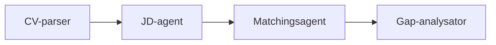
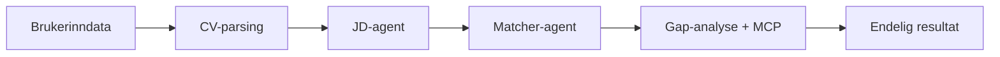

# Modul 4 - Orkestreringsmønstre

⏱️ ~10 min

I denne modulen utforsker du orkestreringsmønstrene som brukes i Resume Job Fit Evaluator og lærer hvordan du leser, endrer og utvider arbeidsflytgrafen. Å forstå disse mønstrene er avgjørende for å feilsøke problemer med datatilførsel og bygge dine egne [multi-agent arbeidsflyter](https://learn.microsoft.com/agent-framework/workflows/).

---

## Mønster 1: Sekvensiell kjede

Det grunnleggende mønsteret i arbeidsflyten er en **sekvensiell kjede** - hver agents utdata føres direkte videre til den neste.


```mermaid
flowchart LR
    RP[CV-parser] --> JD[JD-agent]
    JD --> MA[Matchingsagent]
    MA --> GA[Gap-analysator]
```

I kode oppretter hvert kall til `add_edge()` ett steg i kjeden:

```python
.add_edge(resume_executor, jd_executor)       # ResumeParser utdata → JD Agent
.add_edge(jd_executor, matching_executor)     # JD Agent utdata → MatchingAgent
.add_edge(matching_executor, gap_executor)    # MatchingAgent utdata → GapAnalyzer
```

> **Hvorfor sekvensiell, ikke fan-out/fan-in?** `WorkflowBuilder` bruker **OR-semantikk** for innkommende kanter: en nedstrøms utfører aktiveres så snart **hvilken som helst** forgjenger er ferdig. Hvis `matching_executor` hadde to innkommende kanter (fra både `resume_executor` og `jd_executor`), ville den trigget to ganger - en gang når ResumeParser ferdigstilles og en gang når JD Agent ferdigstilles - noe som ville føre til at GapAnalyzer også kjører to ganger og utdata vises to ganger. Den sekvensielle pipelinen unngår dette helt.

## Mønster 2: Innholdsoverføring

Fordi `context_mode="last_agent"` betyr at hver utfører bare ser **sin direkte forgjengers utdata**, må agenter i en sekvensiell kjede eksplisitt sende videre alle data som nedstrøms agenter trenger.

I denne arbeidsflyten:
- **ResumeParser** kopierer JD ordrett inn i `[JOB DESCRIPTION PASS-THROUGH]` (slik at JD Agent kan finne det).
- **JD Agent** kopierer `[PARSED RESUME]` ordrett inn i `[PARSED RESUME PASS-THROUGH]` (slik at MatchingAgent kan sammenligne begge profilene).

```
ResumeParser output
└─ [PARSED RESUME]               ← extracted by JD Agent
└─ [JOB DESCRIPTION PASS-THROUGH] ← extracted by JD Agent

JD Agent output
└─ [JD REQUIREMENTS]             ← extracted by MatchingAgent
└─ [PARSED RESUME PASS-THROUGH]  ← extracted by MatchingAgent
```

Hver overføringsseksjon må kopieres **ordrett** - å oppsummere eller parafrasere ødelegger den nedstrøms agenten som er avhengig av det.

---

## Den komplette grafen

Å kombinere de sekvensielle kjede- og innholdsoverføringsmønstrene gir hele arbeidsflyten:


```mermaid
flowchart LR
    U[Brukerinndata] --> RP[CV-parsing]
    RP --> JD[JD-agent]
    JD --> MA[Matcher-agent]
    MA --> GA[Gap-analyse + MCP]
    GA --> O[Endelig resultat]
```

Agentinspektøren viser denne samme grafstrukturen når agenten kjører lokalt. Se [Modul 5 - Test lokalt](05-test-locally.md) for skjermbilder.

---

## Lese WorkflowBuilder-koden

Den fullstendige `create_workflow()`-funksjonen ligger i [`PersonalCareerCopilot/main.py`](../../../../../workshop/lab02-multi-agent/PersonalCareerCopilot/main.py). De tre kallene til `add_edge()` bygger den sekvensielle pipelinen:

| # | Kante | Effekt |
|---|------|--------|
| 1 | `resume_executor → jd_executor` | JD Agent mottar `[PARSED RESUME]` + `[JOB DESCRIPTION PASS-THROUGH]` |
| 2 | `jd_executor → matching_executor` | MatchingAgent mottar `[JD REQUIREMENTS]` + `[PARSED RESUME PASS-THROUGH]` |
| 3 | `matching_executor → gap_executor` | GapAnalyzer mottar fit-rapport + gap-liste |

---

## Endre grafen

### Legge til en ny agent

For å legge til en femte agent (f.eks. en **InterviewPrepAgent** etter GapAnalyzer):

1. Definer en konstant `INTERVIEW_PREP_INSTRUCTIONS`.
2. Lag `Agent` + `AgentExecutor` objekter (samme mønster som de eksisterende fire).
3. Legg til `.add_edge(gap_executor, interview_exec)` i `WorkflowBuilder`.
4. Oppdater `output_executors=[interview_exec]`.

> **Viktig:** `start_executor` er den eneste agenten som mottar rå brukerinnputt. Alle andre agenter mottar utdata fra sine oppstrømskanter.

---

## Vanlige graf-feil

| Feil | Symptom | Løsning |
|---------|---------|-----|
| Manglende kant til `output_executors` | Agent kjører, men utdata er tomme | Sørg for at det finnes en sti fra `start_executor` til hver agent i `output_executors` |
| Sirkulær avhengighet | Uendelig løkke eller timeout | Sjekk at ingen agent fører tilbake til en oppstrøms agent |
| Agent i `output_executors` uten innkommende kant | Tomt utdata | Legg til minst én `add_edge(kilde, den_agenten)` |
| Flere `output_executors` uten fan-in | Utdata inneholder kun én agents svar | Bruk en enkelt output-agent som aggregerer, eller godta flere output |
| Manglende `start_executor` | `ValueError` ved bygging | Spesifiser alltid `start_executor` i `WorkflowBuilder()` |

---

## Feilsøke grafen

### Bruke Agent Inspector

1. Start agenten lokalt med F5.
2. Åpne Agent Inspector (`Ctrl+Shift+P` → **Foundry Toolkit: Open Agent Inspector**).
3. Send en testmelding.
4. I Inspektørens responspanel, se etter **streamende utdata** - det viser hver agents bidrag i sekvens.


### Bruke logging

Legg til logging i `main.py` for å spore datatilførsel:

```python
import logging
logger = logging.getLogger("resume-job-fit")

# I main(), etter å ha bygget arbeidsflyten:
logger.info("Workflow graph built with edges: RP→JD, JD→MA, MA→GA")
```

Server-loggene viser rekkefølgen for agentutførelser og MCP-verktøy-kall:

```
INFO:agent_framework:Executing agent: ResumeParser
INFO:agent_framework:Executing agent: JobDescriptionAgent
INFO:agent_framework:Executing agent: MatchingAgent
INFO:agent_framework:Executing agent: GapAnalyzer
INFO:agent_framework:Tool call: search_microsoft_learn_for_plan(skill="Kubernetes")
POST https://learn.microsoft.com/api/mcp → 200
INFO:agent_framework:Tool call: search_microsoft_learn_for_plan(skill="Terraform")
POST https://learn.microsoft.com/api/mcp → 200
```

---

### Sjekkpunkter

- [ ] Du kan identifisere de to orkestreringsmønstrene i arbeidsflyten: sekvensiell kjede og innholdsoverføring
- [ ] Du forstår hvorfor `context_mode="last_agent"` krever eksplisitt dataoverføring mellom agenter
- [ ] Du kan lese `WorkflowBuilder`-koden og knytte hvert `add_edge()`-kall til den visuelle grafen
- [ ] Du vet hvordan du legger til en ny agent til slutten av pipelinen
- [ ] Du kan identifisere vanlige graf-feil og deres symptomer

---

**Forrige:** [03 - Konfigurer Agenter & Miljø](03-configure-agents.md) · **Neste:** [05 - Test Lokalt →](05-test-locally.md)

---

<!-- CO-OP TRANSLATOR DISCLAIMER START -->
**Ansvarsfraskrivelse**:
Dette dokumentet er oversatt ved hjelp av AI-oversettelsestjenesten [Co-op Translator](https://github.com/Azure/co-op-translator). Selv om vi streber etter nøyaktighet, vær oppmerksom på at automatiske oversettelser kan inneholde feil eller unøyaktigheter. Det opprinnelige dokumentet på originalspråket skal betraktes som den autoritative kilden. For kritisk informasjon anbefales profesjonell menneskelig oversettelse. Vi er ikke ansvarlige for eventuelle misforståelser eller feiltolkninger som oppstår ved bruk av denne oversettelsen.
<!-- CO-OP TRANSLATOR DISCLAIMER END -->